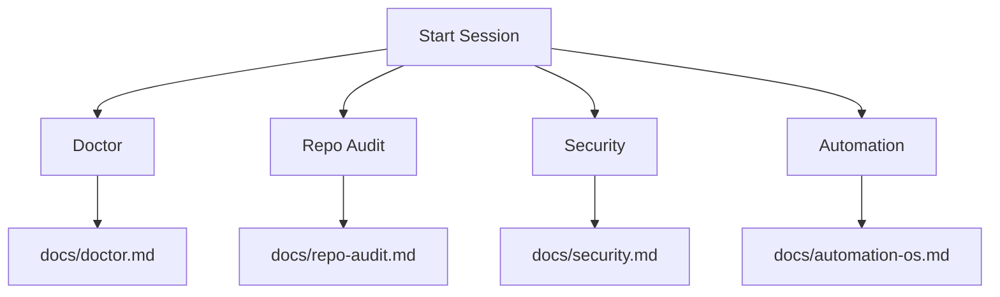
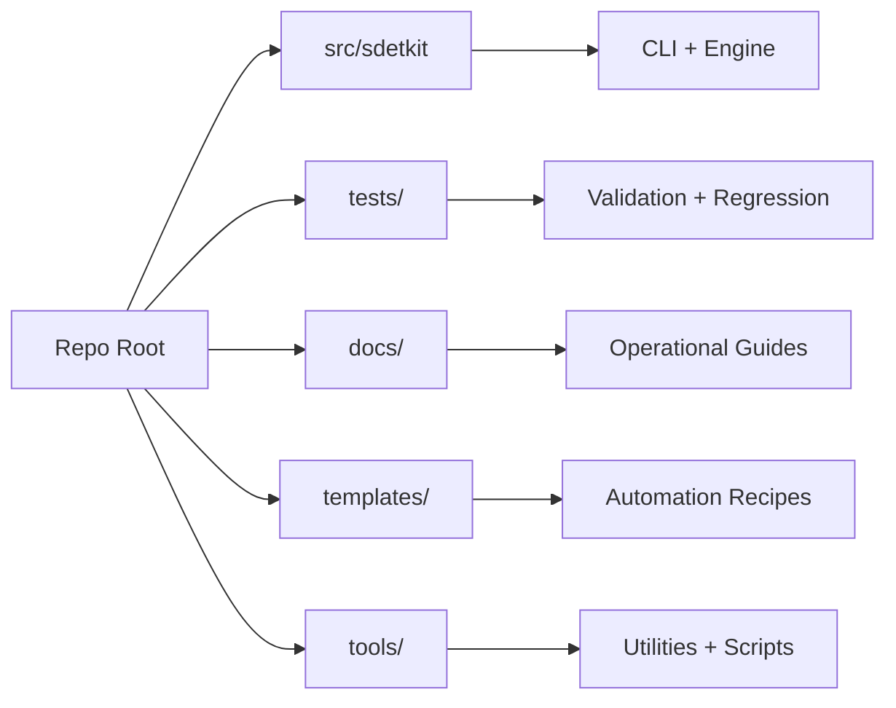
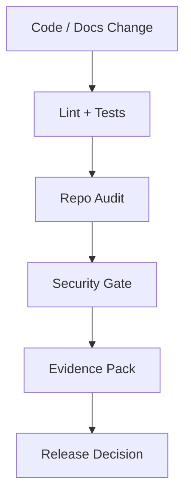

<div align="center">
  <a href="https://sherif69-sa.github.io/DevS69-sdetkit/">
    
  </a>

  <p>
    <a href="https://sherif69-sa.github.io/DevS69-sdetkit/"></a>
    <a href="docs/index.md"></a>
    <a href="docs/repo-audit.md"></a>
    <a href="docs/security.md"></a>
  </p>

  <h1 style="margin: 14px 0 6px; text-align: center;">DevS69 (sdetkit)</h1>

  <p style="max-width: 920px; margin: 0 auto 8px; font-size: 17px; line-height: 1.5;">
    <strong>One-line value proposition:</strong> DevS69 turns SDET quality, API reliability, and repository governance into one repeatable CLI workflow your team can run locally or in CI.
  </p>

  <p style="max-width: 920px; margin: 0 auto 10px; font-size: 16px; line-height: 1.55;">
    <strong>Production-ready SDET toolkit</strong> for API reliability, repository quality,
    and enterprise-grade engineering workflows — tightly aligned with the live portal experience.
  </p>

  <p style="margin: 6px 0 8px;"><strong>Built for:</strong> SDETs · QA Leads · Platform Engineers · Security Champions · Engineering Managers</p>

  <p style="margin: 10px 0 16px;">
    <a href="#quick-start"><strong>⚡ Start in 60 seconds</strong></a>
    ·
    <a href="#day-1-ultra-upgrade-pack"><strong>🧭 Day 1 onboarding</strong></a>
    ·
    <a href="https://sherif69-sa.github.io/DevS69-sdetkit/"><strong>🌐 Live Experience Portal</strong></a>
    ·
    <a href="docs/index.md"><strong>📚 Documentation</strong></a>
    ·
    <a href="CONTRIBUTING.md"><strong>🤝 Contribute</strong></a>
    ·
    <a href="docs/repo-tour.md"><strong>🧭 Repo Tour</strong></a>
  </p>

  <p>
    <a href="https://sherif69-sa.github.io/DevS69-sdetkit/"><strong>Open Portal Now →</strong></a>
  </p>

  <table>
    <tr>
      <td align="center">
        <a href="https://sherif69-sa.github.io/DevS69-sdetkit/">
          
        </a>
        <br />
        <a href="https://sherif69-sa.github.io/DevS69-sdetkit/"><strong>Open Live Experience Portal →</strong></a>
      </td>
      <td align="center">
        <a href="docs/index.md">
          
        </a>
        <br />
        <a href="docs/index.md"><strong>Browse Documentation Hub →</strong></a>
      </td>
      <td align="center">
        <a href="CONTRIBUTING.md">
          
        </a>
        <br />
        <a href="CONTRIBUTING.md"><strong>Start Contributing Guide →</strong></a>
      </td>
    </tr>
  </table>

  <table>
    <tr>
      <td align="center">
        <a href="docs/repo-tour.md">
          
        </a>
        <br />
        <a href="docs/repo-tour.md"><strong>Explore Repo Tour →</strong></a>
      </td>
      <td align="center">
        <a href="docs/repo-audit.md">
          
        </a>
        <br />
        <a href="docs/repo-audit.md"><strong>Review Cache + Audit Strategy →</strong></a>
      </td>
      <td align="center">
        <a href="docs/repo-audit.md">
          
        </a>
        <br />
        <a href="docs/repo-audit.md"><strong>See Exporters + Reports →</strong></a>
      </td>
    </tr>
  </table>

  <h2>✨ Big UX + UI boost (repo HUD edition)</h2>

  <p align="center">
    <strong>A cleaner, more visual README hub with command HUD, repository map, and diff intelligence flow.</strong>
  </p>

  <div align="center">
    
  </div>

  <table>
    <tr>
      <td align="center"><a href="#-devs69-command-hud-live-clickable"><strong>🕹️ DevS69 Command HUD (Live + Clickable)</strong></a></td>
      <td align="center"><a href="#-devs69-repo-map-live-clickable"><strong>🗺️ DevS69 Repo Map (Live + Clickable)</strong></a></td>
      <td align="center"><a href="#-devs69-diff-to-decision-live-clickable"><strong>🔄 DevS69 Diff-to-Decision (Live + Clickable)</strong></a></td>
    </tr>
    <tr>
      <td align="center">Interactive command lanes with direct jump links.</td>
      <td align="center">Real diagram for source/tests/docs/tools relationships.</td>
      <td align="center">Real pipeline diagram from change to release evidence.</td>
    </tr>
  </table>

### 🕹️ DevS69 Command HUD (live clickable)



| HUD Lane | Command | Result | Open Docs |
|---|---|---|---|
| Health baseline | `python -m sdetkit doctor --format markdown` | Immediate health + recommendations | [Doctor docs](docs/doctor.md) |
| Governance checks | `python -m sdetkit repo audit --format markdown` | Policy + hygiene status | [Repo audit](docs/repo-audit.md) |
| Security hardening | `python -m sdetkit security scan --format text` | Risk view + actionable fixes | [Security docs](docs/security.md) |
| Workflow orchestration | `python -m sdetkit agent run 'action repo.audit {"profile":"default"}' --approve` | Deterministic automation lane | [Automation OS](docs/automation-os.md) |

### 🗺️ DevS69 Repo Map (live clickable)



| Zone | Purpose | Click |
|---|---|---|
| Source | CLI and orchestration code | [src/sdetkit](src/sdetkit) |
| Tests | Deterministic checks and contracts | [tests](tests) |
| Docs | Guides, runbooks, references | [docs](docs) |
| Templates | Reusable automation templates | [templates](templates) |
| Tools | Helper scripts and policies | [tools](tools) |

### 🔄 DevS69 Diff-to-Decision (live clickable)



| Stage | Command | Artifact |
|---|---|---|
| Validate | `python -m pytest -q` | Test pass/fail signal |
| Audit | `python -m sdetkit repo audit --format markdown` | Quality findings |
| Secure | `python -m sdetkit security report --format sarif --output build/security.sarif` | SARIF report |
| Publish evidence | `python -m sdetkit proof --execute --strict --format markdown --output docs/artifacts/day3-proof-sample.md` | Shareable proof pack |
| Decide | `python -m sdetkit release-narrative --format markdown --output docs/artifacts/day20-release-narrative-sample.md` | Release narrative |

  <h3>🧩 Repo rearrange + discoverability upgrades</h3>

  <table>
    <tr><td><strong>Upgrade lane</strong></td><td><strong>What improved</strong></td><td><strong>Why it feels better</strong></td></tr>
    <tr><td><strong>README hub hierarchy</strong></td><td>Stronger top navigation + grouped visual cards</td><td>Faster first-click orientation for new and returning contributors</td></tr>
    <tr><td><strong>HUD language</strong></td><td>Product-style terminology (HUD, control center, flow lanes)</td><td>Makes CLI capabilities feel cohesive instead of fragmented</td></tr>
    <tr><td><strong>Visual repo map</strong></td><td>Added architecture-style map card for repo layout</td><td>Faster understanding of project structure without deep scrolling</td></tr>
    <tr><td><strong>Diff narrative</strong></td><td>Added diff-to-insight story card and workflow framing</td><td>Better context for audits, reports, and quality governance</td></tr>
  </table>

  <h3>🛸 What is now uniquely "DevS69"</h3>
  <ul>
    <li><strong>Hero-first identity</strong> with live portal alignment and consistent visual rhythm.</li>
    <li><strong>CLI-as-a-control-center</strong> storytelling across README sections.</li>
    <li><strong>Repo intelligence framing</strong> (map + diff + output) instead of plain command dumps.</li>
    <li><strong>Design continuity</strong> between docs portal, README cards, and automation narratives.</li>
  </ul>

  <p style="margin: 14px 0 8px;">
    <a href="https://github.com/sherif69-sa/DevS69-sdetkit/actions/workflows/ci.yml"></a>
    <a href="https://github.com/sherif69-sa/DevS69-sdetkit/actions/workflows/quality.yml"></a>
    <a href="https://github.com/sherif69-sa/DevS69-sdetkit/actions/workflows/mutation-tests.yml"></a>
    <a href="https://github.com/sherif69-sa/DevS69-sdetkit/actions/workflows/security.yml"></a>
    <a href="https://github.com/sherif69-sa/DevS69-sdetkit/actions/workflows/pages.yml"></a>
  </p>

  <p style="margin: 0 0 10px;">
    <a href="https://github.com/sherif69-sa/DevS69-sdetkit/releases"></a>
    <a href="LICENSE"></a>
    
    <a href="https://github.com/sherif69-sa/DevS69-sdetkit/security/code-scanning"></a>
    <a href="https://github.com/sherif69-sa/DevS69-sdetkit/security/dependabot"></a>
  </p>
</div>

---

## 👥 Who this toolkit is for

| Role | Typical pain | What DevS69 helps you do |
|---|---|---|
| **SDET / QA Engineer** | Flaky checks and fragmented scripts | Run deterministic health, API, and policy checks from one CLI. |
| **Platform / DevOps Engineer** | Inconsistent repo standards across teams | Apply repeatable quality and security guardrails in CI/CD. |
| **Security / Compliance lead** | Weak evidence trail for controls and policy checks | Produce auditable reports and enforce baseline rules. |
| **Engineering Manager / Tech Lead** | Slow onboarding and unclear operational standards | Give teams a documented, role-based workflow with fast adoption paths. |

## 🟢 Top call to action

**Start with the fastest path:** follow the [Quick start](#quick-start) and run your first `doctor` + `repo audit` flow today.


## 🔥 Day 1 ultra upgrade pack

### Start by role (copy/paste entry points)

| I am a... | First command | Next action |
|---|---|---|
| **SDET / QA engineer** | `sdetkit doctor --format markdown` | Run [`repo audit`](docs/repo-audit.md) to convert warnings into fixable tasks. |
| **Platform / DevOps engineer** | `sdetkit repo audit --format markdown` | Wire checks into CI with the [GitHub Action guide](docs/github-action.md). |
| **Security / compliance lead** | `sdetkit security --format markdown` | Enforce policies from [security docs](docs/security.md) and [policy baselines](docs/policy-and-baselines.md). |
| **Engineering manager / tech lead** | `sdetkit doctor --format markdown` | Use [Automation OS docs](docs/automation-os.md) to standardize team-wide operating flow. |

### Day 1 success criteria

- ✅ Clear value proposition in the hero section.
- ✅ Explicit audience segmentation by engineering role.
- ✅ Top-of-page CTA that routes users to first successful command run.
- ✅ Role-specific entry table with immediate command-level next steps.

See the full implementation and validation report in [`docs/day-1-ultra-upgrade-report.md`](docs/day-1-ultra-upgrade-report.md).

Sample runnable artifact: [`docs/artifacts/day1-onboarding-sample.md`](docs/artifacts/day1-onboarding-sample.md) (generated by `python -m sdetkit onboarding --format markdown --output docs/artifacts/day1-onboarding-sample.md`).

## ✨ Platform spotlight

> **Big visual boost + aligned UX:** every major surface (hero, cards, quick links, launch map) now points clearly to the same experience center — **[sherif69-sa.github.io/DevS69-sdetkit](https://sherif69-sa.github.io/DevS69-sdetkit/)**.

## 🧠 Premium Engine Control Center (new)

<div align="center">
  <a href="https://sherif69-sa.github.io/DevS69-sdetkit/">
    <p><strong>Unified visual control center now aligned with the live site</strong></p>
  </a>

  <table>
    <tr>
      <td align="center"><strong>Data source</strong></td>
      <td align="center"><strong>Engine action</strong></td>
      <td align="center"><strong>Artifact / visualization</strong></td>
    </tr>
    <tr>
      <td>doctor.json / maintenance.json / security-check.json</td>
      <td>Normalize + score + rank warnings/recommendations</td>
      <td><code>.sdetkit/out/premium-summary.json</code></td>
    </tr>
    <tr>
      <td>premium-insights.db (guidelines + commit learning)</td>
      <td>Apply learned guidance to active warnings</td>
      <td>Runtime recommendation + manual fix plan</td>
    </tr>
    <tr>
      <td>Local API (<code>/guidelines</code>, <code>/analyze</code>, <code>/learn-commit</code>)</td>
      <td>Editable knowledge base + continuous learning loop</td>
      <td><a href="https://sherif69-sa.github.io/DevS69-sdetkit/">Live docs & visual portal</a></td>
    </tr>
  </table>
</div>

## 🧭 Fast entry paths

| What you need | Start here | Outcome |
|---|---|---|
| Get up and running quickly | [Quick start](#quick-start) | Ready-to-run local environment + first quality pass |
| Get role-based first steps instantly | `sdetkit onboarding --format markdown` | Copy/paste role paths for SDET, Platform, Security, and Engineering leads |
| Bootstrap Linux/macOS/Windows quickly | `sdetkit onboarding --platform all --format text` | One command prints platform-specific setup commands for mixed teams |
| Understand repository layout | [Repo tour](docs/repo-tour.md) | Role-based orientation and architecture map |
| Use CLI commands effectively | [CLI guide](docs/cli.md) | Practical usage patterns and examples |
| Diagnose repository health | [Doctor docs](docs/doctor.md) | Health checks and recommendations |
| Run safe checks and targeted fixes | [Repo audit](docs/repo-audit.md) | Enterprise-focused guardrails |
| Run deterministic automation workflows | [Automation OS](docs/automation-os.md) | Manager/worker workflows, replay, diff, artifacts |
| Contribute with confidence | [Contributing guide](CONTRIBUTING.md) | Quality gates + PR expectations |
| Grow adoption and reach | [Top-10 GitHub strategy](docs/top-10-github-strategy.md) | 90-day execution plan + measurable KPIs |
| Start immediately (Phase 1 days 1–30) | [Phase-1 daily execution plan](docs/top-10-github-strategy.md#phase-1-days-1-30-positioning-conversion-daily-execution) | High-impact actions for same-day momentum |

## 🗃️ Clickable file launcher (rearranged for faster UX)

Use this section as a **one-click navigator** to the most relevant files based on what you want to do right now.

| Goal | Open first | Then open | Why this flow is better |
|---|---|---|---|
| Get running in minutes | [Quick start](#quick-start) | [CLI guide](docs/cli.md) | Starts with executable commands, then explains how to extend usage safely. |
| Understand project architecture | [Repository map](#repository-map) | [Project structure](docs/project-structure.md) | Gives a high-level map first, then detailed file-by-file structure. |
| Improve quality and reliability | [Core CLI commands](#core-cli-commands) | [Repo audit](docs/repo-audit.md) | Moves from common commands to full enterprise-quality checks. |
| Secure your workflows | [Security Gate](#security-gate) | [Security model](docs/security-model.md) | Pairs immediate guardrails with deeper policy/architecture guidance. |
| Contribute confidently | [Contributing](CONTRIBUTING.md) | [PR automation guide](docs/pr-automation.md) | Covers standards first, then automation expectations and templates. |
| Operate AgentOS workflows | [AgentOS overview](#agentos-overview) | [AgentOS cookbook](docs/agentos-cookbook.md) | Explains the system model before moving into repeatable operations. |

### 📌 Most-used files (quick links)

- [`README.md`](README.md) — primary orientation and command hub.
- [`docs/index.md`](docs/index.md) — central documentation landing page.
- [`docs/repo-tour.md`](docs/repo-tour.md) — role-based repository walkthrough.
- [`docs/cli.md`](docs/cli.md) — command reference and usage patterns.
- [`docs/repo-audit.md`](docs/repo-audit.md) — quality and policy checks.
- [`docs/security.md`](docs/security.md) — security operations and controls.
- [`docs/automation-os.md`](docs/automation-os.md) — deterministic automation workflows.
- [`CONTRIBUTING.md`](CONTRIBUTING.md) — contributor workflow and quality gates.
- [`QUALITY_PLAYBOOK.md`](QUALITY_PLAYBOOK.md) — engineering quality standards.
- [`ROADMAP.md`](ROADMAP.md) — execution direction and priority visibility.

## 🎨 Visual + clickable experience map

<p align="center">
  <a href="#quick-start">⚡ Quick Start</a> ·
  <a href="#core-cli-commands">🛠️ Core CLI</a> ·
  <a href="#maintenance-and-diagnostics">🧪 Maintenance</a> ·
  <a href="#documentation-index">📘 Docs Index</a> ·
  <a href="#automation-highlights">🤖 Automation</a> ·
  <a href="https://sherif69-sa.github.io/DevS69-sdetkit/">🌐 Live Portal</a>
</p>

| Experience area | What you get | Direct links |
|---|---|---|
| **Onboarding flow** | Quick setup and immediate value | [Quick start](#quick-start), [60-second orientation](#60-second-orientation) |
| **Daily operations** | Stable commands for health, audits, and API checks | [Core CLI commands](#core-cli-commands), [Developer workflow](#developer-workflow) |
| **Quality + security** | Gate-driven reliability and hardening posture | [Repo audit](docs/repo-audit.md), [Security docs](docs/security.md) |
| **Contrib + governance** | Standards and expectations for collaboration | [Contributing](CONTRIBUTING.md), [Code of Conduct](CODE_OF_CONDUCT.md) |
| **Portal-aligned discovery** | Polished visual documentation experience | [Live portal](https://sherif69-sa.github.io/DevS69-sdetkit/), [Docs home](docs/index.md) |

## 🚀 Portal-aligned launch deck

| Area | Highlight | Open |
|---|---|---|
| **Experience center** | The primary visual destination for onboarding and project discovery. | [Open portal](https://sherif69-sa.github.io/DevS69-sdetkit/) |
| **Engineering docs** | Command docs, architecture references, and operational playbooks. | [Open docs](docs/index.md) |
| **Repository quality** | Audits, policy checks, and enterprise readiness workflows. | [Open repo audit](docs/repo-audit.md) |
| **Security posture** | Security policy, reporting, and hardening guidance. | [Open security docs](docs/security.md) |

## 🎯 What makes DevS69 stand out

| Pillar | Description |
|---|---|
| **Quality by default** | Linting, formatting, tests, mutation checks, and CI guardrails are designed into daily workflows. |
| **Security-first operations** | Security policy, code scanning, dependency hygiene, and hardening checks are built into automation. |
| **Operator-friendly CLI** | Commands are predictable, scriptable, and compatible with both local workflows and CI pipelines. |
| **Docs as a product surface** | Practical docs + live portal provide fast path onboarding for new contributors and maintainers. |

## 🗂️ Experience navigation (one-click)

### Governance & trust
- [Code of Conduct](CODE_OF_CONDUCT.md)
- [Contributing](CONTRIBUTING.md)
- [Security Policy](SECURITY.md)
- [Support](SUPPORT.md)
- [License](LICENSE)
- [Commercial Licensing](COMMERCIAL_LICENSE.md)

### Engineering standards
- [Quality Playbook](QUALITY_PLAYBOOK.md)
- [Release Guide](RELEASE.md)
- [Roadmap](ROADMAP.md)
- [Top-10 GitHub Strategy](docs/top-10-github-strategy.md)
- [Changelog](CHANGELOG.md)

### Documentation hub
- [Docs Home](docs/index.md)
- [Repo Tour](docs/repo-tour.md)
- [Project Structure](docs/project-structure.md)
- [Security Docs](docs/security.md)
- [Release Process](docs/releasing.md)

## 🚀 60-second orientation

1. Read this [README](README.md) for the quickest project overview.
2. Open [the live portal](https://sherif69-sa.github.io/DevS69-sdetkit/) for a polished visual entry point.
3. Use [docs/cli.md](docs/cli.md) + [docs/doctor.md](docs/doctor.md) for daily operations.
4. Follow [CONTRIBUTING.md](CONTRIBUTING.md) before opening a PR.


## AgentOS overview

AgentOS is the deterministic orchestration layer behind `sdetkit agent`.

```text
User/CI
  |
  v
sdetkit agent CLI
  |
  +--> Manager (plan)
  +--> Workers (actions: repo/report/fs/shell)
  +--> Reviewer (accept/reject)
  |
  +--> Safety gates (approval, allowlists, restricted shell)
  +--> Stable artifacts (history, conversations, dashboards, exports)
```

Core docs: [AgentOS foundation](docs/agentos-foundation.md), [Omnichannel + MCP bridge](docs/omnichannel-mcp-bridge.md), [Automation templates engine](docs/automation-templates-engine.md).

## Quickstart (clean checkout, provider=none)

```bash
python3 -m venv .venv
./.venv/bin/python -m pip install -r requirements-test.txt -r requirements-docs.txt -e .
./.venv/bin/sdetkit agent init
./.venv/bin/sdetkit agent run 'action repo.audit {"profile":"default"}' --approve
./.venv/bin/sdetkit agent dashboard build --format html
./.venv/bin/sdetkit report build --history-dir .sdetkit/audit-history --output report.html
```

This path is offline-friendly and deterministic when `provider.type=none` and inputs are unchanged.

## Production and enterprise notes

- Safety gates are explicit: dangerous writes/shell actions require approval and allowlists.
- Run records provide durable evidence for what executed and why.
- Exports are deterministic by default (sorted keys/lists + canonical JSON).
- Data ownership remains local to your repository workspace unless you explicitly route data elsewhere.
- MCP/tool bridge is disabled by default and must be explicitly allowlisted.

Additional references: [AgentOS cookbook](docs/agentos-cookbook.md), [Determinism contract](docs/determinism-contract.md), [Security model](docs/security-model.md).


## 🔐 Security Gate

Run the top-level security gate locally and in CI:

```bash
python -m sdetkit security scan --fail-on medium --format text
python -m sdetkit security report --format sarif --output build/security.sarif
python -m sdetkit security fix --dry-run
python -m sdetkit security fix --apply
python -m sdetkit notify --list
bash premium-gate.sh
```

More details:

- [Security gate guide](docs/security-gate.md)
- [Security model](docs/security-model.md)


## 🏢 Company adoption quickstart

```bash
python3 -m sdetkit ops init
python3 -m sdetkit policy snapshot --output .sdetkit/policies/baseline.json
python3 -m sdetkit policy check --baseline .sdetkit/policies/baseline.json
bash premium-gate.sh
```

Outputs are written under `.sdetkit/out/` by default (including `security.sarif` and `evidence.zip`).

## 🧩 Why this repository exists

This project is designed for fast onboarding and high-confidence delivery:

- **Clear entry points** in [`src/sdetkit`](src/sdetkit)
- **Strong quality gates** across lint, format, type checks, tests, coverage, and docs
- **Modular internals** that are easy to import, test, and extend
- **Docs-first architecture** for fast navigation and contributor productivity

## 🚀 Day 2 ultra: 60-second demo path

Use this copy-paste demo flow to show value in under a minute.

```bash
python -m sdetkit demo --execute --format text
```

Expected snippets you should see:

- `doctor score:` and `recommendations:`
- `Repo audit:` and `Result:`
- `security scan:` and `top findings:`

Need a shareable artifact?

```bash
python -m sdetkit demo --execute --format markdown --output docs/artifacts/day2-demo-sample.md
```

See implementation details: [Day 2 ultra upgrade report](docs/day-2-ultra-upgrade-report.md).

Day 2 closeout hints:

- Use `--fail-fast` during live demos to stop on first blocker.
- Use `--timeout-seconds 30` on slower CI machines.
- Use `--target-seconds 60` to enforce a strict Day 2 demo SLA.

## 📸 Day 3 ultra: proof pack

Day 3 focuses on evidence you can share in PRs, release notes, and stakeholder updates.

```bash
python -m sdetkit proof --execute --strict --format text
```

Generate a markdown artifact for handoffs:

```bash
python -m sdetkit proof --execute --strict --format markdown --output docs/artifacts/day3-proof-sample.md
```

See implementation details: [Day 3 ultra upgrade report](docs/day-3-ultra-upgrade-report.md).

Day 3 closeout gate:

```bash
python scripts/check_day3_proof_contract.py
```

- Keep generated markdown artifacts under `docs/artifacts/` for traceability.

## 🧠 Day 4 ultra: skills expansion

Day 4 focuses on automation skill coverage: discover every built-in AgentOS template (skill), run all skills in one command, and keep deterministic artifacts per skill.

```bash
python -m sdetkit agent templates list
python -m sdetkit agent templates run-all --output-dir .sdetkit/agent/template-runs
```

Inspect a specific skill/template contract:

```bash
python -m sdetkit agent templates show repo-health-audit
```

See implementation details: [Day 4 ultra upgrade report](docs/day-4-ultra-upgrade-report.md).

Review sample artifact: [Day 4 skills sample](docs/artifacts/day4-skills-sample.md).

Day 4 closeout checks:

```bash
python -m pytest -q tests/test_agent_templates_cli.py
python scripts/check_day4_skills_contract.py
```

- Keep generated markdown artifacts under `docs/artifacts/` for traceability.

## 🖥️ Day 5 ultra: platform onboarding boost

Day 5 removed setup friction for mixed-OS teams with platform-specific onboarding steps.

```bash
python -m sdetkit onboarding --format text --platform all
```

Generate a shareable onboarding artifact:

```bash
python -m sdetkit onboarding --format markdown --platform all --output docs/artifacts/day5-platform-onboarding-sample.md
```

See implementation details: [Day 5 ultra upgrade report](docs/day-5-ultra-upgrade-report.md).

Review sample artifact: [Day 5 platform onboarding sample](docs/artifacts/day5-platform-onboarding-sample.md).

## 🔗 Day 6 ultra: conversion QA hardening

Day 6 adds a runnable docs conversion QA gate that validates README/docs links and anchors so first-time users do not hit dead paths.

```bash
python -m sdetkit docs-qa --format text
```

Export a Day 6 QA artifact for reviews and handoffs:

```bash
python -m sdetkit docs-qa --format markdown --output docs/artifacts/day6-conversion-qa-sample.md
```

See implementation details: [Day 6 ultra upgrade report](docs/day-6-ultra-upgrade-report.md).

Day 6 closeout checks:

```bash
python -m pytest -q tests/test_docs_qa.py tests/test_cli_help_lists_subcommands.py
python scripts/check_day6_conversion_contract.py
```


## 📊 Day 7 ultra: weekly review #1

Day 7 closes week one with an objective review of what shipped, KPI movement, and next-week priorities.

```bash
python -m sdetkit weekly-review --format text
```

Export a markdown artifact for stakeholder handoff:

```bash
python -m sdetkit weekly-review --format markdown --output docs/artifacts/day7-weekly-review-sample.md
```

See implementation details: [Day 7 ultra upgrade report](docs/day-7-ultra-upgrade-report.md).

Day 7 closeout checks:

```bash
python -m pytest -q tests/test_weekly_review.py tests/test_cli_help_lists_subcommands.py
python scripts/check_day7_weekly_review_contract.py
```


## 🧲 Day 8 ultra: contributor funnel backlog

Day 8 starts week two with a curated `good first issue` backlog so new contributors can pick scoped tasks with clear acceptance criteria.

```bash
python -m sdetkit contributor-funnel --format text --strict
```

Export a markdown artifact for triage and community channels:

```bash
python -m sdetkit contributor-funnel --format markdown --output docs/artifacts/day8-good-first-issues-sample.md
python -m sdetkit contributor-funnel --area docs --issue-pack-dir docs/artifacts/day8-issue-pack
```

See implementation details: [Day 8 ultra upgrade report](docs/day-8-ultra-upgrade-report.md).

Day 8 closeout checks:

```bash
python -m pytest -q tests/test_contributor_funnel.py tests/test_cli_help_lists_subcommands.py
python scripts/check_day8_contributor_funnel_contract.py
python -m sdetkit contributor-funnel --format json --strict
```

## 🧩 Day 9 ultra: contribution templates

Day 9 upgrades issue + PR templates and issue-template config for faster triage with explicit severity, acceptance criteria, risk, rollback, and recovery automation.

```bash
python -m sdetkit triage-templates --format text --strict
python -m sdetkit triage-templates --write-defaults --format json --strict
```

Export a markdown artifact for maintainer handoff:

```bash
python -m sdetkit triage-templates --format markdown --output docs/artifacts/day9-triage-templates-sample.md
```

See implementation details: [Day 9 ultra upgrade report](docs/day-9-ultra-upgrade-report.md).

Day 9 closeout checks:

```bash
python -m pytest -q tests/test_triage_templates.py tests/test_cli_help_lists_subcommands.py
python scripts/check_day9_contribution_templates_contract.py
python -m sdetkit triage-templates --format json --strict
```

## ✅ Day 10 ultra: first-contribution checklist

Day 10 adds a guided first-contribution checklist so new contributors can move from fork/clone to PR with deterministic quality gates.

```bash
python -m sdetkit first-contribution --format text --strict
python -m sdetkit first-contribution --write-defaults --format json --strict
```

Export a markdown artifact for mentor/reviewer handoff:

```bash
python -m sdetkit first-contribution --format markdown --output docs/artifacts/day10-first-contribution-checklist-sample.md
```

See implementation details: [Day 10 ultra upgrade report](docs/day-10-ultra-upgrade-report.md).

Day 10 closeout checks:

```bash
python -m pytest -q tests/test_first_contribution.py tests/test_cli_help_lists_subcommands.py
python scripts/check_day10_first_contribution_contract.py
python -m sdetkit first-contribution --format json --strict
```


## 🧭 Day 11 ultra: docs navigation tune-up

Day 11 makes top user journeys one-click from docs home so users can jump straight to fast start, core CLI guidance, and contribution paths.

```bash
python -m sdetkit docs-nav --format text --strict
python -m sdetkit docs-nav --write-defaults --format json --strict
```

Export a markdown artifact for docs handoff:

```bash
python -m sdetkit docs-nav --format markdown --output docs/artifacts/day11-docs-navigation-sample.md
```

See implementation details: [Day 11 ultra upgrade report](docs/day-11-ultra-upgrade-report.md).

Day 11 closeout checks:

```bash
python -m pytest -q tests/test_docs_navigation.py tests/test_cli_help_lists_subcommands.py
python scripts/check_day11_docs_navigation_contract.py
python -m sdetkit docs-nav --format json --strict
```

## 🚀 Day 12 ultra: startup/small-team use-case page

Day 12 ships a dedicated startup/small-team workflow landing page with a runnable 10-minute path, weekly operating rhythm, and quality guardrails.

```bash
python -m sdetkit startup-use-case --format text --strict
python -m sdetkit startup-use-case --write-defaults --format json --strict
python -m sdetkit startup-use-case --emit-pack-dir docs/artifacts/day12-startup-pack --format json --strict
```

Export a markdown artifact for adoption handoff:

```bash
python -m sdetkit startup-use-case --format markdown --output docs/artifacts/day12-startup-use-case-sample.md
```

See implementation details: [Day 12 ultra upgrade report](docs/day-12-ultra-upgrade-report.md).

Day 12 closeout checks:

```bash
python -m pytest -q tests/test_startup_use_case.py tests/test_cli_help_lists_subcommands.py
python scripts/check_day12_startup_use_case_contract.py
python -m sdetkit startup-use-case --format json --strict
```

## 🏢 Day 13 ultra: enterprise/regulated use-case page

Day 13 ships a dedicated enterprise/regulated workflow landing page with governance cadence, compliance evidence controls, and rollout guidance for multi-repo organizations.

```bash
python -m sdetkit enterprise-use-case --format text --strict
python -m sdetkit enterprise-use-case --write-defaults --format json --strict
python -m sdetkit enterprise-use-case --emit-pack-dir docs/artifacts/day13-enterprise-pack --format json --strict
python -m sdetkit enterprise-use-case --execute --evidence-dir docs/artifacts/day13-enterprise-pack/evidence --format json --strict
```

Export a markdown artifact for compliance handoff:

```bash
python -m sdetkit enterprise-use-case --format markdown --output docs/artifacts/day13-enterprise-use-case-sample.md
```

See implementation details: [Day 13 ultra upgrade report](docs/day-13-ultra-upgrade-report.md).

Day 13 closeout checks:

```bash
python -m pytest -q tests/test_enterprise_use_case.py tests/test_cli_help_lists_subcommands.py
python scripts/check_day13_enterprise_use_case_contract.py
python -m sdetkit enterprise-use-case --format json --strict
python -m sdetkit enterprise-use-case --execute --evidence-dir docs/artifacts/day13-enterprise-pack/evidence --format json --strict
```

## 📈 Day 14 ultra: weekly review #2

Day 14 closes week two with deterministic reporting for Day 8-13 shipment status, KPI movement, growth signals (traffic/stars/discussions), and blocker-fix closeout tracking.

```bash
python -m sdetkit weekly-review --week 2 --format text --signals-file docs/artifacts/day14-growth-signals.json --previous-signals-file docs/artifacts/day7-growth-signals.json
```

Export a markdown artifact for stakeholder handoff:

```bash
python -m sdetkit weekly-review --week 2 --format markdown --signals-file docs/artifacts/day14-growth-signals.json --previous-signals-file docs/artifacts/day7-growth-signals.json --output docs/artifacts/day14-weekly-review-sample.md
```

Emit a Day 14 closeout pack (checklist, KPI scorecard, blocker action plan):

```bash
python -m sdetkit weekly-review --week 2 --emit-pack-dir docs/artifacts/day14-weekly-pack --signals-file docs/artifacts/day14-growth-signals.json --previous-signals-file docs/artifacts/day7-growth-signals.json --format json --strict
```

See implementation details: [Day 14 ultra upgrade report](docs/day-14-ultra-upgrade-report.md).

Day 14 closeout checks:

```bash
python -m pytest -q tests/test_weekly_review.py tests/test_cli_help_lists_subcommands.py
python scripts/check_day14_weekly_review_contract.py
python -m sdetkit weekly-review --week 2 --format json --signals-file docs/artifacts/day14-growth-signals.json --previous-signals-file docs/artifacts/day7-growth-signals.json --strict
```

## 🔁 Day 15 ultra: GitHub Actions quickstart

Day 15 closes with a **production-ready integration recipe**: minimal + strict + nightly GitHub Actions workflows, execution evidence capture, and distribution-loop guidance.

```bash
python -m sdetkit github-actions-quickstart --format text --strict
python -m sdetkit github-actions-quickstart --format json --variant strict --strict
python -m sdetkit github-actions-quickstart --write-defaults --format json --strict
python -m sdetkit github-actions-quickstart --emit-pack-dir docs/artifacts/day15-github-pack --format json --strict
python -m sdetkit github-actions-quickstart --execute --evidence-dir docs/artifacts/day15-github-pack/evidence --format json --strict
```

Export a markdown artifact for handoff:

```bash
python -m sdetkit github-actions-quickstart --format markdown --variant strict --output docs/artifacts/day15-github-actions-quickstart-sample.md
```

See implementation details: [Day 15 ultra upgrade report](docs/day-15-ultra-upgrade-report.md).

Day 15 closeout checks:

```bash
python -m pytest -q tests/test_github_actions_quickstart.py tests/test_cli_help_lists_subcommands.py
python scripts/check_day15_github_actions_quickstart_contract.py
python -m sdetkit github-actions-quickstart --format json --strict
python -m sdetkit github-actions-quickstart --execute --evidence-dir docs/artifacts/day15-github-pack/evidence --format json --strict
```

## 🦊 Day 16 ultra: GitLab CI quickstart

Day 16 ships a **production-ready GitLab CI integration recipe** with minimal + strict + nightly pipelines, evidence capture, and distribution-loop guidance.

```bash
python -m sdetkit gitlab-ci-quickstart --format text --strict
python -m sdetkit gitlab-ci-quickstart --format json --variant strict --strict
python -m sdetkit gitlab-ci-quickstart --write-defaults --format json --strict
python -m sdetkit gitlab-ci-quickstart --emit-pack-dir docs/artifacts/day16-gitlab-pack --format json --strict
python -m sdetkit gitlab-ci-quickstart --variant strict --bootstrap-pipeline --pipeline-path .gitlab-ci.yml --format json --strict
python -m sdetkit gitlab-ci-quickstart --execute --evidence-dir docs/artifacts/day16-gitlab-pack/evidence --format json --strict
```

Export a markdown artifact for handoff:

```bash
python -m sdetkit gitlab-ci-quickstart --format markdown --variant strict --output docs/artifacts/day16-gitlab-ci-quickstart-sample.md
```

See implementation details: [Day 16 ultra upgrade report](docs/day-16-ultra-upgrade-report.md).

Day 16 closeout checks:

```bash
python -m pytest -q tests/test_gitlab_ci_quickstart.py tests/test_cli_help_lists_subcommands.py
python scripts/check_day16_gitlab_ci_quickstart_contract.py
python -m sdetkit gitlab-ci-quickstart --format json --strict
python -m sdetkit gitlab-ci-quickstart --variant strict --bootstrap-pipeline --pipeline-path .gitlab-ci.yml --format json --strict
python -m sdetkit gitlab-ci-quickstart --execute --evidence-dir docs/artifacts/day16-gitlab-pack/evidence --format json --strict
```

## 🧮 Day 17 ultra: quality + contribution deltas

Day 17 captures one **week-over-week evidence pack** that combines quality KPIs and contribution signals into a single closeout view.

```bash
python -m sdetkit quality-contribution-delta --current-signals-file docs/artifacts/day17-growth-signals.json --previous-signals-file docs/artifacts/day14-growth-signals.json --format text
python -m sdetkit quality-contribution-delta --current-signals-file docs/artifacts/day17-growth-signals.json --previous-signals-file docs/artifacts/day14-growth-signals.json --format json --strict
python -m sdetkit quality-contribution-delta --current-signals-file docs/artifacts/day17-growth-signals.json --previous-signals-file docs/artifacts/day14-growth-signals.json --min-traffic-delta 100 --min-stars-delta 5 --min-discussions-delta 2 --min-blocker-fixes-delta 1 --format json --strict
python -m sdetkit quality-contribution-delta --current-signals-file docs/artifacts/day17-growth-signals.json --previous-signals-file docs/artifacts/day14-growth-signals.json --emit-pack-dir docs/artifacts/day17-delta-pack --format json --strict
```

Export a markdown artifact for handoff:

```bash
python -m sdetkit quality-contribution-delta --current-signals-file docs/artifacts/day17-growth-signals.json --previous-signals-file docs/artifacts/day14-growth-signals.json --format markdown --output docs/artifacts/day17-quality-contribution-delta-sample.md
```

See implementation details: [Day 17 ultra upgrade report](docs/day-17-ultra-upgrade-report.md).

Day 17 closeout checks:

```bash
python -m pytest -q tests/test_quality_contribution_delta.py tests/test_cli_help_lists_subcommands.py
python scripts/check_day17_quality_contribution_delta_contract.py
python -m sdetkit quality-contribution-delta --current-signals-file docs/artifacts/day17-growth-signals.json --previous-signals-file docs/artifacts/day14-growth-signals.json --format json --strict
```

## 🧱 Day 18 ultra: reliability evidence pack

Day 18 now ships a production-grade **reliability operating pack** that consolidates Day 15/16 execution evidence and Day 17 quality+contribution deltas into one deterministic closeout lane.

```bash
python -m sdetkit reliability-evidence-pack --format text
python -m sdetkit reliability-evidence-pack --format json --strict
python -m sdetkit reliability-evidence-pack --write-defaults --format json --strict
python -m sdetkit reliability-evidence-pack --emit-pack-dir docs/artifacts/day18-reliability-pack --format json --strict
python -m sdetkit reliability-evidence-pack --execute --evidence-dir docs/artifacts/day18-reliability-pack/evidence --format json --strict
```

Export a markdown artifact for handoff:

```bash
python -m sdetkit reliability-evidence-pack --format markdown --output docs/artifacts/day18-reliability-evidence-pack-sample.md
```

See implementation details: [Day 18 ultra upgrade report](docs/day-18-ultra-upgrade-report.md).

Day 18 closeout checks:

```bash
python -m pytest -q tests/test_reliability_evidence_pack.py tests/test_cli_help_lists_subcommands.py
python scripts/check_day18_reliability_evidence_pack_contract.py
python -m sdetkit reliability-evidence-pack --format json --strict
python -m sdetkit reliability-evidence-pack --execute --evidence-dir docs/artifacts/day18-reliability-pack/evidence --format json --strict
```


## 🧭 Day 19 ultra: release readiness board

Day 19 ships a deterministic **release readiness board** that combines Day 18 reliability posture with Day 14 KPI trend health into one go/no-go score.

```bash
python -m sdetkit release-readiness-board --format text
python -m sdetkit release-readiness-board --format json --strict
python -m sdetkit release-readiness-board --write-defaults --format json --strict
python -m sdetkit release-readiness-board --emit-pack-dir docs/artifacts/day19-release-readiness-pack --format json --strict
python -m sdetkit release-readiness-board --execute --evidence-dir docs/artifacts/day19-release-readiness-pack/evidence --format json --strict
```

Export a markdown artifact for handoff:

```bash
python -m sdetkit release-readiness-board --format markdown --output docs/artifacts/day19-release-readiness-board-sample.md
```

See implementation details: [Day 19 ultra upgrade report](docs/day-19-ultra-upgrade-report.md).

Day 19 closeout checks:

```bash
python -m pytest -q tests/test_release_readiness_board.py tests/test_cli_help_lists_subcommands.py
python scripts/check_day19_release_readiness_board_contract.py
python -m sdetkit release-readiness-board --format json --strict
python -m sdetkit release-readiness-board --execute --evidence-dir docs/artifacts/day19-release-readiness-pack/evidence --format json --strict
```

## ✍️ Day 20 ultra: release narrative

Day 20 now ships a deterministic **release narrative operating lane** that converts Day 19 readiness posture and changelog highlights into multi-channel, non-maintainer storytelling.

```bash
python -m sdetkit release-narrative --format text
python -m sdetkit release-narrative --format json --strict
python -m sdetkit release-narrative --write-defaults --format json --strict
python -m sdetkit release-narrative --emit-pack-dir docs/artifacts/day20-release-narrative-pack --format json --strict
python -m sdetkit release-narrative --execute --evidence-dir docs/artifacts/day20-release-narrative-pack/evidence --format json --strict
```

Export a markdown artifact for handoff:

```bash
python -m sdetkit release-narrative --format markdown --output docs/artifacts/day20-release-narrative-sample.md
```

See implementation details: [Day 20 ultra upgrade report](docs/day-20-ultra-upgrade-report.md).

Day 20 closeout checks:

```bash
python -m pytest -q tests/test_release_narrative.py tests/test_cli_help_lists_subcommands.py
python scripts/check_day20_release_narrative_contract.py
python -m sdetkit release-narrative --format json --strict
python -m sdetkit release-narrative --execute --evidence-dir docs/artifacts/day20-release-narrative-pack/evidence --format json --strict
```

## 📊 Day 21 ultra: weekly review #3

Day 21 ships a deterministic **weekly review #3 closeout lane** that tracks conversion and contributor-response movement across Days 15-20 in one scorecard.

```bash
python -m sdetkit weekly-review --week 3 --format text --signals-file docs/artifacts/day21-growth-signals.json --previous-signals-file docs/artifacts/day14-growth-signals.json
python -m sdetkit weekly-review --week 3 --format json --signals-file docs/artifacts/day21-growth-signals.json --previous-signals-file docs/artifacts/day14-growth-signals.json --strict
python -m sdetkit weekly-review --week 3 --emit-pack-dir docs/artifacts/day21-weekly-pack --signals-file docs/artifacts/day21-growth-signals.json --previous-signals-file docs/artifacts/day14-growth-signals.json --format json --strict
```

Export a markdown artifact for handoff:

```bash
python -m sdetkit weekly-review --week 3 --format markdown --signals-file docs/artifacts/day21-growth-signals.json --previous-signals-file docs/artifacts/day14-growth-signals.json --output docs/artifacts/day21-weekly-review-sample.md
```

See implementation details: [Day 21 ultra upgrade report](docs/day-21-ultra-upgrade-report.md).

Day 21 closeout checks:

```bash
python -m pytest -q tests/test_weekly_review.py tests/test_cli_help_lists_subcommands.py
python scripts/check_day21_weekly_review_contract.py
python -m sdetkit weekly-review --week 3 --format json --signals-file docs/artifacts/day21-growth-signals.json --previous-signals-file docs/artifacts/day14-growth-signals.json --strict
python -m sdetkit weekly-review --week 3 --emit-pack-dir docs/artifacts/day21-weekly-pack --signals-file docs/artifacts/day21-growth-signals.json --previous-signals-file docs/artifacts/day14-growth-signals.json --format json --strict
```

## 🔐 Day 22 ultra: trust signal upgrade

Day 22 ships a deterministic **trust signal upgrade lane** that verifies reliability badges, policy discoverability links, and core trust workflows before broad promotion.

```bash
python -m sdetkit trust-signal-upgrade --format text
python -m sdetkit trust-signal-upgrade --format json --strict
python -m sdetkit trust-signal-upgrade --docs-index docs/index.md --min-trust-score 95 --format json --strict
python -m sdetkit trust-signal-upgrade --write-defaults --format json --strict
python -m sdetkit trust-signal-upgrade --emit-pack-dir docs/artifacts/day22-trust-pack --format json --strict
python -m sdetkit trust-signal-upgrade --execute --evidence-dir docs/artifacts/day22-trust-pack/evidence --format json --strict
```

Export a markdown artifact for handoff:

```bash
python -m sdetkit trust-signal-upgrade --format markdown --output docs/artifacts/day22-trust-signal-upgrade-sample.md
```

See implementation details: [Day 22 ultra upgrade report](docs/day-22-ultra-upgrade-report.md).

Day 22 closeout checks:

```bash
python -m pytest -q tests/test_trust_signal_upgrade.py tests/test_cli_help_lists_subcommands.py
python scripts/check_day22_trust_signal_upgrade_contract.py
python -m sdetkit trust-signal-upgrade --format json --strict
python -m sdetkit trust-signal-upgrade --execute --evidence-dir docs/artifacts/day22-trust-pack/evidence --format json --strict
```


## ❓ Day 23 ultra: FAQ and objections

Day 23 ships a deterministic **FAQ and objection closeout lane** so adoption blockers become validated, operational answers instead of ad-hoc replies.

```bash
python -m sdetkit faq-objections --format text
python -m sdetkit faq-objections --format json --strict
python -m sdetkit faq-objections --docs-page docs/integrations-faq-objections.md --min-faq-score 90 --format json --strict
python -m sdetkit faq-objections --write-defaults --format json --strict
python -m sdetkit faq-objections --emit-pack-dir docs/artifacts/day23-faq-pack --format json --strict
python -m sdetkit faq-objections --execute --evidence-dir docs/artifacts/day23-faq-pack/evidence --format json --strict
```

Export a markdown artifact for handoff:

```bash
python -m sdetkit faq-objections --format markdown --output docs/artifacts/day23-faq-objections-sample.md
```

See implementation details: [Day 23 ultra upgrade report](docs/day-23-ultra-upgrade-report.md).

## ⏱️ Day 24 ultra: onboarding time-to-first-success

- Run `python -m sdetkit onboarding-time-upgrade --format json --strict` to validate Day 24 closeout readiness.
- Emit shareable onboarding pack: `python -m sdetkit onboarding-time-upgrade --emit-pack-dir docs/artifacts/day24-onboarding-pack --format json --strict`.
- Execute and collect deterministic logs: `python -m sdetkit onboarding-time-upgrade --execute --evidence-dir docs/artifacts/day24-onboarding-pack/evidence --format json --strict`.
- Review Day 24 integration guide: [Onboarding time upgrade](docs/integrations-onboarding-time-upgrade.md).

See implementation details: [Day 24 ultra upgrade report](docs/day-24-ultra-upgrade-report.md).

## 🗳️ Day 25 ultra: community activation

- Run `python -m sdetkit community-activation --format json --strict` to validate Day 25 roadmap-voting readiness.
- Emit shareable community pack: `python -m sdetkit community-activation --emit-pack-dir docs/artifacts/day25-community-pack --format json --strict`.
- Execute and collect deterministic logs: `python -m sdetkit community-activation --execute --evidence-dir docs/artifacts/day25-community-pack/evidence --format json --strict`.
- Review Day 25 integration guide: [Community activation](docs/integrations-community-activation.md).

See implementation details: [Day 25 ultra upgrade report](docs/day-25-ultra-upgrade-report.md).

## 📣 Day 26 ultra: external contribution push

- Run `python -m sdetkit external-contribution-push --format json --strict` to validate Day 26 starter-task spotlight readiness.
- Emit shareable external contribution pack: `python -m sdetkit external-contribution-push --emit-pack-dir docs/artifacts/day26-external-contribution-pack --format json --strict`.
- Execute and collect deterministic logs: `python -m sdetkit external-contribution-push --execute --evidence-dir docs/artifacts/day26-external-contribution-pack/evidence --format json --strict`.
- Review Day 26 integration guide: [External contribution push](docs/integrations-external-contribution-push.md).

See implementation details: [Day 26 ultra upgrade report](docs/day-26-ultra-upgrade-report.md).

## 📊 Day 27 ultra: KPI audit closeout

- Run `python -m sdetkit kpi-audit --format json --strict` to validate Day 27 KPI baseline-vs-current readiness.
- Emit shareable KPI pack: `python -m sdetkit kpi-audit --emit-pack-dir docs/artifacts/day27-kpi-pack --format json --strict`.
- Execute and collect deterministic logs: `python -m sdetkit kpi-audit --execute --evidence-dir docs/artifacts/day27-kpi-pack/evidence --format json --strict`.
- Review Day 27 integration guide: [KPI audit](docs/integrations-kpi-audit.md).

See implementation details: [Day 27 ultra upgrade report](docs/day-27-ultra-upgrade-report.md).


## 🧾 Day 28 ultra: weekly review #4 closeout

- Run `python -m sdetkit day28-weekly-review --format json --strict` to validate Day 28 wins/misses/corrective-actions readiness.
- Emit shareable weekly pack: `python -m sdetkit day28-weekly-review --emit-pack-dir docs/artifacts/day28-weekly-pack --format json --strict`.
- Execute and collect deterministic logs: `python -m sdetkit day28-weekly-review --execute --evidence-dir docs/artifacts/day28-weekly-pack/evidence --format json --strict`.
- Review Day 28 integration guide: [Weekly review #4](docs/integrations-day28-weekly-review.md).

See implementation details: [Day 28 ultra upgrade report](docs/day-28-ultra-upgrade-report.md).


## 🧱 Day 29 ultra: Phase-1 hardening closeout

- Run `python -m sdetkit day29-phase1-hardening --format json --strict` to validate Day 29 entry-page hardening readiness.
- Emit shareable hardening pack: `python -m sdetkit day29-phase1-hardening --emit-pack-dir docs/artifacts/day29-hardening-pack --format json --strict`.
- Execute and collect deterministic logs: `python -m sdetkit day29-phase1-hardening --execute --evidence-dir docs/artifacts/day29-hardening-pack/evidence --format json --strict`.
- Review Day 29 integration guide: [Phase-1 hardening](docs/integrations-day29-phase1-hardening.md).

See implementation details: [Day 29 ultra upgrade report](docs/day-29-ultra-upgrade-report.md).


## 🏁 Day 30 ultra: Phase-1 wrap + Phase-2 handoff

- Run `python -m sdetkit day30-phase1-wrap --format json --strict` to validate Day 30 closeout and handoff readiness.
- Emit shareable wrap pack: `python -m sdetkit day30-phase1-wrap --emit-pack-dir docs/artifacts/day30-wrap-pack --format json --strict`.
- Execute and collect deterministic logs: `python -m sdetkit day30-phase1-wrap --execute --evidence-dir docs/artifacts/day30-wrap-pack/evidence --format json --strict`.
- Review Day 30 integration guide: [Phase-1 wrap + handoff](docs/integrations-day30-phase1-wrap.md).

See implementation details: [Day 30 ultra upgrade report](docs/day-30-ultra-upgrade-report.md).

Day 30 closeout checks:

```bash
python -m pytest -q tests/test_day30_phase1_wrap.py tests/test_cli_help_lists_subcommands.py
python scripts/check_day30_phase1_wrap_contract.py
python -m sdetkit day30-phase1-wrap --format json --strict
python -m sdetkit day30-phase1-wrap --execute --evidence-dir docs/artifacts/day30-wrap-pack/evidence --format json --strict
```


## 🚀 Day 31 ultra: Phase-2 kickoff baseline

- Run `python -m sdetkit day31-phase2-kickoff --format json --strict` to validate Day 31 baseline + weekly-target readiness.
- Emit shareable kickoff pack: `python -m sdetkit day31-phase2-kickoff --emit-pack-dir docs/artifacts/day31-phase2-pack --format json --strict`.
- Execute and collect deterministic logs: `python -m sdetkit day31-phase2-kickoff --execute --evidence-dir docs/artifacts/day31-phase2-pack/evidence --format json --strict`.
- Review Day 31 integration guide: [Phase-2 kickoff baseline](docs/integrations-day31-phase2-kickoff.md).

See implementation details: [Day 31 ultra upgrade report](docs/day-31-ultra-upgrade-report.md).

Day 31 kickoff checks:

```bash
python -m pytest -q tests/test_day31_phase2_kickoff.py tests/test_cli_help_lists_subcommands.py
python scripts/check_day31_phase2_kickoff_contract.py
python -m sdetkit day31-phase2-kickoff --emit-pack-dir docs/artifacts/day31-phase2-pack --format json --strict
python -m sdetkit day31-phase2-kickoff --execute --evidence-dir docs/artifacts/day31-phase2-pack/evidence --format json --strict
python -m sdetkit day31-phase2-kickoff --format json --strict
```

Day 31 upgraded pack artifacts include:

- `day31-phase2-kickoff-summary.json`
- `day31-phase2-kickoff-summary.md`
- `day31-baseline-snapshot.json`
- `day31-delivery-board.md`
- `day31-validation-commands.md`


## 🧭 Day 32 ultra: Release cadence setup

- Run `python -m sdetkit day32-release-cadence --format json --strict` to validate Day 32 release-cadence and changelog-quality readiness.
- Emit shareable cadence pack: `python -m sdetkit day32-release-cadence --emit-pack-dir docs/artifacts/day32-release-cadence-pack --format json --strict`.
- Execute and collect deterministic logs: `python -m sdetkit day32-release-cadence --execute --evidence-dir docs/artifacts/day32-release-cadence-pack/evidence --format json --strict`.
- Review Day 32 integration guide: [Release cadence setup](docs/integrations-day32-release-cadence.md).

See implementation details: [Day 32 ultra upgrade report](docs/day-32-ultra-upgrade-report.md).

Day 32 cadence checks:

```bash
python -m pytest -q tests/test_day32_release_cadence.py tests/test_cli_help_lists_subcommands.py
python scripts/check_day32_release_cadence_contract.py
python -m sdetkit day32-release-cadence --emit-pack-dir docs/artifacts/day32-release-cadence-pack --format json --strict
python -m sdetkit day32-release-cadence --execute --evidence-dir docs/artifacts/day32-release-cadence-pack/evidence --format json --strict
python -m sdetkit day32-release-cadence --format json --strict
```

Day 32 upgraded pack artifacts include:

- `day32-release-cadence-summary.json`
- `day32-release-cadence-summary.md`
- `day32-cadence-calendar.json`
- `day32-changelog-template.md`
- `day32-delivery-board.md`
- `day32-validation-commands.md`


## 🎬 Day 33 ultra: Demo asset #1 production

- Run `python -m sdetkit day33-demo-asset --format json --strict` to validate Day 33 demo-production readiness.
- Emit shareable demo pack: `python -m sdetkit day33-demo-asset --emit-pack-dir docs/artifacts/day33-demo-asset-pack --format json --strict`.
- Execute and collect deterministic logs: `python -m sdetkit day33-demo-asset --execute --evidence-dir docs/artifacts/day33-demo-asset-pack/evidence --format json --strict`.
- Review Day 33 integration guide: [Demo asset #1 production](docs/integrations-day33-demo-asset.md).

See implementation details: [Day 33 ultra upgrade report](docs/day-33-ultra-upgrade-report.md).

Day 33 demo checks:

```bash
python -m pytest -q tests/test_day33_demo_asset.py tests/test_cli_help_lists_subcommands.py
python scripts/check_day33_demo_asset_contract.py
python -m sdetkit day33-demo-asset --emit-pack-dir docs/artifacts/day33-demo-asset-pack --format json --strict
python -m sdetkit day33-demo-asset --execute --evidence-dir docs/artifacts/day33-demo-asset-pack/evidence --format json --strict
python -m sdetkit day33-demo-asset --format json --strict
```

Day 33 upgraded pack artifacts include:

- `day33-demo-asset-summary.json`
- `day33-demo-asset-summary.md`
- `day33-demo-asset-plan.json`
- `day33-demo-script.md`
- `day33-delivery-board.md`
- `day33-validation-commands.md`


## 🎬 Day 34 ultra: Demo asset #2 production (`repo audit`)

- Run `python -m sdetkit day34-demo-asset2 --format json --strict` to validate Day 34 repo-audit demo-production readiness.
- Emit shareable demo pack: `python -m sdetkit day34-demo-asset2 --emit-pack-dir docs/artifacts/day34-demo-asset2-pack --format json --strict`.
- Execute and collect deterministic logs: `python -m sdetkit day34-demo-asset2 --execute --evidence-dir docs/artifacts/day34-demo-asset2-pack/evidence --format json --strict`.
- Review Day 34 integration guide: [Demo asset #2 production](docs/integrations-day34-demo-asset2.md).

See implementation details: [Day 34 ultra upgrade report](docs/day-34-ultra-upgrade-report.md).

Day 34 demo checks:

```bash
python -m pytest -q tests/test_day34_demo_asset2.py tests/test_cli_help_lists_subcommands.py
python scripts/check_day34_demo_asset2_contract.py
python -m sdetkit day34-demo-asset2 --emit-pack-dir docs/artifacts/day34-demo-asset2-pack --format json --strict
python -m sdetkit day34-demo-asset2 --execute --evidence-dir docs/artifacts/day34-demo-asset2-pack/evidence --format json --strict
python -m sdetkit day34-demo-asset2 --format json --strict
```

Day 34 upgraded pack artifacts include:

- `day34-demo-asset2-summary.json`
- `day34-demo-asset2-summary.md`
- `day34-demo-asset2-plan.json`
- `day34-demo-script.md`
- `day34-delivery-board.md`
- `day34-validation-commands.md`


## 📈 Day 35 big upgrade: KPI instrumentation closeout

- Run `python -m sdetkit day35-kpi-instrumentation --format json --strict` to validate Day 35 KPI instrumentation readiness.
- Emit shareable KPI pack: `python -m sdetkit day35-kpi-instrumentation --emit-pack-dir docs/artifacts/day35-kpi-instrumentation-pack --format json --strict`.
- Execute and collect deterministic logs: `python -m sdetkit day35-kpi-instrumentation --execute --evidence-dir docs/artifacts/day35-kpi-instrumentation-pack/evidence --format json --strict`.
- Review Day 35 integration guide: [KPI instrumentation closeout](docs/integrations-day35-kpi-instrumentation.md).

See implementation details: [Day 35 big upgrade report](docs/day-35-big-upgrade-report.md).

Day 35 demo checks:

```bash
python -m pytest -q tests/test_day35_kpi_instrumentation.py tests/test_cli_help_lists_subcommands.py
python scripts/check_day35_kpi_instrumentation_contract.py
python -m sdetkit day35-kpi-instrumentation --emit-pack-dir docs/artifacts/day35-kpi-instrumentation-pack --format json --strict
python -m sdetkit day35-kpi-instrumentation --execute --evidence-dir docs/artifacts/day35-kpi-instrumentation-pack/evidence --format json --strict
python -m sdetkit day35-kpi-instrumentation --format json --strict
```

Day 35 upgraded pack artifacts include:

- `day35-kpi-instrumentation-summary.json`
- `day35-kpi-instrumentation-summary.md`
- `day35-kpi-dictionary.csv`
- `day35-alert-policy.md`
- `day35-delivery-board.md`
- `day35-validation-commands.md`


## 🚀 Day 36 big upgrade: Community distribution closeout

- Run `python -m sdetkit day36-distribution-closeout --format json --strict` to validate Day 36 distribution readiness.
- Emit shareable distribution pack: `python -m sdetkit day36-distribution-closeout --emit-pack-dir docs/artifacts/day36-distribution-closeout-pack --format json --strict`.
- Execute and collect deterministic logs: `python -m sdetkit day36-distribution-closeout --execute --evidence-dir docs/artifacts/day36-distribution-closeout-pack/evidence --format json --strict`.
- Review Day 36 integration guide: [Community distribution closeout](docs/integrations-day36-distribution-closeout.md).

See implementation details: [Day 36 big upgrade report](docs/day-36-big-upgrade-report.md).

Day 36 demo checks:

```bash
python -m pytest -q tests/test_day36_distribution_closeout.py tests/test_cli_help_lists_subcommands.py
python scripts/check_day36_distribution_closeout_contract.py
python -m sdetkit day36-distribution-closeout --emit-pack-dir docs/artifacts/day36-distribution-closeout-pack --format json --strict
python -m sdetkit day36-distribution-closeout --execute --evidence-dir docs/artifacts/day36-distribution-closeout-pack/evidence --format json --strict
python -m sdetkit day36-distribution-closeout --format json --strict
```

Day 36 upgraded pack artifacts include:

- `day36-distribution-closeout-summary.json`
- `day36-distribution-closeout-summary.md`
- `day36-distribution-message-kit.md`
- `day36-launch-plan.csv`
- `day36-experiment-backlog.md`
- `day36-delivery-board.md`
- `day36-validation-commands.md`


## 🧪 Day 37 big upgrade: Experiment lane activation

- Run `python -m sdetkit day37-experiment-lane --format json --strict` to validate Day 37 experiment readiness.
- Emit shareable experiment pack: `python -m sdetkit day37-experiment-lane --emit-pack-dir docs/artifacts/day37-experiment-lane-pack --format json --strict`.
- Execute and collect deterministic logs: `python -m sdetkit day37-experiment-lane --execute --evidence-dir docs/artifacts/day37-experiment-lane-pack/evidence --format json --strict`.
- Review Day 37 integration guide: [Experiment lane activation](docs/integrations-day37-experiment-lane.md).

See implementation details: [Day 37 big upgrade report](docs/day-37-big-upgrade-report.md).

Day 37 demo checks:

```bash
python -m pytest -q tests/test_day37_experiment_lane.py tests/test_cli_help_lists_subcommands.py
python scripts/check_day37_experiment_lane_contract.py
python -m sdetkit day37-experiment-lane --emit-pack-dir docs/artifacts/day37-experiment-lane-pack --format json --strict
python -m sdetkit day37-experiment-lane --execute --evidence-dir docs/artifacts/day37-experiment-lane-pack/evidence --format json --strict
python -m sdetkit day37-experiment-lane --format json --strict
```

Day 37 upgraded pack artifacts include:

- `day37-experiment-lane-summary.json`
- `day37-experiment-lane-summary.md`
- `day37-experiment-matrix.csv`
- `day37-hypothesis-brief.md`
- `day37-experiment-scorecard.json`
- `day37-decision-log.md`
- `day37-delivery-board.md`
- `day37-validation-commands.md`


## 📣 Day 38 big upgrade: Distribution batch #1

- Run `python -m sdetkit day38-distribution-batch --format json --strict` to validate Day 38 distribution batch readiness.
- Emit shareable distribution batch pack: `python -m sdetkit day38-distribution-batch --emit-pack-dir docs/artifacts/day38-distribution-batch-pack --format json --strict`.
- Execute and collect deterministic logs: `python -m sdetkit day38-distribution-batch --execute --evidence-dir docs/artifacts/day38-distribution-batch-pack/evidence --format json --strict`.
- Review Day 38 integration guide: [Distribution batch #1](docs/integrations-day38-distribution-batch.md).

See implementation details: [Day 38 big upgrade report](docs/day-38-big-upgrade-report.md).

Day 38 demo checks:

```bash
python -m pytest -q tests/test_day38_distribution_batch.py tests/test_cli_help_lists_subcommands.py
python scripts/check_day38_distribution_batch_contract.py
python -m sdetkit day38-distribution-batch --emit-pack-dir docs/artifacts/day38-distribution-batch-pack --format json --strict
python -m sdetkit day38-distribution-batch --execute --evidence-dir docs/artifacts/day38-distribution-batch-pack/evidence --format json --strict
python -m sdetkit day38-distribution-batch --format json --strict
```

Day 38 upgraded pack artifacts include:

- `day38-distribution-batch-summary.json`
- `day38-distribution-batch-summary.md`
- `day38-channel-plan.csv`
- `day38-post-copy.md`
- `day38-kpi-scorecard.json`
- `day38-execution-log.md`
- `day38-delivery-board.md`
- `day38-validation-commands.md`


## ⚡ Quick start

```bash
python3 -m venv .venv
./.venv/bin/python -m pip install -r requirements-test.txt -r requirements-docs.txt -e .
bash quality.sh cov
```

## 🧱 Repository map

```text
src/sdetkit/              # package source: CLI + library modules
tests/                    # unit tests, behavior tests, mutation-test killers
docs/                     # mkdocs pages for usage, design, and process
scripts/                  # local helper scripts (check, env, bootstrap)
tools/                    # extra developer tooling + patch harness wrapper
```

## 🛠️ Core CLI commands

```bash
./.venv/bin/sdetkit --help
./.venv/bin/sdetkit doctor --all
./.venv/bin/sdetkit apiget https://example.com/api --expect dict
./.venv/bin/sdetkit repo audit --format text
./.venv/bin/sdetkit repo check . --profile enterprise --format json
./.venv/bin/python tools/patch_harness.py spec.json --check
```

## 🧪 Maintenance and diagnostics

```bash
python -m sdetkit.maintenance --mode quick --format json
python -m sdetkit maintenance --mode full --fix --format md --out artifacts/maintenance.md
bash scripts/maintenance_ci.sh full true artifacts/maintenance
```

The maintenance engine emits a stable, versioned report schema (`ok`, `score`, `checks`, `recommendations`, `meta`) in JSON and Markdown formats so local runs and CI artifacts match.

## 🔁 Developer workflow

```bash
# full quality gates
bash scripts/check.sh all

# alternative quality runner with coverage target
bash quality.sh cov

# convenience shell with .venv/bin on PATH
bash scripts/shell.sh
```

## 📘 Documentation index

- [docs/index.md](docs/index.md) — docs homepage
- [docs/repo-tour.md](docs/repo-tour.md) — visual orientation + role-based quick links
- [docs/project-structure.md](docs/project-structure.md) — architecture + file/folder map
- [docs/cli.md](docs/cli.md) — CLI command guide
- [docs/doctor.md](docs/doctor.md) — repository health diagnostics
- [docs/repo-audit.md](docs/repo-audit.md) — repo audit and repository hardening
- [docs/patch-harness.md](docs/patch-harness.md) — spec-driven patch harness usage
- [docs/security.md](docs/security.md) — security policies and notes
- [docs/releasing.md](docs/releasing.md) — release process

## 🤖 Automation highlights

- Docs deployment: [.github/workflows/pages.yml](.github/workflows/pages.yml)
- Release workflow: [.github/workflows/release.yml](.github/workflows/release.yml)
- Version consistency guard: [.github/workflows/versioning.yml](.github/workflows/versioning.yml)
- PR quality feedback: [.github/workflows/pr-quality-comment.yml](.github/workflows/pr-quality-comment.yml)
- Security automation: CodeQL + scheduled secret scanning workflow (see [docs/security.md](docs/security.md))
- Weekly maintenance automation: [.github/workflows/weekly-maintenance.yml](.github/workflows/weekly-maintenance.yml)
- On-demand maintenance workflow: [.github/workflows/maintenance-on-demand.yml](.github/workflows/maintenance-on-demand.yml)
- Shared CI maintenance runner: [scripts/maintenance_ci.sh](scripts/maintenance_ci.sh)
- Dependency automation: Dependabot daily updates + safe auto-merge workflow for low-risk updates

## 🤝 Contributing and support

- [Contributing Guide](CONTRIBUTING.md)
- [Code of Conduct](CODE_OF_CONDUCT.md)
- [Security Policy](SECURITY.md)
- [Support](SUPPORT.md)

## 📄 License

Free for personal/educational noncommercial use. Commercial use requires a paid license (see [COMMERCIAL_LICENSE.md](COMMERCIAL_LICENSE.md)).


## 📣 Day 39 big upgrade: Playbook post #1

- Run `python -m sdetkit day39-playbook-post --format json --strict` to validate Day 39 playbook publication readiness.
- Emit shareable Day 39 playbook pack: `python -m sdetkit day39-playbook-post --emit-pack-dir docs/artifacts/day39-playbook-post-pack --format json --strict`.
- Execute and collect deterministic logs: `python -m sdetkit day39-playbook-post --execute --evidence-dir docs/artifacts/day39-playbook-post-pack/evidence --format json --strict`.
- Review Day 39 integration guide: [Playbook post #1](docs/integrations-day39-playbook-post.md).

See implementation details: [Day 39 big upgrade report](docs/day-39-big-upgrade-report.md).

Day 39 demo checks:

```bash
python -m pytest -q tests/test_day39_playbook_post.py tests/test_cli_help_lists_subcommands.py
python scripts/check_day39_playbook_post_contract.py
python -m sdetkit day39-playbook-post --emit-pack-dir docs/artifacts/day39-playbook-post-pack --format json --strict
python -m sdetkit day39-playbook-post --execute --evidence-dir docs/artifacts/day39-playbook-post-pack/evidence --format json --strict
python -m sdetkit day39-playbook-post --format json --strict
```

Day 39 upgraded pack artifacts include:

- `day39-playbook-post-summary.json`
- `day39-playbook-post-summary.md`
- `day39-playbook-draft.md`
- `day39-rollout-plan.csv`
- `day39-kpi-scorecard.json`
- `day39-execution-log.md`
- `day39-delivery-board.md`
- `day39-validation-commands.md`

## 🚀 Day 40 big upgrade: Scale lane #1

- Run `python -m sdetkit day40-scale-lane --format json --strict` to validate Day 40 scale lane readiness.
- Emit shareable Day 40 scale pack: `python -m sdetkit day40-scale-lane --emit-pack-dir docs/artifacts/day40-scale-lane-pack --format json --strict`.
- Execute and collect deterministic logs: `python -m sdetkit day40-scale-lane --execute --evidence-dir docs/artifacts/day40-scale-lane-pack/evidence --format json --strict`.
- Review Day 40 integration guide: [Scale lane #1](docs/integrations-day40-scale-lane.md).

See implementation details: [Day 40 big upgrade report](docs/day-40-big-upgrade-report.md).

Day 40 demo checks:

```bash
python -m pytest -q tests/test_day40_scale_lane.py tests/test_cli_help_lists_subcommands.py
python scripts/check_day40_scale_lane_contract.py
python -m sdetkit day40-scale-lane --emit-pack-dir docs/artifacts/day40-scale-lane-pack --format json --strict
python -m sdetkit day40-scale-lane --execute --evidence-dir docs/artifacts/day40-scale-lane-pack/evidence --format json --strict
python -m sdetkit day40-scale-lane --format json --strict
```

Day 40 upgraded pack artifacts include:

- `day40-scale-lane-summary.json`
- `day40-scale-lane-summary.md`
- `day40-scale-plan.md`
- `day40-channel-matrix.csv`
- `day40-scale-kpi-scorecard.json`
- `day40-execution-log.md`
- `day40-delivery-board.md`
- `day40-validation-commands.md`


## ⚡ Day 41 big upgrade: Expansion automation lane

- Run `python -m sdetkit day41-expansion-automation --format json --strict` to validate Day 41 expansion readiness.
- Emit shareable Day 41 expansion pack: `python -m sdetkit day41-expansion-automation --emit-pack-dir docs/artifacts/day41-expansion-automation-pack --format json --strict`.
- Execute and collect deterministic logs: `python -m sdetkit day41-expansion-automation --execute --evidence-dir docs/artifacts/day41-expansion-automation-pack/evidence --format json --strict`.
- Review Day 41 integration guide: [Expansion automation lane](docs/integrations-day41-expansion-automation.md).

See implementation details: [Day 41 big upgrade report](docs/day-41-big-upgrade-report.md).

Day 41 demo checks:

```bash
python -m pytest -q tests/test_day41_expansion_automation.py tests/test_cli_help_lists_subcommands.py
python scripts/check_day41_expansion_automation_contract.py
python -m sdetkit day41-expansion-automation --emit-pack-dir docs/artifacts/day41-expansion-automation-pack --format json --strict
python -m sdetkit day41-expansion-automation --execute --evidence-dir docs/artifacts/day41-expansion-automation-pack/evidence --format json --strict
python -m sdetkit day41-expansion-automation --format json --strict
```

Day 41 upgraded pack artifacts include:

- `day41-expansion-automation-summary.json`
- `day41-expansion-automation-summary.md`
- `day41-expansion-plan.md`
- `day41-automation-matrix.csv`
- `day41-expansion-kpi-scorecard.json`
- `day41-execution-log.md`
- `day41-delivery-board.md`
- `day41-validation-commands.md`


## ⚡ Day 42 big upgrade: Optimization closeout lane

- Run `python -m sdetkit day42-optimization-closeout --format json --strict` to validate Day 42 optimization readiness.
- Emit shareable Day 42 optimization pack: `python -m sdetkit day42-optimization-closeout --emit-pack-dir docs/artifacts/day42-optimization-closeout-pack --format json --strict`.
- Execute and collect deterministic logs: `python -m sdetkit day42-optimization-closeout --execute --evidence-dir docs/artifacts/day42-optimization-closeout-pack/evidence --format json --strict`.
- Review Day 42 integration guide: [Optimization closeout lane](docs/integrations-day42-optimization-closeout.md).

See implementation details: [Day 42 big upgrade report](docs/day-42-big-upgrade-report.md).

Day 42 demo checks:

```bash
python -m pytest -q tests/test_day42_optimization_closeout.py tests/test_cli_help_lists_subcommands.py
python scripts/check_day42_optimization_closeout_contract.py
python -m sdetkit day42-optimization-closeout --emit-pack-dir docs/artifacts/day42-optimization-closeout-pack --format json --strict
python -m sdetkit day42-optimization-closeout --execute --evidence-dir docs/artifacts/day42-optimization-closeout-pack/evidence --format json --strict
python -m sdetkit day42-optimization-closeout --format json --strict
```

Day 42 upgraded pack artifacts include:

- `day42-optimization-closeout-summary.json`
- `day42-optimization-closeout-summary.md`
- `day42-optimization-plan.md`
- `day42-remediation-matrix.csv`
- `day42-optimization-kpi-scorecard.json`
- `day42-execution-log.md`
- `day42-delivery-board.md`
- `day42-validation-commands.md`

### Day 43 — Acceleration closeout lane

- Run `python -m sdetkit day43-acceleration-closeout --format json --strict` to validate Day 43 acceleration readiness.
- Emit shareable Day 43 acceleration pack: `python -m sdetkit day43-acceleration-closeout --emit-pack-dir docs/artifacts/day43-acceleration-closeout-pack --format json --strict`.
- Execute and collect deterministic logs: `python -m sdetkit day43-acceleration-closeout --execute --evidence-dir docs/artifacts/day43-acceleration-closeout-pack/evidence --format json --strict`.
- Review Day 43 integration guide: [Acceleration closeout lane](docs/integrations-day43-acceleration-closeout.md).

See implementation details: [Day 43 big upgrade report](docs/day-43-big-upgrade-report.md).

### Day 44 — Scale closeout lane

- Run `python -m sdetkit day44-scale-closeout --format json --strict` to validate Day 44 scale readiness.
- Emit shareable Day 44 scale pack: `python -m sdetkit day44-scale-closeout --emit-pack-dir docs/artifacts/day44-scale-closeout-pack --format json --strict`.
- Execute and collect deterministic logs: `python -m sdetkit day44-scale-closeout --execute --evidence-dir docs/artifacts/day44-scale-closeout-pack/evidence --format json --strict`.
- Review Day 44 integration guide: [Scale closeout lane](docs/integrations-day44-scale-closeout.md).

See implementation details: [Day 44 big upgrade report](docs/day-44-big-upgrade-report.md).

### Day 45 — Expansion closeout lane

- Run `python -m sdetkit day45-expansion-closeout --format json --strict` to validate Day 45 expansion readiness.
- Emit shareable Day 45 expansion pack: `python -m sdetkit day45-expansion-closeout --emit-pack-dir docs/artifacts/day45-expansion-closeout-pack --format json --strict`.
- Execute and collect deterministic logs: `python -m sdetkit day45-expansion-closeout --execute --evidence-dir docs/artifacts/day45-expansion-closeout-pack/evidence --format json --strict`.
- Review Day 45 integration guide: [Expansion closeout lane](docs/integrations-day45-expansion-closeout.md).

See implementation details: [Day 45 big upgrade report](docs/day-45-big-upgrade-report.md).

### Day 46 — Optimization closeout lane

- Run `python -m sdetkit day46-optimization-closeout --format json --strict` to validate Day 46 optimization readiness.
- Emit shareable Day 46 optimization pack: `python -m sdetkit day46-optimization-closeout --emit-pack-dir docs/artifacts/day46-optimization-closeout-pack --format json --strict`.
- Execute and collect deterministic logs: `python -m sdetkit day46-optimization-closeout --execute --evidence-dir docs/artifacts/day46-optimization-closeout-pack/evidence --format json --strict`.
- Review Day 46 integration guide: [Optimization closeout lane](docs/integrations-day46-optimization-closeout.md).

See implementation details: [Day 46 big upgrade report](docs/day-46-big-upgrade-report.md).

### Day 47 — Reliability closeout lane

- Run `python -m sdetkit day47-reliability-closeout --format json --strict` to validate Day 47 reliability readiness.
- Emit shareable Day 47 reliability pack: `python -m sdetkit day47-reliability-closeout --emit-pack-dir docs/artifacts/day47-reliability-closeout-pack --format json --strict`.
- Execute and collect deterministic logs: `python -m sdetkit day47-reliability-closeout --execute --evidence-dir docs/artifacts/day47-reliability-closeout-pack/evidence --format json --strict`.
- Review Day 47 integration guide: [Reliability closeout lane](docs/integrations-day47-reliability-closeout.md).

See implementation details: [Day 47 big upgrade report](docs/day-47-big-upgrade-report.md).

### Day 48 — Objection closeout lane

- Run `python -m sdetkit day48-objection-closeout --format json --strict` to validate Day 48 objection readiness.
- Emit shareable Day 48 objection pack: `python -m sdetkit day48-objection-closeout --emit-pack-dir docs/artifacts/day48-objection-closeout-pack --format json --strict`.
- Execute and collect deterministic logs: `python -m sdetkit day48-objection-closeout --execute --evidence-dir docs/artifacts/day48-objection-closeout-pack/evidence --format json --strict`.
- Review Day 48 integration guide: [Objection closeout lane](docs/integrations-day48-objection-closeout.md).

See implementation details: [Day 48 big upgrade report](docs/day-48-big-upgrade-report.md).

### Day 49 — Weekly review closeout lane

- Run `python -m sdetkit day49-weekly-review-closeout --format json --strict` to validate Day 49 weekly review readiness.
- Emit shareable Day 49 weekly review pack: `python -m sdetkit day49-weekly-review-closeout --emit-pack-dir docs/artifacts/day49-weekly-review-closeout-pack --format json --strict`.
- Execute and collect deterministic logs: `python -m sdetkit day49-weekly-review-closeout --execute --evidence-dir docs/artifacts/day49-weekly-review-closeout-pack/evidence --format json --strict`.
- Review Day 49 integration guide: [Weekly review closeout lane](docs/integrations-day49-weekly-review-closeout.md).

See implementation details: [Day 49 big upgrade report](docs/day-49-big-upgrade-report.md).

### Day 50 — Execution prioritization closeout lane

- Run `python -m sdetkit day50-execution-prioritization-closeout --format json --strict` to validate Day 50 execution prioritization readiness.
- Emit shareable Day 50 execution prioritization pack: `python -m sdetkit day50-execution-prioritization-closeout --emit-pack-dir docs/artifacts/day50-execution-prioritization-closeout-pack --format json --strict`.
- Execute and collect deterministic logs: `python -m sdetkit day50-execution-prioritization-closeout --execute --evidence-dir docs/artifacts/day50-execution-prioritization-closeout-pack/evidence --format json --strict`.
- Review Day 50 integration guide: [Execution prioritization closeout lane](docs/integrations-day50-execution-prioritization-closeout.md).

See implementation details: [Day 50 big upgrade report](docs/day-50-big-upgrade-report.md).

### Day 51 — Case snippet closeout lane

- Run `python -m sdetkit day51-case-snippet-closeout --format json --strict` to validate Day 51 case snippet readiness.
- Emit shareable Day 51 case snippet pack: `python -m sdetkit day51-case-snippet-closeout --emit-pack-dir docs/artifacts/day51-case-snippet-closeout-pack --format json --strict`.
- Execute and collect deterministic logs: `python -m sdetkit day51-case-snippet-closeout --execute --evidence-dir docs/artifacts/day51-case-snippet-closeout-pack/evidence --format json --strict`.
- Review Day 51 integration guide: [Case snippet closeout lane](docs/integrations-day51-case-snippet-closeout.md).

See implementation details: [Day 51 big upgrade report](docs/day-51-big-upgrade-report.md).

### Day 52 — Narrative closeout lane

- Run `python -m sdetkit day52-narrative-closeout --format json --strict` to validate Day 52 narrative readiness.
- Emit shareable Day 52 narrative pack: `python -m sdetkit day52-narrative-closeout --emit-pack-dir docs/artifacts/day52-narrative-closeout-pack --format json --strict`.
- Execute and collect deterministic logs: `python -m sdetkit day52-narrative-closeout --execute --evidence-dir docs/artifacts/day52-narrative-closeout-pack/evidence --format json --strict`.
- Review Day 52 integration guide: [Narrative closeout lane](docs/integrations-day52-narrative-closeout.md).

See implementation details: [Day 52 big upgrade report](docs/day-52-big-upgrade-report.md).

### Day 53 — Docs-loop optimization closeout lane

- Run `python -m sdetkit day53-docs-loop-closeout --format json --strict` to validate Day 53 docs-loop readiness.
- Emit shareable Day 53 docs-loop pack: `python -m sdetkit day53-docs-loop-closeout --emit-pack-dir docs/artifacts/day53-docs-loop-closeout-pack --format json --strict`.
- Execute and collect deterministic logs: `python -m sdetkit day53-docs-loop-closeout --execute --evidence-dir docs/artifacts/day53-docs-loop-closeout-pack/evidence --format json --strict`.
- Review Day 53 integration guide: [Docs-loop optimization closeout lane](docs/integrations-day53-docs-loop-closeout.md).

See implementation details: [Day 53 big upgrade report](docs/day-53-big-upgrade-report.md).


### Day 55 — Contributor activation closeout lane

- Run `python -m sdetkit day55-contributor-activation-closeout --format json --strict` to validate Day 55 contributor activation readiness.
- Emit shareable Day 55 contributor activation pack: `python -m sdetkit day55-contributor-activation-closeout --emit-pack-dir docs/artifacts/day55-contributor-activation-closeout-pack --format json --strict`.
- Execute and collect deterministic logs: `python -m sdetkit day55-contributor-activation-closeout --execute --evidence-dir docs/artifacts/day55-contributor-activation-closeout-pack/evidence --format json --strict`.
- Review Day 55 integration guide: [Contributor activation closeout lane](docs/integrations-day55-contributor-activation-closeout.md).

See implementation details: [Day 55 big upgrade report](docs/day-55-big-upgrade-report.md).

### Day 56 — Stabilization closeout lane

- Run `python -m sdetkit day56-stabilization-closeout --format json --strict` to validate Day 56 stabilization readiness.
- Emit shareable Day 56 stabilization pack: `python -m sdetkit day56-stabilization-closeout --emit-pack-dir docs/artifacts/day56-stabilization-closeout-pack --format json --strict`.
- Execute and collect deterministic logs: `python -m sdetkit day56-stabilization-closeout --execute --evidence-dir docs/artifacts/day56-stabilization-closeout-pack/evidence --format json --strict`.
- Review Day 56 integration guide: [Stabilization closeout lane](docs/integrations-day56-stabilization-closeout.md).

See implementation details: [Day 56 big upgrade report](docs/day-56-big-upgrade-report.md).

### Day 57 — KPI deep audit closeout lane

- Run `python -m sdetkit day57-kpi-deep-audit-closeout --format json --strict` to validate Day 57 KPI deep-audit readiness.
- Emit shareable Day 57 KPI deep-audit pack: `python -m sdetkit day57-kpi-deep-audit-closeout --emit-pack-dir docs/artifacts/day57-kpi-deep-audit-closeout-pack --format json --strict`.
- Execute and collect deterministic logs: `python -m sdetkit day57-kpi-deep-audit-closeout --execute --evidence-dir docs/artifacts/day57-kpi-deep-audit-closeout-pack/evidence --format json --strict`.
- Review Day 57 integration guide: [KPI deep audit closeout lane](docs/integrations-day57-kpi-deep-audit-closeout.md).

See implementation details: [Day 57 big upgrade report](docs/day-57-big-upgrade-report.md).

### Day 58 — Phase-2 hardening closeout lane

- Run `python -m sdetkit day58-phase2-hardening-closeout --format json --strict` to validate Day 58 Phase-2 hardening readiness.
- Emit shareable Day 58 Phase-2 hardening pack: `python -m sdetkit day58-phase2-hardening-closeout --emit-pack-dir docs/artifacts/day58-phase2-hardening-closeout-pack --format json --strict`.
- Execute and collect deterministic logs: `python -m sdetkit day58-phase2-hardening-closeout --execute --evidence-dir docs/artifacts/day58-phase2-hardening-closeout-pack/evidence --format json --strict`.
- Review Day 58 integration guide: [Phase-2 hardening closeout lane](docs/integrations-day58-phase2-hardening-closeout.md).

See implementation details: [Day 58 big upgrade report](docs/day-58-big-upgrade-report.md).

### Day 59 — Phase-3 pre-plan closeout lane

- Run `python -m sdetkit day59-phase3-preplan-closeout --format json --strict` to validate Day 59 Phase-3 pre-plan readiness.
- Emit shareable Day 59 Phase-3 pre-plan pack: `python -m sdetkit day59-phase3-preplan-closeout --emit-pack-dir docs/artifacts/day59-phase3-preplan-closeout-pack --format json --strict`.
- Execute and collect deterministic logs: `python -m sdetkit day59-phase3-preplan-closeout --execute --evidence-dir docs/artifacts/day59-phase3-preplan-closeout-pack/evidence --format json --strict`.
- Review Day 59 integration guide: [Phase-3 pre-plan closeout lane](docs/integrations-day59-phase3-preplan-closeout.md).

See implementation details: [Day 59 big upgrade report](docs/day-59-big-upgrade-report.md).

### Day 60 — Phase-2 wrap + handoff closeout lane

- Run `python -m sdetkit day60-phase2-wrap-handoff-closeout --format json --strict` to validate Day 60 Phase-2 wrap + handoff readiness.
- Emit shareable Day 60 Phase-2 wrap + handoff pack: `python -m sdetkit day60-phase2-wrap-handoff-closeout --emit-pack-dir docs/artifacts/day60-phase2-wrap-handoff-closeout-pack --format json --strict`.
- Execute and collect deterministic logs: `python -m sdetkit day60-phase2-wrap-handoff-closeout --execute --evidence-dir docs/artifacts/day60-phase2-wrap-handoff-closeout-pack/evidence --format json --strict`.
- Review Day 60 integration guide: [Phase-2 wrap + handoff closeout lane](docs/integrations-day60-phase2-wrap-handoff-closeout.md).

See implementation details: [Day 60 big upgrade report](docs/day-60-big-upgrade-report.md).


## 🧱 Mega clickable file index (real-time navigation boost)

This section provides fully clickable, file-level navigation across the repository so each important area can be opened individually.

### View A — Alphabetical

0001. [`.dockerignore`](.dockerignore)
0002. [`.editorconfig`](.editorconfig)
0003. [`.gitattributes`](.gitattributes)
0004. [`.github/CODEOWNERS`](.github/CODEOWNERS)
0005. [`.github/ISSUE_TEMPLATE/bug_report.yml`](.github/ISSUE_TEMPLATE/bug_report.yml)
0006. [`.github/ISSUE_TEMPLATE/config.yml`](.github/ISSUE_TEMPLATE/config.yml)
0007. [`.github/ISSUE_TEMPLATE/feature_request.yml`](.github/ISSUE_TEMPLATE/feature_request.yml)
0008. [`.github/PULL_REQUEST_TEMPLATE.md`](.github/PULL_REQUEST_TEMPLATE.md)
0009. [`.github/actions/repo-audit/action.yml`](.github/actions/repo-audit/action.yml)
0010. [`.github/codeql-config.yml`](.github/codeql-config.yml)
0011. [`.github/dependabot.yml`](.github/dependabot.yml)
0012. [`.github/pip-audit-baseline.json`](.github/pip-audit-baseline.json)
0013. [`.github/scripts/check_pip_audit_baseline.py`](.github/scripts/check_pip_audit_baseline.py)
0014. [`.github/workflows/ci.yml`](.github/workflows/ci.yml)
0015. [`.github/workflows/contributor-onboarding-bot.yml`](.github/workflows/contributor-onboarding-bot.yml)
0016. [`.github/workflows/dependency-audit.yml`](.github/workflows/dependency-audit.yml)
0017. [`.github/workflows/dependency-auto-merge.yml`](.github/workflows/dependency-auto-merge.yml)
0018. [`.github/workflows/enterprise-gate.yml`](.github/workflows/enterprise-gate.yml)
0019. [`.github/workflows/maintenance-on-demand.yml`](.github/workflows/maintenance-on-demand.yml)
0020. [`.github/workflows/mutation-tests.yml`](.github/workflows/mutation-tests.yml)
0021. [`.github/workflows/osv-scanner.yml`](.github/workflows/osv-scanner.yml)
0022. [`.github/workflows/pages.yml`](.github/workflows/pages.yml)
0023. [`.github/workflows/pr-helper-bot.yml`](.github/workflows/pr-helper-bot.yml)
0024. [`.github/workflows/pr-quality-comment.yml`](.github/workflows/pr-quality-comment.yml)
0025. [`.github/workflows/pre-commit-autoupdate.yml`](.github/workflows/pre-commit-autoupdate.yml)
0026. [`.github/workflows/premium-gate.yml`](.github/workflows/premium-gate.yml)
0027. [`.github/workflows/quality.yml`](.github/workflows/quality.yml)
0028. [`.github/workflows/release.yml`](.github/workflows/release.yml)
0029. [`.github/workflows/repo-audit.yml`](.github/workflows/repo-audit.yml)
0030. [`.github/workflows/sbom.yml`](.github/workflows/sbom.yml)
0031. [`.github/workflows/security-maintenance-bot.yml`](.github/workflows/security-maintenance-bot.yml)
0032. [`.github/workflows/security.yml`](.github/workflows/security.yml)
0033. [`.github/workflows/versioning.yml`](.github/workflows/versioning.yml)
0034. [`.github/workflows/weekly-maintenance.yml`](.github/workflows/weekly-maintenance.yml)
0035. [`.gitignore`](.gitignore)
0036. [`.gitleaks.toml`](.gitleaks.toml)
0037. [`.gitleaksignore`](.gitleaksignore)
0038. [`.pre-commit-config.yaml`](.pre-commit-config.yaml)
0039. [`CHANGELOG.md`](CHANGELOG.md)
0040. [`CODE_OF_CONDUCT.md`](CODE_OF_CONDUCT.md)
0041. [`COMMERCIAL_LICENSE.md`](COMMERCIAL_LICENSE.md)
0042. [`CONTRIBUTING.md`](CONTRIBUTING.md)
0043. [`Dockerfile`](Dockerfile)
0044. [`LICENSE`](LICENSE)
0045. [`Makefile`](Makefile)
0046. [`QUALITY_PLAYBOOK.md`](QUALITY_PLAYBOOK.md)
0047. [`README.md`](README.md)
0048. [`RELEASE.md`](RELEASE.md)
0049. [`ROADMAP.md`](ROADMAP.md)
0050. [`SECURITY.md`](SECURITY.md)
0051. [`SUPPORT.md`](SUPPORT.md)
0052. [`ci.sh`](ci.sh)
0053. [`docs/agentos-cookbook.md`](docs/agentos-cookbook.md)
0054. [`docs/agentos-foundation.md`](docs/agentos-foundation.md)
0055. [`docs/api.md`](docs/api.md)
0056. [`docs/artifacts/day1-onboarding-sample.md`](docs/artifacts/day1-onboarding-sample.md)
0057. [`docs/artifacts/day10-first-contribution-checklist-sample.md`](docs/artifacts/day10-first-contribution-checklist-sample.md)
0058. [`docs/artifacts/day11-docs-navigation-sample.md`](docs/artifacts/day11-docs-navigation-sample.md)
0059. [`docs/artifacts/day12-startup-pack/startup-day12-checklist.md`](docs/artifacts/day12-startup-pack/startup-day12-checklist.md)
0060. [`docs/artifacts/day12-startup-pack/startup-day12-ci.yml`](docs/artifacts/day12-startup-pack/startup-day12-ci.yml)
0061. [`docs/artifacts/day12-startup-pack/startup-day12-risk-register.md`](docs/artifacts/day12-startup-pack/startup-day12-risk-register.md)
0062. [`docs/artifacts/day12-startup-use-case-sample.md`](docs/artifacts/day12-startup-use-case-sample.md)
0063. [`docs/artifacts/day13-enterprise-pack/enterprise-day13-checklist.md`](docs/artifacts/day13-enterprise-pack/enterprise-day13-checklist.md)
0064. [`docs/artifacts/day13-enterprise-pack/enterprise-day13-ci.yml`](docs/artifacts/day13-enterprise-pack/enterprise-day13-ci.yml)
0065. [`docs/artifacts/day13-enterprise-pack/enterprise-day13-controls-register.md`](docs/artifacts/day13-enterprise-pack/enterprise-day13-controls-register.md)
0066. [`docs/artifacts/day13-enterprise-pack/evidence/command-01.log`](docs/artifacts/day13-enterprise-pack/evidence/command-01.log)
0067. [`docs/artifacts/day13-enterprise-pack/evidence/command-02.log`](docs/artifacts/day13-enterprise-pack/evidence/command-02.log)
0068. [`docs/artifacts/day13-enterprise-pack/evidence/command-03.log`](docs/artifacts/day13-enterprise-pack/evidence/command-03.log)
0069. [`docs/artifacts/day13-enterprise-pack/evidence/command-04.log`](docs/artifacts/day13-enterprise-pack/evidence/command-04.log)
0070. [`docs/artifacts/day13-enterprise-pack/evidence/command-05.log`](docs/artifacts/day13-enterprise-pack/evidence/command-05.log)
0071. [`docs/artifacts/day13-enterprise-pack/evidence/day13-execution-summary.json`](docs/artifacts/day13-enterprise-pack/evidence/day13-execution-summary.json)
0072. [`docs/artifacts/day13-enterprise-use-case-sample.md`](docs/artifacts/day13-enterprise-use-case-sample.md)
0073. [`docs/artifacts/day14-growth-signals.json`](docs/artifacts/day14-growth-signals.json)
0074. [`docs/artifacts/day14-weekly-pack/day14-blocker-action-plan.md`](docs/artifacts/day14-weekly-pack/day14-blocker-action-plan.md)
0075. [`docs/artifacts/day14-weekly-pack/day14-closeout-checklist.md`](docs/artifacts/day14-weekly-pack/day14-closeout-checklist.md)
0076. [`docs/artifacts/day14-weekly-pack/day14-kpi-scorecard.json`](docs/artifacts/day14-weekly-pack/day14-kpi-scorecard.json)
0077. [`docs/artifacts/day14-weekly-review-sample.md`](docs/artifacts/day14-weekly-review-sample.md)
0078. [`docs/artifacts/day15-github-actions-quickstart-sample.md`](docs/artifacts/day15-github-actions-quickstart-sample.md)
0079. [`docs/artifacts/day15-github-pack/day15-distribution-plan.md`](docs/artifacts/day15-github-pack/day15-distribution-plan.md)
0080. [`docs/artifacts/day15-github-pack/day15-github-checklist.md`](docs/artifacts/day15-github-pack/day15-github-checklist.md)
0081. [`docs/artifacts/day15-github-pack/day15-sdetkit-nightly.yml`](docs/artifacts/day15-github-pack/day15-sdetkit-nightly.yml)
0082. [`docs/artifacts/day15-github-pack/day15-sdetkit-quickstart.yml`](docs/artifacts/day15-github-pack/day15-sdetkit-quickstart.yml)
0083. [`docs/artifacts/day15-github-pack/day15-sdetkit-strict.yml`](docs/artifacts/day15-github-pack/day15-sdetkit-strict.yml)
0084. [`docs/artifacts/day15-github-pack/day15-validation-commands.md`](docs/artifacts/day15-github-pack/day15-validation-commands.md)
0085. [`docs/artifacts/day15-github-pack/evidence/command-01.log`](docs/artifacts/day15-github-pack/evidence/command-01.log)
0086. [`docs/artifacts/day15-github-pack/evidence/command-02.log`](docs/artifacts/day15-github-pack/evidence/command-02.log)
0087. [`docs/artifacts/day15-github-pack/evidence/command-03.log`](docs/artifacts/day15-github-pack/evidence/command-03.log)
0088. [`docs/artifacts/day15-github-pack/evidence/command-04.log`](docs/artifacts/day15-github-pack/evidence/command-04.log)
0089. [`docs/artifacts/day15-github-pack/evidence/day15-execution-summary.json`](docs/artifacts/day15-github-pack/evidence/day15-execution-summary.json)
0090. [`docs/artifacts/day16-gitlab-ci-quickstart-sample.md`](docs/artifacts/day16-gitlab-ci-quickstart-sample.md)
0091. [`docs/artifacts/day16-gitlab-pack/day16-distribution-plan.md`](docs/artifacts/day16-gitlab-pack/day16-distribution-plan.md)
0092. [`docs/artifacts/day16-gitlab-pack/day16-gitlab-checklist.md`](docs/artifacts/day16-gitlab-pack/day16-gitlab-checklist.md)
0093. [`docs/artifacts/day16-gitlab-pack/day16-sdetkit-nightly.yml`](docs/artifacts/day16-gitlab-pack/day16-sdetkit-nightly.yml)
0094. [`docs/artifacts/day16-gitlab-pack/day16-sdetkit-quickstart.yml`](docs/artifacts/day16-gitlab-pack/day16-sdetkit-quickstart.yml)
0095. [`docs/artifacts/day16-gitlab-pack/day16-sdetkit-strict.yml`](docs/artifacts/day16-gitlab-pack/day16-sdetkit-strict.yml)
0096. [`docs/artifacts/day16-gitlab-pack/day16-validation-commands.md`](docs/artifacts/day16-gitlab-pack/day16-validation-commands.md)
0097. [`docs/artifacts/day16-gitlab-pack/evidence/command-01.log`](docs/artifacts/day16-gitlab-pack/evidence/command-01.log)
0098. [`docs/artifacts/day16-gitlab-pack/evidence/command-02.log`](docs/artifacts/day16-gitlab-pack/evidence/command-02.log)
0099. [`docs/artifacts/day16-gitlab-pack/evidence/command-03.log`](docs/artifacts/day16-gitlab-pack/evidence/command-03.log)
0100. [`docs/artifacts/day16-gitlab-pack/evidence/command-04.log`](docs/artifacts/day16-gitlab-pack/evidence/command-04.log)
0101. [`docs/artifacts/day16-gitlab-pack/evidence/day16-execution-summary.json`](docs/artifacts/day16-gitlab-pack/evidence/day16-execution-summary.json)
0102. [`docs/artifacts/day17-delta-pack/day17-contribution-action-plan.md`](docs/artifacts/day17-delta-pack/day17-contribution-action-plan.md)
0103. [`docs/artifacts/day17-delta-pack/day17-delta-summary.json`](docs/artifacts/day17-delta-pack/day17-delta-summary.json)
0104. [`docs/artifacts/day17-delta-pack/day17-quality-scorecard.md`](docs/artifacts/day17-delta-pack/day17-quality-scorecard.md)
0105. [`docs/artifacts/day17-delta-pack/day17-remediation-checklist.md`](docs/artifacts/day17-delta-pack/day17-remediation-checklist.md)
0106. [`docs/artifacts/day17-growth-signals.json`](docs/artifacts/day17-growth-signals.json)
0107. [`docs/artifacts/day17-quality-contribution-delta-sample.md`](docs/artifacts/day17-quality-contribution-delta-sample.md)
0108. [`docs/artifacts/day18-reliability-evidence-pack-sample.md`](docs/artifacts/day18-reliability-evidence-pack-sample.md)
0109. [`docs/artifacts/day18-reliability-pack/day18-reliability-checklist.md`](docs/artifacts/day18-reliability-pack/day18-reliability-checklist.md)
0110. [`docs/artifacts/day18-reliability-pack/day18-reliability-scorecard.md`](docs/artifacts/day18-reliability-pack/day18-reliability-scorecard.md)
0111. [`docs/artifacts/day18-reliability-pack/day18-reliability-summary.json`](docs/artifacts/day18-reliability-pack/day18-reliability-summary.json)
0112. [`docs/artifacts/day18-reliability-pack/day18-validation-commands.md`](docs/artifacts/day18-reliability-pack/day18-validation-commands.md)
0113. [`docs/artifacts/day18-reliability-pack/evidence/command-01.log`](docs/artifacts/day18-reliability-pack/evidence/command-01.log)
0114. [`docs/artifacts/day18-reliability-pack/evidence/command-02.log`](docs/artifacts/day18-reliability-pack/evidence/command-02.log)
0115. [`docs/artifacts/day18-reliability-pack/evidence/command-03.log`](docs/artifacts/day18-reliability-pack/evidence/command-03.log)
0116. [`docs/artifacts/day18-reliability-pack/evidence/day18-execution-summary.json`](docs/artifacts/day18-reliability-pack/evidence/day18-execution-summary.json)
0117. [`docs/artifacts/day19-release-readiness-board-sample.md`](docs/artifacts/day19-release-readiness-board-sample.md)
0118. [`docs/artifacts/day19-release-readiness-pack/day19-release-decision.md`](docs/artifacts/day19-release-readiness-pack/day19-release-decision.md)
0119. [`docs/artifacts/day19-release-readiness-pack/day19-release-readiness-checklist.md`](docs/artifacts/day19-release-readiness-pack/day19-release-readiness-checklist.md)
0120. [`docs/artifacts/day19-release-readiness-pack/day19-release-readiness-scorecard.md`](docs/artifacts/day19-release-readiness-pack/day19-release-readiness-scorecard.md)
0121. [`docs/artifacts/day19-release-readiness-pack/day19-release-readiness-summary.json`](docs/artifacts/day19-release-readiness-pack/day19-release-readiness-summary.json)
0122. [`docs/artifacts/day19-release-readiness-pack/day19-validation-commands.md`](docs/artifacts/day19-release-readiness-pack/day19-validation-commands.md)
0123. [`docs/artifacts/day19-release-readiness-pack/evidence/command-01.log`](docs/artifacts/day19-release-readiness-pack/evidence/command-01.log)
0124. [`docs/artifacts/day19-release-readiness-pack/evidence/command-02.log`](docs/artifacts/day19-release-readiness-pack/evidence/command-02.log)
0125. [`docs/artifacts/day19-release-readiness-pack/evidence/command-03.log`](docs/artifacts/day19-release-readiness-pack/evidence/command-03.log)
0126. [`docs/artifacts/day19-release-readiness-pack/evidence/day19-execution-summary.json`](docs/artifacts/day19-release-readiness-pack/evidence/day19-execution-summary.json)
0127. [`docs/artifacts/day2-demo-sample.md`](docs/artifacts/day2-demo-sample.md)
0128. [`docs/artifacts/day20-release-narrative-pack/day20-audience-blurbs.md`](docs/artifacts/day20-release-narrative-pack/day20-audience-blurbs.md)
0129. [`docs/artifacts/day20-release-narrative-pack/day20-channel-posts.md`](docs/artifacts/day20-release-narrative-pack/day20-channel-posts.md)
0130. [`docs/artifacts/day20-release-narrative-pack/day20-release-narrative-summary.json`](docs/artifacts/day20-release-narrative-pack/day20-release-narrative-summary.json)
0131. [`docs/artifacts/day20-release-narrative-pack/day20-release-narrative.md`](docs/artifacts/day20-release-narrative-pack/day20-release-narrative.md)
0132. [`docs/artifacts/day20-release-narrative-pack/day20-validation-commands.md`](docs/artifacts/day20-release-narrative-pack/day20-validation-commands.md)
0133. [`docs/artifacts/day20-release-narrative-pack/evidence/command-01.log`](docs/artifacts/day20-release-narrative-pack/evidence/command-01.log)
0134. [`docs/artifacts/day20-release-narrative-pack/evidence/command-02.log`](docs/artifacts/day20-release-narrative-pack/evidence/command-02.log)
0135. [`docs/artifacts/day20-release-narrative-pack/evidence/command-03.log`](docs/artifacts/day20-release-narrative-pack/evidence/command-03.log)
0136. [`docs/artifacts/day20-release-narrative-pack/evidence/day20-execution-summary.json`](docs/artifacts/day20-release-narrative-pack/evidence/day20-execution-summary.json)
0137. [`docs/artifacts/day20-release-narrative-sample.md`](docs/artifacts/day20-release-narrative-sample.md)
0138. [`docs/artifacts/day21-growth-signals.json`](docs/artifacts/day21-growth-signals.json)
0139. [`docs/artifacts/day21-weekly-pack/day21-closeout-checklist.md`](docs/artifacts/day21-weekly-pack/day21-closeout-checklist.md)
0140. [`docs/artifacts/day21-weekly-pack/day21-contributor-response-plan.md`](docs/artifacts/day21-weekly-pack/day21-contributor-response-plan.md)
0141. [`docs/artifacts/day21-weekly-pack/day21-kpi-scorecard.json`](docs/artifacts/day21-weekly-pack/day21-kpi-scorecard.json)
0142. [`docs/artifacts/day21-weekly-pack/day21-release-narrative-brief.md`](docs/artifacts/day21-weekly-pack/day21-release-narrative-brief.md)
0143. [`docs/artifacts/day21-weekly-review-sample.md`](docs/artifacts/day21-weekly-review-sample.md)
0144. [`docs/artifacts/day22-trust-pack/day22-trust-action-plan.md`](docs/artifacts/day22-trust-pack/day22-trust-action-plan.md)
0145. [`docs/artifacts/day22-trust-pack/day22-trust-scorecard.md`](docs/artifacts/day22-trust-pack/day22-trust-scorecard.md)
0146. [`docs/artifacts/day22-trust-pack/day22-trust-summary.json`](docs/artifacts/day22-trust-pack/day22-trust-summary.json)
0147. [`docs/artifacts/day22-trust-pack/day22-validation-commands.md`](docs/artifacts/day22-trust-pack/day22-validation-commands.md)
0148. [`docs/artifacts/day22-trust-pack/day22-visibility-checklist.md`](docs/artifacts/day22-trust-pack/day22-visibility-checklist.md)
0149. [`docs/artifacts/day22-trust-pack/evidence/command-01.log`](docs/artifacts/day22-trust-pack/evidence/command-01.log)
0150. [`docs/artifacts/day22-trust-pack/evidence/command-02.log`](docs/artifacts/day22-trust-pack/evidence/command-02.log)
0151. [`docs/artifacts/day22-trust-pack/evidence/command-03.log`](docs/artifacts/day22-trust-pack/evidence/command-03.log)
0152. [`docs/artifacts/day22-trust-pack/evidence/day22-execution-summary.json`](docs/artifacts/day22-trust-pack/evidence/day22-execution-summary.json)
0153. [`docs/artifacts/day22-trust-signal-upgrade-sample.md`](docs/artifacts/day22-trust-signal-upgrade-sample.md)
0154. [`docs/artifacts/day23-faq-objections-sample.md`](docs/artifacts/day23-faq-objections-sample.md)
0155. [`docs/artifacts/day23-faq-pack/day23-adoption-playbook.md`](docs/artifacts/day23-faq-pack/day23-adoption-playbook.md)
0156. [`docs/artifacts/day23-faq-pack/day23-faq-scorecard.md`](docs/artifacts/day23-faq-pack/day23-faq-scorecard.md)
0157. [`docs/artifacts/day23-faq-pack/day23-faq-summary.json`](docs/artifacts/day23-faq-pack/day23-faq-summary.json)
0158. [`docs/artifacts/day23-faq-pack/day23-objection-response-matrix.md`](docs/artifacts/day23-faq-pack/day23-objection-response-matrix.md)
0159. [`docs/artifacts/day23-faq-pack/day23-validation-commands.md`](docs/artifacts/day23-faq-pack/day23-validation-commands.md)
0160. [`docs/artifacts/day23-faq-pack/evidence/day23-execution-summary.json`](docs/artifacts/day23-faq-pack/evidence/day23-execution-summary.json)
0161. [`docs/artifacts/day24-onboarding-pack/day24-onboarding-checklist.md`](docs/artifacts/day24-onboarding-pack/day24-onboarding-checklist.md)
0162. [`docs/artifacts/day24-onboarding-pack/day24-onboarding-scorecard.md`](docs/artifacts/day24-onboarding-pack/day24-onboarding-scorecard.md)
0163. [`docs/artifacts/day24-onboarding-pack/day24-onboarding-summary.json`](docs/artifacts/day24-onboarding-pack/day24-onboarding-summary.json)
0164. [`docs/artifacts/day24-onboarding-pack/day24-time-to-first-success-runbook.md`](docs/artifacts/day24-onboarding-pack/day24-time-to-first-success-runbook.md)
0165. [`docs/artifacts/day24-onboarding-pack/day24-validation-commands.md`](docs/artifacts/day24-onboarding-pack/day24-validation-commands.md)
0166. [`docs/artifacts/day24-onboarding-pack/evidence/day24-execution-summary.json`](docs/artifacts/day24-onboarding-pack/evidence/day24-execution-summary.json)
0167. [`docs/artifacts/day24-onboarding-time-upgrade-sample.md`](docs/artifacts/day24-onboarding-time-upgrade-sample.md)
0168. [`docs/artifacts/day25-community-activation-sample.md`](docs/artifacts/day25-community-activation-sample.md)
0169. [`docs/artifacts/day25-community-pack/day25-community-scorecard.md`](docs/artifacts/day25-community-pack/day25-community-scorecard.md)
0170. [`docs/artifacts/day25-community-pack/day25-community-summary.json`](docs/artifacts/day25-community-pack/day25-community-summary.json)
0171. [`docs/artifacts/day25-community-pack/day25-feedback-triage-board.md`](docs/artifacts/day25-community-pack/day25-feedback-triage-board.md)
0172. [`docs/artifacts/day25-community-pack/day25-roadmap-vote-discussion-template.md`](docs/artifacts/day25-community-pack/day25-roadmap-vote-discussion-template.md)
0173. [`docs/artifacts/day25-community-pack/day25-validation-commands.md`](docs/artifacts/day25-community-pack/day25-validation-commands.md)
0174. [`docs/artifacts/day25-community-pack/evidence/day25-execution-summary.json`](docs/artifacts/day25-community-pack/evidence/day25-execution-summary.json)
0175. [`docs/artifacts/day26-external-contribution-pack/day26-external-contribution-scorecard.md`](docs/artifacts/day26-external-contribution-pack/day26-external-contribution-scorecard.md)
0176. [`docs/artifacts/day26-external-contribution-pack/day26-external-contribution-summary.json`](docs/artifacts/day26-external-contribution-pack/day26-external-contribution-summary.json)
0177. [`docs/artifacts/day26-external-contribution-pack/day26-external-contribution-triage-board.md`](docs/artifacts/day26-external-contribution-pack/day26-external-contribution-triage-board.md)
0178. [`docs/artifacts/day26-external-contribution-pack/day26-starter-task-spotlight.md`](docs/artifacts/day26-external-contribution-pack/day26-starter-task-spotlight.md)
0179. [`docs/artifacts/day26-external-contribution-pack/day26-validation-commands.md`](docs/artifacts/day26-external-contribution-pack/day26-validation-commands.md)
0180. [`docs/artifacts/day26-external-contribution-push-sample.md`](docs/artifacts/day26-external-contribution-push-sample.md)
0181. [`docs/artifacts/day27-kpi-audit-sample.md`](docs/artifacts/day27-kpi-audit-sample.md)
0182. [`docs/artifacts/day27-kpi-pack/day27-kpi-baseline.json`](docs/artifacts/day27-kpi-pack/day27-kpi-baseline.json)
0183. [`docs/artifacts/day27-kpi-pack/day27-kpi-corrective-actions.md`](docs/artifacts/day27-kpi-pack/day27-kpi-corrective-actions.md)
0184. [`docs/artifacts/day27-kpi-pack/day27-kpi-current.json`](docs/artifacts/day27-kpi-pack/day27-kpi-current.json)
0185. [`docs/artifacts/day27-kpi-pack/day27-kpi-delta-table.md`](docs/artifacts/day27-kpi-pack/day27-kpi-delta-table.md)
0186. [`docs/artifacts/day27-kpi-pack/day27-kpi-scorecard.md`](docs/artifacts/day27-kpi-pack/day27-kpi-scorecard.md)
0187. [`docs/artifacts/day27-kpi-pack/day27-kpi-summary.json`](docs/artifacts/day27-kpi-pack/day27-kpi-summary.json)
0188. [`docs/artifacts/day27-kpi-pack/day27-validation-commands.md`](docs/artifacts/day27-kpi-pack/day27-validation-commands.md)
0189. [`docs/artifacts/day27-kpi-pack/evidence/day27-execution-summary.json`](docs/artifacts/day27-kpi-pack/evidence/day27-execution-summary.json)
0190. [`docs/artifacts/day28-weekly-pack/day28-kpi-rollup.md`](docs/artifacts/day28-weekly-pack/day28-kpi-rollup.md)
0191. [`docs/artifacts/day28-weekly-pack/day28-validation-commands.md`](docs/artifacts/day28-weekly-pack/day28-validation-commands.md)
0192. [`docs/artifacts/day28-weekly-pack/day28-weekly-review-summary.json`](docs/artifacts/day28-weekly-pack/day28-weekly-review-summary.json)
0193. [`docs/artifacts/day28-weekly-pack/day28-wins-misses-actions.md`](docs/artifacts/day28-weekly-pack/day28-wins-misses-actions.md)
0194. [`docs/artifacts/day28-weekly-pack/evidence/day28-execution-summary.json`](docs/artifacts/day28-weekly-pack/evidence/day28-execution-summary.json)
0195. [`docs/artifacts/day28-weekly-review-sample.md`](docs/artifacts/day28-weekly-review-sample.md)
0196. [`docs/artifacts/day29-hardening-pack/day29-phase1-hardening-summary.json`](docs/artifacts/day29-hardening-pack/day29-phase1-hardening-summary.json)
0197. [`docs/artifacts/day29-hardening-pack/day29-phase1-hardening-summary.md`](docs/artifacts/day29-hardening-pack/day29-phase1-hardening-summary.md)
0198. [`docs/artifacts/day29-hardening-pack/day29-stale-gaps.json`](docs/artifacts/day29-hardening-pack/day29-stale-gaps.json)
0199. [`docs/artifacts/day29-hardening-pack/day29-validation-commands.md`](docs/artifacts/day29-hardening-pack/day29-validation-commands.md)
0200. [`docs/artifacts/day29-phase1-hardening-sample.md`](docs/artifacts/day29-phase1-hardening-sample.md)
0201. [`docs/artifacts/day3-proof-sample.md`](docs/artifacts/day3-proof-sample.md)
0202. [`docs/artifacts/day30-phase1-wrap-sample.md`](docs/artifacts/day30-phase1-wrap-sample.md)
0203. [`docs/artifacts/day30-wrap-pack/day30-handoff-actions.md`](docs/artifacts/day30-wrap-pack/day30-handoff-actions.md)
0204. [`docs/artifacts/day30-wrap-pack/day30-phase1-wrap-summary.json`](docs/artifacts/day30-wrap-pack/day30-phase1-wrap-summary.json)
0205. [`docs/artifacts/day30-wrap-pack/day30-phase1-wrap-summary.md`](docs/artifacts/day30-wrap-pack/day30-phase1-wrap-summary.md)
0206. [`docs/artifacts/day30-wrap-pack/day30-phase2-backlog.md`](docs/artifacts/day30-wrap-pack/day30-phase2-backlog.md)
0207. [`docs/artifacts/day30-wrap-pack/day30-validation-commands.md`](docs/artifacts/day30-wrap-pack/day30-validation-commands.md)
0208. [`docs/artifacts/day30-wrap-pack/evidence/day30-execution-summary.json`](docs/artifacts/day30-wrap-pack/evidence/day30-execution-summary.json)
0209. [`docs/artifacts/day31-phase2-pack/day31-baseline-snapshot.json`](docs/artifacts/day31-phase2-pack/day31-baseline-snapshot.json)
0210. [`docs/artifacts/day31-phase2-pack/day31-delivery-board.md`](docs/artifacts/day31-phase2-pack/day31-delivery-board.md)
0211. [`docs/artifacts/day31-phase2-pack/day31-phase2-kickoff-summary.json`](docs/artifacts/day31-phase2-pack/day31-phase2-kickoff-summary.json)
0212. [`docs/artifacts/day31-phase2-pack/day31-phase2-kickoff-summary.md`](docs/artifacts/day31-phase2-pack/day31-phase2-kickoff-summary.md)
0213. [`docs/artifacts/day31-phase2-pack/day31-validation-commands.md`](docs/artifacts/day31-phase2-pack/day31-validation-commands.md)
0214. [`docs/artifacts/day31-phase2-pack/evidence/day31-execution-summary.json`](docs/artifacts/day31-phase2-pack/evidence/day31-execution-summary.json)
0215. [`docs/artifacts/day32-release-cadence-pack/day32-cadence-calendar.json`](docs/artifacts/day32-release-cadence-pack/day32-cadence-calendar.json)
0216. [`docs/artifacts/day32-release-cadence-pack/day32-changelog-template.md`](docs/artifacts/day32-release-cadence-pack/day32-changelog-template.md)
0217. [`docs/artifacts/day32-release-cadence-pack/day32-delivery-board.md`](docs/artifacts/day32-release-cadence-pack/day32-delivery-board.md)
0218. [`docs/artifacts/day32-release-cadence-pack/day32-release-cadence-summary.json`](docs/artifacts/day32-release-cadence-pack/day32-release-cadence-summary.json)
0219. [`docs/artifacts/day32-release-cadence-pack/day32-release-cadence-summary.md`](docs/artifacts/day32-release-cadence-pack/day32-release-cadence-summary.md)
0220. [`docs/artifacts/day32-release-cadence-pack/day32-validation-commands.md`](docs/artifacts/day32-release-cadence-pack/day32-validation-commands.md)
0221. [`docs/artifacts/day32-release-cadence-pack/evidence/day32-execution-summary.json`](docs/artifacts/day32-release-cadence-pack/evidence/day32-execution-summary.json)
0222. [`docs/artifacts/day33-demo-asset-pack/day33-delivery-board.md`](docs/artifacts/day33-demo-asset-pack/day33-delivery-board.md)
0223. [`docs/artifacts/day33-demo-asset-pack/day33-demo-asset-plan.json`](docs/artifacts/day33-demo-asset-pack/day33-demo-asset-plan.json)
0224. [`docs/artifacts/day33-demo-asset-pack/day33-demo-asset-summary.json`](docs/artifacts/day33-demo-asset-pack/day33-demo-asset-summary.json)
0225. [`docs/artifacts/day33-demo-asset-pack/day33-demo-asset-summary.md`](docs/artifacts/day33-demo-asset-pack/day33-demo-asset-summary.md)
0226. [`docs/artifacts/day33-demo-asset-pack/day33-demo-script.md`](docs/artifacts/day33-demo-asset-pack/day33-demo-script.md)
0227. [`docs/artifacts/day33-demo-asset-pack/day33-validation-commands.md`](docs/artifacts/day33-demo-asset-pack/day33-validation-commands.md)
0228. [`docs/artifacts/day33-demo-asset-pack/evidence/day33-execution-summary.json`](docs/artifacts/day33-demo-asset-pack/evidence/day33-execution-summary.json)
0229. [`docs/artifacts/day34-demo-asset2-pack/day34-delivery-board.md`](docs/artifacts/day34-demo-asset2-pack/day34-delivery-board.md)
0230. [`docs/artifacts/day34-demo-asset2-pack/day34-demo-asset2-plan.json`](docs/artifacts/day34-demo-asset2-pack/day34-demo-asset2-plan.json)
0231. [`docs/artifacts/day34-demo-asset2-pack/day34-demo-asset2-summary.json`](docs/artifacts/day34-demo-asset2-pack/day34-demo-asset2-summary.json)
0232. [`docs/artifacts/day34-demo-asset2-pack/day34-demo-asset2-summary.md`](docs/artifacts/day34-demo-asset2-pack/day34-demo-asset2-summary.md)
0233. [`docs/artifacts/day34-demo-asset2-pack/day34-demo-script.md`](docs/artifacts/day34-demo-asset2-pack/day34-demo-script.md)
0234. [`docs/artifacts/day34-demo-asset2-pack/day34-validation-commands.md`](docs/artifacts/day34-demo-asset2-pack/day34-validation-commands.md)
0235. [`docs/artifacts/day34-demo-asset2-pack/evidence/day34-execution-summary.json`](docs/artifacts/day34-demo-asset2-pack/evidence/day34-execution-summary.json)
0236. [`docs/artifacts/day35-kpi-instrumentation-pack/day35-alert-policy.md`](docs/artifacts/day35-kpi-instrumentation-pack/day35-alert-policy.md)
0237. [`docs/artifacts/day35-kpi-instrumentation-pack/day35-delivery-board.md`](docs/artifacts/day35-kpi-instrumentation-pack/day35-delivery-board.md)
0238. [`docs/artifacts/day35-kpi-instrumentation-pack/day35-kpi-dictionary.csv`](docs/artifacts/day35-kpi-instrumentation-pack/day35-kpi-dictionary.csv)
0239. [`docs/artifacts/day35-kpi-instrumentation-pack/day35-kpi-instrumentation-summary.json`](docs/artifacts/day35-kpi-instrumentation-pack/day35-kpi-instrumentation-summary.json)
0240. [`docs/artifacts/day35-kpi-instrumentation-pack/day35-kpi-instrumentation-summary.md`](docs/artifacts/day35-kpi-instrumentation-pack/day35-kpi-instrumentation-summary.md)
0241. [`docs/artifacts/day35-kpi-instrumentation-pack/day35-validation-commands.md`](docs/artifacts/day35-kpi-instrumentation-pack/day35-validation-commands.md)
0242. [`docs/artifacts/day35-kpi-instrumentation-pack/evidence/day35-execution-summary.json`](docs/artifacts/day35-kpi-instrumentation-pack/evidence/day35-execution-summary.json)
0243. [`docs/artifacts/day36-distribution-closeout-pack/day36-delivery-board.md`](docs/artifacts/day36-distribution-closeout-pack/day36-delivery-board.md)
0244. [`docs/artifacts/day36-distribution-closeout-pack/day36-distribution-closeout-summary.json`](docs/artifacts/day36-distribution-closeout-pack/day36-distribution-closeout-summary.json)
0245. [`docs/artifacts/day36-distribution-closeout-pack/day36-distribution-closeout-summary.md`](docs/artifacts/day36-distribution-closeout-pack/day36-distribution-closeout-summary.md)
0246. [`docs/artifacts/day36-distribution-closeout-pack/day36-distribution-message-kit.md`](docs/artifacts/day36-distribution-closeout-pack/day36-distribution-message-kit.md)
0247. [`docs/artifacts/day36-distribution-closeout-pack/day36-experiment-backlog.md`](docs/artifacts/day36-distribution-closeout-pack/day36-experiment-backlog.md)
0248. [`docs/artifacts/day36-distribution-closeout-pack/day36-launch-plan.csv`](docs/artifacts/day36-distribution-closeout-pack/day36-launch-plan.csv)
0249. [`docs/artifacts/day36-distribution-closeout-pack/day36-validation-commands.md`](docs/artifacts/day36-distribution-closeout-pack/day36-validation-commands.md)
0250. [`docs/artifacts/day36-distribution-closeout-pack/evidence/day36-execution-summary.json`](docs/artifacts/day36-distribution-closeout-pack/evidence/day36-execution-summary.json)
0251. [`docs/artifacts/day37-experiment-lane-pack/day37-decision-log.md`](docs/artifacts/day37-experiment-lane-pack/day37-decision-log.md)
0252. [`docs/artifacts/day37-experiment-lane-pack/day37-delivery-board.md`](docs/artifacts/day37-experiment-lane-pack/day37-delivery-board.md)
0253. [`docs/artifacts/day37-experiment-lane-pack/day37-experiment-lane-summary.json`](docs/artifacts/day37-experiment-lane-pack/day37-experiment-lane-summary.json)
0254. [`docs/artifacts/day37-experiment-lane-pack/day37-experiment-lane-summary.md`](docs/artifacts/day37-experiment-lane-pack/day37-experiment-lane-summary.md)
0255. [`docs/artifacts/day37-experiment-lane-pack/day37-experiment-matrix.csv`](docs/artifacts/day37-experiment-lane-pack/day37-experiment-matrix.csv)
0256. [`docs/artifacts/day37-experiment-lane-pack/day37-experiment-scorecard.json`](docs/artifacts/day37-experiment-lane-pack/day37-experiment-scorecard.json)
0257. [`docs/artifacts/day37-experiment-lane-pack/day37-hypothesis-brief.md`](docs/artifacts/day37-experiment-lane-pack/day37-hypothesis-brief.md)
0258. [`docs/artifacts/day37-experiment-lane-pack/day37-validation-commands.md`](docs/artifacts/day37-experiment-lane-pack/day37-validation-commands.md)
0259. [`docs/artifacts/day37-experiment-lane-pack/evidence/day37-execution-summary.json`](docs/artifacts/day37-experiment-lane-pack/evidence/day37-execution-summary.json)
0260. [`docs/artifacts/day38-distribution-batch-pack/day38-channel-plan.csv`](docs/artifacts/day38-distribution-batch-pack/day38-channel-plan.csv)
0261. [`docs/artifacts/day38-distribution-batch-pack/day38-delivery-board.md`](docs/artifacts/day38-distribution-batch-pack/day38-delivery-board.md)
0262. [`docs/artifacts/day38-distribution-batch-pack/day38-distribution-batch-summary.json`](docs/artifacts/day38-distribution-batch-pack/day38-distribution-batch-summary.json)
0263. [`docs/artifacts/day38-distribution-batch-pack/day38-distribution-batch-summary.md`](docs/artifacts/day38-distribution-batch-pack/day38-distribution-batch-summary.md)
0264. [`docs/artifacts/day38-distribution-batch-pack/day38-execution-log.md`](docs/artifacts/day38-distribution-batch-pack/day38-execution-log.md)
0265. [`docs/artifacts/day38-distribution-batch-pack/day38-kpi-scorecard.json`](docs/artifacts/day38-distribution-batch-pack/day38-kpi-scorecard.json)
0266. [`docs/artifacts/day38-distribution-batch-pack/day38-post-copy.md`](docs/artifacts/day38-distribution-batch-pack/day38-post-copy.md)
0267. [`docs/artifacts/day38-distribution-batch-pack/day38-validation-commands.md`](docs/artifacts/day38-distribution-batch-pack/day38-validation-commands.md)
0268. [`docs/artifacts/day38-distribution-batch-pack/evidence/day38-execution-summary.json`](docs/artifacts/day38-distribution-batch-pack/evidence/day38-execution-summary.json)
0269. [`docs/artifacts/day39-playbook-post-pack/day39-delivery-board.md`](docs/artifacts/day39-playbook-post-pack/day39-delivery-board.md)
0270. [`docs/artifacts/day39-playbook-post-pack/day39-execution-log.md`](docs/artifacts/day39-playbook-post-pack/day39-execution-log.md)
0271. [`docs/artifacts/day39-playbook-post-pack/day39-kpi-scorecard.json`](docs/artifacts/day39-playbook-post-pack/day39-kpi-scorecard.json)
0272. [`docs/artifacts/day39-playbook-post-pack/day39-playbook-draft.md`](docs/artifacts/day39-playbook-post-pack/day39-playbook-draft.md)
0273. [`docs/artifacts/day39-playbook-post-pack/day39-playbook-post-summary.json`](docs/artifacts/day39-playbook-post-pack/day39-playbook-post-summary.json)
0274. [`docs/artifacts/day39-playbook-post-pack/day39-playbook-post-summary.md`](docs/artifacts/day39-playbook-post-pack/day39-playbook-post-summary.md)
0275. [`docs/artifacts/day39-playbook-post-pack/day39-rollout-plan.csv`](docs/artifacts/day39-playbook-post-pack/day39-rollout-plan.csv)
0276. [`docs/artifacts/day39-playbook-post-pack/day39-validation-commands.md`](docs/artifacts/day39-playbook-post-pack/day39-validation-commands.md)
0277. [`docs/artifacts/day4-skills-sample.md`](docs/artifacts/day4-skills-sample.md)
0278. [`docs/artifacts/day40-scale-lane-pack/day40-channel-matrix.csv`](docs/artifacts/day40-scale-lane-pack/day40-channel-matrix.csv)
0279. [`docs/artifacts/day40-scale-lane-pack/day40-delivery-board.md`](docs/artifacts/day40-scale-lane-pack/day40-delivery-board.md)
0280. [`docs/artifacts/day40-scale-lane-pack/day40-execution-log.md`](docs/artifacts/day40-scale-lane-pack/day40-execution-log.md)
0281. [`docs/artifacts/day40-scale-lane-pack/day40-scale-kpi-scorecard.json`](docs/artifacts/day40-scale-lane-pack/day40-scale-kpi-scorecard.json)
0282. [`docs/artifacts/day40-scale-lane-pack/day40-scale-lane-summary.json`](docs/artifacts/day40-scale-lane-pack/day40-scale-lane-summary.json)
0283. [`docs/artifacts/day40-scale-lane-pack/day40-scale-lane-summary.md`](docs/artifacts/day40-scale-lane-pack/day40-scale-lane-summary.md)
0284. [`docs/artifacts/day40-scale-lane-pack/day40-scale-plan.md`](docs/artifacts/day40-scale-lane-pack/day40-scale-plan.md)
0285. [`docs/artifacts/day40-scale-lane-pack/day40-validation-commands.md`](docs/artifacts/day40-scale-lane-pack/day40-validation-commands.md)
0286. [`docs/artifacts/day41-expansion-automation-pack/day41-automation-matrix.csv`](docs/artifacts/day41-expansion-automation-pack/day41-automation-matrix.csv)
0287. [`docs/artifacts/day41-expansion-automation-pack/day41-delivery-board.md`](docs/artifacts/day41-expansion-automation-pack/day41-delivery-board.md)
0288. [`docs/artifacts/day41-expansion-automation-pack/day41-execution-log.md`](docs/artifacts/day41-expansion-automation-pack/day41-execution-log.md)
0289. [`docs/artifacts/day41-expansion-automation-pack/day41-expansion-automation-summary.json`](docs/artifacts/day41-expansion-automation-pack/day41-expansion-automation-summary.json)
0290. [`docs/artifacts/day41-expansion-automation-pack/day41-expansion-automation-summary.md`](docs/artifacts/day41-expansion-automation-pack/day41-expansion-automation-summary.md)
0291. [`docs/artifacts/day41-expansion-automation-pack/day41-expansion-kpi-scorecard.json`](docs/artifacts/day41-expansion-automation-pack/day41-expansion-kpi-scorecard.json)
0292. [`docs/artifacts/day41-expansion-automation-pack/day41-expansion-plan.md`](docs/artifacts/day41-expansion-automation-pack/day41-expansion-plan.md)
0293. [`docs/artifacts/day41-expansion-automation-pack/day41-validation-commands.md`](docs/artifacts/day41-expansion-automation-pack/day41-validation-commands.md)
0294. [`docs/artifacts/day41-expansion-automation-pack/evidence/day41-execution-summary.json`](docs/artifacts/day41-expansion-automation-pack/evidence/day41-execution-summary.json)
0295. [`docs/artifacts/day42-optimization-closeout-pack/day42-delivery-board.md`](docs/artifacts/day42-optimization-closeout-pack/day42-delivery-board.md)
0296. [`docs/artifacts/day42-optimization-closeout-pack/day42-execution-log.md`](docs/artifacts/day42-optimization-closeout-pack/day42-execution-log.md)
0297. [`docs/artifacts/day42-optimization-closeout-pack/day42-optimization-closeout-summary.json`](docs/artifacts/day42-optimization-closeout-pack/day42-optimization-closeout-summary.json)
0298. [`docs/artifacts/day42-optimization-closeout-pack/day42-optimization-closeout-summary.md`](docs/artifacts/day42-optimization-closeout-pack/day42-optimization-closeout-summary.md)
0299. [`docs/artifacts/day42-optimization-closeout-pack/day42-optimization-kpi-scorecard.json`](docs/artifacts/day42-optimization-closeout-pack/day42-optimization-kpi-scorecard.json)
0300. [`docs/artifacts/day42-optimization-closeout-pack/day42-optimization-plan.md`](docs/artifacts/day42-optimization-closeout-pack/day42-optimization-plan.md)
0301. [`docs/artifacts/day42-optimization-closeout-pack/day42-remediation-matrix.csv`](docs/artifacts/day42-optimization-closeout-pack/day42-remediation-matrix.csv)
0302. [`docs/artifacts/day42-optimization-closeout-pack/day42-validation-commands.md`](docs/artifacts/day42-optimization-closeout-pack/day42-validation-commands.md)
0303. [`docs/artifacts/day42-optimization-closeout-pack/evidence/command-01.log`](docs/artifacts/day42-optimization-closeout-pack/evidence/command-01.log)
0304. [`docs/artifacts/day42-optimization-closeout-pack/evidence/command-02.log`](docs/artifacts/day42-optimization-closeout-pack/evidence/command-02.log)
0305. [`docs/artifacts/day42-optimization-closeout-pack/evidence/command-03.log`](docs/artifacts/day42-optimization-closeout-pack/evidence/command-03.log)
0306. [`docs/artifacts/day42-optimization-closeout-pack/evidence/day42-execution-summary.json`](docs/artifacts/day42-optimization-closeout-pack/evidence/day42-execution-summary.json)
0307. [`docs/artifacts/day43-acceleration-closeout-pack/day43-acceleration-closeout-summary.json`](docs/artifacts/day43-acceleration-closeout-pack/day43-acceleration-closeout-summary.json)
0308. [`docs/artifacts/day43-acceleration-closeout-pack/day43-delivery-board.md`](docs/artifacts/day43-acceleration-closeout-pack/day43-delivery-board.md)
0309. [`docs/artifacts/day44-scale-closeout-pack/day44-delivery-board.md`](docs/artifacts/day44-scale-closeout-pack/day44-delivery-board.md)
0310. [`docs/artifacts/day44-scale-closeout-pack/day44-execution-log.md`](docs/artifacts/day44-scale-closeout-pack/day44-execution-log.md)
0311. [`docs/artifacts/day44-scale-closeout-pack/day44-growth-matrix.csv`](docs/artifacts/day44-scale-closeout-pack/day44-growth-matrix.csv)
0312. [`docs/artifacts/day44-scale-closeout-pack/day44-scale-closeout-summary.json`](docs/artifacts/day44-scale-closeout-pack/day44-scale-closeout-summary.json)
0313. [`docs/artifacts/day44-scale-closeout-pack/day44-scale-closeout-summary.md`](docs/artifacts/day44-scale-closeout-pack/day44-scale-closeout-summary.md)
0314. [`docs/artifacts/day44-scale-closeout-pack/day44-scale-kpi-scorecard.json`](docs/artifacts/day44-scale-closeout-pack/day44-scale-kpi-scorecard.json)
0315. [`docs/artifacts/day44-scale-closeout-pack/day44-scale-plan.md`](docs/artifacts/day44-scale-closeout-pack/day44-scale-plan.md)
0316. [`docs/artifacts/day44-scale-closeout-pack/day44-validation-commands.md`](docs/artifacts/day44-scale-closeout-pack/day44-validation-commands.md)
0317. [`docs/artifacts/day44-scale-closeout-pack/evidence/command-01.log`](docs/artifacts/day44-scale-closeout-pack/evidence/command-01.log)
0318. [`docs/artifacts/day44-scale-closeout-pack/evidence/command-02.log`](docs/artifacts/day44-scale-closeout-pack/evidence/command-02.log)
0319. [`docs/artifacts/day44-scale-closeout-pack/evidence/command-03.log`](docs/artifacts/day44-scale-closeout-pack/evidence/command-03.log)
0320. [`docs/artifacts/day44-scale-closeout-pack/evidence/day44-execution-summary.json`](docs/artifacts/day44-scale-closeout-pack/evidence/day44-execution-summary.json)
0321. [`docs/artifacts/day45-expansion-closeout-pack/day45-delivery-board.md`](docs/artifacts/day45-expansion-closeout-pack/day45-delivery-board.md)
0322. [`docs/artifacts/day45-expansion-closeout-pack/day45-execution-log.md`](docs/artifacts/day45-expansion-closeout-pack/day45-execution-log.md)
0323. [`docs/artifacts/day45-expansion-closeout-pack/day45-expansion-closeout-summary.json`](docs/artifacts/day45-expansion-closeout-pack/day45-expansion-closeout-summary.json)
0324. [`docs/artifacts/day45-expansion-closeout-pack/day45-expansion-closeout-summary.md`](docs/artifacts/day45-expansion-closeout-pack/day45-expansion-closeout-summary.md)
0325. [`docs/artifacts/day45-expansion-closeout-pack/day45-expansion-kpi-scorecard.json`](docs/artifacts/day45-expansion-closeout-pack/day45-expansion-kpi-scorecard.json)
0326. [`docs/artifacts/day45-expansion-closeout-pack/day45-expansion-plan.md`](docs/artifacts/day45-expansion-closeout-pack/day45-expansion-plan.md)
0327. [`docs/artifacts/day45-expansion-closeout-pack/day45-growth-matrix.csv`](docs/artifacts/day45-expansion-closeout-pack/day45-growth-matrix.csv)
0328. [`docs/artifacts/day45-expansion-closeout-pack/day45-validation-commands.md`](docs/artifacts/day45-expansion-closeout-pack/day45-validation-commands.md)
0329. [`docs/artifacts/day45-expansion-closeout-pack/evidence/command-01.log`](docs/artifacts/day45-expansion-closeout-pack/evidence/command-01.log)
0330. [`docs/artifacts/day45-expansion-closeout-pack/evidence/command-02.log`](docs/artifacts/day45-expansion-closeout-pack/evidence/command-02.log)
0331. [`docs/artifacts/day45-expansion-closeout-pack/evidence/command-03.log`](docs/artifacts/day45-expansion-closeout-pack/evidence/command-03.log)
0332. [`docs/artifacts/day45-expansion-closeout-pack/evidence/day45-execution-summary.json`](docs/artifacts/day45-expansion-closeout-pack/evidence/day45-execution-summary.json)
0333. [`docs/artifacts/day46-optimization-closeout-pack/day46-bottleneck-map.csv`](docs/artifacts/day46-optimization-closeout-pack/day46-bottleneck-map.csv)
0334. [`docs/artifacts/day46-optimization-closeout-pack/day46-delivery-board.md`](docs/artifacts/day46-optimization-closeout-pack/day46-delivery-board.md)
0335. [`docs/artifacts/day46-optimization-closeout-pack/day46-execution-log.md`](docs/artifacts/day46-optimization-closeout-pack/day46-execution-log.md)
0336. [`docs/artifacts/day46-optimization-closeout-pack/day46-optimization-closeout-summary.json`](docs/artifacts/day46-optimization-closeout-pack/day46-optimization-closeout-summary.json)
0337. [`docs/artifacts/day46-optimization-closeout-pack/day46-optimization-closeout-summary.md`](docs/artifacts/day46-optimization-closeout-pack/day46-optimization-closeout-summary.md)
0338. [`docs/artifacts/day46-optimization-closeout-pack/day46-optimization-kpi-scorecard.json`](docs/artifacts/day46-optimization-closeout-pack/day46-optimization-kpi-scorecard.json)
0339. [`docs/artifacts/day46-optimization-closeout-pack/day46-optimization-plan.md`](docs/artifacts/day46-optimization-closeout-pack/day46-optimization-plan.md)
0340. [`docs/artifacts/day46-optimization-closeout-pack/day46-validation-commands.md`](docs/artifacts/day46-optimization-closeout-pack/day46-validation-commands.md)
0341. [`docs/artifacts/day46-optimization-closeout-pack/evidence/command-01.log`](docs/artifacts/day46-optimization-closeout-pack/evidence/command-01.log)
0342. [`docs/artifacts/day46-optimization-closeout-pack/evidence/command-02.log`](docs/artifacts/day46-optimization-closeout-pack/evidence/command-02.log)
0343. [`docs/artifacts/day46-optimization-closeout-pack/evidence/command-03.log`](docs/artifacts/day46-optimization-closeout-pack/evidence/command-03.log)
0344. [`docs/artifacts/day46-optimization-closeout-pack/evidence/day46-execution-summary.json`](docs/artifacts/day46-optimization-closeout-pack/evidence/day46-execution-summary.json)
0345. [`docs/artifacts/day47-reliability-closeout-pack/day47-delivery-board.md`](docs/artifacts/day47-reliability-closeout-pack/day47-delivery-board.md)
0346. [`docs/artifacts/day47-reliability-closeout-pack/day47-execution-log.md`](docs/artifacts/day47-reliability-closeout-pack/day47-execution-log.md)
0347. [`docs/artifacts/day47-reliability-closeout-pack/day47-incident-map.csv`](docs/artifacts/day47-reliability-closeout-pack/day47-incident-map.csv)
0348. [`docs/artifacts/day47-reliability-closeout-pack/day47-reliability-closeout-summary.json`](docs/artifacts/day47-reliability-closeout-pack/day47-reliability-closeout-summary.json)
0349. [`docs/artifacts/day47-reliability-closeout-pack/day47-reliability-closeout-summary.md`](docs/artifacts/day47-reliability-closeout-pack/day47-reliability-closeout-summary.md)
0350. [`docs/artifacts/day47-reliability-closeout-pack/day47-reliability-kpi-scorecard.json`](docs/artifacts/day47-reliability-closeout-pack/day47-reliability-kpi-scorecard.json)
0351. [`docs/artifacts/day47-reliability-closeout-pack/day47-reliability-plan.md`](docs/artifacts/day47-reliability-closeout-pack/day47-reliability-plan.md)
0352. [`docs/artifacts/day47-reliability-closeout-pack/day47-validation-commands.md`](docs/artifacts/day47-reliability-closeout-pack/day47-validation-commands.md)
0353. [`docs/artifacts/day47-reliability-closeout-pack/evidence/command-01.log`](docs/artifacts/day47-reliability-closeout-pack/evidence/command-01.log)
0354. [`docs/artifacts/day47-reliability-closeout-pack/evidence/command-02.log`](docs/artifacts/day47-reliability-closeout-pack/evidence/command-02.log)
0355. [`docs/artifacts/day47-reliability-closeout-pack/evidence/command-03.log`](docs/artifacts/day47-reliability-closeout-pack/evidence/command-03.log)
0356. [`docs/artifacts/day47-reliability-closeout-pack/evidence/day47-execution-summary.json`](docs/artifacts/day47-reliability-closeout-pack/evidence/day47-execution-summary.json)
0357. [`docs/artifacts/day48-objection-closeout-pack/day48-delivery-board.md`](docs/artifacts/day48-objection-closeout-pack/day48-delivery-board.md)
0358. [`docs/artifacts/day48-objection-closeout-pack/day48-execution-log.md`](docs/artifacts/day48-objection-closeout-pack/day48-execution-log.md)
0359. [`docs/artifacts/day48-objection-closeout-pack/day48-faq-objection-map.csv`](docs/artifacts/day48-objection-closeout-pack/day48-faq-objection-map.csv)
0360. [`docs/artifacts/day48-objection-closeout-pack/day48-objection-closeout-summary.json`](docs/artifacts/day48-objection-closeout-pack/day48-objection-closeout-summary.json)
0361. [`docs/artifacts/day48-objection-closeout-pack/day48-objection-closeout-summary.md`](docs/artifacts/day48-objection-closeout-pack/day48-objection-closeout-summary.md)
0362. [`docs/artifacts/day48-objection-closeout-pack/day48-objection-kpi-scorecard.json`](docs/artifacts/day48-objection-closeout-pack/day48-objection-kpi-scorecard.json)
0363. [`docs/artifacts/day48-objection-closeout-pack/day48-objection-plan.md`](docs/artifacts/day48-objection-closeout-pack/day48-objection-plan.md)
0364. [`docs/artifacts/day48-objection-closeout-pack/day48-validation-commands.md`](docs/artifacts/day48-objection-closeout-pack/day48-validation-commands.md)
0365. [`docs/artifacts/day48-objection-closeout-pack/evidence/command-01.log`](docs/artifacts/day48-objection-closeout-pack/evidence/command-01.log)
0366. [`docs/artifacts/day48-objection-closeout-pack/evidence/command-02.log`](docs/artifacts/day48-objection-closeout-pack/evidence/command-02.log)
0367. [`docs/artifacts/day48-objection-closeout-pack/evidence/command-03.log`](docs/artifacts/day48-objection-closeout-pack/evidence/command-03.log)
0368. [`docs/artifacts/day48-objection-closeout-pack/evidence/day48-execution-summary.json`](docs/artifacts/day48-objection-closeout-pack/evidence/day48-execution-summary.json)
0369. [`docs/artifacts/day49-weekly-review-closeout-pack/day49-delivery-board.md`](docs/artifacts/day49-weekly-review-closeout-pack/day49-delivery-board.md)
0370. [`docs/artifacts/day49-weekly-review-closeout-pack/day49-execution-log.md`](docs/artifacts/day49-weekly-review-closeout-pack/day49-execution-log.md)
0371. [`docs/artifacts/day49-weekly-review-closeout-pack/day49-validation-commands.md`](docs/artifacts/day49-weekly-review-closeout-pack/day49-validation-commands.md)
0372. [`docs/artifacts/day49-weekly-review-closeout-pack/day49-weekly-review-brief.md`](docs/artifacts/day49-weekly-review-closeout-pack/day49-weekly-review-brief.md)
0373. [`docs/artifacts/day49-weekly-review-closeout-pack/day49-weekly-review-closeout-summary.json`](docs/artifacts/day49-weekly-review-closeout-pack/day49-weekly-review-closeout-summary.json)
0374. [`docs/artifacts/day49-weekly-review-closeout-pack/day49-weekly-review-closeout-summary.md`](docs/artifacts/day49-weekly-review-closeout-pack/day49-weekly-review-closeout-summary.md)
0375. [`docs/artifacts/day49-weekly-review-closeout-pack/day49-weekly-review-kpi-scorecard.json`](docs/artifacts/day49-weekly-review-closeout-pack/day49-weekly-review-kpi-scorecard.json)
0376. [`docs/artifacts/day49-weekly-review-closeout-pack/day49-weekly-review-risk-register.csv`](docs/artifacts/day49-weekly-review-closeout-pack/day49-weekly-review-risk-register.csv)
0377. [`docs/artifacts/day49-weekly-review-closeout-pack/evidence/command-01.log`](docs/artifacts/day49-weekly-review-closeout-pack/evidence/command-01.log)
0378. [`docs/artifacts/day49-weekly-review-closeout-pack/evidence/command-02.log`](docs/artifacts/day49-weekly-review-closeout-pack/evidence/command-02.log)
0379. [`docs/artifacts/day49-weekly-review-closeout-pack/evidence/command-03.log`](docs/artifacts/day49-weekly-review-closeout-pack/evidence/command-03.log)
0380. [`docs/artifacts/day49-weekly-review-closeout-pack/evidence/day49-execution-summary.json`](docs/artifacts/day49-weekly-review-closeout-pack/evidence/day49-execution-summary.json)
0381. [`docs/artifacts/day5-platform-onboarding-sample.md`](docs/artifacts/day5-platform-onboarding-sample.md)
0382. [`docs/artifacts/day50-execution-prioritization-closeout-pack/day50-delivery-board.md`](docs/artifacts/day50-execution-prioritization-closeout-pack/day50-delivery-board.md)
0383. [`docs/artifacts/day50-execution-prioritization-closeout-pack/day50-execution-log.md`](docs/artifacts/day50-execution-prioritization-closeout-pack/day50-execution-log.md)
0384. [`docs/artifacts/day50-execution-prioritization-closeout-pack/day50-execution-prioritization-brief.md`](docs/artifacts/day50-execution-prioritization-closeout-pack/day50-execution-prioritization-brief.md)
0385. [`docs/artifacts/day50-execution-prioritization-closeout-pack/day50-execution-prioritization-closeout-summary.json`](docs/artifacts/day50-execution-prioritization-closeout-pack/day50-execution-prioritization-closeout-summary.json)
0386. [`docs/artifacts/day50-execution-prioritization-closeout-pack/day50-execution-prioritization-closeout-summary.md`](docs/artifacts/day50-execution-prioritization-closeout-pack/day50-execution-prioritization-closeout-summary.md)
0387. [`docs/artifacts/day50-execution-prioritization-closeout-pack/day50-execution-prioritization-kpi-scorecard.json`](docs/artifacts/day50-execution-prioritization-closeout-pack/day50-execution-prioritization-kpi-scorecard.json)
0388. [`docs/artifacts/day50-execution-prioritization-closeout-pack/day50-risk-register.csv`](docs/artifacts/day50-execution-prioritization-closeout-pack/day50-risk-register.csv)
0389. [`docs/artifacts/day50-execution-prioritization-closeout-pack/day50-validation-commands.md`](docs/artifacts/day50-execution-prioritization-closeout-pack/day50-validation-commands.md)
0390. [`docs/artifacts/day50-execution-prioritization-closeout-pack/evidence/command-01.log`](docs/artifacts/day50-execution-prioritization-closeout-pack/evidence/command-01.log)
0391. [`docs/artifacts/day50-execution-prioritization-closeout-pack/evidence/command-02.log`](docs/artifacts/day50-execution-prioritization-closeout-pack/evidence/command-02.log)
0392. [`docs/artifacts/day50-execution-prioritization-closeout-pack/evidence/command-03.log`](docs/artifacts/day50-execution-prioritization-closeout-pack/evidence/command-03.log)
0393. [`docs/artifacts/day50-execution-prioritization-closeout-pack/evidence/day50-execution-summary.json`](docs/artifacts/day50-execution-prioritization-closeout-pack/evidence/day50-execution-summary.json)
0394. [`docs/artifacts/day51-case-snippet-closeout-pack/day51-case-snippet-brief.md`](docs/artifacts/day51-case-snippet-closeout-pack/day51-case-snippet-brief.md)
0395. [`docs/artifacts/day51-case-snippet-closeout-pack/day51-case-snippet-closeout-summary.json`](docs/artifacts/day51-case-snippet-closeout-pack/day51-case-snippet-closeout-summary.json)
0396. [`docs/artifacts/day51-case-snippet-closeout-pack/day51-case-snippet-closeout-summary.md`](docs/artifacts/day51-case-snippet-closeout-pack/day51-case-snippet-closeout-summary.md)
0397. [`docs/artifacts/day51-case-snippet-closeout-pack/day51-case-snippet-kpi-scorecard.json`](docs/artifacts/day51-case-snippet-closeout-pack/day51-case-snippet-kpi-scorecard.json)
0398. [`docs/artifacts/day51-case-snippet-closeout-pack/day51-delivery-board.md`](docs/artifacts/day51-case-snippet-closeout-pack/day51-delivery-board.md)
0399. [`docs/artifacts/day51-case-snippet-closeout-pack/day51-execution-log.md`](docs/artifacts/day51-case-snippet-closeout-pack/day51-execution-log.md)
0400. [`docs/artifacts/day51-case-snippet-closeout-pack/day51-proof-map.csv`](docs/artifacts/day51-case-snippet-closeout-pack/day51-proof-map.csv)
0401. [`docs/artifacts/day51-case-snippet-closeout-pack/day51-validation-commands.md`](docs/artifacts/day51-case-snippet-closeout-pack/day51-validation-commands.md)
0402. [`docs/artifacts/day51-case-snippet-closeout-pack/evidence/command-01.log`](docs/artifacts/day51-case-snippet-closeout-pack/evidence/command-01.log)
0403. [`docs/artifacts/day51-case-snippet-closeout-pack/evidence/command-02.log`](docs/artifacts/day51-case-snippet-closeout-pack/evidence/command-02.log)
0404. [`docs/artifacts/day51-case-snippet-closeout-pack/evidence/command-03.log`](docs/artifacts/day51-case-snippet-closeout-pack/evidence/command-03.log)
0405. [`docs/artifacts/day51-case-snippet-closeout-pack/evidence/day51-execution-summary.json`](docs/artifacts/day51-case-snippet-closeout-pack/evidence/day51-execution-summary.json)
0406. [`docs/artifacts/day52-narrative-closeout-pack/day52-delivery-board.md`](docs/artifacts/day52-narrative-closeout-pack/day52-delivery-board.md)
0407. [`docs/artifacts/day52-narrative-closeout-pack/day52-execution-log.md`](docs/artifacts/day52-narrative-closeout-pack/day52-execution-log.md)
0408. [`docs/artifacts/day52-narrative-closeout-pack/day52-narrative-brief.md`](docs/artifacts/day52-narrative-closeout-pack/day52-narrative-brief.md)
0409. [`docs/artifacts/day52-narrative-closeout-pack/day52-narrative-closeout-summary.json`](docs/artifacts/day52-narrative-closeout-pack/day52-narrative-closeout-summary.json)
0410. [`docs/artifacts/day52-narrative-closeout-pack/day52-narrative-closeout-summary.md`](docs/artifacts/day52-narrative-closeout-pack/day52-narrative-closeout-summary.md)
0411. [`docs/artifacts/day52-narrative-closeout-pack/day52-narrative-kpi-scorecard.json`](docs/artifacts/day52-narrative-closeout-pack/day52-narrative-kpi-scorecard.json)
0412. [`docs/artifacts/day52-narrative-closeout-pack/day52-proof-map.csv`](docs/artifacts/day52-narrative-closeout-pack/day52-proof-map.csv)
0413. [`docs/artifacts/day52-narrative-closeout-pack/day52-validation-commands.md`](docs/artifacts/day52-narrative-closeout-pack/day52-validation-commands.md)
0414. [`docs/artifacts/day52-narrative-closeout-pack/evidence/command-01.log`](docs/artifacts/day52-narrative-closeout-pack/evidence/command-01.log)
0415. [`docs/artifacts/day52-narrative-closeout-pack/evidence/command-02.log`](docs/artifacts/day52-narrative-closeout-pack/evidence/command-02.log)
0416. [`docs/artifacts/day52-narrative-closeout-pack/evidence/command-03.log`](docs/artifacts/day52-narrative-closeout-pack/evidence/command-03.log)
0417. [`docs/artifacts/day52-narrative-closeout-pack/evidence/day52-execution-summary.json`](docs/artifacts/day52-narrative-closeout-pack/evidence/day52-execution-summary.json)
0418. [`docs/artifacts/day53-docs-loop-closeout-pack/day53-cross-link-map.csv`](docs/artifacts/day53-docs-loop-closeout-pack/day53-cross-link-map.csv)
0419. [`docs/artifacts/day53-docs-loop-closeout-pack/day53-delivery-board.md`](docs/artifacts/day53-docs-loop-closeout-pack/day53-delivery-board.md)
0420. [`docs/artifacts/day53-docs-loop-closeout-pack/day53-docs-loop-brief.md`](docs/artifacts/day53-docs-loop-closeout-pack/day53-docs-loop-brief.md)
0421. [`docs/artifacts/day53-docs-loop-closeout-pack/day53-docs-loop-closeout-summary.json`](docs/artifacts/day53-docs-loop-closeout-pack/day53-docs-loop-closeout-summary.json)
0422. [`docs/artifacts/day53-docs-loop-closeout-pack/day53-docs-loop-closeout-summary.md`](docs/artifacts/day53-docs-loop-closeout-pack/day53-docs-loop-closeout-summary.md)
0423. [`docs/artifacts/day53-docs-loop-closeout-pack/day53-docs-loop-kpi-scorecard.json`](docs/artifacts/day53-docs-loop-closeout-pack/day53-docs-loop-kpi-scorecard.json)
0424. [`docs/artifacts/day53-docs-loop-closeout-pack/day53-execution-log.md`](docs/artifacts/day53-docs-loop-closeout-pack/day53-execution-log.md)
0425. [`docs/artifacts/day53-docs-loop-closeout-pack/day53-validation-commands.md`](docs/artifacts/day53-docs-loop-closeout-pack/day53-validation-commands.md)
0426. [`docs/artifacts/day53-docs-loop-closeout-pack/evidence/command-01.log`](docs/artifacts/day53-docs-loop-closeout-pack/evidence/command-01.log)
0427. [`docs/artifacts/day53-docs-loop-closeout-pack/evidence/command-02.log`](docs/artifacts/day53-docs-loop-closeout-pack/evidence/command-02.log)
0428. [`docs/artifacts/day53-docs-loop-closeout-pack/evidence/command-03.log`](docs/artifacts/day53-docs-loop-closeout-pack/evidence/command-03.log)
0429. [`docs/artifacts/day53-docs-loop-closeout-pack/evidence/day53-execution-summary.json`](docs/artifacts/day53-docs-loop-closeout-pack/evidence/day53-execution-summary.json)
0430. [`docs/artifacts/day59-phase3-preplan-closeout-pack/day59-delivery-board.md`](docs/artifacts/day59-phase3-preplan-closeout-pack/day59-delivery-board.md)
0431. [`docs/artifacts/day59-phase3-preplan-closeout-pack/day59-execution-log.md`](docs/artifacts/day59-phase3-preplan-closeout-pack/day59-execution-log.md)
0432. [`docs/artifacts/day59-phase3-preplan-closeout-pack/day59-kpi-scorecard.json`](docs/artifacts/day59-phase3-preplan-closeout-pack/day59-kpi-scorecard.json)
0433. [`docs/artifacts/day59-phase3-preplan-closeout-pack/day59-phase3-preplan-brief.md`](docs/artifacts/day59-phase3-preplan-closeout-pack/day59-phase3-preplan-brief.md)
0434. [`docs/artifacts/day59-phase3-preplan-closeout-pack/day59-phase3-preplan-closeout-summary.json`](docs/artifacts/day59-phase3-preplan-closeout-pack/day59-phase3-preplan-closeout-summary.json)
0435. [`docs/artifacts/day59-phase3-preplan-closeout-pack/day59-phase3-preplan-closeout-summary.md`](docs/artifacts/day59-phase3-preplan-closeout-pack/day59-phase3-preplan-closeout-summary.md)
0436. [`docs/artifacts/day59-phase3-preplan-closeout-pack/day59-risk-ledger.csv`](docs/artifacts/day59-phase3-preplan-closeout-pack/day59-risk-ledger.csv)
0437. [`docs/artifacts/day59-phase3-preplan-closeout-pack/day59-validation-commands.md`](docs/artifacts/day59-phase3-preplan-closeout-pack/day59-validation-commands.md)
0438. [`docs/artifacts/day59-phase3-preplan-closeout-pack/evidence/command-01.log`](docs/artifacts/day59-phase3-preplan-closeout-pack/evidence/command-01.log)
0439. [`docs/artifacts/day59-phase3-preplan-closeout-pack/evidence/command-02.log`](docs/artifacts/day59-phase3-preplan-closeout-pack/evidence/command-02.log)
0440. [`docs/artifacts/day59-phase3-preplan-closeout-pack/evidence/command-03.log`](docs/artifacts/day59-phase3-preplan-closeout-pack/evidence/command-03.log)
0441. [`docs/artifacts/day59-phase3-preplan-closeout-pack/evidence/day59-execution-summary.json`](docs/artifacts/day59-phase3-preplan-closeout-pack/evidence/day59-execution-summary.json)
0442. [`docs/artifacts/day6-conversion-qa-sample.md`](docs/artifacts/day6-conversion-qa-sample.md)
0443. [`docs/artifacts/day60-phase2-wrap-handoff-closeout-pack/day60-delivery-board.md`](docs/artifacts/day60-phase2-wrap-handoff-closeout-pack/day60-delivery-board.md)
0444. [`docs/artifacts/day60-phase2-wrap-handoff-closeout-pack/day60-execution-log.md`](docs/artifacts/day60-phase2-wrap-handoff-closeout-pack/day60-execution-log.md)
0445. [`docs/artifacts/day60-phase2-wrap-handoff-closeout-pack/day60-kpi-scorecard.json`](docs/artifacts/day60-phase2-wrap-handoff-closeout-pack/day60-kpi-scorecard.json)
0446. [`docs/artifacts/day60-phase2-wrap-handoff-closeout-pack/day60-phase2-wrap-handoff-brief.md`](docs/artifacts/day60-phase2-wrap-handoff-closeout-pack/day60-phase2-wrap-handoff-brief.md)
0447. [`docs/artifacts/day60-phase2-wrap-handoff-closeout-pack/day60-phase2-wrap-handoff-closeout-summary.json`](docs/artifacts/day60-phase2-wrap-handoff-closeout-pack/day60-phase2-wrap-handoff-closeout-summary.json)
0448. [`docs/artifacts/day60-phase2-wrap-handoff-closeout-pack/day60-phase2-wrap-handoff-closeout-summary.md`](docs/artifacts/day60-phase2-wrap-handoff-closeout-pack/day60-phase2-wrap-handoff-closeout-summary.md)
0449. [`docs/artifacts/day60-phase2-wrap-handoff-closeout-pack/day60-risk-ledger.csv`](docs/artifacts/day60-phase2-wrap-handoff-closeout-pack/day60-risk-ledger.csv)
0450. [`docs/artifacts/day60-phase2-wrap-handoff-closeout-pack/day60-validation-commands.md`](docs/artifacts/day60-phase2-wrap-handoff-closeout-pack/day60-validation-commands.md)
0451. [`docs/artifacts/day60-phase2-wrap-handoff-closeout-pack/evidence/command-01.log`](docs/artifacts/day60-phase2-wrap-handoff-closeout-pack/evidence/command-01.log)
0452. [`docs/artifacts/day60-phase2-wrap-handoff-closeout-pack/evidence/command-02.log`](docs/artifacts/day60-phase2-wrap-handoff-closeout-pack/evidence/command-02.log)
0453. [`docs/artifacts/day60-phase2-wrap-handoff-closeout-pack/evidence/command-03.log`](docs/artifacts/day60-phase2-wrap-handoff-closeout-pack/evidence/command-03.log)
0454. [`docs/artifacts/day60-phase2-wrap-handoff-closeout-pack/evidence/day60-execution-summary.json`](docs/artifacts/day60-phase2-wrap-handoff-closeout-pack/evidence/day60-execution-summary.json)
0455. [`docs/artifacts/day7-growth-signals.json`](docs/artifacts/day7-growth-signals.json)
0456. [`docs/artifacts/day7-weekly-review-sample.md`](docs/artifacts/day7-weekly-review-sample.md)
0457. [`docs/artifacts/day8-good-first-issues-sample.md`](docs/artifacts/day8-good-first-issues-sample.md)
0458. [`docs/artifacts/day8-issue-pack/gfi-01.md`](docs/artifacts/day8-issue-pack/gfi-01.md)
0459. [`docs/artifacts/day8-issue-pack/gfi-02.md`](docs/artifacts/day8-issue-pack/gfi-02.md)
0460. [`docs/artifacts/day8-issue-pack/gfi-04.md`](docs/artifacts/day8-issue-pack/gfi-04.md)
0461. [`docs/artifacts/day8-issue-pack/gfi-06.md`](docs/artifacts/day8-issue-pack/gfi-06.md)
0462. [`docs/artifacts/day8-issue-pack/gfi-08.md`](docs/artifacts/day8-issue-pack/gfi-08.md)
0463. [`docs/artifacts/day8-issue-pack/gfi-10.md`](docs/artifacts/day8-issue-pack/gfi-10.md)
0464. [`docs/artifacts/day9-triage-templates-sample.md`](docs/artifacts/day9-triage-templates-sample.md)
0465. [`docs/assets/devs69-card-cache.svg`](docs/assets/devs69-card-cache.svg)
0466. [`docs/assets/devs69-card-contribute.svg`](docs/assets/devs69-card-contribute.svg)
0467. [`docs/assets/devs69-card-diff-flow.svg`](docs/assets/devs69-card-diff-flow.svg)
0468. [`docs/assets/devs69-card-docs.svg`](docs/assets/devs69-card-docs.svg)
0469. [`docs/assets/devs69-card-exporters.svg`](docs/assets/devs69-card-exporters.svg)
0470. [`docs/assets/devs69-card-hud.svg`](docs/assets/devs69-card-hud.svg)
0471. [`docs/assets/devs69-card-monorepo.svg`](docs/assets/devs69-card-monorepo.svg)
0472. [`docs/assets/devs69-card-portal.svg`](docs/assets/devs69-card-portal.svg)
0473. [`docs/assets/devs69-card-repo-map.svg`](docs/assets/devs69-card-repo-map.svg)
0474. [`docs/assets/devs69-hero.svg`](docs/assets/devs69-hero.svg)
0475. [`docs/assets/logo-mark.svg`](docs/assets/logo-mark.svg)
0476. [`docs/automation-os.md`](docs/automation-os.md)
0477. [`docs/automation-templates-engine.md`](docs/automation-templates-engine.md)
0478. [`docs/ci-contract.md`](docs/ci-contract.md)
0479. [`docs/cli.md`](docs/cli.md)
0480. [`docs/contributing.md`](docs/contributing.md)
0481. [`docs/day-1-ultra-upgrade-report.md`](docs/day-1-ultra-upgrade-report.md)
0482. [`docs/day-10-ultra-upgrade-report.md`](docs/day-10-ultra-upgrade-report.md)
0483. [`docs/day-11-ultra-upgrade-report.md`](docs/day-11-ultra-upgrade-report.md)
0484. [`docs/day-12-ultra-upgrade-report.md`](docs/day-12-ultra-upgrade-report.md)
0485. [`docs/day-13-ultra-upgrade-report.md`](docs/day-13-ultra-upgrade-report.md)
0486. [`docs/day-14-ultra-upgrade-report.md`](docs/day-14-ultra-upgrade-report.md)
0487. [`docs/day-15-ultra-upgrade-report.md`](docs/day-15-ultra-upgrade-report.md)
0488. [`docs/day-16-ultra-upgrade-report.md`](docs/day-16-ultra-upgrade-report.md)
0489. [`docs/day-17-ultra-upgrade-report.md`](docs/day-17-ultra-upgrade-report.md)
0490. [`docs/day-18-ultra-upgrade-report.md`](docs/day-18-ultra-upgrade-report.md)
0491. [`docs/day-19-ultra-upgrade-report.md`](docs/day-19-ultra-upgrade-report.md)
0492. [`docs/day-2-ultra-upgrade-report.md`](docs/day-2-ultra-upgrade-report.md)
0493. [`docs/day-20-ultra-upgrade-report.md`](docs/day-20-ultra-upgrade-report.md)
0494. [`docs/day-21-ultra-upgrade-report.md`](docs/day-21-ultra-upgrade-report.md)
0495. [`docs/day-22-ultra-upgrade-report.md`](docs/day-22-ultra-upgrade-report.md)
0496. [`docs/day-23-ultra-upgrade-report.md`](docs/day-23-ultra-upgrade-report.md)
0497. [`docs/day-24-ultra-upgrade-report.md`](docs/day-24-ultra-upgrade-report.md)
0498. [`docs/day-25-ultra-upgrade-report.md`](docs/day-25-ultra-upgrade-report.md)
0499. [`docs/day-26-ultra-upgrade-report.md`](docs/day-26-ultra-upgrade-report.md)
0500. [`docs/day-27-ultra-upgrade-report.md`](docs/day-27-ultra-upgrade-report.md)
0501. [`docs/day-28-ultra-upgrade-report.md`](docs/day-28-ultra-upgrade-report.md)
0502. [`docs/day-29-ultra-upgrade-report.md`](docs/day-29-ultra-upgrade-report.md)
0503. [`docs/day-3-ultra-upgrade-report.md`](docs/day-3-ultra-upgrade-report.md)
0504. [`docs/day-30-ultra-upgrade-report.md`](docs/day-30-ultra-upgrade-report.md)
0505. [`docs/day-31-ultra-upgrade-report.md`](docs/day-31-ultra-upgrade-report.md)
0506. [`docs/day-32-ultra-upgrade-report.md`](docs/day-32-ultra-upgrade-report.md)
0507. [`docs/day-33-ultra-upgrade-report.md`](docs/day-33-ultra-upgrade-report.md)
0508. [`docs/day-34-ultra-upgrade-report.md`](docs/day-34-ultra-upgrade-report.md)
0509. [`docs/day-35-big-upgrade-report.md`](docs/day-35-big-upgrade-report.md)
0510. [`docs/day-36-big-upgrade-report.md`](docs/day-36-big-upgrade-report.md)
0511. [`docs/day-37-big-upgrade-report.md`](docs/day-37-big-upgrade-report.md)
0512. [`docs/day-38-big-upgrade-report.md`](docs/day-38-big-upgrade-report.md)
0513. [`docs/day-39-big-upgrade-report.md`](docs/day-39-big-upgrade-report.md)
0514. [`docs/day-4-ultra-upgrade-report.md`](docs/day-4-ultra-upgrade-report.md)
0515. [`docs/day-40-big-upgrade-report.md`](docs/day-40-big-upgrade-report.md)
0516. [`docs/day-41-big-upgrade-report.md`](docs/day-41-big-upgrade-report.md)
0517. [`docs/day-42-big-upgrade-report.md`](docs/day-42-big-upgrade-report.md)
0518. [`docs/day-43-big-upgrade-report.md`](docs/day-43-big-upgrade-report.md)
0519. [`docs/day-44-big-upgrade-report.md`](docs/day-44-big-upgrade-report.md)
0520. [`docs/day-45-big-upgrade-report.md`](docs/day-45-big-upgrade-report.md)
0521. [`docs/day-46-big-upgrade-report.md`](docs/day-46-big-upgrade-report.md)
0522. [`docs/day-47-big-upgrade-report.md`](docs/day-47-big-upgrade-report.md)
0523. [`docs/day-48-big-upgrade-report.md`](docs/day-48-big-upgrade-report.md)
0524. [`docs/day-49-big-upgrade-report.md`](docs/day-49-big-upgrade-report.md)
0525. [`docs/day-5-ultra-upgrade-report.md`](docs/day-5-ultra-upgrade-report.md)
0526. [`docs/day-50-big-upgrade-report.md`](docs/day-50-big-upgrade-report.md)
0527. [`docs/day-51-big-upgrade-report.md`](docs/day-51-big-upgrade-report.md)
0528. [`docs/day-52-big-upgrade-report.md`](docs/day-52-big-upgrade-report.md)
0529. [`docs/day-53-big-upgrade-report.md`](docs/day-53-big-upgrade-report.md)
0530. [`docs/day-55-big-upgrade-report.md`](docs/day-55-big-upgrade-report.md)
0531. [`docs/day-56-big-upgrade-report.md`](docs/day-56-big-upgrade-report.md)
0532. [`docs/day-57-big-upgrade-report.md`](docs/day-57-big-upgrade-report.md)
0533. [`docs/day-58-big-upgrade-report.md`](docs/day-58-big-upgrade-report.md)
0534. [`docs/day-59-big-upgrade-report.md`](docs/day-59-big-upgrade-report.md)
0535. [`docs/day-6-ultra-upgrade-report.md`](docs/day-6-ultra-upgrade-report.md)
0536. [`docs/day-60-big-upgrade-report.md`](docs/day-60-big-upgrade-report.md)
0537. [`docs/day-7-ultra-upgrade-report.md`](docs/day-7-ultra-upgrade-report.md)
0538. [`docs/day-8-ultra-upgrade-report.md`](docs/day-8-ultra-upgrade-report.md)
0539. [`docs/day-9-ultra-upgrade-report.md`](docs/day-9-ultra-upgrade-report.md)
0540. [`docs/design.md`](docs/design.md)
0541. [`docs/determinism-contract.md`](docs/determinism-contract.md)
0542. [`docs/doctor.md`](docs/doctor.md)
0543. [`docs/enterprise-productization-blueprint.md`](docs/enterprise-productization-blueprint.md)
0544. [`docs/evidence.md`](docs/evidence.md)
0545. [`docs/github-action.md`](docs/github-action.md)
0546. [`docs/governance-and-org-packs.md`](docs/governance-and-org-packs.md)
0547. [`docs/ide-and-precommit.md`](docs/ide-and-precommit.md)
0548. [`docs/index.md`](docs/index.md)
0549. [`docs/integrations-community-activation.md`](docs/integrations-community-activation.md)
0550. [`docs/integrations-day28-weekly-review.md`](docs/integrations-day28-weekly-review.md)
0551. [`docs/integrations-day29-phase1-hardening.md`](docs/integrations-day29-phase1-hardening.md)
0552. [`docs/integrations-day30-phase1-wrap.md`](docs/integrations-day30-phase1-wrap.md)
0553. [`docs/integrations-day31-phase2-kickoff.md`](docs/integrations-day31-phase2-kickoff.md)
0554. [`docs/integrations-day32-release-cadence.md`](docs/integrations-day32-release-cadence.md)
0555. [`docs/integrations-day33-demo-asset.md`](docs/integrations-day33-demo-asset.md)
0556. [`docs/integrations-day34-demo-asset2.md`](docs/integrations-day34-demo-asset2.md)
0557. [`docs/integrations-day35-kpi-instrumentation.md`](docs/integrations-day35-kpi-instrumentation.md)
0558. [`docs/integrations-day36-distribution-closeout.md`](docs/integrations-day36-distribution-closeout.md)
0559. [`docs/integrations-day37-experiment-lane.md`](docs/integrations-day37-experiment-lane.md)
0560. [`docs/integrations-day38-distribution-batch.md`](docs/integrations-day38-distribution-batch.md)
0561. [`docs/integrations-day39-playbook-post.md`](docs/integrations-day39-playbook-post.md)
0562. [`docs/integrations-day40-scale-lane.md`](docs/integrations-day40-scale-lane.md)
0563. [`docs/integrations-day41-expansion-automation.md`](docs/integrations-day41-expansion-automation.md)
0564. [`docs/integrations-day42-optimization-closeout.md`](docs/integrations-day42-optimization-closeout.md)
0565. [`docs/integrations-day43-acceleration-closeout.md`](docs/integrations-day43-acceleration-closeout.md)
0566. [`docs/integrations-day44-scale-closeout.md`](docs/integrations-day44-scale-closeout.md)
0567. [`docs/integrations-day45-expansion-closeout.md`](docs/integrations-day45-expansion-closeout.md)
0568. [`docs/integrations-day46-optimization-closeout.md`](docs/integrations-day46-optimization-closeout.md)
0569. [`docs/integrations-day47-reliability-closeout.md`](docs/integrations-day47-reliability-closeout.md)
0570. [`docs/integrations-day48-objection-closeout.md`](docs/integrations-day48-objection-closeout.md)
0571. [`docs/integrations-day49-weekly-review-closeout.md`](docs/integrations-day49-weekly-review-closeout.md)
0572. [`docs/integrations-day50-execution-prioritization-closeout.md`](docs/integrations-day50-execution-prioritization-closeout.md)
0573. [`docs/integrations-day51-case-snippet-closeout.md`](docs/integrations-day51-case-snippet-closeout.md)
0574. [`docs/integrations-day52-narrative-closeout.md`](docs/integrations-day52-narrative-closeout.md)
0575. [`docs/integrations-day53-docs-loop-closeout.md`](docs/integrations-day53-docs-loop-closeout.md)
0576. [`docs/integrations-day55-contributor-activation-closeout.md`](docs/integrations-day55-contributor-activation-closeout.md)
0577. [`docs/integrations-day56-stabilization-closeout.md`](docs/integrations-day56-stabilization-closeout.md)
0578. [`docs/integrations-day57-kpi-deep-audit-closeout.md`](docs/integrations-day57-kpi-deep-audit-closeout.md)
0579. [`docs/integrations-day58-phase2-hardening-closeout.md`](docs/integrations-day58-phase2-hardening-closeout.md)
0580. [`docs/integrations-day59-phase3-preplan-closeout.md`](docs/integrations-day59-phase3-preplan-closeout.md)
0581. [`docs/integrations-day60-phase2-wrap-handoff-closeout.md`](docs/integrations-day60-phase2-wrap-handoff-closeout.md)
0582. [`docs/integrations-external-contribution-push.md`](docs/integrations-external-contribution-push.md)
0583. [`docs/integrations-faq-objections.md`](docs/integrations-faq-objections.md)
0584. [`docs/integrations-github-actions-quickstart.md`](docs/integrations-github-actions-quickstart.md)
0585. [`docs/integrations-gitlab-ci-quickstart.md`](docs/integrations-gitlab-ci-quickstart.md)
0586. [`docs/integrations-kpi-audit.md`](docs/integrations-kpi-audit.md)
0587. [`docs/integrations-onboarding-time-upgrade.md`](docs/integrations-onboarding-time-upgrade.md)
0588. [`docs/integrations-release-narrative.md`](docs/integrations-release-narrative.md)
0589. [`docs/integrations-release-readiness-board.md`](docs/integrations-release-readiness-board.md)
0590. [`docs/integrations-reliability-evidence-pack.md`](docs/integrations-reliability-evidence-pack.md)
0591. [`docs/integrations-trust-signal-upgrade.md`](docs/integrations-trust-signal-upgrade.md)
0592. [`docs/license.md`](docs/license.md)
0593. [`docs/monorepo-projects.md`](docs/monorepo-projects.md)
0594. [`docs/n8n.md`](docs/n8n.md)
0595. [`docs/omnichannel-mcp-bridge.md`](docs/omnichannel-mcp-bridge.md)
0596. [`docs/ops.md`](docs/ops.md)
0597. [`docs/patch-harness.md`](docs/patch-harness.md)
0598. [`docs/performance-and-incremental.md`](docs/performance-and-incremental.md)
0599. [`docs/plugins-and-fix.md`](docs/plugins-and-fix.md)
0600. [`docs/plugins.md`](docs/plugins.md)
0601. [`docs/policy-and-baselines.md`](docs/policy-and-baselines.md)
0602. [`docs/policy.md`](docs/policy.md)
0603. [`docs/pr-automation.md`](docs/pr-automation.md)
0604. [`docs/premium-quality-gate.md`](docs/premium-quality-gate.md)
0605. [`docs/project-structure.md`](docs/project-structure.md)
0606. [`docs/releasing.md`](docs/releasing.md)
0607. [`docs/repo-audit.md`](docs/repo-audit.md)
0608. [`docs/repo-init.md`](docs/repo-init.md)
0609. [`docs/repo-tour.md`](docs/repo-tour.md)
0610. [`docs/reporting-and-trends.md`](docs/reporting-and-trends.md)
0611. [`docs/roadmap.md`](docs/roadmap.md)
0612. [`docs/security-code-scanning-followups.md`](docs/security-code-scanning-followups.md)
0613. [`docs/security-gate.md`](docs/security-gate.md)
0614. [`docs/security-model.md`](docs/security-model.md)
0615. [`docs/security-suite.md`](docs/security-suite.md)
0616. [`docs/security.md`](docs/security.md)
0617. [`docs/stylesheets/extra.css`](docs/stylesheets/extra.css)
0618. [`docs/tool-server.md`](docs/tool-server.md)
0619. [`docs/top-10-github-strategy.md`](docs/top-10-github-strategy.md)
0620. [`docs/use-cases-enterprise-regulated.md`](docs/use-cases-enterprise-regulated.md)
0621. [`docs/use-cases-startup-small-team.md`](docs/use-cases-startup-small-team.md)
0622. [`mkdocs.yml`](mkdocs.yml)
0623. [`mutmut_config.py`](mutmut_config.py)
0624. [`noxfile.py`](noxfile.py)
0625. [`poetry.lock`](poetry.lock)
0626. [`premium-gate.sh`](premium-gate.sh)
0627. [`pyproject.toml`](pyproject.toml)
0628. [`quality.sh`](quality.sh)
0629. [`requirements-docs.txt`](requirements-docs.txt)
0630. [`requirements-test.txt`](requirements-test.txt)
0631. [`requirements.lock`](requirements.lock)
0632. [`requirements.txt`](requirements.txt)
0633. [`requirements.txt.lock`](requirements.txt.lock)
0634. [`scripts/bootstrap.sh`](scripts/bootstrap.sh)
0635. [`scripts/check.sh`](scripts/check.sh)
0636. [`scripts/check_community_standards.py`](scripts/check_community_standards.py)
0637. [`scripts/check_day10_first_contribution_contract.py`](scripts/check_day10_first_contribution_contract.py)
0638. [`scripts/check_day11_docs_navigation_contract.py`](scripts/check_day11_docs_navigation_contract.py)
0639. [`scripts/check_day12_startup_use_case_contract.py`](scripts/check_day12_startup_use_case_contract.py)
0640. [`scripts/check_day13_enterprise_use_case_contract.py`](scripts/check_day13_enterprise_use_case_contract.py)
0641. [`scripts/check_day14_weekly_review_contract.py`](scripts/check_day14_weekly_review_contract.py)
0642. [`scripts/check_day15_github_actions_quickstart_contract.py`](scripts/check_day15_github_actions_quickstart_contract.py)
0643. [`scripts/check_day16_gitlab_ci_quickstart_contract.py`](scripts/check_day16_gitlab_ci_quickstart_contract.py)
0644. [`scripts/check_day17_quality_contribution_delta_contract.py`](scripts/check_day17_quality_contribution_delta_contract.py)
0645. [`scripts/check_day18_reliability_evidence_pack_contract.py`](scripts/check_day18_reliability_evidence_pack_contract.py)
0646. [`scripts/check_day19_release_readiness_board_contract.py`](scripts/check_day19_release_readiness_board_contract.py)
0647. [`scripts/check_day20_release_narrative_contract.py`](scripts/check_day20_release_narrative_contract.py)
0648. [`scripts/check_day21_weekly_review_contract.py`](scripts/check_day21_weekly_review_contract.py)
0649. [`scripts/check_day22_trust_signal_upgrade_contract.py`](scripts/check_day22_trust_signal_upgrade_contract.py)
0650. [`scripts/check_day23_faq_objections_contract.py`](scripts/check_day23_faq_objections_contract.py)
0651. [`scripts/check_day24_onboarding_time_upgrade_contract.py`](scripts/check_day24_onboarding_time_upgrade_contract.py)
0652. [`scripts/check_day25_community_activation_contract.py`](scripts/check_day25_community_activation_contract.py)
0653. [`scripts/check_day26_external_contribution_push_contract.py`](scripts/check_day26_external_contribution_push_contract.py)
0654. [`scripts/check_day27_kpi_audit_contract.py`](scripts/check_day27_kpi_audit_contract.py)
0655. [`scripts/check_day28_weekly_review_contract.py`](scripts/check_day28_weekly_review_contract.py)
0656. [`scripts/check_day29_phase1_hardening_contract.py`](scripts/check_day29_phase1_hardening_contract.py)
0657. [`scripts/check_day30_phase1_wrap_contract.py`](scripts/check_day30_phase1_wrap_contract.py)
0658. [`scripts/check_day31_phase2_kickoff_contract.py`](scripts/check_day31_phase2_kickoff_contract.py)
0659. [`scripts/check_day32_release_cadence_contract.py`](scripts/check_day32_release_cadence_contract.py)
0660. [`scripts/check_day33_demo_asset_contract.py`](scripts/check_day33_demo_asset_contract.py)
0661. [`scripts/check_day34_demo_asset2_contract.py`](scripts/check_day34_demo_asset2_contract.py)
0662. [`scripts/check_day35_kpi_instrumentation_contract.py`](scripts/check_day35_kpi_instrumentation_contract.py)
0663. [`scripts/check_day36_distribution_closeout_contract.py`](scripts/check_day36_distribution_closeout_contract.py)
0664. [`scripts/check_day37_experiment_lane_contract.py`](scripts/check_day37_experiment_lane_contract.py)
0665. [`scripts/check_day38_distribution_batch_contract.py`](scripts/check_day38_distribution_batch_contract.py)
0666. [`scripts/check_day39_playbook_post_contract.py`](scripts/check_day39_playbook_post_contract.py)
0667. [`scripts/check_day3_proof_contract.py`](scripts/check_day3_proof_contract.py)
0668. [`scripts/check_day40_scale_lane_contract.py`](scripts/check_day40_scale_lane_contract.py)
0669. [`scripts/check_day41_expansion_automation_contract.py`](scripts/check_day41_expansion_automation_contract.py)
0670. [`scripts/check_day42_optimization_closeout_contract.py`](scripts/check_day42_optimization_closeout_contract.py)
0671. [`scripts/check_day43_acceleration_closeout_contract.py`](scripts/check_day43_acceleration_closeout_contract.py)
0672. [`scripts/check_day44_scale_closeout_contract.py`](scripts/check_day44_scale_closeout_contract.py)
0673. [`scripts/check_day45_expansion_closeout_contract.py`](scripts/check_day45_expansion_closeout_contract.py)
0674. [`scripts/check_day46_optimization_closeout_contract.py`](scripts/check_day46_optimization_closeout_contract.py)
0675. [`scripts/check_day47_reliability_closeout_contract.py`](scripts/check_day47_reliability_closeout_contract.py)
0676. [`scripts/check_day48_objection_closeout_contract.py`](scripts/check_day48_objection_closeout_contract.py)
0677. [`scripts/check_day49_weekly_review_closeout_contract.py`](scripts/check_day49_weekly_review_closeout_contract.py)
0678. [`scripts/check_day4_skills_contract.py`](scripts/check_day4_skills_contract.py)
0679. [`scripts/check_day50_execution_prioritization_closeout_contract.py`](scripts/check_day50_execution_prioritization_closeout_contract.py)
0680. [`scripts/check_day51_case_snippet_closeout_contract.py`](scripts/check_day51_case_snippet_closeout_contract.py)
0681. [`scripts/check_day52_narrative_closeout_contract.py`](scripts/check_day52_narrative_closeout_contract.py)
0682. [`scripts/check_day53_docs_loop_closeout_contract.py`](scripts/check_day53_docs_loop_closeout_contract.py)
0683. [`scripts/check_day55_contributor_activation_closeout_contract.py`](scripts/check_day55_contributor_activation_closeout_contract.py)
0684. [`scripts/check_day56_stabilization_closeout_contract.py`](scripts/check_day56_stabilization_closeout_contract.py)
0685. [`scripts/check_day57_kpi_deep_audit_closeout_contract.py`](scripts/check_day57_kpi_deep_audit_closeout_contract.py)
0686. [`scripts/check_day58_phase2_hardening_closeout_contract.py`](scripts/check_day58_phase2_hardening_closeout_contract.py)
0687. [`scripts/check_day59_phase3_preplan_closeout_contract.py`](scripts/check_day59_phase3_preplan_closeout_contract.py)
0688. [`scripts/check_day5_platform_contract.py`](scripts/check_day5_platform_contract.py)
0689. [`scripts/check_day60_phase2_wrap_handoff_closeout_contract.py`](scripts/check_day60_phase2_wrap_handoff_closeout_contract.py)
0690. [`scripts/check_day6_conversion_contract.py`](scripts/check_day6_conversion_contract.py)
0691. [`scripts/check_day7_weekly_review_contract.py`](scripts/check_day7_weekly_review_contract.py)
0692. [`scripts/check_day8_contributor_funnel_contract.py`](scripts/check_day8_contributor_funnel_contract.py)
0693. [`scripts/check_day9_contribution_templates_contract.py`](scripts/check_day9_contribution_templates_contract.py)
0694. [`scripts/check_onboarding_contract.py`](scripts/check_onboarding_contract.py)
0695. [`scripts/check_release_tag_version.py`](scripts/check_release_tag_version.py)
0696. [`scripts/env.sh`](scripts/env.sh)
0697. [`scripts/maintenance_ci.sh`](scripts/maintenance_ci.sh)
0698. [`scripts/shell.sh`](scripts/shell.sh)
0699. [`security.sh`](security.sh)
0700. [`src/sdetkit/__init__.py`](src/sdetkit/__init__.py)
0701. [`src/sdetkit/__main__.py`](src/sdetkit/__main__.py)
0702. [`src/sdetkit/_entrypoints.py`](src/sdetkit/_entrypoints.py)
0703. [`src/sdetkit/_toml.py`](src/sdetkit/_toml.py)
0704. [`src/sdetkit/agent/__init__.py`](src/sdetkit/agent/__init__.py)
0705. [`src/sdetkit/agent/actions.py`](src/sdetkit/agent/actions.py)
0706. [`src/sdetkit/agent/cli.py`](src/sdetkit/agent/cli.py)
0707. [`src/sdetkit/agent/core.py`](src/sdetkit/agent/core.py)
0708. [`src/sdetkit/agent/dashboard.py`](src/sdetkit/agent/dashboard.py)
0709. [`src/sdetkit/agent/demo.py`](src/sdetkit/agent/demo.py)
0710. [`src/sdetkit/agent/omnichannel.py`](src/sdetkit/agent/omnichannel.py)
0711. [`src/sdetkit/agent/providers.py`](src/sdetkit/agent/providers.py)
0712. [`src/sdetkit/agent/templates.py`](src/sdetkit/agent/templates.py)
0713. [`src/sdetkit/apiclient.py`](src/sdetkit/apiclient.py)
0714. [`src/sdetkit/apiget.py`](src/sdetkit/apiget.py)
0715. [`src/sdetkit/atomicio.py`](src/sdetkit/atomicio.py)
0716. [`src/sdetkit/cassette.py`](src/sdetkit/cassette.py)
0717. [`src/sdetkit/cli.py`](src/sdetkit/cli.py)
0718. [`src/sdetkit/community_activation.py`](src/sdetkit/community_activation.py)
0719. [`src/sdetkit/contributor_funnel.py`](src/sdetkit/contributor_funnel.py)
0720. [`src/sdetkit/day28_weekly_review.py`](src/sdetkit/day28_weekly_review.py)
0721. [`src/sdetkit/day29_phase1_hardening.py`](src/sdetkit/day29_phase1_hardening.py)
0722. [`src/sdetkit/day30_phase1_wrap.py`](src/sdetkit/day30_phase1_wrap.py)
0723. [`src/sdetkit/day31_phase2_kickoff.py`](src/sdetkit/day31_phase2_kickoff.py)
0724. [`src/sdetkit/day32_release_cadence.py`](src/sdetkit/day32_release_cadence.py)
0725. [`src/sdetkit/day33_demo_asset.py`](src/sdetkit/day33_demo_asset.py)
0726. [`src/sdetkit/day34_demo_asset2.py`](src/sdetkit/day34_demo_asset2.py)
0727. [`src/sdetkit/day35_kpi_instrumentation.py`](src/sdetkit/day35_kpi_instrumentation.py)
0728. [`src/sdetkit/day36_distribution_closeout.py`](src/sdetkit/day36_distribution_closeout.py)
0729. [`src/sdetkit/day37_experiment_lane.py`](src/sdetkit/day37_experiment_lane.py)
0730. [`src/sdetkit/day38_distribution_batch.py`](src/sdetkit/day38_distribution_batch.py)
0731. [`src/sdetkit/day39_playbook_post.py`](src/sdetkit/day39_playbook_post.py)
0732. [`src/sdetkit/day40_scale_lane.py`](src/sdetkit/day40_scale_lane.py)
0733. [`src/sdetkit/day41_expansion_automation.py`](src/sdetkit/day41_expansion_automation.py)
0734. [`src/sdetkit/day42_optimization_closeout.py`](src/sdetkit/day42_optimization_closeout.py)
0735. [`src/sdetkit/day43_acceleration_closeout.py`](src/sdetkit/day43_acceleration_closeout.py)
0736. [`src/sdetkit/day44_scale_closeout.py`](src/sdetkit/day44_scale_closeout.py)
0737. [`src/sdetkit/day45_expansion_closeout.py`](src/sdetkit/day45_expansion_closeout.py)
0738. [`src/sdetkit/day46_optimization_closeout.py`](src/sdetkit/day46_optimization_closeout.py)
0739. [`src/sdetkit/day47_reliability_closeout.py`](src/sdetkit/day47_reliability_closeout.py)
0740. [`src/sdetkit/day48_objection_closeout.py`](src/sdetkit/day48_objection_closeout.py)
0741. [`src/sdetkit/day49_weekly_review_closeout.py`](src/sdetkit/day49_weekly_review_closeout.py)
0742. [`src/sdetkit/day50_execution_prioritization_closeout.py`](src/sdetkit/day50_execution_prioritization_closeout.py)
0743. [`src/sdetkit/day51_case_snippet_closeout.py`](src/sdetkit/day51_case_snippet_closeout.py)
0744. [`src/sdetkit/day52_narrative_closeout.py`](src/sdetkit/day52_narrative_closeout.py)
0745. [`src/sdetkit/day53_docs_loop_closeout.py`](src/sdetkit/day53_docs_loop_closeout.py)
0746. [`src/sdetkit/day55_contributor_activation_closeout.py`](src/sdetkit/day55_contributor_activation_closeout.py)
0747. [`src/sdetkit/day56_stabilization_closeout.py`](src/sdetkit/day56_stabilization_closeout.py)
0748. [`src/sdetkit/day57_kpi_deep_audit_closeout.py`](src/sdetkit/day57_kpi_deep_audit_closeout.py)
0749. [`src/sdetkit/day58_phase2_hardening_closeout.py`](src/sdetkit/day58_phase2_hardening_closeout.py)
0750. [`src/sdetkit/day59_phase3_preplan_closeout.py`](src/sdetkit/day59_phase3_preplan_closeout.py)
0751. [`src/sdetkit/day60_phase2_wrap_handoff_closeout.py`](src/sdetkit/day60_phase2_wrap_handoff_closeout.py)
0752. [`src/sdetkit/demo.py`](src/sdetkit/demo.py)
0753. [`src/sdetkit/docs_navigation.py`](src/sdetkit/docs_navigation.py)
0754. [`src/sdetkit/docs_qa.py`](src/sdetkit/docs_qa.py)
0755. [`src/sdetkit/doctor.py`](src/sdetkit/doctor.py)
0756. [`src/sdetkit/enterprise_use_case.py`](src/sdetkit/enterprise_use_case.py)
0757. [`src/sdetkit/evidence.py`](src/sdetkit/evidence.py)
0758. [`src/sdetkit/external_contribution_push.py`](src/sdetkit/external_contribution_push.py)
0759. [`src/sdetkit/faq_objections.py`](src/sdetkit/faq_objections.py)
0760. [`src/sdetkit/first_contribution.py`](src/sdetkit/first_contribution.py)
0761. [`src/sdetkit/github_actions_quickstart.py`](src/sdetkit/github_actions_quickstart.py)
0762. [`src/sdetkit/gitlab_ci_quickstart.py`](src/sdetkit/gitlab_ci_quickstart.py)
0763. [`src/sdetkit/import_hazards.py`](src/sdetkit/import_hazards.py)
0764. [`src/sdetkit/kpi_audit.py`](src/sdetkit/kpi_audit.py)
0765. [`src/sdetkit/kvcli.py`](src/sdetkit/kvcli.py)
0766. [`src/sdetkit/maintenance/__init__.py`](src/sdetkit/maintenance/__init__.py)
0767. [`src/sdetkit/maintenance/__main__.py`](src/sdetkit/maintenance/__main__.py)
0768. [`src/sdetkit/maintenance/checks/__init__.py`](src/sdetkit/maintenance/checks/__init__.py)
0769. [`src/sdetkit/maintenance/checks/clean_tree_check.py`](src/sdetkit/maintenance/checks/clean_tree_check.py)
0770. [`src/sdetkit/maintenance/checks/custom_example_check.py`](src/sdetkit/maintenance/checks/custom_example_check.py)
0771. [`src/sdetkit/maintenance/checks/deps_check.py`](src/sdetkit/maintenance/checks/deps_check.py)
0772. [`src/sdetkit/maintenance/checks/doctor_check.py`](src/sdetkit/maintenance/checks/doctor_check.py)
0773. [`src/sdetkit/maintenance/checks/lint_check.py`](src/sdetkit/maintenance/checks/lint_check.py)
0774. [`src/sdetkit/maintenance/checks/security_check.py`](src/sdetkit/maintenance/checks/security_check.py)
0775. [`src/sdetkit/maintenance/checks/tests_check.py`](src/sdetkit/maintenance/checks/tests_check.py)
0776. [`src/sdetkit/maintenance/cli.py`](src/sdetkit/maintenance/cli.py)
0777. [`src/sdetkit/maintenance/registry.py`](src/sdetkit/maintenance/registry.py)
0778. [`src/sdetkit/maintenance/types.py`](src/sdetkit/maintenance/types.py)
0779. [`src/sdetkit/maintenance/utils.py`](src/sdetkit/maintenance/utils.py)
0780. [`src/sdetkit/netclient.py`](src/sdetkit/netclient.py)
0781. [`src/sdetkit/notify.py`](src/sdetkit/notify.py)
0782. [`src/sdetkit/notify_plugins.py`](src/sdetkit/notify_plugins.py)
0783. [`src/sdetkit/onboarding.py`](src/sdetkit/onboarding.py)
0784. [`src/sdetkit/onboarding_time_upgrade.py`](src/sdetkit/onboarding_time_upgrade.py)
0785. [`src/sdetkit/ops.py`](src/sdetkit/ops.py)
0786. [`src/sdetkit/ops_control.py`](src/sdetkit/ops_control.py)
0787. [`src/sdetkit/patch.py`](src/sdetkit/patch.py)
0788. [`src/sdetkit/plugin_system.py`](src/sdetkit/plugin_system.py)
0789. [`src/sdetkit/plugins.py`](src/sdetkit/plugins.py)
0790. [`src/sdetkit/policy.py`](src/sdetkit/policy.py)
0791. [`src/sdetkit/premium_gate_engine.py`](src/sdetkit/premium_gate_engine.py)
0792. [`src/sdetkit/projects.py`](src/sdetkit/projects.py)
0793. [`src/sdetkit/proof.py`](src/sdetkit/proof.py)
0794. [`src/sdetkit/quality_contribution_delta.py`](src/sdetkit/quality_contribution_delta.py)
0795. [`src/sdetkit/release_narrative.py`](src/sdetkit/release_narrative.py)
0796. [`src/sdetkit/release_readiness_board.py`](src/sdetkit/release_readiness_board.py)
0797. [`src/sdetkit/reliability_evidence_pack.py`](src/sdetkit/reliability_evidence_pack.py)
0798. [`src/sdetkit/repo.py`](src/sdetkit/repo.py)
0799. [`src/sdetkit/report.py`](src/sdetkit/report.py)
0800. [`src/sdetkit/security.py`](src/sdetkit/security.py)
0801. [`src/sdetkit/security_gate.py`](src/sdetkit/security_gate.py)
0802. [`src/sdetkit/sqlite_scalar.py`](src/sdetkit/sqlite_scalar.py)
0803. [`src/sdetkit/startup_use_case.py`](src/sdetkit/startup_use_case.py)
0804. [`src/sdetkit/templates/__init__.py`](src/sdetkit/templates/__init__.py)
0805. [`src/sdetkit/templates/enterprise_python/.github/workflows/ci.yml`](src/sdetkit/templates/enterprise_python/.github/workflows/ci.yml)
0806. [`src/sdetkit/templates/enterprise_python/.github/workflows/quality.yml`](src/sdetkit/templates/enterprise_python/.github/workflows/quality.yml)
0807. [`src/sdetkit/templates/enterprise_python/.github/workflows/security.yml`](src/sdetkit/templates/enterprise_python/.github/workflows/security.yml)
0808. [`src/sdetkit/templates/enterprise_python/CODEOWNERS`](src/sdetkit/templates/enterprise_python/CODEOWNERS)
0809. [`src/sdetkit/templates/enterprise_python/CODE_OF_CONDUCT.md`](src/sdetkit/templates/enterprise_python/CODE_OF_CONDUCT.md)
0810. [`src/sdetkit/templates/enterprise_python/CONTRIBUTING.md`](src/sdetkit/templates/enterprise_python/CONTRIBUTING.md)
0811. [`src/sdetkit/templates/enterprise_python/LICENSE`](src/sdetkit/templates/enterprise_python/LICENSE)
0812. [`src/sdetkit/templates/enterprise_python/SECURITY.md`](src/sdetkit/templates/enterprise_python/SECURITY.md)
0813. [`src/sdetkit/templates/enterprise_python/__init__.py`](src/sdetkit/templates/enterprise_python/__init__.py)
0814. [`src/sdetkit/textutil.py`](src/sdetkit/textutil.py)
0815. [`src/sdetkit/triage_templates.py`](src/sdetkit/triage_templates.py)
0816. [`src/sdetkit/trust_signal_upgrade.py`](src/sdetkit/trust_signal_upgrade.py)
0817. [`src/sdetkit/weekly_review.py`](src/sdetkit/weekly_review.py)
0818. [`src/sdkit/__init__.py`](src/sdkit/__init__.py)
0819. [`src/sdkit/__main__.py`](src/sdkit/__main__.py)
0820. [`templates/automations/baseline-update-gated.yaml`](templates/automations/baseline-update-gated.yaml)
0821. [`templates/automations/change-only-audit.yaml`](templates/automations/change-only-audit.yaml)
0822. [`templates/automations/ci-artifact-bundle.yaml`](templates/automations/ci-artifact-bundle.yaml)
0823. [`templates/automations/dependency-outdated-report.yaml`](templates/automations/dependency-outdated-report.yaml)
0824. [`templates/automations/precommit-style-checks.yaml`](templates/automations/precommit-style-checks.yaml)
0825. [`templates/automations/repo-health-audit.yaml`](templates/automations/repo-health-audit.yaml)
0826. [`templates/automations/report-dashboard.yaml`](templates/automations/report-dashboard.yaml)
0827. [`templates/automations/security-governance-summary.yaml`](templates/automations/security-governance-summary.yaml)
0828. [`tests/conftest.py`](tests/conftest.py)
0829. [`tests/test_agent_cli_ux.py`](tests/test_agent_cli_ux.py)
0830. [`tests/test_agent_dashboard_escaping.py`](tests/test_agent_dashboard_escaping.py)
0831. [`tests/test_agent_foundation.py`](tests/test_agent_foundation.py)
0832. [`tests/test_agent_omnichannel.py`](tests/test_agent_omnichannel.py)
0833. [`tests/test_agent_productization.py`](tests/test_agent_productization.py)
0834. [`tests/test_agent_templates_cli.py`](tests/test_agent_templates_cli.py)
0835. [`tests/test_agent_templates_engine.py`](tests/test_agent_templates_engine.py)
0836. [`tests/test_apiclient.py`](tests/test_apiclient.py)
0837. [`tests/test_apiclient_advanced.py`](tests/test_apiclient_advanced.py)
0838. [`tests/test_apiclient_async.py`](tests/test_apiclient_async.py)
0839. [`tests/test_apiclient_async_advanced.py`](tests/test_apiclient_async_advanced.py)
0840. [`tests/test_apiclient_async_list.py`](tests/test_apiclient_async_list.py)
0841. [`tests/test_apiclient_async_pagination.py`](tests/test_apiclient_async_pagination.py)
0842. [`tests/test_apiclient_async_timeout.py`](tests/test_apiclient_async_timeout.py)
0843. [`tests/test_apiclient_list.py`](tests/test_apiclient_list.py)
0844. [`tests/test_apiclient_mutmut_killers.py`](tests/test_apiclient_mutmut_killers.py)
0845. [`tests/test_apiclient_pagination.py`](tests/test_apiclient_pagination.py)
0846. [`tests/test_apiclient_timeout.py`](tests/test_apiclient_timeout.py)
0847. [`tests/test_apiget_at_file.py`](tests/test_apiget_at_file.py)
0848. [`tests/test_apiget_auth_dump_headers.py`](tests/test_apiget_auth_dump_headers.py)
0849. [`tests/test_apiget_envelope_pagination.py`](tests/test_apiget_envelope_pagination.py)
0850. [`tests/test_apiget_fail_flags.py`](tests/test_apiget_fail_flags.py)
0851. [`tests/test_apiget_query_header_stdin.py`](tests/test_apiget_query_header_stdin.py)
0852. [`tests/test_apiget_raw_path_corner_cases.py`](tests/test_apiget_raw_path_corner_cases.py)
0853. [`tests/test_apiget_request_builder.py`](tests/test_apiget_request_builder.py)
0854. [`tests/test_apiget_verbose_debug.py`](tests/test_apiget_verbose_debug.py)
0855. [`tests/test_atomicio.py`](tests/test_atomicio.py)
0856. [`tests/test_atomicio_mutmut_killers.py`](tests/test_atomicio_mutmut_killers.py)
0857. [`tests/test_cassette.py`](tests/test_cassette.py)
0858. [`tests/test_cli_apiget_cassette.py`](tests/test_cli_apiget_cassette.py)
0859. [`tests/test_cli_cassette_get.py`](tests/test_cli_cassette_get.py)
0860. [`tests/test_cli_doctor.py`](tests/test_cli_doctor.py)
0861. [`tests/test_cli_e2e_subprocess.py`](tests/test_cli_e2e_subprocess.py)
0862. [`tests/test_cli_help_lists_subcommands.py`](tests/test_cli_help_lists_subcommands.py)
0863. [`tests/test_cli_patch.py`](tests/test_cli_patch.py)
0864. [`tests/test_cli_sdetkit.py`](tests/test_cli_sdetkit.py)
0865. [`tests/test_cli_smoke_coverage.py`](tests/test_cli_smoke_coverage.py)
0866. [`tests/test_collect_git_changed_files_flags.py`](tests/test_collect_git_changed_files_flags.py)
0867. [`tests/test_community_activation.py`](tests/test_community_activation.py)
0868. [`tests/test_contributor_funnel.py`](tests/test_contributor_funnel.py)
0869. [`tests/test_control_plane_ops.py`](tests/test_control_plane_ops.py)
0870. [`tests/test_day28_weekly_review.py`](tests/test_day28_weekly_review.py)
0871. [`tests/test_day29_phase1_hardening.py`](tests/test_day29_phase1_hardening.py)
0872. [`tests/test_day30_phase1_wrap.py`](tests/test_day30_phase1_wrap.py)
0873. [`tests/test_day31_phase2_kickoff.py`](tests/test_day31_phase2_kickoff.py)
0874. [`tests/test_day32_release_cadence.py`](tests/test_day32_release_cadence.py)
0875. [`tests/test_day33_demo_asset.py`](tests/test_day33_demo_asset.py)
0876. [`tests/test_day34_demo_asset2.py`](tests/test_day34_demo_asset2.py)
0877. [`tests/test_day35_kpi_instrumentation.py`](tests/test_day35_kpi_instrumentation.py)
0878. [`tests/test_day36_distribution_closeout.py`](tests/test_day36_distribution_closeout.py)
0879. [`tests/test_day37_experiment_lane.py`](tests/test_day37_experiment_lane.py)
0880. [`tests/test_day38_distribution_batch.py`](tests/test_day38_distribution_batch.py)
0881. [`tests/test_day39_playbook_post.py`](tests/test_day39_playbook_post.py)
0882. [`tests/test_day40_scale_lane.py`](tests/test_day40_scale_lane.py)
0883. [`tests/test_day41_expansion_automation.py`](tests/test_day41_expansion_automation.py)
0884. [`tests/test_day42_optimization_closeout.py`](tests/test_day42_optimization_closeout.py)
0885. [`tests/test_day43_acceleration_closeout.py`](tests/test_day43_acceleration_closeout.py)
0886. [`tests/test_day44_scale_closeout.py`](tests/test_day44_scale_closeout.py)
0887. [`tests/test_day45_expansion_closeout.py`](tests/test_day45_expansion_closeout.py)
0888. [`tests/test_day46_optimization_closeout.py`](tests/test_day46_optimization_closeout.py)
0889. [`tests/test_day47_reliability_closeout.py`](tests/test_day47_reliability_closeout.py)
0890. [`tests/test_day50_execution_prioritization_closeout.py`](tests/test_day50_execution_prioritization_closeout.py)
0891. [`tests/test_day51_case_snippet_closeout.py`](tests/test_day51_case_snippet_closeout.py)
0892. [`tests/test_day52_narrative_closeout.py`](tests/test_day52_narrative_closeout.py)
0893. [`tests/test_day53_docs_loop_closeout.py`](tests/test_day53_docs_loop_closeout.py)
0894. [`tests/test_day55_contributor_activation_closeout.py`](tests/test_day55_contributor_activation_closeout.py)
0895. [`tests/test_day56_stabilization_closeout.py`](tests/test_day56_stabilization_closeout.py)
0896. [`tests/test_day57_kpi_deep_audit_closeout.py`](tests/test_day57_kpi_deep_audit_closeout.py)
0897. [`tests/test_day58_phase2_hardening_closeout.py`](tests/test_day58_phase2_hardening_closeout.py)
0898. [`tests/test_day59_phase3_preplan_closeout.py`](tests/test_day59_phase3_preplan_closeout.py)
0899. [`tests/test_day60_phase2_wrap_handoff_closeout.py`](tests/test_day60_phase2_wrap_handoff_closeout.py)
0900. [`tests/test_demo_cli.py`](tests/test_demo_cli.py)
0901. [`tests/test_docs_navigation.py`](tests/test_docs_navigation.py)
0902. [`tests/test_docs_qa.py`](tests/test_docs_qa.py)
0903. [`tests/test_doctor_ascii.py`](tests/test_doctor_ascii.py)
0904. [`tests/test_doctor_devx.py`](tests/test_doctor_devx.py)
0905. [`tests/test_doctor_diagnostics.py`](tests/test_doctor_diagnostics.py)
0906. [`tests/test_doctor_md_and_out.py`](tests/test_doctor_md_and_out.py)
0907. [`tests/test_doctor_policy_gate.py`](tests/test_doctor_policy_gate.py)
0908. [`tests/test_doctor_score_and_recommendations.py`](tests/test_doctor_score_and_recommendations.py)
0909. [`tests/test_enterprise_use_case.py`](tests/test_enterprise_use_case.py)
0910. [`tests/test_entrypoints_cassette_get.py`](tests/test_entrypoints_cassette_get.py)
0911. [`tests/test_entrypoints_smoke.py`](tests/test_entrypoints_smoke.py)
0912. [`tests/test_evidence_pack.py`](tests/test_evidence_pack.py)
0913. [`tests/test_external_contribution_push.py`](tests/test_external_contribution_push.py)
0914. [`tests/test_faq_objections.py`](tests/test_faq_objections.py)
0915. [`tests/test_file_inventory_cache.py`](tests/test_file_inventory_cache.py)
0916. [`tests/test_first_contribution.py`](tests/test_first_contribution.py)
0917. [`tests/test_github_actions_quickstart.py`](tests/test_github_actions_quickstart.py)
0918. [`tests/test_gitlab_ci_quickstart.py`](tests/test_gitlab_ci_quickstart.py)
0919. [`tests/test_import_hazards_stdlib_shadowing.py`](tests/test_import_hazards_stdlib_shadowing.py)
0920. [`tests/test_kpi_audit.py`](tests/test_kpi_audit.py)
0921. [`tests/test_kvcli.py`](tests/test_kvcli.py)
0922. [`tests/test_kvcli_mutmut_killers.py`](tests/test_kvcli_mutmut_killers.py)
0923. [`tests/test_main_cassette_get_extra.py`](tests/test_main_cassette_get_extra.py)
0924. [`tests/test_maintenance_cli.py`](tests/test_maintenance_cli.py)
0925. [`tests/test_netclient_breaker.py`](tests/test_netclient_breaker.py)
0926. [`tests/test_netclient_observability.py`](tests/test_netclient_observability.py)
0927. [`tests/test_no_hidden_unicode.py`](tests/test_no_hidden_unicode.py)
0928. [`tests/test_notify_plugins.py`](tests/test_notify_plugins.py)
0929. [`tests/test_notify_plugins_control_plane.py`](tests/test_notify_plugins_control_plane.py)
0930. [`tests/test_onboarding_cli.py`](tests/test_onboarding_cli.py)
0931. [`tests/test_onboarding_time_upgrade.py`](tests/test_onboarding_time_upgrade.py)
0932. [`tests/test_ops_policy.py`](tests/test_ops_policy.py)
0933. [`tests/test_ops_server.py`](tests/test_ops_server.py)
0934. [`tests/test_ops_workflows.py`](tests/test_ops_workflows.py)
0935. [`tests/test_patch_harness.py`](tests/test_patch_harness.py)
0936. [`tests/test_patch_module_extra.py`](tests/test_patch_module_extra.py)
0937. [`tests/test_patch_security_and_schema.py`](tests/test_patch_security_and_schema.py)
0938. [`tests/test_policy_control_plane.py`](tests/test_policy_control_plane.py)
0939. [`tests/test_premium_gate_engine.py`](tests/test_premium_gate_engine.py)
0940. [`tests/test_projects_autodiscover.py`](tests/test_projects_autodiscover.py)
0941. [`tests/test_proof_cli.py`](tests/test_proof_cli.py)
0942. [`tests/test_quality_contribution_delta.py`](tests/test_quality_contribution_delta.py)
0943. [`tests/test_release_narrative.py`](tests/test_release_narrative.py)
0944. [`tests/test_release_readiness_board.py`](tests/test_release_readiness_board.py)
0945. [`tests/test_reliability_evidence_pack.py`](tests/test_reliability_evidence_pack.py)
0946. [`tests/test_repo_audit.py`](tests/test_repo_audit.py)
0947. [`tests/test_repo_audit_cli.py`](tests/test_repo_audit_cli.py)
0948. [`tests/test_repo_audit_exporters_determinism.py`](tests/test_repo_audit_exporters_determinism.py)
0949. [`tests/test_repo_audit_performance.py`](tests/test_repo_audit_performance.py)
0950. [`tests/test_repo_audit_policy_baseline.py`](tests/test_repo_audit_policy_baseline.py)
0951. [`tests/test_repo_check_cli.py`](tests/test_repo_check_cli.py)
0952. [`tests/test_repo_dev_ide_precommit.py`](tests/test_repo_dev_ide_precommit.py)
0953. [`tests/test_repo_enterprise.py`](tests/test_repo_enterprise.py)
0954. [`tests/test_repo_init_cli.py`](tests/test_repo_init_cli.py)
0955. [`tests/test_repo_monorepo_projects.py`](tests/test_repo_monorepo_projects.py)
0956. [`tests/test_repo_ops.py`](tests/test_repo_ops.py)
0957. [`tests/test_repo_plugins_fix_audit.py`](tests/test_repo_plugins_fix_audit.py)
0958. [`tests/test_repo_policy_governance.py`](tests/test_repo_policy_governance.py)
0959. [`tests/test_repo_pr_fix.py`](tests/test_repo_pr_fix.py)
0960. [`tests/test_repo_security_suite.py`](tests/test_repo_security_suite.py)
0961. [`tests/test_report_build_determinism.py`](tests/test_report_build_determinism.py)
0962. [`tests/test_report_cli_contracts.py`](tests/test_report_cli_contracts.py)
0963. [`tests/test_report_trends.py`](tests/test_report_trends.py)
0964. [`tests/test_sdkit_alias.py`](tests/test_sdkit_alias.py)
0965. [`tests/test_security_control_tower.py`](tests/test_security_control_tower.py)
0966. [`tests/test_security_gate_cli.py`](tests/test_security_gate_cli.py)
0967. [`tests/test_security_hardening.py`](tests/test_security_hardening.py)
0968. [`tests/test_sqlite_scalar.py`](tests/test_sqlite_scalar.py)
0969. [`tests/test_startup_use_case.py`](tests/test_startup_use_case.py)
0970. [`tests/test_textutil.py`](tests/test_textutil.py)
0971. [`tests/test_textutil_mutmut_killers.py`](tests/test_textutil_mutmut_killers.py)
0972. [`tests/test_toml_compat.py`](tests/test_toml_compat.py)
0973. [`tests/test_tomllib_shadowing.py`](tests/test_tomllib_shadowing.py)
0974. [`tests/test_triage_templates.py`](tests/test_triage_templates.py)
0975. [`tests/test_triage_tool.py`](tests/test_triage_tool.py)
0976. [`tests/test_trust_signal_upgrade.py`](tests/test_trust_signal_upgrade.py)
0977. [`tests/test_weekly_review.py`](tests/test_weekly_review.py)
0978. [`tools/devS69.sh`](tools/devS69.sh)
0979. [`tools/devS69_watch.py`](tools/devS69_watch.py)
0980. [`tools/patch_harness.py`](tools/patch_harness.py)
0981. [`tools/security.baseline.json`](tools/security.baseline.json)
0982. [`tools/security_allowlist.json`](tools/security_allowlist.json)
0983. [`tools/triage.py`](tools/triage.py)
0984. [`tools/workflows/templates/audit_and_security.toml`](tools/workflows/templates/audit_and_security.toml)
0985. [`tools/workflows/templates/ci_like_gate.toml`](tools/workflows/templates/ci_like_gate.toml)
0986. [`tools/workflows/templates/release_readiness.toml`](tools/workflows/templates/release_readiness.toml)
### View B — Rearranged by depth

0001. [`.dockerignore`](.dockerignore)
0002. [`.editorconfig`](.editorconfig)
0003. [`.gitattributes`](.gitattributes)
0004. [`.gitignore`](.gitignore)
0005. [`.gitleaks.toml`](.gitleaks.toml)
0006. [`.gitleaksignore`](.gitleaksignore)
0007. [`.pre-commit-config.yaml`](.pre-commit-config.yaml)
0008. [`CHANGELOG.md`](CHANGELOG.md)
0009. [`CODE_OF_CONDUCT.md`](CODE_OF_CONDUCT.md)
0010. [`COMMERCIAL_LICENSE.md`](COMMERCIAL_LICENSE.md)
0011. [`CONTRIBUTING.md`](CONTRIBUTING.md)
0012. [`Dockerfile`](Dockerfile)
0013. [`LICENSE`](LICENSE)
0014. [`Makefile`](Makefile)
0015. [`QUALITY_PLAYBOOK.md`](QUALITY_PLAYBOOK.md)
0016. [`README.md`](README.md)
0017. [`RELEASE.md`](RELEASE.md)
0018. [`ROADMAP.md`](ROADMAP.md)
0019. [`SECURITY.md`](SECURITY.md)
0020. [`SUPPORT.md`](SUPPORT.md)
0021. [`ci.sh`](ci.sh)
0022. [`mkdocs.yml`](mkdocs.yml)
0023. [`mutmut_config.py`](mutmut_config.py)
0024. [`noxfile.py`](noxfile.py)
0025. [`poetry.lock`](poetry.lock)
0026. [`premium-gate.sh`](premium-gate.sh)
0027. [`pyproject.toml`](pyproject.toml)
0028. [`quality.sh`](quality.sh)
0029. [`requirements-docs.txt`](requirements-docs.txt)
0030. [`requirements-test.txt`](requirements-test.txt)
0031. [`requirements.lock`](requirements.lock)
0032. [`requirements.txt`](requirements.txt)
0033. [`requirements.txt.lock`](requirements.txt.lock)
0034. [`security.sh`](security.sh)
0035. [`.github/CODEOWNERS`](.github/CODEOWNERS)
0036. [`.github/PULL_REQUEST_TEMPLATE.md`](.github/PULL_REQUEST_TEMPLATE.md)
0037. [`.github/codeql-config.yml`](.github/codeql-config.yml)
0038. [`.github/dependabot.yml`](.github/dependabot.yml)
0039. [`.github/pip-audit-baseline.json`](.github/pip-audit-baseline.json)
0040. [`docs/agentos-cookbook.md`](docs/agentos-cookbook.md)
0041. [`docs/agentos-foundation.md`](docs/agentos-foundation.md)
0042. [`docs/api.md`](docs/api.md)
0043. [`docs/automation-os.md`](docs/automation-os.md)
0044. [`docs/automation-templates-engine.md`](docs/automation-templates-engine.md)
0045. [`docs/ci-contract.md`](docs/ci-contract.md)
0046. [`docs/cli.md`](docs/cli.md)
0047. [`docs/contributing.md`](docs/contributing.md)
0048. [`docs/day-1-ultra-upgrade-report.md`](docs/day-1-ultra-upgrade-report.md)
0049. [`docs/day-10-ultra-upgrade-report.md`](docs/day-10-ultra-upgrade-report.md)
0050. [`docs/day-11-ultra-upgrade-report.md`](docs/day-11-ultra-upgrade-report.md)
0051. [`docs/day-12-ultra-upgrade-report.md`](docs/day-12-ultra-upgrade-report.md)
0052. [`docs/day-13-ultra-upgrade-report.md`](docs/day-13-ultra-upgrade-report.md)
0053. [`docs/day-14-ultra-upgrade-report.md`](docs/day-14-ultra-upgrade-report.md)
0054. [`docs/day-15-ultra-upgrade-report.md`](docs/day-15-ultra-upgrade-report.md)
0055. [`docs/day-16-ultra-upgrade-report.md`](docs/day-16-ultra-upgrade-report.md)
0056. [`docs/day-17-ultra-upgrade-report.md`](docs/day-17-ultra-upgrade-report.md)
0057. [`docs/day-18-ultra-upgrade-report.md`](docs/day-18-ultra-upgrade-report.md)
0058. [`docs/day-19-ultra-upgrade-report.md`](docs/day-19-ultra-upgrade-report.md)
0059. [`docs/day-2-ultra-upgrade-report.md`](docs/day-2-ultra-upgrade-report.md)
0060. [`docs/day-20-ultra-upgrade-report.md`](docs/day-20-ultra-upgrade-report.md)
0061. [`docs/day-21-ultra-upgrade-report.md`](docs/day-21-ultra-upgrade-report.md)
0062. [`docs/day-22-ultra-upgrade-report.md`](docs/day-22-ultra-upgrade-report.md)
0063. [`docs/day-23-ultra-upgrade-report.md`](docs/day-23-ultra-upgrade-report.md)
0064. [`docs/day-24-ultra-upgrade-report.md`](docs/day-24-ultra-upgrade-report.md)
0065. [`docs/day-25-ultra-upgrade-report.md`](docs/day-25-ultra-upgrade-report.md)
0066. [`docs/day-26-ultra-upgrade-report.md`](docs/day-26-ultra-upgrade-report.md)
0067. [`docs/day-27-ultra-upgrade-report.md`](docs/day-27-ultra-upgrade-report.md)
0068. [`docs/day-28-ultra-upgrade-report.md`](docs/day-28-ultra-upgrade-report.md)
0069. [`docs/day-29-ultra-upgrade-report.md`](docs/day-29-ultra-upgrade-report.md)
0070. [`docs/day-3-ultra-upgrade-report.md`](docs/day-3-ultra-upgrade-report.md)
0071. [`docs/day-30-ultra-upgrade-report.md`](docs/day-30-ultra-upgrade-report.md)
0072. [`docs/day-31-ultra-upgrade-report.md`](docs/day-31-ultra-upgrade-report.md)
0073. [`docs/day-32-ultra-upgrade-report.md`](docs/day-32-ultra-upgrade-report.md)
0074. [`docs/day-33-ultra-upgrade-report.md`](docs/day-33-ultra-upgrade-report.md)
0075. [`docs/day-34-ultra-upgrade-report.md`](docs/day-34-ultra-upgrade-report.md)
0076. [`docs/day-35-big-upgrade-report.md`](docs/day-35-big-upgrade-report.md)
0077. [`docs/day-36-big-upgrade-report.md`](docs/day-36-big-upgrade-report.md)
0078. [`docs/day-37-big-upgrade-report.md`](docs/day-37-big-upgrade-report.md)
0079. [`docs/day-38-big-upgrade-report.md`](docs/day-38-big-upgrade-report.md)
0080. [`docs/day-39-big-upgrade-report.md`](docs/day-39-big-upgrade-report.md)
0081. [`docs/day-4-ultra-upgrade-report.md`](docs/day-4-ultra-upgrade-report.md)
0082. [`docs/day-40-big-upgrade-report.md`](docs/day-40-big-upgrade-report.md)
0083. [`docs/day-41-big-upgrade-report.md`](docs/day-41-big-upgrade-report.md)
0084. [`docs/day-42-big-upgrade-report.md`](docs/day-42-big-upgrade-report.md)
0085. [`docs/day-43-big-upgrade-report.md`](docs/day-43-big-upgrade-report.md)
0086. [`docs/day-44-big-upgrade-report.md`](docs/day-44-big-upgrade-report.md)
0087. [`docs/day-45-big-upgrade-report.md`](docs/day-45-big-upgrade-report.md)
0088. [`docs/day-46-big-upgrade-report.md`](docs/day-46-big-upgrade-report.md)
0089. [`docs/day-47-big-upgrade-report.md`](docs/day-47-big-upgrade-report.md)
0090. [`docs/day-48-big-upgrade-report.md`](docs/day-48-big-upgrade-report.md)
0091. [`docs/day-49-big-upgrade-report.md`](docs/day-49-big-upgrade-report.md)
0092. [`docs/day-5-ultra-upgrade-report.md`](docs/day-5-ultra-upgrade-report.md)
0093. [`docs/day-50-big-upgrade-report.md`](docs/day-50-big-upgrade-report.md)
0094. [`docs/day-51-big-upgrade-report.md`](docs/day-51-big-upgrade-report.md)
0095. [`docs/day-52-big-upgrade-report.md`](docs/day-52-big-upgrade-report.md)
0096. [`docs/day-53-big-upgrade-report.md`](docs/day-53-big-upgrade-report.md)
0097. [`docs/day-55-big-upgrade-report.md`](docs/day-55-big-upgrade-report.md)
0098. [`docs/day-56-big-upgrade-report.md`](docs/day-56-big-upgrade-report.md)
0099. [`docs/day-57-big-upgrade-report.md`](docs/day-57-big-upgrade-report.md)
0100. [`docs/day-58-big-upgrade-report.md`](docs/day-58-big-upgrade-report.md)
0101. [`docs/day-59-big-upgrade-report.md`](docs/day-59-big-upgrade-report.md)
0102. [`docs/day-6-ultra-upgrade-report.md`](docs/day-6-ultra-upgrade-report.md)
0103. [`docs/day-60-big-upgrade-report.md`](docs/day-60-big-upgrade-report.md)
0104. [`docs/day-7-ultra-upgrade-report.md`](docs/day-7-ultra-upgrade-report.md)
0105. [`docs/day-8-ultra-upgrade-report.md`](docs/day-8-ultra-upgrade-report.md)
0106. [`docs/day-9-ultra-upgrade-report.md`](docs/day-9-ultra-upgrade-report.md)
0107. [`docs/design.md`](docs/design.md)
0108. [`docs/determinism-contract.md`](docs/determinism-contract.md)
0109. [`docs/doctor.md`](docs/doctor.md)
0110. [`docs/enterprise-productization-blueprint.md`](docs/enterprise-productization-blueprint.md)
0111. [`docs/evidence.md`](docs/evidence.md)
0112. [`docs/github-action.md`](docs/github-action.md)
0113. [`docs/governance-and-org-packs.md`](docs/governance-and-org-packs.md)
0114. [`docs/ide-and-precommit.md`](docs/ide-and-precommit.md)
0115. [`docs/index.md`](docs/index.md)
0116. [`docs/integrations-community-activation.md`](docs/integrations-community-activation.md)
0117. [`docs/integrations-day28-weekly-review.md`](docs/integrations-day28-weekly-review.md)
0118. [`docs/integrations-day29-phase1-hardening.md`](docs/integrations-day29-phase1-hardening.md)
0119. [`docs/integrations-day30-phase1-wrap.md`](docs/integrations-day30-phase1-wrap.md)
0120. [`docs/integrations-day31-phase2-kickoff.md`](docs/integrations-day31-phase2-kickoff.md)
0121. [`docs/integrations-day32-release-cadence.md`](docs/integrations-day32-release-cadence.md)
0122. [`docs/integrations-day33-demo-asset.md`](docs/integrations-day33-demo-asset.md)
0123. [`docs/integrations-day34-demo-asset2.md`](docs/integrations-day34-demo-asset2.md)
0124. [`docs/integrations-day35-kpi-instrumentation.md`](docs/integrations-day35-kpi-instrumentation.md)
0125. [`docs/integrations-day36-distribution-closeout.md`](docs/integrations-day36-distribution-closeout.md)
0126. [`docs/integrations-day37-experiment-lane.md`](docs/integrations-day37-experiment-lane.md)
0127. [`docs/integrations-day38-distribution-batch.md`](docs/integrations-day38-distribution-batch.md)
0128. [`docs/integrations-day39-playbook-post.md`](docs/integrations-day39-playbook-post.md)
0129. [`docs/integrations-day40-scale-lane.md`](docs/integrations-day40-scale-lane.md)
0130. [`docs/integrations-day41-expansion-automation.md`](docs/integrations-day41-expansion-automation.md)
0131. [`docs/integrations-day42-optimization-closeout.md`](docs/integrations-day42-optimization-closeout.md)
0132. [`docs/integrations-day43-acceleration-closeout.md`](docs/integrations-day43-acceleration-closeout.md)
0133. [`docs/integrations-day44-scale-closeout.md`](docs/integrations-day44-scale-closeout.md)
0134. [`docs/integrations-day45-expansion-closeout.md`](docs/integrations-day45-expansion-closeout.md)
0135. [`docs/integrations-day46-optimization-closeout.md`](docs/integrations-day46-optimization-closeout.md)
0136. [`docs/integrations-day47-reliability-closeout.md`](docs/integrations-day47-reliability-closeout.md)
0137. [`docs/integrations-day48-objection-closeout.md`](docs/integrations-day48-objection-closeout.md)
0138. [`docs/integrations-day49-weekly-review-closeout.md`](docs/integrations-day49-weekly-review-closeout.md)
0139. [`docs/integrations-day50-execution-prioritization-closeout.md`](docs/integrations-day50-execution-prioritization-closeout.md)
0140. [`docs/integrations-day51-case-snippet-closeout.md`](docs/integrations-day51-case-snippet-closeout.md)
0141. [`docs/integrations-day52-narrative-closeout.md`](docs/integrations-day52-narrative-closeout.md)
0142. [`docs/integrations-day53-docs-loop-closeout.md`](docs/integrations-day53-docs-loop-closeout.md)
0143. [`docs/integrations-day55-contributor-activation-closeout.md`](docs/integrations-day55-contributor-activation-closeout.md)
0144. [`docs/integrations-day56-stabilization-closeout.md`](docs/integrations-day56-stabilization-closeout.md)
0145. [`docs/integrations-day57-kpi-deep-audit-closeout.md`](docs/integrations-day57-kpi-deep-audit-closeout.md)
0146. [`docs/integrations-day58-phase2-hardening-closeout.md`](docs/integrations-day58-phase2-hardening-closeout.md)
0147. [`docs/integrations-day59-phase3-preplan-closeout.md`](docs/integrations-day59-phase3-preplan-closeout.md)
0148. [`docs/integrations-day60-phase2-wrap-handoff-closeout.md`](docs/integrations-day60-phase2-wrap-handoff-closeout.md)
0149. [`docs/integrations-external-contribution-push.md`](docs/integrations-external-contribution-push.md)
0150. [`docs/integrations-faq-objections.md`](docs/integrations-faq-objections.md)
0151. [`docs/integrations-github-actions-quickstart.md`](docs/integrations-github-actions-quickstart.md)
0152. [`docs/integrations-gitlab-ci-quickstart.md`](docs/integrations-gitlab-ci-quickstart.md)
0153. [`docs/integrations-kpi-audit.md`](docs/integrations-kpi-audit.md)
0154. [`docs/integrations-onboarding-time-upgrade.md`](docs/integrations-onboarding-time-upgrade.md)
0155. [`docs/integrations-release-narrative.md`](docs/integrations-release-narrative.md)
0156. [`docs/integrations-release-readiness-board.md`](docs/integrations-release-readiness-board.md)
0157. [`docs/integrations-reliability-evidence-pack.md`](docs/integrations-reliability-evidence-pack.md)
0158. [`docs/integrations-trust-signal-upgrade.md`](docs/integrations-trust-signal-upgrade.md)
0159. [`docs/license.md`](docs/license.md)
0160. [`docs/monorepo-projects.md`](docs/monorepo-projects.md)
0161. [`docs/n8n.md`](docs/n8n.md)
0162. [`docs/omnichannel-mcp-bridge.md`](docs/omnichannel-mcp-bridge.md)
0163. [`docs/ops.md`](docs/ops.md)
0164. [`docs/patch-harness.md`](docs/patch-harness.md)
0165. [`docs/performance-and-incremental.md`](docs/performance-and-incremental.md)
0166. [`docs/plugins-and-fix.md`](docs/plugins-and-fix.md)
0167. [`docs/plugins.md`](docs/plugins.md)
0168. [`docs/policy-and-baselines.md`](docs/policy-and-baselines.md)
0169. [`docs/policy.md`](docs/policy.md)
0170. [`docs/pr-automation.md`](docs/pr-automation.md)
0171. [`docs/premium-quality-gate.md`](docs/premium-quality-gate.md)
0172. [`docs/project-structure.md`](docs/project-structure.md)
0173. [`docs/releasing.md`](docs/releasing.md)
0174. [`docs/repo-audit.md`](docs/repo-audit.md)
0175. [`docs/repo-init.md`](docs/repo-init.md)
0176. [`docs/repo-tour.md`](docs/repo-tour.md)
0177. [`docs/reporting-and-trends.md`](docs/reporting-and-trends.md)
0178. [`docs/roadmap.md`](docs/roadmap.md)
0179. [`docs/security-code-scanning-followups.md`](docs/security-code-scanning-followups.md)
0180. [`docs/security-gate.md`](docs/security-gate.md)
0181. [`docs/security-model.md`](docs/security-model.md)
0182. [`docs/security-suite.md`](docs/security-suite.md)
0183. [`docs/security.md`](docs/security.md)
0184. [`docs/tool-server.md`](docs/tool-server.md)
0185. [`docs/top-10-github-strategy.md`](docs/top-10-github-strategy.md)
0186. [`docs/use-cases-enterprise-regulated.md`](docs/use-cases-enterprise-regulated.md)
0187. [`docs/use-cases-startup-small-team.md`](docs/use-cases-startup-small-team.md)
0188. [`scripts/bootstrap.sh`](scripts/bootstrap.sh)
0189. [`scripts/check.sh`](scripts/check.sh)
0190. [`scripts/check_community_standards.py`](scripts/check_community_standards.py)
0191. [`scripts/check_day10_first_contribution_contract.py`](scripts/check_day10_first_contribution_contract.py)
0192. [`scripts/check_day11_docs_navigation_contract.py`](scripts/check_day11_docs_navigation_contract.py)
0193. [`scripts/check_day12_startup_use_case_contract.py`](scripts/check_day12_startup_use_case_contract.py)
0194. [`scripts/check_day13_enterprise_use_case_contract.py`](scripts/check_day13_enterprise_use_case_contract.py)
0195. [`scripts/check_day14_weekly_review_contract.py`](scripts/check_day14_weekly_review_contract.py)
0196. [`scripts/check_day15_github_actions_quickstart_contract.py`](scripts/check_day15_github_actions_quickstart_contract.py)
0197. [`scripts/check_day16_gitlab_ci_quickstart_contract.py`](scripts/check_day16_gitlab_ci_quickstart_contract.py)
0198. [`scripts/check_day17_quality_contribution_delta_contract.py`](scripts/check_day17_quality_contribution_delta_contract.py)
0199. [`scripts/check_day18_reliability_evidence_pack_contract.py`](scripts/check_day18_reliability_evidence_pack_contract.py)
0200. [`scripts/check_day19_release_readiness_board_contract.py`](scripts/check_day19_release_readiness_board_contract.py)
0201. [`scripts/check_day20_release_narrative_contract.py`](scripts/check_day20_release_narrative_contract.py)
0202. [`scripts/check_day21_weekly_review_contract.py`](scripts/check_day21_weekly_review_contract.py)
0203. [`scripts/check_day22_trust_signal_upgrade_contract.py`](scripts/check_day22_trust_signal_upgrade_contract.py)
0204. [`scripts/check_day23_faq_objections_contract.py`](scripts/check_day23_faq_objections_contract.py)
0205. [`scripts/check_day24_onboarding_time_upgrade_contract.py`](scripts/check_day24_onboarding_time_upgrade_contract.py)
0206. [`scripts/check_day25_community_activation_contract.py`](scripts/check_day25_community_activation_contract.py)
0207. [`scripts/check_day26_external_contribution_push_contract.py`](scripts/check_day26_external_contribution_push_contract.py)
0208. [`scripts/check_day27_kpi_audit_contract.py`](scripts/check_day27_kpi_audit_contract.py)
0209. [`scripts/check_day28_weekly_review_contract.py`](scripts/check_day28_weekly_review_contract.py)
0210. [`scripts/check_day29_phase1_hardening_contract.py`](scripts/check_day29_phase1_hardening_contract.py)
0211. [`scripts/check_day30_phase1_wrap_contract.py`](scripts/check_day30_phase1_wrap_contract.py)
0212. [`scripts/check_day31_phase2_kickoff_contract.py`](scripts/check_day31_phase2_kickoff_contract.py)
0213. [`scripts/check_day32_release_cadence_contract.py`](scripts/check_day32_release_cadence_contract.py)
0214. [`scripts/check_day33_demo_asset_contract.py`](scripts/check_day33_demo_asset_contract.py)
0215. [`scripts/check_day34_demo_asset2_contract.py`](scripts/check_day34_demo_asset2_contract.py)
0216. [`scripts/check_day35_kpi_instrumentation_contract.py`](scripts/check_day35_kpi_instrumentation_contract.py)
0217. [`scripts/check_day36_distribution_closeout_contract.py`](scripts/check_day36_distribution_closeout_contract.py)
0218. [`scripts/check_day37_experiment_lane_contract.py`](scripts/check_day37_experiment_lane_contract.py)
0219. [`scripts/check_day38_distribution_batch_contract.py`](scripts/check_day38_distribution_batch_contract.py)
0220. [`scripts/check_day39_playbook_post_contract.py`](scripts/check_day39_playbook_post_contract.py)
0221. [`scripts/check_day3_proof_contract.py`](scripts/check_day3_proof_contract.py)
0222. [`scripts/check_day40_scale_lane_contract.py`](scripts/check_day40_scale_lane_contract.py)
0223. [`scripts/check_day41_expansion_automation_contract.py`](scripts/check_day41_expansion_automation_contract.py)
0224. [`scripts/check_day42_optimization_closeout_contract.py`](scripts/check_day42_optimization_closeout_contract.py)
0225. [`scripts/check_day43_acceleration_closeout_contract.py`](scripts/check_day43_acceleration_closeout_contract.py)
0226. [`scripts/check_day44_scale_closeout_contract.py`](scripts/check_day44_scale_closeout_contract.py)
0227. [`scripts/check_day45_expansion_closeout_contract.py`](scripts/check_day45_expansion_closeout_contract.py)
0228. [`scripts/check_day46_optimization_closeout_contract.py`](scripts/check_day46_optimization_closeout_contract.py)
0229. [`scripts/check_day47_reliability_closeout_contract.py`](scripts/check_day47_reliability_closeout_contract.py)
0230. [`scripts/check_day48_objection_closeout_contract.py`](scripts/check_day48_objection_closeout_contract.py)
0231. [`scripts/check_day49_weekly_review_closeout_contract.py`](scripts/check_day49_weekly_review_closeout_contract.py)
0232. [`scripts/check_day4_skills_contract.py`](scripts/check_day4_skills_contract.py)
0233. [`scripts/check_day50_execution_prioritization_closeout_contract.py`](scripts/check_day50_execution_prioritization_closeout_contract.py)
0234. [`scripts/check_day51_case_snippet_closeout_contract.py`](scripts/check_day51_case_snippet_closeout_contract.py)
0235. [`scripts/check_day52_narrative_closeout_contract.py`](scripts/check_day52_narrative_closeout_contract.py)
0236. [`scripts/check_day53_docs_loop_closeout_contract.py`](scripts/check_day53_docs_loop_closeout_contract.py)
0237. [`scripts/check_day55_contributor_activation_closeout_contract.py`](scripts/check_day55_contributor_activation_closeout_contract.py)
0238. [`scripts/check_day56_stabilization_closeout_contract.py`](scripts/check_day56_stabilization_closeout_contract.py)
0239. [`scripts/check_day57_kpi_deep_audit_closeout_contract.py`](scripts/check_day57_kpi_deep_audit_closeout_contract.py)
0240. [`scripts/check_day58_phase2_hardening_closeout_contract.py`](scripts/check_day58_phase2_hardening_closeout_contract.py)
0241. [`scripts/check_day59_phase3_preplan_closeout_contract.py`](scripts/check_day59_phase3_preplan_closeout_contract.py)
0242. [`scripts/check_day5_platform_contract.py`](scripts/check_day5_platform_contract.py)
0243. [`scripts/check_day60_phase2_wrap_handoff_closeout_contract.py`](scripts/check_day60_phase2_wrap_handoff_closeout_contract.py)
0244. [`scripts/check_day6_conversion_contract.py`](scripts/check_day6_conversion_contract.py)
0245. [`scripts/check_day7_weekly_review_contract.py`](scripts/check_day7_weekly_review_contract.py)
0246. [`scripts/check_day8_contributor_funnel_contract.py`](scripts/check_day8_contributor_funnel_contract.py)
0247. [`scripts/check_day9_contribution_templates_contract.py`](scripts/check_day9_contribution_templates_contract.py)
0248. [`scripts/check_onboarding_contract.py`](scripts/check_onboarding_contract.py)
0249. [`scripts/check_release_tag_version.py`](scripts/check_release_tag_version.py)
0250. [`scripts/env.sh`](scripts/env.sh)
0251. [`scripts/maintenance_ci.sh`](scripts/maintenance_ci.sh)
0252. [`scripts/shell.sh`](scripts/shell.sh)
0253. [`tests/conftest.py`](tests/conftest.py)
0254. [`tests/test_agent_cli_ux.py`](tests/test_agent_cli_ux.py)
0255. [`tests/test_agent_dashboard_escaping.py`](tests/test_agent_dashboard_escaping.py)
0256. [`tests/test_agent_foundation.py`](tests/test_agent_foundation.py)
0257. [`tests/test_agent_omnichannel.py`](tests/test_agent_omnichannel.py)
0258. [`tests/test_agent_productization.py`](tests/test_agent_productization.py)
0259. [`tests/test_agent_templates_cli.py`](tests/test_agent_templates_cli.py)
0260. [`tests/test_agent_templates_engine.py`](tests/test_agent_templates_engine.py)
0261. [`tests/test_apiclient.py`](tests/test_apiclient.py)
0262. [`tests/test_apiclient_advanced.py`](tests/test_apiclient_advanced.py)
0263. [`tests/test_apiclient_async.py`](tests/test_apiclient_async.py)
0264. [`tests/test_apiclient_async_advanced.py`](tests/test_apiclient_async_advanced.py)
0265. [`tests/test_apiclient_async_list.py`](tests/test_apiclient_async_list.py)
0266. [`tests/test_apiclient_async_pagination.py`](tests/test_apiclient_async_pagination.py)
0267. [`tests/test_apiclient_async_timeout.py`](tests/test_apiclient_async_timeout.py)
0268. [`tests/test_apiclient_list.py`](tests/test_apiclient_list.py)
0269. [`tests/test_apiclient_mutmut_killers.py`](tests/test_apiclient_mutmut_killers.py)
0270. [`tests/test_apiclient_pagination.py`](tests/test_apiclient_pagination.py)
0271. [`tests/test_apiclient_timeout.py`](tests/test_apiclient_timeout.py)
0272. [`tests/test_apiget_at_file.py`](tests/test_apiget_at_file.py)
0273. [`tests/test_apiget_auth_dump_headers.py`](tests/test_apiget_auth_dump_headers.py)
0274. [`tests/test_apiget_envelope_pagination.py`](tests/test_apiget_envelope_pagination.py)
0275. [`tests/test_apiget_fail_flags.py`](tests/test_apiget_fail_flags.py)
0276. [`tests/test_apiget_query_header_stdin.py`](tests/test_apiget_query_header_stdin.py)
0277. [`tests/test_apiget_raw_path_corner_cases.py`](tests/test_apiget_raw_path_corner_cases.py)
0278. [`tests/test_apiget_request_builder.py`](tests/test_apiget_request_builder.py)
0279. [`tests/test_apiget_verbose_debug.py`](tests/test_apiget_verbose_debug.py)
0280. [`tests/test_atomicio.py`](tests/test_atomicio.py)
0281. [`tests/test_atomicio_mutmut_killers.py`](tests/test_atomicio_mutmut_killers.py)
0282. [`tests/test_cassette.py`](tests/test_cassette.py)
0283. [`tests/test_cli_apiget_cassette.py`](tests/test_cli_apiget_cassette.py)
0284. [`tests/test_cli_cassette_get.py`](tests/test_cli_cassette_get.py)
0285. [`tests/test_cli_doctor.py`](tests/test_cli_doctor.py)
0286. [`tests/test_cli_e2e_subprocess.py`](tests/test_cli_e2e_subprocess.py)
0287. [`tests/test_cli_help_lists_subcommands.py`](tests/test_cli_help_lists_subcommands.py)
0288. [`tests/test_cli_patch.py`](tests/test_cli_patch.py)
0289. [`tests/test_cli_sdetkit.py`](tests/test_cli_sdetkit.py)
0290. [`tests/test_cli_smoke_coverage.py`](tests/test_cli_smoke_coverage.py)
0291. [`tests/test_collect_git_changed_files_flags.py`](tests/test_collect_git_changed_files_flags.py)
0292. [`tests/test_community_activation.py`](tests/test_community_activation.py)
0293. [`tests/test_contributor_funnel.py`](tests/test_contributor_funnel.py)
0294. [`tests/test_control_plane_ops.py`](tests/test_control_plane_ops.py)
0295. [`tests/test_day28_weekly_review.py`](tests/test_day28_weekly_review.py)
0296. [`tests/test_day29_phase1_hardening.py`](tests/test_day29_phase1_hardening.py)
0297. [`tests/test_day30_phase1_wrap.py`](tests/test_day30_phase1_wrap.py)
0298. [`tests/test_day31_phase2_kickoff.py`](tests/test_day31_phase2_kickoff.py)
0299. [`tests/test_day32_release_cadence.py`](tests/test_day32_release_cadence.py)
0300. [`tests/test_day33_demo_asset.py`](tests/test_day33_demo_asset.py)
0301. [`tests/test_day34_demo_asset2.py`](tests/test_day34_demo_asset2.py)
0302. [`tests/test_day35_kpi_instrumentation.py`](tests/test_day35_kpi_instrumentation.py)
0303. [`tests/test_day36_distribution_closeout.py`](tests/test_day36_distribution_closeout.py)
0304. [`tests/test_day37_experiment_lane.py`](tests/test_day37_experiment_lane.py)
0305. [`tests/test_day38_distribution_batch.py`](tests/test_day38_distribution_batch.py)
0306. [`tests/test_day39_playbook_post.py`](tests/test_day39_playbook_post.py)
0307. [`tests/test_day40_scale_lane.py`](tests/test_day40_scale_lane.py)
0308. [`tests/test_day41_expansion_automation.py`](tests/test_day41_expansion_automation.py)
0309. [`tests/test_day42_optimization_closeout.py`](tests/test_day42_optimization_closeout.py)
0310. [`tests/test_day43_acceleration_closeout.py`](tests/test_day43_acceleration_closeout.py)
0311. [`tests/test_day44_scale_closeout.py`](tests/test_day44_scale_closeout.py)
0312. [`tests/test_day45_expansion_closeout.py`](tests/test_day45_expansion_closeout.py)
0313. [`tests/test_day46_optimization_closeout.py`](tests/test_day46_optimization_closeout.py)
0314. [`tests/test_day47_reliability_closeout.py`](tests/test_day47_reliability_closeout.py)
0315. [`tests/test_day50_execution_prioritization_closeout.py`](tests/test_day50_execution_prioritization_closeout.py)
0316. [`tests/test_day51_case_snippet_closeout.py`](tests/test_day51_case_snippet_closeout.py)
0317. [`tests/test_day52_narrative_closeout.py`](tests/test_day52_narrative_closeout.py)
0318. [`tests/test_day53_docs_loop_closeout.py`](tests/test_day53_docs_loop_closeout.py)
0319. [`tests/test_day55_contributor_activation_closeout.py`](tests/test_day55_contributor_activation_closeout.py)
0320. [`tests/test_day56_stabilization_closeout.py`](tests/test_day56_stabilization_closeout.py)
0321. [`tests/test_day57_kpi_deep_audit_closeout.py`](tests/test_day57_kpi_deep_audit_closeout.py)
0322. [`tests/test_day58_phase2_hardening_closeout.py`](tests/test_day58_phase2_hardening_closeout.py)
0323. [`tests/test_day59_phase3_preplan_closeout.py`](tests/test_day59_phase3_preplan_closeout.py)
0324. [`tests/test_day60_phase2_wrap_handoff_closeout.py`](tests/test_day60_phase2_wrap_handoff_closeout.py)
0325. [`tests/test_demo_cli.py`](tests/test_demo_cli.py)
0326. [`tests/test_docs_navigation.py`](tests/test_docs_navigation.py)
0327. [`tests/test_docs_qa.py`](tests/test_docs_qa.py)
0328. [`tests/test_doctor_ascii.py`](tests/test_doctor_ascii.py)
0329. [`tests/test_doctor_devx.py`](tests/test_doctor_devx.py)
0330. [`tests/test_doctor_diagnostics.py`](tests/test_doctor_diagnostics.py)
0331. [`tests/test_doctor_md_and_out.py`](tests/test_doctor_md_and_out.py)
0332. [`tests/test_doctor_policy_gate.py`](tests/test_doctor_policy_gate.py)
0333. [`tests/test_doctor_score_and_recommendations.py`](tests/test_doctor_score_and_recommendations.py)
0334. [`tests/test_enterprise_use_case.py`](tests/test_enterprise_use_case.py)
0335. [`tests/test_entrypoints_cassette_get.py`](tests/test_entrypoints_cassette_get.py)
0336. [`tests/test_entrypoints_smoke.py`](tests/test_entrypoints_smoke.py)
0337. [`tests/test_evidence_pack.py`](tests/test_evidence_pack.py)
0338. [`tests/test_external_contribution_push.py`](tests/test_external_contribution_push.py)
0339. [`tests/test_faq_objections.py`](tests/test_faq_objections.py)
0340. [`tests/test_file_inventory_cache.py`](tests/test_file_inventory_cache.py)
0341. [`tests/test_first_contribution.py`](tests/test_first_contribution.py)
0342. [`tests/test_github_actions_quickstart.py`](tests/test_github_actions_quickstart.py)
0343. [`tests/test_gitlab_ci_quickstart.py`](tests/test_gitlab_ci_quickstart.py)
0344. [`tests/test_import_hazards_stdlib_shadowing.py`](tests/test_import_hazards_stdlib_shadowing.py)
0345. [`tests/test_kpi_audit.py`](tests/test_kpi_audit.py)
0346. [`tests/test_kvcli.py`](tests/test_kvcli.py)
0347. [`tests/test_kvcli_mutmut_killers.py`](tests/test_kvcli_mutmut_killers.py)
0348. [`tests/test_main_cassette_get_extra.py`](tests/test_main_cassette_get_extra.py)
0349. [`tests/test_maintenance_cli.py`](tests/test_maintenance_cli.py)
0350. [`tests/test_netclient_breaker.py`](tests/test_netclient_breaker.py)
0351. [`tests/test_netclient_observability.py`](tests/test_netclient_observability.py)
0352. [`tests/test_no_hidden_unicode.py`](tests/test_no_hidden_unicode.py)
0353. [`tests/test_notify_plugins.py`](tests/test_notify_plugins.py)
0354. [`tests/test_notify_plugins_control_plane.py`](tests/test_notify_plugins_control_plane.py)
0355. [`tests/test_onboarding_cli.py`](tests/test_onboarding_cli.py)
0356. [`tests/test_onboarding_time_upgrade.py`](tests/test_onboarding_time_upgrade.py)
0357. [`tests/test_ops_policy.py`](tests/test_ops_policy.py)
0358. [`tests/test_ops_server.py`](tests/test_ops_server.py)
0359. [`tests/test_ops_workflows.py`](tests/test_ops_workflows.py)
0360. [`tests/test_patch_harness.py`](tests/test_patch_harness.py)
0361. [`tests/test_patch_module_extra.py`](tests/test_patch_module_extra.py)
0362. [`tests/test_patch_security_and_schema.py`](tests/test_patch_security_and_schema.py)
0363. [`tests/test_policy_control_plane.py`](tests/test_policy_control_plane.py)
0364. [`tests/test_premium_gate_engine.py`](tests/test_premium_gate_engine.py)
0365. [`tests/test_projects_autodiscover.py`](tests/test_projects_autodiscover.py)
0366. [`tests/test_proof_cli.py`](tests/test_proof_cli.py)
0367. [`tests/test_quality_contribution_delta.py`](tests/test_quality_contribution_delta.py)
0368. [`tests/test_release_narrative.py`](tests/test_release_narrative.py)
0369. [`tests/test_release_readiness_board.py`](tests/test_release_readiness_board.py)
0370. [`tests/test_reliability_evidence_pack.py`](tests/test_reliability_evidence_pack.py)
0371. [`tests/test_repo_audit.py`](tests/test_repo_audit.py)
0372. [`tests/test_repo_audit_cli.py`](tests/test_repo_audit_cli.py)
0373. [`tests/test_repo_audit_exporters_determinism.py`](tests/test_repo_audit_exporters_determinism.py)
0374. [`tests/test_repo_audit_performance.py`](tests/test_repo_audit_performance.py)
0375. [`tests/test_repo_audit_policy_baseline.py`](tests/test_repo_audit_policy_baseline.py)
0376. [`tests/test_repo_check_cli.py`](tests/test_repo_check_cli.py)
0377. [`tests/test_repo_dev_ide_precommit.py`](tests/test_repo_dev_ide_precommit.py)
0378. [`tests/test_repo_enterprise.py`](tests/test_repo_enterprise.py)
0379. [`tests/test_repo_init_cli.py`](tests/test_repo_init_cli.py)
0380. [`tests/test_repo_monorepo_projects.py`](tests/test_repo_monorepo_projects.py)
0381. [`tests/test_repo_ops.py`](tests/test_repo_ops.py)
0382. [`tests/test_repo_plugins_fix_audit.py`](tests/test_repo_plugins_fix_audit.py)
0383. [`tests/test_repo_policy_governance.py`](tests/test_repo_policy_governance.py)
0384. [`tests/test_repo_pr_fix.py`](tests/test_repo_pr_fix.py)
0385. [`tests/test_repo_security_suite.py`](tests/test_repo_security_suite.py)
0386. [`tests/test_report_build_determinism.py`](tests/test_report_build_determinism.py)
0387. [`tests/test_report_cli_contracts.py`](tests/test_report_cli_contracts.py)
0388. [`tests/test_report_trends.py`](tests/test_report_trends.py)
0389. [`tests/test_sdkit_alias.py`](tests/test_sdkit_alias.py)
0390. [`tests/test_security_control_tower.py`](tests/test_security_control_tower.py)
0391. [`tests/test_security_gate_cli.py`](tests/test_security_gate_cli.py)
0392. [`tests/test_security_hardening.py`](tests/test_security_hardening.py)
0393. [`tests/test_sqlite_scalar.py`](tests/test_sqlite_scalar.py)
0394. [`tests/test_startup_use_case.py`](tests/test_startup_use_case.py)
0395. [`tests/test_textutil.py`](tests/test_textutil.py)
0396. [`tests/test_textutil_mutmut_killers.py`](tests/test_textutil_mutmut_killers.py)
0397. [`tests/test_toml_compat.py`](tests/test_toml_compat.py)
0398. [`tests/test_tomllib_shadowing.py`](tests/test_tomllib_shadowing.py)
0399. [`tests/test_triage_templates.py`](tests/test_triage_templates.py)
0400. [`tests/test_triage_tool.py`](tests/test_triage_tool.py)
0401. [`tests/test_trust_signal_upgrade.py`](tests/test_trust_signal_upgrade.py)
0402. [`tests/test_weekly_review.py`](tests/test_weekly_review.py)
0403. [`tools/devS69.sh`](tools/devS69.sh)
0404. [`tools/devS69_watch.py`](tools/devS69_watch.py)
0405. [`tools/patch_harness.py`](tools/patch_harness.py)
0406. [`tools/security.baseline.json`](tools/security.baseline.json)
0407. [`tools/security_allowlist.json`](tools/security_allowlist.json)
0408. [`tools/triage.py`](tools/triage.py)
0409. [`.github/ISSUE_TEMPLATE/bug_report.yml`](.github/ISSUE_TEMPLATE/bug_report.yml)
0410. [`.github/ISSUE_TEMPLATE/config.yml`](.github/ISSUE_TEMPLATE/config.yml)
0411. [`.github/ISSUE_TEMPLATE/feature_request.yml`](.github/ISSUE_TEMPLATE/feature_request.yml)
0412. [`.github/scripts/check_pip_audit_baseline.py`](.github/scripts/check_pip_audit_baseline.py)
0413. [`.github/workflows/ci.yml`](.github/workflows/ci.yml)
0414. [`.github/workflows/contributor-onboarding-bot.yml`](.github/workflows/contributor-onboarding-bot.yml)
0415. [`.github/workflows/dependency-audit.yml`](.github/workflows/dependency-audit.yml)
0416. [`.github/workflows/dependency-auto-merge.yml`](.github/workflows/dependency-auto-merge.yml)
0417. [`.github/workflows/enterprise-gate.yml`](.github/workflows/enterprise-gate.yml)
0418. [`.github/workflows/maintenance-on-demand.yml`](.github/workflows/maintenance-on-demand.yml)
0419. [`.github/workflows/mutation-tests.yml`](.github/workflows/mutation-tests.yml)
0420. [`.github/workflows/osv-scanner.yml`](.github/workflows/osv-scanner.yml)
0421. [`.github/workflows/pages.yml`](.github/workflows/pages.yml)
0422. [`.github/workflows/pr-helper-bot.yml`](.github/workflows/pr-helper-bot.yml)
0423. [`.github/workflows/pr-quality-comment.yml`](.github/workflows/pr-quality-comment.yml)
0424. [`.github/workflows/pre-commit-autoupdate.yml`](.github/workflows/pre-commit-autoupdate.yml)
0425. [`.github/workflows/premium-gate.yml`](.github/workflows/premium-gate.yml)
0426. [`.github/workflows/quality.yml`](.github/workflows/quality.yml)
0427. [`.github/workflows/release.yml`](.github/workflows/release.yml)
0428. [`.github/workflows/repo-audit.yml`](.github/workflows/repo-audit.yml)
0429. [`.github/workflows/sbom.yml`](.github/workflows/sbom.yml)
0430. [`.github/workflows/security-maintenance-bot.yml`](.github/workflows/security-maintenance-bot.yml)
0431. [`.github/workflows/security.yml`](.github/workflows/security.yml)
0432. [`.github/workflows/versioning.yml`](.github/workflows/versioning.yml)
0433. [`.github/workflows/weekly-maintenance.yml`](.github/workflows/weekly-maintenance.yml)
0434. [`docs/artifacts/day1-onboarding-sample.md`](docs/artifacts/day1-onboarding-sample.md)
0435. [`docs/artifacts/day10-first-contribution-checklist-sample.md`](docs/artifacts/day10-first-contribution-checklist-sample.md)
0436. [`docs/artifacts/day11-docs-navigation-sample.md`](docs/artifacts/day11-docs-navigation-sample.md)
0437. [`docs/artifacts/day12-startup-use-case-sample.md`](docs/artifacts/day12-startup-use-case-sample.md)
0438. [`docs/artifacts/day13-enterprise-use-case-sample.md`](docs/artifacts/day13-enterprise-use-case-sample.md)
0439. [`docs/artifacts/day14-growth-signals.json`](docs/artifacts/day14-growth-signals.json)
0440. [`docs/artifacts/day14-weekly-review-sample.md`](docs/artifacts/day14-weekly-review-sample.md)
0441. [`docs/artifacts/day15-github-actions-quickstart-sample.md`](docs/artifacts/day15-github-actions-quickstart-sample.md)
0442. [`docs/artifacts/day16-gitlab-ci-quickstart-sample.md`](docs/artifacts/day16-gitlab-ci-quickstart-sample.md)
0443. [`docs/artifacts/day17-growth-signals.json`](docs/artifacts/day17-growth-signals.json)
0444. [`docs/artifacts/day17-quality-contribution-delta-sample.md`](docs/artifacts/day17-quality-contribution-delta-sample.md)
0445. [`docs/artifacts/day18-reliability-evidence-pack-sample.md`](docs/artifacts/day18-reliability-evidence-pack-sample.md)
0446. [`docs/artifacts/day19-release-readiness-board-sample.md`](docs/artifacts/day19-release-readiness-board-sample.md)
0447. [`docs/artifacts/day2-demo-sample.md`](docs/artifacts/day2-demo-sample.md)
0448. [`docs/artifacts/day20-release-narrative-sample.md`](docs/artifacts/day20-release-narrative-sample.md)
0449. [`docs/artifacts/day21-growth-signals.json`](docs/artifacts/day21-growth-signals.json)
0450. [`docs/artifacts/day21-weekly-review-sample.md`](docs/artifacts/day21-weekly-review-sample.md)
0451. [`docs/artifacts/day22-trust-signal-upgrade-sample.md`](docs/artifacts/day22-trust-signal-upgrade-sample.md)
0452. [`docs/artifacts/day23-faq-objections-sample.md`](docs/artifacts/day23-faq-objections-sample.md)
0453. [`docs/artifacts/day24-onboarding-time-upgrade-sample.md`](docs/artifacts/day24-onboarding-time-upgrade-sample.md)
0454. [`docs/artifacts/day25-community-activation-sample.md`](docs/artifacts/day25-community-activation-sample.md)
0455. [`docs/artifacts/day26-external-contribution-push-sample.md`](docs/artifacts/day26-external-contribution-push-sample.md)
0456. [`docs/artifacts/day27-kpi-audit-sample.md`](docs/artifacts/day27-kpi-audit-sample.md)
0457. [`docs/artifacts/day28-weekly-review-sample.md`](docs/artifacts/day28-weekly-review-sample.md)
0458. [`docs/artifacts/day29-phase1-hardening-sample.md`](docs/artifacts/day29-phase1-hardening-sample.md)
0459. [`docs/artifacts/day3-proof-sample.md`](docs/artifacts/day3-proof-sample.md)
0460. [`docs/artifacts/day30-phase1-wrap-sample.md`](docs/artifacts/day30-phase1-wrap-sample.md)
0461. [`docs/artifacts/day4-skills-sample.md`](docs/artifacts/day4-skills-sample.md)
0462. [`docs/artifacts/day5-platform-onboarding-sample.md`](docs/artifacts/day5-platform-onboarding-sample.md)
0463. [`docs/artifacts/day6-conversion-qa-sample.md`](docs/artifacts/day6-conversion-qa-sample.md)
0464. [`docs/artifacts/day7-growth-signals.json`](docs/artifacts/day7-growth-signals.json)
0465. [`docs/artifacts/day7-weekly-review-sample.md`](docs/artifacts/day7-weekly-review-sample.md)
0466. [`docs/artifacts/day8-good-first-issues-sample.md`](docs/artifacts/day8-good-first-issues-sample.md)
0467. [`docs/artifacts/day9-triage-templates-sample.md`](docs/artifacts/day9-triage-templates-sample.md)
0468. [`docs/assets/devs69-card-cache.svg`](docs/assets/devs69-card-cache.svg)
0469. [`docs/assets/devs69-card-contribute.svg`](docs/assets/devs69-card-contribute.svg)
0470. [`docs/assets/devs69-card-diff-flow.svg`](docs/assets/devs69-card-diff-flow.svg)
0471. [`docs/assets/devs69-card-docs.svg`](docs/assets/devs69-card-docs.svg)
0472. [`docs/assets/devs69-card-exporters.svg`](docs/assets/devs69-card-exporters.svg)
0473. [`docs/assets/devs69-card-hud.svg`](docs/assets/devs69-card-hud.svg)
0474. [`docs/assets/devs69-card-monorepo.svg`](docs/assets/devs69-card-monorepo.svg)
0475. [`docs/assets/devs69-card-portal.svg`](docs/assets/devs69-card-portal.svg)
0476. [`docs/assets/devs69-card-repo-map.svg`](docs/assets/devs69-card-repo-map.svg)
0477. [`docs/assets/devs69-hero.svg`](docs/assets/devs69-hero.svg)
0478. [`docs/assets/logo-mark.svg`](docs/assets/logo-mark.svg)
0479. [`docs/stylesheets/extra.css`](docs/stylesheets/extra.css)
0480. [`src/sdetkit/__init__.py`](src/sdetkit/__init__.py)
0481. [`src/sdetkit/__main__.py`](src/sdetkit/__main__.py)
0482. [`src/sdetkit/_entrypoints.py`](src/sdetkit/_entrypoints.py)
0483. [`src/sdetkit/_toml.py`](src/sdetkit/_toml.py)
0484. [`src/sdetkit/apiclient.py`](src/sdetkit/apiclient.py)
0485. [`src/sdetkit/apiget.py`](src/sdetkit/apiget.py)
0486. [`src/sdetkit/atomicio.py`](src/sdetkit/atomicio.py)
0487. [`src/sdetkit/cassette.py`](src/sdetkit/cassette.py)
0488. [`src/sdetkit/cli.py`](src/sdetkit/cli.py)
0489. [`src/sdetkit/community_activation.py`](src/sdetkit/community_activation.py)
0490. [`src/sdetkit/contributor_funnel.py`](src/sdetkit/contributor_funnel.py)
0491. [`src/sdetkit/day28_weekly_review.py`](src/sdetkit/day28_weekly_review.py)
0492. [`src/sdetkit/day29_phase1_hardening.py`](src/sdetkit/day29_phase1_hardening.py)
0493. [`src/sdetkit/day30_phase1_wrap.py`](src/sdetkit/day30_phase1_wrap.py)
0494. [`src/sdetkit/day31_phase2_kickoff.py`](src/sdetkit/day31_phase2_kickoff.py)
0495. [`src/sdetkit/day32_release_cadence.py`](src/sdetkit/day32_release_cadence.py)
0496. [`src/sdetkit/day33_demo_asset.py`](src/sdetkit/day33_demo_asset.py)
0497. [`src/sdetkit/day34_demo_asset2.py`](src/sdetkit/day34_demo_asset2.py)
0498. [`src/sdetkit/day35_kpi_instrumentation.py`](src/sdetkit/day35_kpi_instrumentation.py)
0499. [`src/sdetkit/day36_distribution_closeout.py`](src/sdetkit/day36_distribution_closeout.py)
0500. [`src/sdetkit/day37_experiment_lane.py`](src/sdetkit/day37_experiment_lane.py)
0501. [`src/sdetkit/day38_distribution_batch.py`](src/sdetkit/day38_distribution_batch.py)
0502. [`src/sdetkit/day39_playbook_post.py`](src/sdetkit/day39_playbook_post.py)
0503. [`src/sdetkit/day40_scale_lane.py`](src/sdetkit/day40_scale_lane.py)
0504. [`src/sdetkit/day41_expansion_automation.py`](src/sdetkit/day41_expansion_automation.py)
0505. [`src/sdetkit/day42_optimization_closeout.py`](src/sdetkit/day42_optimization_closeout.py)
0506. [`src/sdetkit/day43_acceleration_closeout.py`](src/sdetkit/day43_acceleration_closeout.py)
0507. [`src/sdetkit/day44_scale_closeout.py`](src/sdetkit/day44_scale_closeout.py)
0508. [`src/sdetkit/day45_expansion_closeout.py`](src/sdetkit/day45_expansion_closeout.py)
0509. [`src/sdetkit/day46_optimization_closeout.py`](src/sdetkit/day46_optimization_closeout.py)
0510. [`src/sdetkit/day47_reliability_closeout.py`](src/sdetkit/day47_reliability_closeout.py)
0511. [`src/sdetkit/day48_objection_closeout.py`](src/sdetkit/day48_objection_closeout.py)
0512. [`src/sdetkit/day49_weekly_review_closeout.py`](src/sdetkit/day49_weekly_review_closeout.py)
0513. [`src/sdetkit/day50_execution_prioritization_closeout.py`](src/sdetkit/day50_execution_prioritization_closeout.py)
0514. [`src/sdetkit/day51_case_snippet_closeout.py`](src/sdetkit/day51_case_snippet_closeout.py)
0515. [`src/sdetkit/day52_narrative_closeout.py`](src/sdetkit/day52_narrative_closeout.py)
0516. [`src/sdetkit/day53_docs_loop_closeout.py`](src/sdetkit/day53_docs_loop_closeout.py)
0517. [`src/sdetkit/day55_contributor_activation_closeout.py`](src/sdetkit/day55_contributor_activation_closeout.py)
0518. [`src/sdetkit/day56_stabilization_closeout.py`](src/sdetkit/day56_stabilization_closeout.py)
0519. [`src/sdetkit/day57_kpi_deep_audit_closeout.py`](src/sdetkit/day57_kpi_deep_audit_closeout.py)
0520. [`src/sdetkit/day58_phase2_hardening_closeout.py`](src/sdetkit/day58_phase2_hardening_closeout.py)
0521. [`src/sdetkit/day59_phase3_preplan_closeout.py`](src/sdetkit/day59_phase3_preplan_closeout.py)
0522. [`src/sdetkit/day60_phase2_wrap_handoff_closeout.py`](src/sdetkit/day60_phase2_wrap_handoff_closeout.py)
0523. [`src/sdetkit/demo.py`](src/sdetkit/demo.py)
0524. [`src/sdetkit/docs_navigation.py`](src/sdetkit/docs_navigation.py)
0525. [`src/sdetkit/docs_qa.py`](src/sdetkit/docs_qa.py)
0526. [`src/sdetkit/doctor.py`](src/sdetkit/doctor.py)
0527. [`src/sdetkit/enterprise_use_case.py`](src/sdetkit/enterprise_use_case.py)
0528. [`src/sdetkit/evidence.py`](src/sdetkit/evidence.py)
0529. [`src/sdetkit/external_contribution_push.py`](src/sdetkit/external_contribution_push.py)
0530. [`src/sdetkit/faq_objections.py`](src/sdetkit/faq_objections.py)
0531. [`src/sdetkit/first_contribution.py`](src/sdetkit/first_contribution.py)
0532. [`src/sdetkit/github_actions_quickstart.py`](src/sdetkit/github_actions_quickstart.py)
0533. [`src/sdetkit/gitlab_ci_quickstart.py`](src/sdetkit/gitlab_ci_quickstart.py)
0534. [`src/sdetkit/import_hazards.py`](src/sdetkit/import_hazards.py)
0535. [`src/sdetkit/kpi_audit.py`](src/sdetkit/kpi_audit.py)
0536. [`src/sdetkit/kvcli.py`](src/sdetkit/kvcli.py)
0537. [`src/sdetkit/netclient.py`](src/sdetkit/netclient.py)
0538. [`src/sdetkit/notify.py`](src/sdetkit/notify.py)
0539. [`src/sdetkit/notify_plugins.py`](src/sdetkit/notify_plugins.py)
0540. [`src/sdetkit/onboarding.py`](src/sdetkit/onboarding.py)
0541. [`src/sdetkit/onboarding_time_upgrade.py`](src/sdetkit/onboarding_time_upgrade.py)
0542. [`src/sdetkit/ops.py`](src/sdetkit/ops.py)
0543. [`src/sdetkit/ops_control.py`](src/sdetkit/ops_control.py)
0544. [`src/sdetkit/patch.py`](src/sdetkit/patch.py)
0545. [`src/sdetkit/plugin_system.py`](src/sdetkit/plugin_system.py)
0546. [`src/sdetkit/plugins.py`](src/sdetkit/plugins.py)
0547. [`src/sdetkit/policy.py`](src/sdetkit/policy.py)
0548. [`src/sdetkit/premium_gate_engine.py`](src/sdetkit/premium_gate_engine.py)
0549. [`src/sdetkit/projects.py`](src/sdetkit/projects.py)
0550. [`src/sdetkit/proof.py`](src/sdetkit/proof.py)
0551. [`src/sdetkit/quality_contribution_delta.py`](src/sdetkit/quality_contribution_delta.py)
0552. [`src/sdetkit/release_narrative.py`](src/sdetkit/release_narrative.py)
0553. [`src/sdetkit/release_readiness_board.py`](src/sdetkit/release_readiness_board.py)
0554. [`src/sdetkit/reliability_evidence_pack.py`](src/sdetkit/reliability_evidence_pack.py)
0555. [`src/sdetkit/repo.py`](src/sdetkit/repo.py)
0556. [`src/sdetkit/report.py`](src/sdetkit/report.py)
0557. [`src/sdetkit/security.py`](src/sdetkit/security.py)
0558. [`src/sdetkit/security_gate.py`](src/sdetkit/security_gate.py)
0559. [`src/sdetkit/sqlite_scalar.py`](src/sdetkit/sqlite_scalar.py)
0560. [`src/sdetkit/startup_use_case.py`](src/sdetkit/startup_use_case.py)
0561. [`src/sdetkit/textutil.py`](src/sdetkit/textutil.py)
0562. [`src/sdetkit/triage_templates.py`](src/sdetkit/triage_templates.py)
0563. [`src/sdetkit/trust_signal_upgrade.py`](src/sdetkit/trust_signal_upgrade.py)
0564. [`src/sdetkit/weekly_review.py`](src/sdetkit/weekly_review.py)
0565. [`src/sdkit/__init__.py`](src/sdkit/__init__.py)
0566. [`src/sdkit/__main__.py`](src/sdkit/__main__.py)
0567. [`templates/automations/baseline-update-gated.yaml`](templates/automations/baseline-update-gated.yaml)
0568. [`templates/automations/change-only-audit.yaml`](templates/automations/change-only-audit.yaml)
0569. [`templates/automations/ci-artifact-bundle.yaml`](templates/automations/ci-artifact-bundle.yaml)
0570. [`templates/automations/dependency-outdated-report.yaml`](templates/automations/dependency-outdated-report.yaml)
0571. [`templates/automations/precommit-style-checks.yaml`](templates/automations/precommit-style-checks.yaml)
0572. [`templates/automations/repo-health-audit.yaml`](templates/automations/repo-health-audit.yaml)
0573. [`templates/automations/report-dashboard.yaml`](templates/automations/report-dashboard.yaml)
0574. [`templates/automations/security-governance-summary.yaml`](templates/automations/security-governance-summary.yaml)
0575. [`.github/actions/repo-audit/action.yml`](.github/actions/repo-audit/action.yml)
0576. [`docs/artifacts/day12-startup-pack/startup-day12-checklist.md`](docs/artifacts/day12-startup-pack/startup-day12-checklist.md)
0577. [`docs/artifacts/day12-startup-pack/startup-day12-ci.yml`](docs/artifacts/day12-startup-pack/startup-day12-ci.yml)
0578. [`docs/artifacts/day12-startup-pack/startup-day12-risk-register.md`](docs/artifacts/day12-startup-pack/startup-day12-risk-register.md)
0579. [`docs/artifacts/day13-enterprise-pack/enterprise-day13-checklist.md`](docs/artifacts/day13-enterprise-pack/enterprise-day13-checklist.md)
0580. [`docs/artifacts/day13-enterprise-pack/enterprise-day13-ci.yml`](docs/artifacts/day13-enterprise-pack/enterprise-day13-ci.yml)
0581. [`docs/artifacts/day13-enterprise-pack/enterprise-day13-controls-register.md`](docs/artifacts/day13-enterprise-pack/enterprise-day13-controls-register.md)
0582. [`docs/artifacts/day14-weekly-pack/day14-blocker-action-plan.md`](docs/artifacts/day14-weekly-pack/day14-blocker-action-plan.md)
0583. [`docs/artifacts/day14-weekly-pack/day14-closeout-checklist.md`](docs/artifacts/day14-weekly-pack/day14-closeout-checklist.md)
0584. [`docs/artifacts/day14-weekly-pack/day14-kpi-scorecard.json`](docs/artifacts/day14-weekly-pack/day14-kpi-scorecard.json)
0585. [`docs/artifacts/day15-github-pack/day15-distribution-plan.md`](docs/artifacts/day15-github-pack/day15-distribution-plan.md)
0586. [`docs/artifacts/day15-github-pack/day15-github-checklist.md`](docs/artifacts/day15-github-pack/day15-github-checklist.md)
0587. [`docs/artifacts/day15-github-pack/day15-sdetkit-nightly.yml`](docs/artifacts/day15-github-pack/day15-sdetkit-nightly.yml)
0588. [`docs/artifacts/day15-github-pack/day15-sdetkit-quickstart.yml`](docs/artifacts/day15-github-pack/day15-sdetkit-quickstart.yml)
0589. [`docs/artifacts/day15-github-pack/day15-sdetkit-strict.yml`](docs/artifacts/day15-github-pack/day15-sdetkit-strict.yml)
0590. [`docs/artifacts/day15-github-pack/day15-validation-commands.md`](docs/artifacts/day15-github-pack/day15-validation-commands.md)
0591. [`docs/artifacts/day16-gitlab-pack/day16-distribution-plan.md`](docs/artifacts/day16-gitlab-pack/day16-distribution-plan.md)
0592. [`docs/artifacts/day16-gitlab-pack/day16-gitlab-checklist.md`](docs/artifacts/day16-gitlab-pack/day16-gitlab-checklist.md)
0593. [`docs/artifacts/day16-gitlab-pack/day16-sdetkit-nightly.yml`](docs/artifacts/day16-gitlab-pack/day16-sdetkit-nightly.yml)
0594. [`docs/artifacts/day16-gitlab-pack/day16-sdetkit-quickstart.yml`](docs/artifacts/day16-gitlab-pack/day16-sdetkit-quickstart.yml)
0595. [`docs/artifacts/day16-gitlab-pack/day16-sdetkit-strict.yml`](docs/artifacts/day16-gitlab-pack/day16-sdetkit-strict.yml)
0596. [`docs/artifacts/day16-gitlab-pack/day16-validation-commands.md`](docs/artifacts/day16-gitlab-pack/day16-validation-commands.md)
0597. [`docs/artifacts/day17-delta-pack/day17-contribution-action-plan.md`](docs/artifacts/day17-delta-pack/day17-contribution-action-plan.md)
0598. [`docs/artifacts/day17-delta-pack/day17-delta-summary.json`](docs/artifacts/day17-delta-pack/day17-delta-summary.json)
0599. [`docs/artifacts/day17-delta-pack/day17-quality-scorecard.md`](docs/artifacts/day17-delta-pack/day17-quality-scorecard.md)
0600. [`docs/artifacts/day17-delta-pack/day17-remediation-checklist.md`](docs/artifacts/day17-delta-pack/day17-remediation-checklist.md)
0601. [`docs/artifacts/day18-reliability-pack/day18-reliability-checklist.md`](docs/artifacts/day18-reliability-pack/day18-reliability-checklist.md)
0602. [`docs/artifacts/day18-reliability-pack/day18-reliability-scorecard.md`](docs/artifacts/day18-reliability-pack/day18-reliability-scorecard.md)
0603. [`docs/artifacts/day18-reliability-pack/day18-reliability-summary.json`](docs/artifacts/day18-reliability-pack/day18-reliability-summary.json)
0604. [`docs/artifacts/day18-reliability-pack/day18-validation-commands.md`](docs/artifacts/day18-reliability-pack/day18-validation-commands.md)
0605. [`docs/artifacts/day19-release-readiness-pack/day19-release-decision.md`](docs/artifacts/day19-release-readiness-pack/day19-release-decision.md)
0606. [`docs/artifacts/day19-release-readiness-pack/day19-release-readiness-checklist.md`](docs/artifacts/day19-release-readiness-pack/day19-release-readiness-checklist.md)
0607. [`docs/artifacts/day19-release-readiness-pack/day19-release-readiness-scorecard.md`](docs/artifacts/day19-release-readiness-pack/day19-release-readiness-scorecard.md)
0608. [`docs/artifacts/day19-release-readiness-pack/day19-release-readiness-summary.json`](docs/artifacts/day19-release-readiness-pack/day19-release-readiness-summary.json)
0609. [`docs/artifacts/day19-release-readiness-pack/day19-validation-commands.md`](docs/artifacts/day19-release-readiness-pack/day19-validation-commands.md)
0610. [`docs/artifacts/day20-release-narrative-pack/day20-audience-blurbs.md`](docs/artifacts/day20-release-narrative-pack/day20-audience-blurbs.md)
0611. [`docs/artifacts/day20-release-narrative-pack/day20-channel-posts.md`](docs/artifacts/day20-release-narrative-pack/day20-channel-posts.md)
0612. [`docs/artifacts/day20-release-narrative-pack/day20-release-narrative-summary.json`](docs/artifacts/day20-release-narrative-pack/day20-release-narrative-summary.json)
0613. [`docs/artifacts/day20-release-narrative-pack/day20-release-narrative.md`](docs/artifacts/day20-release-narrative-pack/day20-release-narrative.md)
0614. [`docs/artifacts/day20-release-narrative-pack/day20-validation-commands.md`](docs/artifacts/day20-release-narrative-pack/day20-validation-commands.md)
0615. [`docs/artifacts/day21-weekly-pack/day21-closeout-checklist.md`](docs/artifacts/day21-weekly-pack/day21-closeout-checklist.md)
0616. [`docs/artifacts/day21-weekly-pack/day21-contributor-response-plan.md`](docs/artifacts/day21-weekly-pack/day21-contributor-response-plan.md)
0617. [`docs/artifacts/day21-weekly-pack/day21-kpi-scorecard.json`](docs/artifacts/day21-weekly-pack/day21-kpi-scorecard.json)
0618. [`docs/artifacts/day21-weekly-pack/day21-release-narrative-brief.md`](docs/artifacts/day21-weekly-pack/day21-release-narrative-brief.md)
0619. [`docs/artifacts/day22-trust-pack/day22-trust-action-plan.md`](docs/artifacts/day22-trust-pack/day22-trust-action-plan.md)
0620. [`docs/artifacts/day22-trust-pack/day22-trust-scorecard.md`](docs/artifacts/day22-trust-pack/day22-trust-scorecard.md)
0621. [`docs/artifacts/day22-trust-pack/day22-trust-summary.json`](docs/artifacts/day22-trust-pack/day22-trust-summary.json)
0622. [`docs/artifacts/day22-trust-pack/day22-validation-commands.md`](docs/artifacts/day22-trust-pack/day22-validation-commands.md)
0623. [`docs/artifacts/day22-trust-pack/day22-visibility-checklist.md`](docs/artifacts/day22-trust-pack/day22-visibility-checklist.md)
0624. [`docs/artifacts/day23-faq-pack/day23-adoption-playbook.md`](docs/artifacts/day23-faq-pack/day23-adoption-playbook.md)
0625. [`docs/artifacts/day23-faq-pack/day23-faq-scorecard.md`](docs/artifacts/day23-faq-pack/day23-faq-scorecard.md)
0626. [`docs/artifacts/day23-faq-pack/day23-faq-summary.json`](docs/artifacts/day23-faq-pack/day23-faq-summary.json)
0627. [`docs/artifacts/day23-faq-pack/day23-objection-response-matrix.md`](docs/artifacts/day23-faq-pack/day23-objection-response-matrix.md)
0628. [`docs/artifacts/day23-faq-pack/day23-validation-commands.md`](docs/artifacts/day23-faq-pack/day23-validation-commands.md)
0629. [`docs/artifacts/day24-onboarding-pack/day24-onboarding-checklist.md`](docs/artifacts/day24-onboarding-pack/day24-onboarding-checklist.md)
0630. [`docs/artifacts/day24-onboarding-pack/day24-onboarding-scorecard.md`](docs/artifacts/day24-onboarding-pack/day24-onboarding-scorecard.md)
0631. [`docs/artifacts/day24-onboarding-pack/day24-onboarding-summary.json`](docs/artifacts/day24-onboarding-pack/day24-onboarding-summary.json)
0632. [`docs/artifacts/day24-onboarding-pack/day24-time-to-first-success-runbook.md`](docs/artifacts/day24-onboarding-pack/day24-time-to-first-success-runbook.md)
0633. [`docs/artifacts/day24-onboarding-pack/day24-validation-commands.md`](docs/artifacts/day24-onboarding-pack/day24-validation-commands.md)
0634. [`docs/artifacts/day25-community-pack/day25-community-scorecard.md`](docs/artifacts/day25-community-pack/day25-community-scorecard.md)
0635. [`docs/artifacts/day25-community-pack/day25-community-summary.json`](docs/artifacts/day25-community-pack/day25-community-summary.json)
0636. [`docs/artifacts/day25-community-pack/day25-feedback-triage-board.md`](docs/artifacts/day25-community-pack/day25-feedback-triage-board.md)
0637. [`docs/artifacts/day25-community-pack/day25-roadmap-vote-discussion-template.md`](docs/artifacts/day25-community-pack/day25-roadmap-vote-discussion-template.md)
0638. [`docs/artifacts/day25-community-pack/day25-validation-commands.md`](docs/artifacts/day25-community-pack/day25-validation-commands.md)
0639. [`docs/artifacts/day26-external-contribution-pack/day26-external-contribution-scorecard.md`](docs/artifacts/day26-external-contribution-pack/day26-external-contribution-scorecard.md)
0640. [`docs/artifacts/day26-external-contribution-pack/day26-external-contribution-summary.json`](docs/artifacts/day26-external-contribution-pack/day26-external-contribution-summary.json)
0641. [`docs/artifacts/day26-external-contribution-pack/day26-external-contribution-triage-board.md`](docs/artifacts/day26-external-contribution-pack/day26-external-contribution-triage-board.md)
0642. [`docs/artifacts/day26-external-contribution-pack/day26-starter-task-spotlight.md`](docs/artifacts/day26-external-contribution-pack/day26-starter-task-spotlight.md)
0643. [`docs/artifacts/day26-external-contribution-pack/day26-validation-commands.md`](docs/artifacts/day26-external-contribution-pack/day26-validation-commands.md)
0644. [`docs/artifacts/day27-kpi-pack/day27-kpi-baseline.json`](docs/artifacts/day27-kpi-pack/day27-kpi-baseline.json)
0645. [`docs/artifacts/day27-kpi-pack/day27-kpi-corrective-actions.md`](docs/artifacts/day27-kpi-pack/day27-kpi-corrective-actions.md)
0646. [`docs/artifacts/day27-kpi-pack/day27-kpi-current.json`](docs/artifacts/day27-kpi-pack/day27-kpi-current.json)
0647. [`docs/artifacts/day27-kpi-pack/day27-kpi-delta-table.md`](docs/artifacts/day27-kpi-pack/day27-kpi-delta-table.md)
0648. [`docs/artifacts/day27-kpi-pack/day27-kpi-scorecard.md`](docs/artifacts/day27-kpi-pack/day27-kpi-scorecard.md)
0649. [`docs/artifacts/day27-kpi-pack/day27-kpi-summary.json`](docs/artifacts/day27-kpi-pack/day27-kpi-summary.json)
0650. [`docs/artifacts/day27-kpi-pack/day27-validation-commands.md`](docs/artifacts/day27-kpi-pack/day27-validation-commands.md)
0651. [`docs/artifacts/day28-weekly-pack/day28-kpi-rollup.md`](docs/artifacts/day28-weekly-pack/day28-kpi-rollup.md)
0652. [`docs/artifacts/day28-weekly-pack/day28-validation-commands.md`](docs/artifacts/day28-weekly-pack/day28-validation-commands.md)
0653. [`docs/artifacts/day28-weekly-pack/day28-weekly-review-summary.json`](docs/artifacts/day28-weekly-pack/day28-weekly-review-summary.json)
0654. [`docs/artifacts/day28-weekly-pack/day28-wins-misses-actions.md`](docs/artifacts/day28-weekly-pack/day28-wins-misses-actions.md)
0655. [`docs/artifacts/day29-hardening-pack/day29-phase1-hardening-summary.json`](docs/artifacts/day29-hardening-pack/day29-phase1-hardening-summary.json)
0656. [`docs/artifacts/day29-hardening-pack/day29-phase1-hardening-summary.md`](docs/artifacts/day29-hardening-pack/day29-phase1-hardening-summary.md)
0657. [`docs/artifacts/day29-hardening-pack/day29-stale-gaps.json`](docs/artifacts/day29-hardening-pack/day29-stale-gaps.json)
0658. [`docs/artifacts/day29-hardening-pack/day29-validation-commands.md`](docs/artifacts/day29-hardening-pack/day29-validation-commands.md)
0659. [`docs/artifacts/day30-wrap-pack/day30-handoff-actions.md`](docs/artifacts/day30-wrap-pack/day30-handoff-actions.md)
0660. [`docs/artifacts/day30-wrap-pack/day30-phase1-wrap-summary.json`](docs/artifacts/day30-wrap-pack/day30-phase1-wrap-summary.json)
0661. [`docs/artifacts/day30-wrap-pack/day30-phase1-wrap-summary.md`](docs/artifacts/day30-wrap-pack/day30-phase1-wrap-summary.md)
0662. [`docs/artifacts/day30-wrap-pack/day30-phase2-backlog.md`](docs/artifacts/day30-wrap-pack/day30-phase2-backlog.md)
0663. [`docs/artifacts/day30-wrap-pack/day30-validation-commands.md`](docs/artifacts/day30-wrap-pack/day30-validation-commands.md)
0664. [`docs/artifacts/day31-phase2-pack/day31-baseline-snapshot.json`](docs/artifacts/day31-phase2-pack/day31-baseline-snapshot.json)
0665. [`docs/artifacts/day31-phase2-pack/day31-delivery-board.md`](docs/artifacts/day31-phase2-pack/day31-delivery-board.md)
0666. [`docs/artifacts/day31-phase2-pack/day31-phase2-kickoff-summary.json`](docs/artifacts/day31-phase2-pack/day31-phase2-kickoff-summary.json)
0667. [`docs/artifacts/day31-phase2-pack/day31-phase2-kickoff-summary.md`](docs/artifacts/day31-phase2-pack/day31-phase2-kickoff-summary.md)
0668. [`docs/artifacts/day31-phase2-pack/day31-validation-commands.md`](docs/artifacts/day31-phase2-pack/day31-validation-commands.md)
0669. [`docs/artifacts/day32-release-cadence-pack/day32-cadence-calendar.json`](docs/artifacts/day32-release-cadence-pack/day32-cadence-calendar.json)
0670. [`docs/artifacts/day32-release-cadence-pack/day32-changelog-template.md`](docs/artifacts/day32-release-cadence-pack/day32-changelog-template.md)
0671. [`docs/artifacts/day32-release-cadence-pack/day32-delivery-board.md`](docs/artifacts/day32-release-cadence-pack/day32-delivery-board.md)
0672. [`docs/artifacts/day32-release-cadence-pack/day32-release-cadence-summary.json`](docs/artifacts/day32-release-cadence-pack/day32-release-cadence-summary.json)
0673. [`docs/artifacts/day32-release-cadence-pack/day32-release-cadence-summary.md`](docs/artifacts/day32-release-cadence-pack/day32-release-cadence-summary.md)
0674. [`docs/artifacts/day32-release-cadence-pack/day32-validation-commands.md`](docs/artifacts/day32-release-cadence-pack/day32-validation-commands.md)
0675. [`docs/artifacts/day33-demo-asset-pack/day33-delivery-board.md`](docs/artifacts/day33-demo-asset-pack/day33-delivery-board.md)
0676. [`docs/artifacts/day33-demo-asset-pack/day33-demo-asset-plan.json`](docs/artifacts/day33-demo-asset-pack/day33-demo-asset-plan.json)
0677. [`docs/artifacts/day33-demo-asset-pack/day33-demo-asset-summary.json`](docs/artifacts/day33-demo-asset-pack/day33-demo-asset-summary.json)
0678. [`docs/artifacts/day33-demo-asset-pack/day33-demo-asset-summary.md`](docs/artifacts/day33-demo-asset-pack/day33-demo-asset-summary.md)
0679. [`docs/artifacts/day33-demo-asset-pack/day33-demo-script.md`](docs/artifacts/day33-demo-asset-pack/day33-demo-script.md)
0680. [`docs/artifacts/day33-demo-asset-pack/day33-validation-commands.md`](docs/artifacts/day33-demo-asset-pack/day33-validation-commands.md)
0681. [`docs/artifacts/day34-demo-asset2-pack/day34-delivery-board.md`](docs/artifacts/day34-demo-asset2-pack/day34-delivery-board.md)
0682. [`docs/artifacts/day34-demo-asset2-pack/day34-demo-asset2-plan.json`](docs/artifacts/day34-demo-asset2-pack/day34-demo-asset2-plan.json)
0683. [`docs/artifacts/day34-demo-asset2-pack/day34-demo-asset2-summary.json`](docs/artifacts/day34-demo-asset2-pack/day34-demo-asset2-summary.json)
0684. [`docs/artifacts/day34-demo-asset2-pack/day34-demo-asset2-summary.md`](docs/artifacts/day34-demo-asset2-pack/day34-demo-asset2-summary.md)
0685. [`docs/artifacts/day34-demo-asset2-pack/day34-demo-script.md`](docs/artifacts/day34-demo-asset2-pack/day34-demo-script.md)
0686. [`docs/artifacts/day34-demo-asset2-pack/day34-validation-commands.md`](docs/artifacts/day34-demo-asset2-pack/day34-validation-commands.md)
0687. [`docs/artifacts/day35-kpi-instrumentation-pack/day35-alert-policy.md`](docs/artifacts/day35-kpi-instrumentation-pack/day35-alert-policy.md)
0688. [`docs/artifacts/day35-kpi-instrumentation-pack/day35-delivery-board.md`](docs/artifacts/day35-kpi-instrumentation-pack/day35-delivery-board.md)
0689. [`docs/artifacts/day35-kpi-instrumentation-pack/day35-kpi-dictionary.csv`](docs/artifacts/day35-kpi-instrumentation-pack/day35-kpi-dictionary.csv)
0690. [`docs/artifacts/day35-kpi-instrumentation-pack/day35-kpi-instrumentation-summary.json`](docs/artifacts/day35-kpi-instrumentation-pack/day35-kpi-instrumentation-summary.json)
0691. [`docs/artifacts/day35-kpi-instrumentation-pack/day35-kpi-instrumentation-summary.md`](docs/artifacts/day35-kpi-instrumentation-pack/day35-kpi-instrumentation-summary.md)
0692. [`docs/artifacts/day35-kpi-instrumentation-pack/day35-validation-commands.md`](docs/artifacts/day35-kpi-instrumentation-pack/day35-validation-commands.md)
0693. [`docs/artifacts/day36-distribution-closeout-pack/day36-delivery-board.md`](docs/artifacts/day36-distribution-closeout-pack/day36-delivery-board.md)
0694. [`docs/artifacts/day36-distribution-closeout-pack/day36-distribution-closeout-summary.json`](docs/artifacts/day36-distribution-closeout-pack/day36-distribution-closeout-summary.json)
0695. [`docs/artifacts/day36-distribution-closeout-pack/day36-distribution-closeout-summary.md`](docs/artifacts/day36-distribution-closeout-pack/day36-distribution-closeout-summary.md)
0696. [`docs/artifacts/day36-distribution-closeout-pack/day36-distribution-message-kit.md`](docs/artifacts/day36-distribution-closeout-pack/day36-distribution-message-kit.md)
0697. [`docs/artifacts/day36-distribution-closeout-pack/day36-experiment-backlog.md`](docs/artifacts/day36-distribution-closeout-pack/day36-experiment-backlog.md)
0698. [`docs/artifacts/day36-distribution-closeout-pack/day36-launch-plan.csv`](docs/artifacts/day36-distribution-closeout-pack/day36-launch-plan.csv)
0699. [`docs/artifacts/day36-distribution-closeout-pack/day36-validation-commands.md`](docs/artifacts/day36-distribution-closeout-pack/day36-validation-commands.md)
0700. [`docs/artifacts/day37-experiment-lane-pack/day37-decision-log.md`](docs/artifacts/day37-experiment-lane-pack/day37-decision-log.md)
0701. [`docs/artifacts/day37-experiment-lane-pack/day37-delivery-board.md`](docs/artifacts/day37-experiment-lane-pack/day37-delivery-board.md)
0702. [`docs/artifacts/day37-experiment-lane-pack/day37-experiment-lane-summary.json`](docs/artifacts/day37-experiment-lane-pack/day37-experiment-lane-summary.json)
0703. [`docs/artifacts/day37-experiment-lane-pack/day37-experiment-lane-summary.md`](docs/artifacts/day37-experiment-lane-pack/day37-experiment-lane-summary.md)
0704. [`docs/artifacts/day37-experiment-lane-pack/day37-experiment-matrix.csv`](docs/artifacts/day37-experiment-lane-pack/day37-experiment-matrix.csv)
0705. [`docs/artifacts/day37-experiment-lane-pack/day37-experiment-scorecard.json`](docs/artifacts/day37-experiment-lane-pack/day37-experiment-scorecard.json)
0706. [`docs/artifacts/day37-experiment-lane-pack/day37-hypothesis-brief.md`](docs/artifacts/day37-experiment-lane-pack/day37-hypothesis-brief.md)
0707. [`docs/artifacts/day37-experiment-lane-pack/day37-validation-commands.md`](docs/artifacts/day37-experiment-lane-pack/day37-validation-commands.md)
0708. [`docs/artifacts/day38-distribution-batch-pack/day38-channel-plan.csv`](docs/artifacts/day38-distribution-batch-pack/day38-channel-plan.csv)
0709. [`docs/artifacts/day38-distribution-batch-pack/day38-delivery-board.md`](docs/artifacts/day38-distribution-batch-pack/day38-delivery-board.md)
0710. [`docs/artifacts/day38-distribution-batch-pack/day38-distribution-batch-summary.json`](docs/artifacts/day38-distribution-batch-pack/day38-distribution-batch-summary.json)
0711. [`docs/artifacts/day38-distribution-batch-pack/day38-distribution-batch-summary.md`](docs/artifacts/day38-distribution-batch-pack/day38-distribution-batch-summary.md)
0712. [`docs/artifacts/day38-distribution-batch-pack/day38-execution-log.md`](docs/artifacts/day38-distribution-batch-pack/day38-execution-log.md)
0713. [`docs/artifacts/day38-distribution-batch-pack/day38-kpi-scorecard.json`](docs/artifacts/day38-distribution-batch-pack/day38-kpi-scorecard.json)
0714. [`docs/artifacts/day38-distribution-batch-pack/day38-post-copy.md`](docs/artifacts/day38-distribution-batch-pack/day38-post-copy.md)
0715. [`docs/artifacts/day38-distribution-batch-pack/day38-validation-commands.md`](docs/artifacts/day38-distribution-batch-pack/day38-validation-commands.md)
0716. [`docs/artifacts/day39-playbook-post-pack/day39-delivery-board.md`](docs/artifacts/day39-playbook-post-pack/day39-delivery-board.md)
0717. [`docs/artifacts/day39-playbook-post-pack/day39-execution-log.md`](docs/artifacts/day39-playbook-post-pack/day39-execution-log.md)
0718. [`docs/artifacts/day39-playbook-post-pack/day39-kpi-scorecard.json`](docs/artifacts/day39-playbook-post-pack/day39-kpi-scorecard.json)
0719. [`docs/artifacts/day39-playbook-post-pack/day39-playbook-draft.md`](docs/artifacts/day39-playbook-post-pack/day39-playbook-draft.md)
0720. [`docs/artifacts/day39-playbook-post-pack/day39-playbook-post-summary.json`](docs/artifacts/day39-playbook-post-pack/day39-playbook-post-summary.json)
0721. [`docs/artifacts/day39-playbook-post-pack/day39-playbook-post-summary.md`](docs/artifacts/day39-playbook-post-pack/day39-playbook-post-summary.md)
0722. [`docs/artifacts/day39-playbook-post-pack/day39-rollout-plan.csv`](docs/artifacts/day39-playbook-post-pack/day39-rollout-plan.csv)
0723. [`docs/artifacts/day39-playbook-post-pack/day39-validation-commands.md`](docs/artifacts/day39-playbook-post-pack/day39-validation-commands.md)
0724. [`docs/artifacts/day40-scale-lane-pack/day40-channel-matrix.csv`](docs/artifacts/day40-scale-lane-pack/day40-channel-matrix.csv)
0725. [`docs/artifacts/day40-scale-lane-pack/day40-delivery-board.md`](docs/artifacts/day40-scale-lane-pack/day40-delivery-board.md)
0726. [`docs/artifacts/day40-scale-lane-pack/day40-execution-log.md`](docs/artifacts/day40-scale-lane-pack/day40-execution-log.md)
0727. [`docs/artifacts/day40-scale-lane-pack/day40-scale-kpi-scorecard.json`](docs/artifacts/day40-scale-lane-pack/day40-scale-kpi-scorecard.json)
0728. [`docs/artifacts/day40-scale-lane-pack/day40-scale-lane-summary.json`](docs/artifacts/day40-scale-lane-pack/day40-scale-lane-summary.json)
0729. [`docs/artifacts/day40-scale-lane-pack/day40-scale-lane-summary.md`](docs/artifacts/day40-scale-lane-pack/day40-scale-lane-summary.md)
0730. [`docs/artifacts/day40-scale-lane-pack/day40-scale-plan.md`](docs/artifacts/day40-scale-lane-pack/day40-scale-plan.md)
0731. [`docs/artifacts/day40-scale-lane-pack/day40-validation-commands.md`](docs/artifacts/day40-scale-lane-pack/day40-validation-commands.md)
0732. [`docs/artifacts/day41-expansion-automation-pack/day41-automation-matrix.csv`](docs/artifacts/day41-expansion-automation-pack/day41-automation-matrix.csv)
0733. [`docs/artifacts/day41-expansion-automation-pack/day41-delivery-board.md`](docs/artifacts/day41-expansion-automation-pack/day41-delivery-board.md)
0734. [`docs/artifacts/day41-expansion-automation-pack/day41-execution-log.md`](docs/artifacts/day41-expansion-automation-pack/day41-execution-log.md)
0735. [`docs/artifacts/day41-expansion-automation-pack/day41-expansion-automation-summary.json`](docs/artifacts/day41-expansion-automation-pack/day41-expansion-automation-summary.json)
0736. [`docs/artifacts/day41-expansion-automation-pack/day41-expansion-automation-summary.md`](docs/artifacts/day41-expansion-automation-pack/day41-expansion-automation-summary.md)
0737. [`docs/artifacts/day41-expansion-automation-pack/day41-expansion-kpi-scorecard.json`](docs/artifacts/day41-expansion-automation-pack/day41-expansion-kpi-scorecard.json)
0738. [`docs/artifacts/day41-expansion-automation-pack/day41-expansion-plan.md`](docs/artifacts/day41-expansion-automation-pack/day41-expansion-plan.md)
0739. [`docs/artifacts/day41-expansion-automation-pack/day41-validation-commands.md`](docs/artifacts/day41-expansion-automation-pack/day41-validation-commands.md)
0740. [`docs/artifacts/day42-optimization-closeout-pack/day42-delivery-board.md`](docs/artifacts/day42-optimization-closeout-pack/day42-delivery-board.md)
0741. [`docs/artifacts/day42-optimization-closeout-pack/day42-execution-log.md`](docs/artifacts/day42-optimization-closeout-pack/day42-execution-log.md)
0742. [`docs/artifacts/day42-optimization-closeout-pack/day42-optimization-closeout-summary.json`](docs/artifacts/day42-optimization-closeout-pack/day42-optimization-closeout-summary.json)
0743. [`docs/artifacts/day42-optimization-closeout-pack/day42-optimization-closeout-summary.md`](docs/artifacts/day42-optimization-closeout-pack/day42-optimization-closeout-summary.md)
0744. [`docs/artifacts/day42-optimization-closeout-pack/day42-optimization-kpi-scorecard.json`](docs/artifacts/day42-optimization-closeout-pack/day42-optimization-kpi-scorecard.json)
0745. [`docs/artifacts/day42-optimization-closeout-pack/day42-optimization-plan.md`](docs/artifacts/day42-optimization-closeout-pack/day42-optimization-plan.md)
0746. [`docs/artifacts/day42-optimization-closeout-pack/day42-remediation-matrix.csv`](docs/artifacts/day42-optimization-closeout-pack/day42-remediation-matrix.csv)
0747. [`docs/artifacts/day42-optimization-closeout-pack/day42-validation-commands.md`](docs/artifacts/day42-optimization-closeout-pack/day42-validation-commands.md)
0748. [`docs/artifacts/day43-acceleration-closeout-pack/day43-acceleration-closeout-summary.json`](docs/artifacts/day43-acceleration-closeout-pack/day43-acceleration-closeout-summary.json)
0749. [`docs/artifacts/day43-acceleration-closeout-pack/day43-delivery-board.md`](docs/artifacts/day43-acceleration-closeout-pack/day43-delivery-board.md)
0750. [`docs/artifacts/day44-scale-closeout-pack/day44-delivery-board.md`](docs/artifacts/day44-scale-closeout-pack/day44-delivery-board.md)
0751. [`docs/artifacts/day44-scale-closeout-pack/day44-execution-log.md`](docs/artifacts/day44-scale-closeout-pack/day44-execution-log.md)
0752. [`docs/artifacts/day44-scale-closeout-pack/day44-growth-matrix.csv`](docs/artifacts/day44-scale-closeout-pack/day44-growth-matrix.csv)
0753. [`docs/artifacts/day44-scale-closeout-pack/day44-scale-closeout-summary.json`](docs/artifacts/day44-scale-closeout-pack/day44-scale-closeout-summary.json)
0754. [`docs/artifacts/day44-scale-closeout-pack/day44-scale-closeout-summary.md`](docs/artifacts/day44-scale-closeout-pack/day44-scale-closeout-summary.md)
0755. [`docs/artifacts/day44-scale-closeout-pack/day44-scale-kpi-scorecard.json`](docs/artifacts/day44-scale-closeout-pack/day44-scale-kpi-scorecard.json)
0756. [`docs/artifacts/day44-scale-closeout-pack/day44-scale-plan.md`](docs/artifacts/day44-scale-closeout-pack/day44-scale-plan.md)
0757. [`docs/artifacts/day44-scale-closeout-pack/day44-validation-commands.md`](docs/artifacts/day44-scale-closeout-pack/day44-validation-commands.md)
0758. [`docs/artifacts/day45-expansion-closeout-pack/day45-delivery-board.md`](docs/artifacts/day45-expansion-closeout-pack/day45-delivery-board.md)
0759. [`docs/artifacts/day45-expansion-closeout-pack/day45-execution-log.md`](docs/artifacts/day45-expansion-closeout-pack/day45-execution-log.md)
0760. [`docs/artifacts/day45-expansion-closeout-pack/day45-expansion-closeout-summary.json`](docs/artifacts/day45-expansion-closeout-pack/day45-expansion-closeout-summary.json)
0761. [`docs/artifacts/day45-expansion-closeout-pack/day45-expansion-closeout-summary.md`](docs/artifacts/day45-expansion-closeout-pack/day45-expansion-closeout-summary.md)
0762. [`docs/artifacts/day45-expansion-closeout-pack/day45-expansion-kpi-scorecard.json`](docs/artifacts/day45-expansion-closeout-pack/day45-expansion-kpi-scorecard.json)
0763. [`docs/artifacts/day45-expansion-closeout-pack/day45-expansion-plan.md`](docs/artifacts/day45-expansion-closeout-pack/day45-expansion-plan.md)
0764. [`docs/artifacts/day45-expansion-closeout-pack/day45-growth-matrix.csv`](docs/artifacts/day45-expansion-closeout-pack/day45-growth-matrix.csv)
0765. [`docs/artifacts/day45-expansion-closeout-pack/day45-validation-commands.md`](docs/artifacts/day45-expansion-closeout-pack/day45-validation-commands.md)
0766. [`docs/artifacts/day46-optimization-closeout-pack/day46-bottleneck-map.csv`](docs/artifacts/day46-optimization-closeout-pack/day46-bottleneck-map.csv)
0767. [`docs/artifacts/day46-optimization-closeout-pack/day46-delivery-board.md`](docs/artifacts/day46-optimization-closeout-pack/day46-delivery-board.md)
0768. [`docs/artifacts/day46-optimization-closeout-pack/day46-execution-log.md`](docs/artifacts/day46-optimization-closeout-pack/day46-execution-log.md)
0769. [`docs/artifacts/day46-optimization-closeout-pack/day46-optimization-closeout-summary.json`](docs/artifacts/day46-optimization-closeout-pack/day46-optimization-closeout-summary.json)
0770. [`docs/artifacts/day46-optimization-closeout-pack/day46-optimization-closeout-summary.md`](docs/artifacts/day46-optimization-closeout-pack/day46-optimization-closeout-summary.md)
0771. [`docs/artifacts/day46-optimization-closeout-pack/day46-optimization-kpi-scorecard.json`](docs/artifacts/day46-optimization-closeout-pack/day46-optimization-kpi-scorecard.json)
0772. [`docs/artifacts/day46-optimization-closeout-pack/day46-optimization-plan.md`](docs/artifacts/day46-optimization-closeout-pack/day46-optimization-plan.md)
0773. [`docs/artifacts/day46-optimization-closeout-pack/day46-validation-commands.md`](docs/artifacts/day46-optimization-closeout-pack/day46-validation-commands.md)
0774. [`docs/artifacts/day47-reliability-closeout-pack/day47-delivery-board.md`](docs/artifacts/day47-reliability-closeout-pack/day47-delivery-board.md)
0775. [`docs/artifacts/day47-reliability-closeout-pack/day47-execution-log.md`](docs/artifacts/day47-reliability-closeout-pack/day47-execution-log.md)
0776. [`docs/artifacts/day47-reliability-closeout-pack/day47-incident-map.csv`](docs/artifacts/day47-reliability-closeout-pack/day47-incident-map.csv)
0777. [`docs/artifacts/day47-reliability-closeout-pack/day47-reliability-closeout-summary.json`](docs/artifacts/day47-reliability-closeout-pack/day47-reliability-closeout-summary.json)
0778. [`docs/artifacts/day47-reliability-closeout-pack/day47-reliability-closeout-summary.md`](docs/artifacts/day47-reliability-closeout-pack/day47-reliability-closeout-summary.md)
0779. [`docs/artifacts/day47-reliability-closeout-pack/day47-reliability-kpi-scorecard.json`](docs/artifacts/day47-reliability-closeout-pack/day47-reliability-kpi-scorecard.json)
0780. [`docs/artifacts/day47-reliability-closeout-pack/day47-reliability-plan.md`](docs/artifacts/day47-reliability-closeout-pack/day47-reliability-plan.md)
0781. [`docs/artifacts/day47-reliability-closeout-pack/day47-validation-commands.md`](docs/artifacts/day47-reliability-closeout-pack/day47-validation-commands.md)
0782. [`docs/artifacts/day48-objection-closeout-pack/day48-delivery-board.md`](docs/artifacts/day48-objection-closeout-pack/day48-delivery-board.md)
0783. [`docs/artifacts/day48-objection-closeout-pack/day48-execution-log.md`](docs/artifacts/day48-objection-closeout-pack/day48-execution-log.md)
0784. [`docs/artifacts/day48-objection-closeout-pack/day48-faq-objection-map.csv`](docs/artifacts/day48-objection-closeout-pack/day48-faq-objection-map.csv)
0785. [`docs/artifacts/day48-objection-closeout-pack/day48-objection-closeout-summary.json`](docs/artifacts/day48-objection-closeout-pack/day48-objection-closeout-summary.json)
0786. [`docs/artifacts/day48-objection-closeout-pack/day48-objection-closeout-summary.md`](docs/artifacts/day48-objection-closeout-pack/day48-objection-closeout-summary.md)
0787. [`docs/artifacts/day48-objection-closeout-pack/day48-objection-kpi-scorecard.json`](docs/artifacts/day48-objection-closeout-pack/day48-objection-kpi-scorecard.json)
0788. [`docs/artifacts/day48-objection-closeout-pack/day48-objection-plan.md`](docs/artifacts/day48-objection-closeout-pack/day48-objection-plan.md)
0789. [`docs/artifacts/day48-objection-closeout-pack/day48-validation-commands.md`](docs/artifacts/day48-objection-closeout-pack/day48-validation-commands.md)
0790. [`docs/artifacts/day49-weekly-review-closeout-pack/day49-delivery-board.md`](docs/artifacts/day49-weekly-review-closeout-pack/day49-delivery-board.md)
0791. [`docs/artifacts/day49-weekly-review-closeout-pack/day49-execution-log.md`](docs/artifacts/day49-weekly-review-closeout-pack/day49-execution-log.md)
0792. [`docs/artifacts/day49-weekly-review-closeout-pack/day49-validation-commands.md`](docs/artifacts/day49-weekly-review-closeout-pack/day49-validation-commands.md)
0793. [`docs/artifacts/day49-weekly-review-closeout-pack/day49-weekly-review-brief.md`](docs/artifacts/day49-weekly-review-closeout-pack/day49-weekly-review-brief.md)
0794. [`docs/artifacts/day49-weekly-review-closeout-pack/day49-weekly-review-closeout-summary.json`](docs/artifacts/day49-weekly-review-closeout-pack/day49-weekly-review-closeout-summary.json)
0795. [`docs/artifacts/day49-weekly-review-closeout-pack/day49-weekly-review-closeout-summary.md`](docs/artifacts/day49-weekly-review-closeout-pack/day49-weekly-review-closeout-summary.md)
0796. [`docs/artifacts/day49-weekly-review-closeout-pack/day49-weekly-review-kpi-scorecard.json`](docs/artifacts/day49-weekly-review-closeout-pack/day49-weekly-review-kpi-scorecard.json)
0797. [`docs/artifacts/day49-weekly-review-closeout-pack/day49-weekly-review-risk-register.csv`](docs/artifacts/day49-weekly-review-closeout-pack/day49-weekly-review-risk-register.csv)
0798. [`docs/artifacts/day50-execution-prioritization-closeout-pack/day50-delivery-board.md`](docs/artifacts/day50-execution-prioritization-closeout-pack/day50-delivery-board.md)
0799. [`docs/artifacts/day50-execution-prioritization-closeout-pack/day50-execution-log.md`](docs/artifacts/day50-execution-prioritization-closeout-pack/day50-execution-log.md)
0800. [`docs/artifacts/day50-execution-prioritization-closeout-pack/day50-execution-prioritization-brief.md`](docs/artifacts/day50-execution-prioritization-closeout-pack/day50-execution-prioritization-brief.md)
0801. [`docs/artifacts/day50-execution-prioritization-closeout-pack/day50-execution-prioritization-closeout-summary.json`](docs/artifacts/day50-execution-prioritization-closeout-pack/day50-execution-prioritization-closeout-summary.json)
0802. [`docs/artifacts/day50-execution-prioritization-closeout-pack/day50-execution-prioritization-closeout-summary.md`](docs/artifacts/day50-execution-prioritization-closeout-pack/day50-execution-prioritization-closeout-summary.md)
0803. [`docs/artifacts/day50-execution-prioritization-closeout-pack/day50-execution-prioritization-kpi-scorecard.json`](docs/artifacts/day50-execution-prioritization-closeout-pack/day50-execution-prioritization-kpi-scorecard.json)
0804. [`docs/artifacts/day50-execution-prioritization-closeout-pack/day50-risk-register.csv`](docs/artifacts/day50-execution-prioritization-closeout-pack/day50-risk-register.csv)
0805. [`docs/artifacts/day50-execution-prioritization-closeout-pack/day50-validation-commands.md`](docs/artifacts/day50-execution-prioritization-closeout-pack/day50-validation-commands.md)
0806. [`docs/artifacts/day51-case-snippet-closeout-pack/day51-case-snippet-brief.md`](docs/artifacts/day51-case-snippet-closeout-pack/day51-case-snippet-brief.md)
0807. [`docs/artifacts/day51-case-snippet-closeout-pack/day51-case-snippet-closeout-summary.json`](docs/artifacts/day51-case-snippet-closeout-pack/day51-case-snippet-closeout-summary.json)
0808. [`docs/artifacts/day51-case-snippet-closeout-pack/day51-case-snippet-closeout-summary.md`](docs/artifacts/day51-case-snippet-closeout-pack/day51-case-snippet-closeout-summary.md)
0809. [`docs/artifacts/day51-case-snippet-closeout-pack/day51-case-snippet-kpi-scorecard.json`](docs/artifacts/day51-case-snippet-closeout-pack/day51-case-snippet-kpi-scorecard.json)
0810. [`docs/artifacts/day51-case-snippet-closeout-pack/day51-delivery-board.md`](docs/artifacts/day51-case-snippet-closeout-pack/day51-delivery-board.md)
0811. [`docs/artifacts/day51-case-snippet-closeout-pack/day51-execution-log.md`](docs/artifacts/day51-case-snippet-closeout-pack/day51-execution-log.md)
0812. [`docs/artifacts/day51-case-snippet-closeout-pack/day51-proof-map.csv`](docs/artifacts/day51-case-snippet-closeout-pack/day51-proof-map.csv)
0813. [`docs/artifacts/day51-case-snippet-closeout-pack/day51-validation-commands.md`](docs/artifacts/day51-case-snippet-closeout-pack/day51-validation-commands.md)
0814. [`docs/artifacts/day52-narrative-closeout-pack/day52-delivery-board.md`](docs/artifacts/day52-narrative-closeout-pack/day52-delivery-board.md)
0815. [`docs/artifacts/day52-narrative-closeout-pack/day52-execution-log.md`](docs/artifacts/day52-narrative-closeout-pack/day52-execution-log.md)
0816. [`docs/artifacts/day52-narrative-closeout-pack/day52-narrative-brief.md`](docs/artifacts/day52-narrative-closeout-pack/day52-narrative-brief.md)
0817. [`docs/artifacts/day52-narrative-closeout-pack/day52-narrative-closeout-summary.json`](docs/artifacts/day52-narrative-closeout-pack/day52-narrative-closeout-summary.json)
0818. [`docs/artifacts/day52-narrative-closeout-pack/day52-narrative-closeout-summary.md`](docs/artifacts/day52-narrative-closeout-pack/day52-narrative-closeout-summary.md)
0819. [`docs/artifacts/day52-narrative-closeout-pack/day52-narrative-kpi-scorecard.json`](docs/artifacts/day52-narrative-closeout-pack/day52-narrative-kpi-scorecard.json)
0820. [`docs/artifacts/day52-narrative-closeout-pack/day52-proof-map.csv`](docs/artifacts/day52-narrative-closeout-pack/day52-proof-map.csv)
0821. [`docs/artifacts/day52-narrative-closeout-pack/day52-validation-commands.md`](docs/artifacts/day52-narrative-closeout-pack/day52-validation-commands.md)
0822. [`docs/artifacts/day53-docs-loop-closeout-pack/day53-cross-link-map.csv`](docs/artifacts/day53-docs-loop-closeout-pack/day53-cross-link-map.csv)
0823. [`docs/artifacts/day53-docs-loop-closeout-pack/day53-delivery-board.md`](docs/artifacts/day53-docs-loop-closeout-pack/day53-delivery-board.md)
0824. [`docs/artifacts/day53-docs-loop-closeout-pack/day53-docs-loop-brief.md`](docs/artifacts/day53-docs-loop-closeout-pack/day53-docs-loop-brief.md)
0825. [`docs/artifacts/day53-docs-loop-closeout-pack/day53-docs-loop-closeout-summary.json`](docs/artifacts/day53-docs-loop-closeout-pack/day53-docs-loop-closeout-summary.json)
0826. [`docs/artifacts/day53-docs-loop-closeout-pack/day53-docs-loop-closeout-summary.md`](docs/artifacts/day53-docs-loop-closeout-pack/day53-docs-loop-closeout-summary.md)
0827. [`docs/artifacts/day53-docs-loop-closeout-pack/day53-docs-loop-kpi-scorecard.json`](docs/artifacts/day53-docs-loop-closeout-pack/day53-docs-loop-kpi-scorecard.json)
0828. [`docs/artifacts/day53-docs-loop-closeout-pack/day53-execution-log.md`](docs/artifacts/day53-docs-loop-closeout-pack/day53-execution-log.md)
0829. [`docs/artifacts/day53-docs-loop-closeout-pack/day53-validation-commands.md`](docs/artifacts/day53-docs-loop-closeout-pack/day53-validation-commands.md)
0830. [`docs/artifacts/day59-phase3-preplan-closeout-pack/day59-delivery-board.md`](docs/artifacts/day59-phase3-preplan-closeout-pack/day59-delivery-board.md)
0831. [`docs/artifacts/day59-phase3-preplan-closeout-pack/day59-execution-log.md`](docs/artifacts/day59-phase3-preplan-closeout-pack/day59-execution-log.md)
0832. [`docs/artifacts/day59-phase3-preplan-closeout-pack/day59-kpi-scorecard.json`](docs/artifacts/day59-phase3-preplan-closeout-pack/day59-kpi-scorecard.json)
0833. [`docs/artifacts/day59-phase3-preplan-closeout-pack/day59-phase3-preplan-brief.md`](docs/artifacts/day59-phase3-preplan-closeout-pack/day59-phase3-preplan-brief.md)
0834. [`docs/artifacts/day59-phase3-preplan-closeout-pack/day59-phase3-preplan-closeout-summary.json`](docs/artifacts/day59-phase3-preplan-closeout-pack/day59-phase3-preplan-closeout-summary.json)
0835. [`docs/artifacts/day59-phase3-preplan-closeout-pack/day59-phase3-preplan-closeout-summary.md`](docs/artifacts/day59-phase3-preplan-closeout-pack/day59-phase3-preplan-closeout-summary.md)
0836. [`docs/artifacts/day59-phase3-preplan-closeout-pack/day59-risk-ledger.csv`](docs/artifacts/day59-phase3-preplan-closeout-pack/day59-risk-ledger.csv)
0837. [`docs/artifacts/day59-phase3-preplan-closeout-pack/day59-validation-commands.md`](docs/artifacts/day59-phase3-preplan-closeout-pack/day59-validation-commands.md)
0838. [`docs/artifacts/day60-phase2-wrap-handoff-closeout-pack/day60-delivery-board.md`](docs/artifacts/day60-phase2-wrap-handoff-closeout-pack/day60-delivery-board.md)
0839. [`docs/artifacts/day60-phase2-wrap-handoff-closeout-pack/day60-execution-log.md`](docs/artifacts/day60-phase2-wrap-handoff-closeout-pack/day60-execution-log.md)
0840. [`docs/artifacts/day60-phase2-wrap-handoff-closeout-pack/day60-kpi-scorecard.json`](docs/artifacts/day60-phase2-wrap-handoff-closeout-pack/day60-kpi-scorecard.json)
0841. [`docs/artifacts/day60-phase2-wrap-handoff-closeout-pack/day60-phase2-wrap-handoff-brief.md`](docs/artifacts/day60-phase2-wrap-handoff-closeout-pack/day60-phase2-wrap-handoff-brief.md)
0842. [`docs/artifacts/day60-phase2-wrap-handoff-closeout-pack/day60-phase2-wrap-handoff-closeout-summary.json`](docs/artifacts/day60-phase2-wrap-handoff-closeout-pack/day60-phase2-wrap-handoff-closeout-summary.json)
0843. [`docs/artifacts/day60-phase2-wrap-handoff-closeout-pack/day60-phase2-wrap-handoff-closeout-summary.md`](docs/artifacts/day60-phase2-wrap-handoff-closeout-pack/day60-phase2-wrap-handoff-closeout-summary.md)
0844. [`docs/artifacts/day60-phase2-wrap-handoff-closeout-pack/day60-risk-ledger.csv`](docs/artifacts/day60-phase2-wrap-handoff-closeout-pack/day60-risk-ledger.csv)
0845. [`docs/artifacts/day60-phase2-wrap-handoff-closeout-pack/day60-validation-commands.md`](docs/artifacts/day60-phase2-wrap-handoff-closeout-pack/day60-validation-commands.md)
0846. [`docs/artifacts/day8-issue-pack/gfi-01.md`](docs/artifacts/day8-issue-pack/gfi-01.md)
0847. [`docs/artifacts/day8-issue-pack/gfi-02.md`](docs/artifacts/day8-issue-pack/gfi-02.md)
0848. [`docs/artifacts/day8-issue-pack/gfi-04.md`](docs/artifacts/day8-issue-pack/gfi-04.md)
0849. [`docs/artifacts/day8-issue-pack/gfi-06.md`](docs/artifacts/day8-issue-pack/gfi-06.md)
0850. [`docs/artifacts/day8-issue-pack/gfi-08.md`](docs/artifacts/day8-issue-pack/gfi-08.md)
0851. [`docs/artifacts/day8-issue-pack/gfi-10.md`](docs/artifacts/day8-issue-pack/gfi-10.md)
0852. [`src/sdetkit/agent/__init__.py`](src/sdetkit/agent/__init__.py)
0853. [`src/sdetkit/agent/actions.py`](src/sdetkit/agent/actions.py)
0854. [`src/sdetkit/agent/cli.py`](src/sdetkit/agent/cli.py)
0855. [`src/sdetkit/agent/core.py`](src/sdetkit/agent/core.py)
0856. [`src/sdetkit/agent/dashboard.py`](src/sdetkit/agent/dashboard.py)
0857. [`src/sdetkit/agent/demo.py`](src/sdetkit/agent/demo.py)
0858. [`src/sdetkit/agent/omnichannel.py`](src/sdetkit/agent/omnichannel.py)
0859. [`src/sdetkit/agent/providers.py`](src/sdetkit/agent/providers.py)
0860. [`src/sdetkit/agent/templates.py`](src/sdetkit/agent/templates.py)
0861. [`src/sdetkit/maintenance/__init__.py`](src/sdetkit/maintenance/__init__.py)
0862. [`src/sdetkit/maintenance/__main__.py`](src/sdetkit/maintenance/__main__.py)
0863. [`src/sdetkit/maintenance/cli.py`](src/sdetkit/maintenance/cli.py)
0864. [`src/sdetkit/maintenance/registry.py`](src/sdetkit/maintenance/registry.py)
0865. [`src/sdetkit/maintenance/types.py`](src/sdetkit/maintenance/types.py)
0866. [`src/sdetkit/maintenance/utils.py`](src/sdetkit/maintenance/utils.py)
0867. [`src/sdetkit/templates/__init__.py`](src/sdetkit/templates/__init__.py)
0868. [`tools/workflows/templates/audit_and_security.toml`](tools/workflows/templates/audit_and_security.toml)
0869. [`tools/workflows/templates/ci_like_gate.toml`](tools/workflows/templates/ci_like_gate.toml)
0870. [`tools/workflows/templates/release_readiness.toml`](tools/workflows/templates/release_readiness.toml)
0871. [`docs/artifacts/day13-enterprise-pack/evidence/command-01.log`](docs/artifacts/day13-enterprise-pack/evidence/command-01.log)
0872. [`docs/artifacts/day13-enterprise-pack/evidence/command-02.log`](docs/artifacts/day13-enterprise-pack/evidence/command-02.log)
0873. [`docs/artifacts/day13-enterprise-pack/evidence/command-03.log`](docs/artifacts/day13-enterprise-pack/evidence/command-03.log)
0874. [`docs/artifacts/day13-enterprise-pack/evidence/command-04.log`](docs/artifacts/day13-enterprise-pack/evidence/command-04.log)
0875. [`docs/artifacts/day13-enterprise-pack/evidence/command-05.log`](docs/artifacts/day13-enterprise-pack/evidence/command-05.log)
0876. [`docs/artifacts/day13-enterprise-pack/evidence/day13-execution-summary.json`](docs/artifacts/day13-enterprise-pack/evidence/day13-execution-summary.json)
0877. [`docs/artifacts/day15-github-pack/evidence/command-01.log`](docs/artifacts/day15-github-pack/evidence/command-01.log)
0878. [`docs/artifacts/day15-github-pack/evidence/command-02.log`](docs/artifacts/day15-github-pack/evidence/command-02.log)
0879. [`docs/artifacts/day15-github-pack/evidence/command-03.log`](docs/artifacts/day15-github-pack/evidence/command-03.log)
0880. [`docs/artifacts/day15-github-pack/evidence/command-04.log`](docs/artifacts/day15-github-pack/evidence/command-04.log)
0881. [`docs/artifacts/day15-github-pack/evidence/day15-execution-summary.json`](docs/artifacts/day15-github-pack/evidence/day15-execution-summary.json)
0882. [`docs/artifacts/day16-gitlab-pack/evidence/command-01.log`](docs/artifacts/day16-gitlab-pack/evidence/command-01.log)
0883. [`docs/artifacts/day16-gitlab-pack/evidence/command-02.log`](docs/artifacts/day16-gitlab-pack/evidence/command-02.log)
0884. [`docs/artifacts/day16-gitlab-pack/evidence/command-03.log`](docs/artifacts/day16-gitlab-pack/evidence/command-03.log)
0885. [`docs/artifacts/day16-gitlab-pack/evidence/command-04.log`](docs/artifacts/day16-gitlab-pack/evidence/command-04.log)
0886. [`docs/artifacts/day16-gitlab-pack/evidence/day16-execution-summary.json`](docs/artifacts/day16-gitlab-pack/evidence/day16-execution-summary.json)
0887. [`docs/artifacts/day18-reliability-pack/evidence/command-01.log`](docs/artifacts/day18-reliability-pack/evidence/command-01.log)
0888. [`docs/artifacts/day18-reliability-pack/evidence/command-02.log`](docs/artifacts/day18-reliability-pack/evidence/command-02.log)
0889. [`docs/artifacts/day18-reliability-pack/evidence/command-03.log`](docs/artifacts/day18-reliability-pack/evidence/command-03.log)
0890. [`docs/artifacts/day18-reliability-pack/evidence/day18-execution-summary.json`](docs/artifacts/day18-reliability-pack/evidence/day18-execution-summary.json)
0891. [`docs/artifacts/day19-release-readiness-pack/evidence/command-01.log`](docs/artifacts/day19-release-readiness-pack/evidence/command-01.log)
0892. [`docs/artifacts/day19-release-readiness-pack/evidence/command-02.log`](docs/artifacts/day19-release-readiness-pack/evidence/command-02.log)
0893. [`docs/artifacts/day19-release-readiness-pack/evidence/command-03.log`](docs/artifacts/day19-release-readiness-pack/evidence/command-03.log)
0894. [`docs/artifacts/day19-release-readiness-pack/evidence/day19-execution-summary.json`](docs/artifacts/day19-release-readiness-pack/evidence/day19-execution-summary.json)
0895. [`docs/artifacts/day20-release-narrative-pack/evidence/command-01.log`](docs/artifacts/day20-release-narrative-pack/evidence/command-01.log)
0896. [`docs/artifacts/day20-release-narrative-pack/evidence/command-02.log`](docs/artifacts/day20-release-narrative-pack/evidence/command-02.log)
0897. [`docs/artifacts/day20-release-narrative-pack/evidence/command-03.log`](docs/artifacts/day20-release-narrative-pack/evidence/command-03.log)
0898. [`docs/artifacts/day20-release-narrative-pack/evidence/day20-execution-summary.json`](docs/artifacts/day20-release-narrative-pack/evidence/day20-execution-summary.json)
0899. [`docs/artifacts/day22-trust-pack/evidence/command-01.log`](docs/artifacts/day22-trust-pack/evidence/command-01.log)
0900. [`docs/artifacts/day22-trust-pack/evidence/command-02.log`](docs/artifacts/day22-trust-pack/evidence/command-02.log)
0901. [`docs/artifacts/day22-trust-pack/evidence/command-03.log`](docs/artifacts/day22-trust-pack/evidence/command-03.log)
0902. [`docs/artifacts/day22-trust-pack/evidence/day22-execution-summary.json`](docs/artifacts/day22-trust-pack/evidence/day22-execution-summary.json)
0903. [`docs/artifacts/day23-faq-pack/evidence/day23-execution-summary.json`](docs/artifacts/day23-faq-pack/evidence/day23-execution-summary.json)
0904. [`docs/artifacts/day24-onboarding-pack/evidence/day24-execution-summary.json`](docs/artifacts/day24-onboarding-pack/evidence/day24-execution-summary.json)
0905. [`docs/artifacts/day25-community-pack/evidence/day25-execution-summary.json`](docs/artifacts/day25-community-pack/evidence/day25-execution-summary.json)
0906. [`docs/artifacts/day27-kpi-pack/evidence/day27-execution-summary.json`](docs/artifacts/day27-kpi-pack/evidence/day27-execution-summary.json)
0907. [`docs/artifacts/day28-weekly-pack/evidence/day28-execution-summary.json`](docs/artifacts/day28-weekly-pack/evidence/day28-execution-summary.json)
0908. [`docs/artifacts/day30-wrap-pack/evidence/day30-execution-summary.json`](docs/artifacts/day30-wrap-pack/evidence/day30-execution-summary.json)
0909. [`docs/artifacts/day31-phase2-pack/evidence/day31-execution-summary.json`](docs/artifacts/day31-phase2-pack/evidence/day31-execution-summary.json)
0910. [`docs/artifacts/day32-release-cadence-pack/evidence/day32-execution-summary.json`](docs/artifacts/day32-release-cadence-pack/evidence/day32-execution-summary.json)
0911. [`docs/artifacts/day33-demo-asset-pack/evidence/day33-execution-summary.json`](docs/artifacts/day33-demo-asset-pack/evidence/day33-execution-summary.json)
0912. [`docs/artifacts/day34-demo-asset2-pack/evidence/day34-execution-summary.json`](docs/artifacts/day34-demo-asset2-pack/evidence/day34-execution-summary.json)
0913. [`docs/artifacts/day35-kpi-instrumentation-pack/evidence/day35-execution-summary.json`](docs/artifacts/day35-kpi-instrumentation-pack/evidence/day35-execution-summary.json)
0914. [`docs/artifacts/day36-distribution-closeout-pack/evidence/day36-execution-summary.json`](docs/artifacts/day36-distribution-closeout-pack/evidence/day36-execution-summary.json)
0915. [`docs/artifacts/day37-experiment-lane-pack/evidence/day37-execution-summary.json`](docs/artifacts/day37-experiment-lane-pack/evidence/day37-execution-summary.json)
0916. [`docs/artifacts/day38-distribution-batch-pack/evidence/day38-execution-summary.json`](docs/artifacts/day38-distribution-batch-pack/evidence/day38-execution-summary.json)
0917. [`docs/artifacts/day41-expansion-automation-pack/evidence/day41-execution-summary.json`](docs/artifacts/day41-expansion-automation-pack/evidence/day41-execution-summary.json)
0918. [`docs/artifacts/day42-optimization-closeout-pack/evidence/command-01.log`](docs/artifacts/day42-optimization-closeout-pack/evidence/command-01.log)
0919. [`docs/artifacts/day42-optimization-closeout-pack/evidence/command-02.log`](docs/artifacts/day42-optimization-closeout-pack/evidence/command-02.log)
0920. [`docs/artifacts/day42-optimization-closeout-pack/evidence/command-03.log`](docs/artifacts/day42-optimization-closeout-pack/evidence/command-03.log)
0921. [`docs/artifacts/day42-optimization-closeout-pack/evidence/day42-execution-summary.json`](docs/artifacts/day42-optimization-closeout-pack/evidence/day42-execution-summary.json)
0922. [`docs/artifacts/day44-scale-closeout-pack/evidence/command-01.log`](docs/artifacts/day44-scale-closeout-pack/evidence/command-01.log)
0923. [`docs/artifacts/day44-scale-closeout-pack/evidence/command-02.log`](docs/artifacts/day44-scale-closeout-pack/evidence/command-02.log)
0924. [`docs/artifacts/day44-scale-closeout-pack/evidence/command-03.log`](docs/artifacts/day44-scale-closeout-pack/evidence/command-03.log)
0925. [`docs/artifacts/day44-scale-closeout-pack/evidence/day44-execution-summary.json`](docs/artifacts/day44-scale-closeout-pack/evidence/day44-execution-summary.json)
0926. [`docs/artifacts/day45-expansion-closeout-pack/evidence/command-01.log`](docs/artifacts/day45-expansion-closeout-pack/evidence/command-01.log)
0927. [`docs/artifacts/day45-expansion-closeout-pack/evidence/command-02.log`](docs/artifacts/day45-expansion-closeout-pack/evidence/command-02.log)
0928. [`docs/artifacts/day45-expansion-closeout-pack/evidence/command-03.log`](docs/artifacts/day45-expansion-closeout-pack/evidence/command-03.log)
0929. [`docs/artifacts/day45-expansion-closeout-pack/evidence/day45-execution-summary.json`](docs/artifacts/day45-expansion-closeout-pack/evidence/day45-execution-summary.json)
0930. [`docs/artifacts/day46-optimization-closeout-pack/evidence/command-01.log`](docs/artifacts/day46-optimization-closeout-pack/evidence/command-01.log)
0931. [`docs/artifacts/day46-optimization-closeout-pack/evidence/command-02.log`](docs/artifacts/day46-optimization-closeout-pack/evidence/command-02.log)
0932. [`docs/artifacts/day46-optimization-closeout-pack/evidence/command-03.log`](docs/artifacts/day46-optimization-closeout-pack/evidence/command-03.log)
0933. [`docs/artifacts/day46-optimization-closeout-pack/evidence/day46-execution-summary.json`](docs/artifacts/day46-optimization-closeout-pack/evidence/day46-execution-summary.json)
0934. [`docs/artifacts/day47-reliability-closeout-pack/evidence/command-01.log`](docs/artifacts/day47-reliability-closeout-pack/evidence/command-01.log)
0935. [`docs/artifacts/day47-reliability-closeout-pack/evidence/command-02.log`](docs/artifacts/day47-reliability-closeout-pack/evidence/command-02.log)
0936. [`docs/artifacts/day47-reliability-closeout-pack/evidence/command-03.log`](docs/artifacts/day47-reliability-closeout-pack/evidence/command-03.log)
0937. [`docs/artifacts/day47-reliability-closeout-pack/evidence/day47-execution-summary.json`](docs/artifacts/day47-reliability-closeout-pack/evidence/day47-execution-summary.json)
0938. [`docs/artifacts/day48-objection-closeout-pack/evidence/command-01.log`](docs/artifacts/day48-objection-closeout-pack/evidence/command-01.log)
0939. [`docs/artifacts/day48-objection-closeout-pack/evidence/command-02.log`](docs/artifacts/day48-objection-closeout-pack/evidence/command-02.log)
0940. [`docs/artifacts/day48-objection-closeout-pack/evidence/command-03.log`](docs/artifacts/day48-objection-closeout-pack/evidence/command-03.log)
0941. [`docs/artifacts/day48-objection-closeout-pack/evidence/day48-execution-summary.json`](docs/artifacts/day48-objection-closeout-pack/evidence/day48-execution-summary.json)
0942. [`docs/artifacts/day49-weekly-review-closeout-pack/evidence/command-01.log`](docs/artifacts/day49-weekly-review-closeout-pack/evidence/command-01.log)
0943. [`docs/artifacts/day49-weekly-review-closeout-pack/evidence/command-02.log`](docs/artifacts/day49-weekly-review-closeout-pack/evidence/command-02.log)
0944. [`docs/artifacts/day49-weekly-review-closeout-pack/evidence/command-03.log`](docs/artifacts/day49-weekly-review-closeout-pack/evidence/command-03.log)
0945. [`docs/artifacts/day49-weekly-review-closeout-pack/evidence/day49-execution-summary.json`](docs/artifacts/day49-weekly-review-closeout-pack/evidence/day49-execution-summary.json)
0946. [`docs/artifacts/day50-execution-prioritization-closeout-pack/evidence/command-01.log`](docs/artifacts/day50-execution-prioritization-closeout-pack/evidence/command-01.log)
0947. [`docs/artifacts/day50-execution-prioritization-closeout-pack/evidence/command-02.log`](docs/artifacts/day50-execution-prioritization-closeout-pack/evidence/command-02.log)
0948. [`docs/artifacts/day50-execution-prioritization-closeout-pack/evidence/command-03.log`](docs/artifacts/day50-execution-prioritization-closeout-pack/evidence/command-03.log)
0949. [`docs/artifacts/day50-execution-prioritization-closeout-pack/evidence/day50-execution-summary.json`](docs/artifacts/day50-execution-prioritization-closeout-pack/evidence/day50-execution-summary.json)
0950. [`docs/artifacts/day51-case-snippet-closeout-pack/evidence/command-01.log`](docs/artifacts/day51-case-snippet-closeout-pack/evidence/command-01.log)
0951. [`docs/artifacts/day51-case-snippet-closeout-pack/evidence/command-02.log`](docs/artifacts/day51-case-snippet-closeout-pack/evidence/command-02.log)
0952. [`docs/artifacts/day51-case-snippet-closeout-pack/evidence/command-03.log`](docs/artifacts/day51-case-snippet-closeout-pack/evidence/command-03.log)
0953. [`docs/artifacts/day51-case-snippet-closeout-pack/evidence/day51-execution-summary.json`](docs/artifacts/day51-case-snippet-closeout-pack/evidence/day51-execution-summary.json)
0954. [`docs/artifacts/day52-narrative-closeout-pack/evidence/command-01.log`](docs/artifacts/day52-narrative-closeout-pack/evidence/command-01.log)
0955. [`docs/artifacts/day52-narrative-closeout-pack/evidence/command-02.log`](docs/artifacts/day52-narrative-closeout-pack/evidence/command-02.log)
0956. [`docs/artifacts/day52-narrative-closeout-pack/evidence/command-03.log`](docs/artifacts/day52-narrative-closeout-pack/evidence/command-03.log)
0957. [`docs/artifacts/day52-narrative-closeout-pack/evidence/day52-execution-summary.json`](docs/artifacts/day52-narrative-closeout-pack/evidence/day52-execution-summary.json)
0958. [`docs/artifacts/day53-docs-loop-closeout-pack/evidence/command-01.log`](docs/artifacts/day53-docs-loop-closeout-pack/evidence/command-01.log)
0959. [`docs/artifacts/day53-docs-loop-closeout-pack/evidence/command-02.log`](docs/artifacts/day53-docs-loop-closeout-pack/evidence/command-02.log)
0960. [`docs/artifacts/day53-docs-loop-closeout-pack/evidence/command-03.log`](docs/artifacts/day53-docs-loop-closeout-pack/evidence/command-03.log)
0961. [`docs/artifacts/day53-docs-loop-closeout-pack/evidence/day53-execution-summary.json`](docs/artifacts/day53-docs-loop-closeout-pack/evidence/day53-execution-summary.json)
0962. [`docs/artifacts/day59-phase3-preplan-closeout-pack/evidence/command-01.log`](docs/artifacts/day59-phase3-preplan-closeout-pack/evidence/command-01.log)
0963. [`docs/artifacts/day59-phase3-preplan-closeout-pack/evidence/command-02.log`](docs/artifacts/day59-phase3-preplan-closeout-pack/evidence/command-02.log)
0964. [`docs/artifacts/day59-phase3-preplan-closeout-pack/evidence/command-03.log`](docs/artifacts/day59-phase3-preplan-closeout-pack/evidence/command-03.log)
0965. [`docs/artifacts/day59-phase3-preplan-closeout-pack/evidence/day59-execution-summary.json`](docs/artifacts/day59-phase3-preplan-closeout-pack/evidence/day59-execution-summary.json)
0966. [`docs/artifacts/day60-phase2-wrap-handoff-closeout-pack/evidence/command-01.log`](docs/artifacts/day60-phase2-wrap-handoff-closeout-pack/evidence/command-01.log)
0967. [`docs/artifacts/day60-phase2-wrap-handoff-closeout-pack/evidence/command-02.log`](docs/artifacts/day60-phase2-wrap-handoff-closeout-pack/evidence/command-02.log)
0968. [`docs/artifacts/day60-phase2-wrap-handoff-closeout-pack/evidence/command-03.log`](docs/artifacts/day60-phase2-wrap-handoff-closeout-pack/evidence/command-03.log)
0969. [`docs/artifacts/day60-phase2-wrap-handoff-closeout-pack/evidence/day60-execution-summary.json`](docs/artifacts/day60-phase2-wrap-handoff-closeout-pack/evidence/day60-execution-summary.json)
0970. [`src/sdetkit/maintenance/checks/__init__.py`](src/sdetkit/maintenance/checks/__init__.py)
0971. [`src/sdetkit/maintenance/checks/clean_tree_check.py`](src/sdetkit/maintenance/checks/clean_tree_check.py)
0972. [`src/sdetkit/maintenance/checks/custom_example_check.py`](src/sdetkit/maintenance/checks/custom_example_check.py)
0973. [`src/sdetkit/maintenance/checks/deps_check.py`](src/sdetkit/maintenance/checks/deps_check.py)
0974. [`src/sdetkit/maintenance/checks/doctor_check.py`](src/sdetkit/maintenance/checks/doctor_check.py)
0975. [`src/sdetkit/maintenance/checks/lint_check.py`](src/sdetkit/maintenance/checks/lint_check.py)
0976. [`src/sdetkit/maintenance/checks/security_check.py`](src/sdetkit/maintenance/checks/security_check.py)
0977. [`src/sdetkit/maintenance/checks/tests_check.py`](src/sdetkit/maintenance/checks/tests_check.py)
0978. [`src/sdetkit/templates/enterprise_python/CODEOWNERS`](src/sdetkit/templates/enterprise_python/CODEOWNERS)
0979. [`src/sdetkit/templates/enterprise_python/CODE_OF_CONDUCT.md`](src/sdetkit/templates/enterprise_python/CODE_OF_CONDUCT.md)
0980. [`src/sdetkit/templates/enterprise_python/CONTRIBUTING.md`](src/sdetkit/templates/enterprise_python/CONTRIBUTING.md)
0981. [`src/sdetkit/templates/enterprise_python/LICENSE`](src/sdetkit/templates/enterprise_python/LICENSE)
0982. [`src/sdetkit/templates/enterprise_python/SECURITY.md`](src/sdetkit/templates/enterprise_python/SECURITY.md)
0983. [`src/sdetkit/templates/enterprise_python/__init__.py`](src/sdetkit/templates/enterprise_python/__init__.py)
0984. [`src/sdetkit/templates/enterprise_python/.github/workflows/ci.yml`](src/sdetkit/templates/enterprise_python/.github/workflows/ci.yml)
0985. [`src/sdetkit/templates/enterprise_python/.github/workflows/quality.yml`](src/sdetkit/templates/enterprise_python/.github/workflows/quality.yml)
0986. [`src/sdetkit/templates/enterprise_python/.github/workflows/security.yml`](src/sdetkit/templates/enterprise_python/.github/workflows/security.yml)
### View C — Rearranged by extension

0001. [`Dockerfile`](Dockerfile)
0002. [`LICENSE`](LICENSE)
0003. [`Makefile`](Makefile)
0004. [`src/sdetkit/templates/enterprise_python/CODEOWNERS`](src/sdetkit/templates/enterprise_python/CODEOWNERS)
0005. [`src/sdetkit/templates/enterprise_python/LICENSE`](src/sdetkit/templates/enterprise_python/LICENSE)
0006. [`docs/stylesheets/extra.css`](docs/stylesheets/extra.css)
0007. [`docs/artifacts/day35-kpi-instrumentation-pack/day35-kpi-dictionary.csv`](docs/artifacts/day35-kpi-instrumentation-pack/day35-kpi-dictionary.csv)
0008. [`docs/artifacts/day36-distribution-closeout-pack/day36-launch-plan.csv`](docs/artifacts/day36-distribution-closeout-pack/day36-launch-plan.csv)
0009. [`docs/artifacts/day37-experiment-lane-pack/day37-experiment-matrix.csv`](docs/artifacts/day37-experiment-lane-pack/day37-experiment-matrix.csv)
0010. [`docs/artifacts/day38-distribution-batch-pack/day38-channel-plan.csv`](docs/artifacts/day38-distribution-batch-pack/day38-channel-plan.csv)
0011. [`docs/artifacts/day39-playbook-post-pack/day39-rollout-plan.csv`](docs/artifacts/day39-playbook-post-pack/day39-rollout-plan.csv)
0012. [`docs/artifacts/day40-scale-lane-pack/day40-channel-matrix.csv`](docs/artifacts/day40-scale-lane-pack/day40-channel-matrix.csv)
0013. [`docs/artifacts/day41-expansion-automation-pack/day41-automation-matrix.csv`](docs/artifacts/day41-expansion-automation-pack/day41-automation-matrix.csv)
0014. [`docs/artifacts/day42-optimization-closeout-pack/day42-remediation-matrix.csv`](docs/artifacts/day42-optimization-closeout-pack/day42-remediation-matrix.csv)
0015. [`docs/artifacts/day44-scale-closeout-pack/day44-growth-matrix.csv`](docs/artifacts/day44-scale-closeout-pack/day44-growth-matrix.csv)
0016. [`docs/artifacts/day45-expansion-closeout-pack/day45-growth-matrix.csv`](docs/artifacts/day45-expansion-closeout-pack/day45-growth-matrix.csv)
0017. [`docs/artifacts/day46-optimization-closeout-pack/day46-bottleneck-map.csv`](docs/artifacts/day46-optimization-closeout-pack/day46-bottleneck-map.csv)
0018. [`docs/artifacts/day47-reliability-closeout-pack/day47-incident-map.csv`](docs/artifacts/day47-reliability-closeout-pack/day47-incident-map.csv)
0019. [`docs/artifacts/day48-objection-closeout-pack/day48-faq-objection-map.csv`](docs/artifacts/day48-objection-closeout-pack/day48-faq-objection-map.csv)
0020. [`docs/artifacts/day49-weekly-review-closeout-pack/day49-weekly-review-risk-register.csv`](docs/artifacts/day49-weekly-review-closeout-pack/day49-weekly-review-risk-register.csv)
0021. [`docs/artifacts/day50-execution-prioritization-closeout-pack/day50-risk-register.csv`](docs/artifacts/day50-execution-prioritization-closeout-pack/day50-risk-register.csv)
0022. [`docs/artifacts/day51-case-snippet-closeout-pack/day51-proof-map.csv`](docs/artifacts/day51-case-snippet-closeout-pack/day51-proof-map.csv)
0023. [`docs/artifacts/day52-narrative-closeout-pack/day52-proof-map.csv`](docs/artifacts/day52-narrative-closeout-pack/day52-proof-map.csv)
0024. [`docs/artifacts/day53-docs-loop-closeout-pack/day53-cross-link-map.csv`](docs/artifacts/day53-docs-loop-closeout-pack/day53-cross-link-map.csv)
0025. [`docs/artifacts/day59-phase3-preplan-closeout-pack/day59-risk-ledger.csv`](docs/artifacts/day59-phase3-preplan-closeout-pack/day59-risk-ledger.csv)
0026. [`docs/artifacts/day60-phase2-wrap-handoff-closeout-pack/day60-risk-ledger.csv`](docs/artifacts/day60-phase2-wrap-handoff-closeout-pack/day60-risk-ledger.csv)
0027. [`.dockerignore`](.dockerignore)
0028. [`.editorconfig`](.editorconfig)
0029. [`.gitattributes`](.gitattributes)
0030. [`.github/CODEOWNERS`](.github/CODEOWNERS)
0031. [`.gitignore`](.gitignore)
0032. [`.gitleaksignore`](.gitleaksignore)
0033. [`.github/pip-audit-baseline.json`](.github/pip-audit-baseline.json)
0034. [`docs/artifacts/day13-enterprise-pack/evidence/day13-execution-summary.json`](docs/artifacts/day13-enterprise-pack/evidence/day13-execution-summary.json)
0035. [`docs/artifacts/day14-growth-signals.json`](docs/artifacts/day14-growth-signals.json)
0036. [`docs/artifacts/day14-weekly-pack/day14-kpi-scorecard.json`](docs/artifacts/day14-weekly-pack/day14-kpi-scorecard.json)
0037. [`docs/artifacts/day15-github-pack/evidence/day15-execution-summary.json`](docs/artifacts/day15-github-pack/evidence/day15-execution-summary.json)
0038. [`docs/artifacts/day16-gitlab-pack/evidence/day16-execution-summary.json`](docs/artifacts/day16-gitlab-pack/evidence/day16-execution-summary.json)
0039. [`docs/artifacts/day17-delta-pack/day17-delta-summary.json`](docs/artifacts/day17-delta-pack/day17-delta-summary.json)
0040. [`docs/artifacts/day17-growth-signals.json`](docs/artifacts/day17-growth-signals.json)
0041. [`docs/artifacts/day18-reliability-pack/day18-reliability-summary.json`](docs/artifacts/day18-reliability-pack/day18-reliability-summary.json)
0042. [`docs/artifacts/day18-reliability-pack/evidence/day18-execution-summary.json`](docs/artifacts/day18-reliability-pack/evidence/day18-execution-summary.json)
0043. [`docs/artifacts/day19-release-readiness-pack/day19-release-readiness-summary.json`](docs/artifacts/day19-release-readiness-pack/day19-release-readiness-summary.json)
0044. [`docs/artifacts/day19-release-readiness-pack/evidence/day19-execution-summary.json`](docs/artifacts/day19-release-readiness-pack/evidence/day19-execution-summary.json)
0045. [`docs/artifacts/day20-release-narrative-pack/day20-release-narrative-summary.json`](docs/artifacts/day20-release-narrative-pack/day20-release-narrative-summary.json)
0046. [`docs/artifacts/day20-release-narrative-pack/evidence/day20-execution-summary.json`](docs/artifacts/day20-release-narrative-pack/evidence/day20-execution-summary.json)
0047. [`docs/artifacts/day21-growth-signals.json`](docs/artifacts/day21-growth-signals.json)
0048. [`docs/artifacts/day21-weekly-pack/day21-kpi-scorecard.json`](docs/artifacts/day21-weekly-pack/day21-kpi-scorecard.json)
0049. [`docs/artifacts/day22-trust-pack/day22-trust-summary.json`](docs/artifacts/day22-trust-pack/day22-trust-summary.json)
0050. [`docs/artifacts/day22-trust-pack/evidence/day22-execution-summary.json`](docs/artifacts/day22-trust-pack/evidence/day22-execution-summary.json)
0051. [`docs/artifacts/day23-faq-pack/day23-faq-summary.json`](docs/artifacts/day23-faq-pack/day23-faq-summary.json)
0052. [`docs/artifacts/day23-faq-pack/evidence/day23-execution-summary.json`](docs/artifacts/day23-faq-pack/evidence/day23-execution-summary.json)
0053. [`docs/artifacts/day24-onboarding-pack/day24-onboarding-summary.json`](docs/artifacts/day24-onboarding-pack/day24-onboarding-summary.json)
0054. [`docs/artifacts/day24-onboarding-pack/evidence/day24-execution-summary.json`](docs/artifacts/day24-onboarding-pack/evidence/day24-execution-summary.json)
0055. [`docs/artifacts/day25-community-pack/day25-community-summary.json`](docs/artifacts/day25-community-pack/day25-community-summary.json)
0056. [`docs/artifacts/day25-community-pack/evidence/day25-execution-summary.json`](docs/artifacts/day25-community-pack/evidence/day25-execution-summary.json)
0057. [`docs/artifacts/day26-external-contribution-pack/day26-external-contribution-summary.json`](docs/artifacts/day26-external-contribution-pack/day26-external-contribution-summary.json)
0058. [`docs/artifacts/day27-kpi-pack/day27-kpi-baseline.json`](docs/artifacts/day27-kpi-pack/day27-kpi-baseline.json)
0059. [`docs/artifacts/day27-kpi-pack/day27-kpi-current.json`](docs/artifacts/day27-kpi-pack/day27-kpi-current.json)
0060. [`docs/artifacts/day27-kpi-pack/day27-kpi-summary.json`](docs/artifacts/day27-kpi-pack/day27-kpi-summary.json)
0061. [`docs/artifacts/day27-kpi-pack/evidence/day27-execution-summary.json`](docs/artifacts/day27-kpi-pack/evidence/day27-execution-summary.json)
0062. [`docs/artifacts/day28-weekly-pack/day28-weekly-review-summary.json`](docs/artifacts/day28-weekly-pack/day28-weekly-review-summary.json)
0063. [`docs/artifacts/day28-weekly-pack/evidence/day28-execution-summary.json`](docs/artifacts/day28-weekly-pack/evidence/day28-execution-summary.json)
0064. [`docs/artifacts/day29-hardening-pack/day29-phase1-hardening-summary.json`](docs/artifacts/day29-hardening-pack/day29-phase1-hardening-summary.json)
0065. [`docs/artifacts/day29-hardening-pack/day29-stale-gaps.json`](docs/artifacts/day29-hardening-pack/day29-stale-gaps.json)
0066. [`docs/artifacts/day30-wrap-pack/day30-phase1-wrap-summary.json`](docs/artifacts/day30-wrap-pack/day30-phase1-wrap-summary.json)
0067. [`docs/artifacts/day30-wrap-pack/evidence/day30-execution-summary.json`](docs/artifacts/day30-wrap-pack/evidence/day30-execution-summary.json)
0068. [`docs/artifacts/day31-phase2-pack/day31-baseline-snapshot.json`](docs/artifacts/day31-phase2-pack/day31-baseline-snapshot.json)
0069. [`docs/artifacts/day31-phase2-pack/day31-phase2-kickoff-summary.json`](docs/artifacts/day31-phase2-pack/day31-phase2-kickoff-summary.json)
0070. [`docs/artifacts/day31-phase2-pack/evidence/day31-execution-summary.json`](docs/artifacts/day31-phase2-pack/evidence/day31-execution-summary.json)
0071. [`docs/artifacts/day32-release-cadence-pack/day32-cadence-calendar.json`](docs/artifacts/day32-release-cadence-pack/day32-cadence-calendar.json)
0072. [`docs/artifacts/day32-release-cadence-pack/day32-release-cadence-summary.json`](docs/artifacts/day32-release-cadence-pack/day32-release-cadence-summary.json)
0073. [`docs/artifacts/day32-release-cadence-pack/evidence/day32-execution-summary.json`](docs/artifacts/day32-release-cadence-pack/evidence/day32-execution-summary.json)
0074. [`docs/artifacts/day33-demo-asset-pack/day33-demo-asset-plan.json`](docs/artifacts/day33-demo-asset-pack/day33-demo-asset-plan.json)
0075. [`docs/artifacts/day33-demo-asset-pack/day33-demo-asset-summary.json`](docs/artifacts/day33-demo-asset-pack/day33-demo-asset-summary.json)
0076. [`docs/artifacts/day33-demo-asset-pack/evidence/day33-execution-summary.json`](docs/artifacts/day33-demo-asset-pack/evidence/day33-execution-summary.json)
0077. [`docs/artifacts/day34-demo-asset2-pack/day34-demo-asset2-plan.json`](docs/artifacts/day34-demo-asset2-pack/day34-demo-asset2-plan.json)
0078. [`docs/artifacts/day34-demo-asset2-pack/day34-demo-asset2-summary.json`](docs/artifacts/day34-demo-asset2-pack/day34-demo-asset2-summary.json)
0079. [`docs/artifacts/day34-demo-asset2-pack/evidence/day34-execution-summary.json`](docs/artifacts/day34-demo-asset2-pack/evidence/day34-execution-summary.json)
0080. [`docs/artifacts/day35-kpi-instrumentation-pack/day35-kpi-instrumentation-summary.json`](docs/artifacts/day35-kpi-instrumentation-pack/day35-kpi-instrumentation-summary.json)
0081. [`docs/artifacts/day35-kpi-instrumentation-pack/evidence/day35-execution-summary.json`](docs/artifacts/day35-kpi-instrumentation-pack/evidence/day35-execution-summary.json)
0082. [`docs/artifacts/day36-distribution-closeout-pack/day36-distribution-closeout-summary.json`](docs/artifacts/day36-distribution-closeout-pack/day36-distribution-closeout-summary.json)
0083. [`docs/artifacts/day36-distribution-closeout-pack/evidence/day36-execution-summary.json`](docs/artifacts/day36-distribution-closeout-pack/evidence/day36-execution-summary.json)
0084. [`docs/artifacts/day37-experiment-lane-pack/day37-experiment-lane-summary.json`](docs/artifacts/day37-experiment-lane-pack/day37-experiment-lane-summary.json)
0085. [`docs/artifacts/day37-experiment-lane-pack/day37-experiment-scorecard.json`](docs/artifacts/day37-experiment-lane-pack/day37-experiment-scorecard.json)
0086. [`docs/artifacts/day37-experiment-lane-pack/evidence/day37-execution-summary.json`](docs/artifacts/day37-experiment-lane-pack/evidence/day37-execution-summary.json)
0087. [`docs/artifacts/day38-distribution-batch-pack/day38-distribution-batch-summary.json`](docs/artifacts/day38-distribution-batch-pack/day38-distribution-batch-summary.json)
0088. [`docs/artifacts/day38-distribution-batch-pack/day38-kpi-scorecard.json`](docs/artifacts/day38-distribution-batch-pack/day38-kpi-scorecard.json)
0089. [`docs/artifacts/day38-distribution-batch-pack/evidence/day38-execution-summary.json`](docs/artifacts/day38-distribution-batch-pack/evidence/day38-execution-summary.json)
0090. [`docs/artifacts/day39-playbook-post-pack/day39-kpi-scorecard.json`](docs/artifacts/day39-playbook-post-pack/day39-kpi-scorecard.json)
0091. [`docs/artifacts/day39-playbook-post-pack/day39-playbook-post-summary.json`](docs/artifacts/day39-playbook-post-pack/day39-playbook-post-summary.json)
0092. [`docs/artifacts/day40-scale-lane-pack/day40-scale-kpi-scorecard.json`](docs/artifacts/day40-scale-lane-pack/day40-scale-kpi-scorecard.json)
0093. [`docs/artifacts/day40-scale-lane-pack/day40-scale-lane-summary.json`](docs/artifacts/day40-scale-lane-pack/day40-scale-lane-summary.json)
0094. [`docs/artifacts/day41-expansion-automation-pack/day41-expansion-automation-summary.json`](docs/artifacts/day41-expansion-automation-pack/day41-expansion-automation-summary.json)
0095. [`docs/artifacts/day41-expansion-automation-pack/day41-expansion-kpi-scorecard.json`](docs/artifacts/day41-expansion-automation-pack/day41-expansion-kpi-scorecard.json)
0096. [`docs/artifacts/day41-expansion-automation-pack/evidence/day41-execution-summary.json`](docs/artifacts/day41-expansion-automation-pack/evidence/day41-execution-summary.json)
0097. [`docs/artifacts/day42-optimization-closeout-pack/day42-optimization-closeout-summary.json`](docs/artifacts/day42-optimization-closeout-pack/day42-optimization-closeout-summary.json)
0098. [`docs/artifacts/day42-optimization-closeout-pack/day42-optimization-kpi-scorecard.json`](docs/artifacts/day42-optimization-closeout-pack/day42-optimization-kpi-scorecard.json)
0099. [`docs/artifacts/day42-optimization-closeout-pack/evidence/day42-execution-summary.json`](docs/artifacts/day42-optimization-closeout-pack/evidence/day42-execution-summary.json)
0100. [`docs/artifacts/day43-acceleration-closeout-pack/day43-acceleration-closeout-summary.json`](docs/artifacts/day43-acceleration-closeout-pack/day43-acceleration-closeout-summary.json)
0101. [`docs/artifacts/day44-scale-closeout-pack/day44-scale-closeout-summary.json`](docs/artifacts/day44-scale-closeout-pack/day44-scale-closeout-summary.json)
0102. [`docs/artifacts/day44-scale-closeout-pack/day44-scale-kpi-scorecard.json`](docs/artifacts/day44-scale-closeout-pack/day44-scale-kpi-scorecard.json)
0103. [`docs/artifacts/day44-scale-closeout-pack/evidence/day44-execution-summary.json`](docs/artifacts/day44-scale-closeout-pack/evidence/day44-execution-summary.json)
0104. [`docs/artifacts/day45-expansion-closeout-pack/day45-expansion-closeout-summary.json`](docs/artifacts/day45-expansion-closeout-pack/day45-expansion-closeout-summary.json)
0105. [`docs/artifacts/day45-expansion-closeout-pack/day45-expansion-kpi-scorecard.json`](docs/artifacts/day45-expansion-closeout-pack/day45-expansion-kpi-scorecard.json)
0106. [`docs/artifacts/day45-expansion-closeout-pack/evidence/day45-execution-summary.json`](docs/artifacts/day45-expansion-closeout-pack/evidence/day45-execution-summary.json)
0107. [`docs/artifacts/day46-optimization-closeout-pack/day46-optimization-closeout-summary.json`](docs/artifacts/day46-optimization-closeout-pack/day46-optimization-closeout-summary.json)
0108. [`docs/artifacts/day46-optimization-closeout-pack/day46-optimization-kpi-scorecard.json`](docs/artifacts/day46-optimization-closeout-pack/day46-optimization-kpi-scorecard.json)
0109. [`docs/artifacts/day46-optimization-closeout-pack/evidence/day46-execution-summary.json`](docs/artifacts/day46-optimization-closeout-pack/evidence/day46-execution-summary.json)
0110. [`docs/artifacts/day47-reliability-closeout-pack/day47-reliability-closeout-summary.json`](docs/artifacts/day47-reliability-closeout-pack/day47-reliability-closeout-summary.json)
0111. [`docs/artifacts/day47-reliability-closeout-pack/day47-reliability-kpi-scorecard.json`](docs/artifacts/day47-reliability-closeout-pack/day47-reliability-kpi-scorecard.json)
0112. [`docs/artifacts/day47-reliability-closeout-pack/evidence/day47-execution-summary.json`](docs/artifacts/day47-reliability-closeout-pack/evidence/day47-execution-summary.json)
0113. [`docs/artifacts/day48-objection-closeout-pack/day48-objection-closeout-summary.json`](docs/artifacts/day48-objection-closeout-pack/day48-objection-closeout-summary.json)
0114. [`docs/artifacts/day48-objection-closeout-pack/day48-objection-kpi-scorecard.json`](docs/artifacts/day48-objection-closeout-pack/day48-objection-kpi-scorecard.json)
0115. [`docs/artifacts/day48-objection-closeout-pack/evidence/day48-execution-summary.json`](docs/artifacts/day48-objection-closeout-pack/evidence/day48-execution-summary.json)
0116. [`docs/artifacts/day49-weekly-review-closeout-pack/day49-weekly-review-closeout-summary.json`](docs/artifacts/day49-weekly-review-closeout-pack/day49-weekly-review-closeout-summary.json)
0117. [`docs/artifacts/day49-weekly-review-closeout-pack/day49-weekly-review-kpi-scorecard.json`](docs/artifacts/day49-weekly-review-closeout-pack/day49-weekly-review-kpi-scorecard.json)
0118. [`docs/artifacts/day49-weekly-review-closeout-pack/evidence/day49-execution-summary.json`](docs/artifacts/day49-weekly-review-closeout-pack/evidence/day49-execution-summary.json)
0119. [`docs/artifacts/day50-execution-prioritization-closeout-pack/day50-execution-prioritization-closeout-summary.json`](docs/artifacts/day50-execution-prioritization-closeout-pack/day50-execution-prioritization-closeout-summary.json)
0120. [`docs/artifacts/day50-execution-prioritization-closeout-pack/day50-execution-prioritization-kpi-scorecard.json`](docs/artifacts/day50-execution-prioritization-closeout-pack/day50-execution-prioritization-kpi-scorecard.json)
0121. [`docs/artifacts/day50-execution-prioritization-closeout-pack/evidence/day50-execution-summary.json`](docs/artifacts/day50-execution-prioritization-closeout-pack/evidence/day50-execution-summary.json)
0122. [`docs/artifacts/day51-case-snippet-closeout-pack/day51-case-snippet-closeout-summary.json`](docs/artifacts/day51-case-snippet-closeout-pack/day51-case-snippet-closeout-summary.json)
0123. [`docs/artifacts/day51-case-snippet-closeout-pack/day51-case-snippet-kpi-scorecard.json`](docs/artifacts/day51-case-snippet-closeout-pack/day51-case-snippet-kpi-scorecard.json)
0124. [`docs/artifacts/day51-case-snippet-closeout-pack/evidence/day51-execution-summary.json`](docs/artifacts/day51-case-snippet-closeout-pack/evidence/day51-execution-summary.json)
0125. [`docs/artifacts/day52-narrative-closeout-pack/day52-narrative-closeout-summary.json`](docs/artifacts/day52-narrative-closeout-pack/day52-narrative-closeout-summary.json)
0126. [`docs/artifacts/day52-narrative-closeout-pack/day52-narrative-kpi-scorecard.json`](docs/artifacts/day52-narrative-closeout-pack/day52-narrative-kpi-scorecard.json)
0127. [`docs/artifacts/day52-narrative-closeout-pack/evidence/day52-execution-summary.json`](docs/artifacts/day52-narrative-closeout-pack/evidence/day52-execution-summary.json)
0128. [`docs/artifacts/day53-docs-loop-closeout-pack/day53-docs-loop-closeout-summary.json`](docs/artifacts/day53-docs-loop-closeout-pack/day53-docs-loop-closeout-summary.json)
0129. [`docs/artifacts/day53-docs-loop-closeout-pack/day53-docs-loop-kpi-scorecard.json`](docs/artifacts/day53-docs-loop-closeout-pack/day53-docs-loop-kpi-scorecard.json)
0130. [`docs/artifacts/day53-docs-loop-closeout-pack/evidence/day53-execution-summary.json`](docs/artifacts/day53-docs-loop-closeout-pack/evidence/day53-execution-summary.json)
0131. [`docs/artifacts/day59-phase3-preplan-closeout-pack/day59-kpi-scorecard.json`](docs/artifacts/day59-phase3-preplan-closeout-pack/day59-kpi-scorecard.json)
0132. [`docs/artifacts/day59-phase3-preplan-closeout-pack/day59-phase3-preplan-closeout-summary.json`](docs/artifacts/day59-phase3-preplan-closeout-pack/day59-phase3-preplan-closeout-summary.json)
0133. [`docs/artifacts/day59-phase3-preplan-closeout-pack/evidence/day59-execution-summary.json`](docs/artifacts/day59-phase3-preplan-closeout-pack/evidence/day59-execution-summary.json)
0134. [`docs/artifacts/day60-phase2-wrap-handoff-closeout-pack/day60-kpi-scorecard.json`](docs/artifacts/day60-phase2-wrap-handoff-closeout-pack/day60-kpi-scorecard.json)
0135. [`docs/artifacts/day60-phase2-wrap-handoff-closeout-pack/day60-phase2-wrap-handoff-closeout-summary.json`](docs/artifacts/day60-phase2-wrap-handoff-closeout-pack/day60-phase2-wrap-handoff-closeout-summary.json)
0136. [`docs/artifacts/day60-phase2-wrap-handoff-closeout-pack/evidence/day60-execution-summary.json`](docs/artifacts/day60-phase2-wrap-handoff-closeout-pack/evidence/day60-execution-summary.json)
0137. [`docs/artifacts/day7-growth-signals.json`](docs/artifacts/day7-growth-signals.json)
0138. [`tools/security.baseline.json`](tools/security.baseline.json)
0139. [`tools/security_allowlist.json`](tools/security_allowlist.json)
0140. [`poetry.lock`](poetry.lock)
0141. [`requirements.lock`](requirements.lock)
0142. [`requirements.txt.lock`](requirements.txt.lock)
0143. [`docs/artifacts/day13-enterprise-pack/evidence/command-01.log`](docs/artifacts/day13-enterprise-pack/evidence/command-01.log)
0144. [`docs/artifacts/day13-enterprise-pack/evidence/command-02.log`](docs/artifacts/day13-enterprise-pack/evidence/command-02.log)
0145. [`docs/artifacts/day13-enterprise-pack/evidence/command-03.log`](docs/artifacts/day13-enterprise-pack/evidence/command-03.log)
0146. [`docs/artifacts/day13-enterprise-pack/evidence/command-04.log`](docs/artifacts/day13-enterprise-pack/evidence/command-04.log)
0147. [`docs/artifacts/day13-enterprise-pack/evidence/command-05.log`](docs/artifacts/day13-enterprise-pack/evidence/command-05.log)
0148. [`docs/artifacts/day15-github-pack/evidence/command-01.log`](docs/artifacts/day15-github-pack/evidence/command-01.log)
0149. [`docs/artifacts/day15-github-pack/evidence/command-02.log`](docs/artifacts/day15-github-pack/evidence/command-02.log)
0150. [`docs/artifacts/day15-github-pack/evidence/command-03.log`](docs/artifacts/day15-github-pack/evidence/command-03.log)
0151. [`docs/artifacts/day15-github-pack/evidence/command-04.log`](docs/artifacts/day15-github-pack/evidence/command-04.log)
0152. [`docs/artifacts/day16-gitlab-pack/evidence/command-01.log`](docs/artifacts/day16-gitlab-pack/evidence/command-01.log)
0153. [`docs/artifacts/day16-gitlab-pack/evidence/command-02.log`](docs/artifacts/day16-gitlab-pack/evidence/command-02.log)
0154. [`docs/artifacts/day16-gitlab-pack/evidence/command-03.log`](docs/artifacts/day16-gitlab-pack/evidence/command-03.log)
0155. [`docs/artifacts/day16-gitlab-pack/evidence/command-04.log`](docs/artifacts/day16-gitlab-pack/evidence/command-04.log)
0156. [`docs/artifacts/day18-reliability-pack/evidence/command-01.log`](docs/artifacts/day18-reliability-pack/evidence/command-01.log)
0157. [`docs/artifacts/day18-reliability-pack/evidence/command-02.log`](docs/artifacts/day18-reliability-pack/evidence/command-02.log)
0158. [`docs/artifacts/day18-reliability-pack/evidence/command-03.log`](docs/artifacts/day18-reliability-pack/evidence/command-03.log)
0159. [`docs/artifacts/day19-release-readiness-pack/evidence/command-01.log`](docs/artifacts/day19-release-readiness-pack/evidence/command-01.log)
0160. [`docs/artifacts/day19-release-readiness-pack/evidence/command-02.log`](docs/artifacts/day19-release-readiness-pack/evidence/command-02.log)
0161. [`docs/artifacts/day19-release-readiness-pack/evidence/command-03.log`](docs/artifacts/day19-release-readiness-pack/evidence/command-03.log)
0162. [`docs/artifacts/day20-release-narrative-pack/evidence/command-01.log`](docs/artifacts/day20-release-narrative-pack/evidence/command-01.log)
0163. [`docs/artifacts/day20-release-narrative-pack/evidence/command-02.log`](docs/artifacts/day20-release-narrative-pack/evidence/command-02.log)
0164. [`docs/artifacts/day20-release-narrative-pack/evidence/command-03.log`](docs/artifacts/day20-release-narrative-pack/evidence/command-03.log)
0165. [`docs/artifacts/day22-trust-pack/evidence/command-01.log`](docs/artifacts/day22-trust-pack/evidence/command-01.log)
0166. [`docs/artifacts/day22-trust-pack/evidence/command-02.log`](docs/artifacts/day22-trust-pack/evidence/command-02.log)
0167. [`docs/artifacts/day22-trust-pack/evidence/command-03.log`](docs/artifacts/day22-trust-pack/evidence/command-03.log)
0168. [`docs/artifacts/day42-optimization-closeout-pack/evidence/command-01.log`](docs/artifacts/day42-optimization-closeout-pack/evidence/command-01.log)
0169. [`docs/artifacts/day42-optimization-closeout-pack/evidence/command-02.log`](docs/artifacts/day42-optimization-closeout-pack/evidence/command-02.log)
0170. [`docs/artifacts/day42-optimization-closeout-pack/evidence/command-03.log`](docs/artifacts/day42-optimization-closeout-pack/evidence/command-03.log)
0171. [`docs/artifacts/day44-scale-closeout-pack/evidence/command-01.log`](docs/artifacts/day44-scale-closeout-pack/evidence/command-01.log)
0172. [`docs/artifacts/day44-scale-closeout-pack/evidence/command-02.log`](docs/artifacts/day44-scale-closeout-pack/evidence/command-02.log)
0173. [`docs/artifacts/day44-scale-closeout-pack/evidence/command-03.log`](docs/artifacts/day44-scale-closeout-pack/evidence/command-03.log)
0174. [`docs/artifacts/day45-expansion-closeout-pack/evidence/command-01.log`](docs/artifacts/day45-expansion-closeout-pack/evidence/command-01.log)
0175. [`docs/artifacts/day45-expansion-closeout-pack/evidence/command-02.log`](docs/artifacts/day45-expansion-closeout-pack/evidence/command-02.log)
0176. [`docs/artifacts/day45-expansion-closeout-pack/evidence/command-03.log`](docs/artifacts/day45-expansion-closeout-pack/evidence/command-03.log)
0177. [`docs/artifacts/day46-optimization-closeout-pack/evidence/command-01.log`](docs/artifacts/day46-optimization-closeout-pack/evidence/command-01.log)
0178. [`docs/artifacts/day46-optimization-closeout-pack/evidence/command-02.log`](docs/artifacts/day46-optimization-closeout-pack/evidence/command-02.log)
0179. [`docs/artifacts/day46-optimization-closeout-pack/evidence/command-03.log`](docs/artifacts/day46-optimization-closeout-pack/evidence/command-03.log)
0180. [`docs/artifacts/day47-reliability-closeout-pack/evidence/command-01.log`](docs/artifacts/day47-reliability-closeout-pack/evidence/command-01.log)
0181. [`docs/artifacts/day47-reliability-closeout-pack/evidence/command-02.log`](docs/artifacts/day47-reliability-closeout-pack/evidence/command-02.log)
0182. [`docs/artifacts/day47-reliability-closeout-pack/evidence/command-03.log`](docs/artifacts/day47-reliability-closeout-pack/evidence/command-03.log)
0183. [`docs/artifacts/day48-objection-closeout-pack/evidence/command-01.log`](docs/artifacts/day48-objection-closeout-pack/evidence/command-01.log)
0184. [`docs/artifacts/day48-objection-closeout-pack/evidence/command-02.log`](docs/artifacts/day48-objection-closeout-pack/evidence/command-02.log)
0185. [`docs/artifacts/day48-objection-closeout-pack/evidence/command-03.log`](docs/artifacts/day48-objection-closeout-pack/evidence/command-03.log)
0186. [`docs/artifacts/day49-weekly-review-closeout-pack/evidence/command-01.log`](docs/artifacts/day49-weekly-review-closeout-pack/evidence/command-01.log)
0187. [`docs/artifacts/day49-weekly-review-closeout-pack/evidence/command-02.log`](docs/artifacts/day49-weekly-review-closeout-pack/evidence/command-02.log)
0188. [`docs/artifacts/day49-weekly-review-closeout-pack/evidence/command-03.log`](docs/artifacts/day49-weekly-review-closeout-pack/evidence/command-03.log)
0189. [`docs/artifacts/day50-execution-prioritization-closeout-pack/evidence/command-01.log`](docs/artifacts/day50-execution-prioritization-closeout-pack/evidence/command-01.log)
0190. [`docs/artifacts/day50-execution-prioritization-closeout-pack/evidence/command-02.log`](docs/artifacts/day50-execution-prioritization-closeout-pack/evidence/command-02.log)
0191. [`docs/artifacts/day50-execution-prioritization-closeout-pack/evidence/command-03.log`](docs/artifacts/day50-execution-prioritization-closeout-pack/evidence/command-03.log)
0192. [`docs/artifacts/day51-case-snippet-closeout-pack/evidence/command-01.log`](docs/artifacts/day51-case-snippet-closeout-pack/evidence/command-01.log)
0193. [`docs/artifacts/day51-case-snippet-closeout-pack/evidence/command-02.log`](docs/artifacts/day51-case-snippet-closeout-pack/evidence/command-02.log)
0194. [`docs/artifacts/day51-case-snippet-closeout-pack/evidence/command-03.log`](docs/artifacts/day51-case-snippet-closeout-pack/evidence/command-03.log)
0195. [`docs/artifacts/day52-narrative-closeout-pack/evidence/command-01.log`](docs/artifacts/day52-narrative-closeout-pack/evidence/command-01.log)
0196. [`docs/artifacts/day52-narrative-closeout-pack/evidence/command-02.log`](docs/artifacts/day52-narrative-closeout-pack/evidence/command-02.log)
0197. [`docs/artifacts/day52-narrative-closeout-pack/evidence/command-03.log`](docs/artifacts/day52-narrative-closeout-pack/evidence/command-03.log)
0198. [`docs/artifacts/day53-docs-loop-closeout-pack/evidence/command-01.log`](docs/artifacts/day53-docs-loop-closeout-pack/evidence/command-01.log)
0199. [`docs/artifacts/day53-docs-loop-closeout-pack/evidence/command-02.log`](docs/artifacts/day53-docs-loop-closeout-pack/evidence/command-02.log)
0200. [`docs/artifacts/day53-docs-loop-closeout-pack/evidence/command-03.log`](docs/artifacts/day53-docs-loop-closeout-pack/evidence/command-03.log)
0201. [`docs/artifacts/day59-phase3-preplan-closeout-pack/evidence/command-01.log`](docs/artifacts/day59-phase3-preplan-closeout-pack/evidence/command-01.log)
0202. [`docs/artifacts/day59-phase3-preplan-closeout-pack/evidence/command-02.log`](docs/artifacts/day59-phase3-preplan-closeout-pack/evidence/command-02.log)
0203. [`docs/artifacts/day59-phase3-preplan-closeout-pack/evidence/command-03.log`](docs/artifacts/day59-phase3-preplan-closeout-pack/evidence/command-03.log)
0204. [`docs/artifacts/day60-phase2-wrap-handoff-closeout-pack/evidence/command-01.log`](docs/artifacts/day60-phase2-wrap-handoff-closeout-pack/evidence/command-01.log)
0205. [`docs/artifacts/day60-phase2-wrap-handoff-closeout-pack/evidence/command-02.log`](docs/artifacts/day60-phase2-wrap-handoff-closeout-pack/evidence/command-02.log)
0206. [`docs/artifacts/day60-phase2-wrap-handoff-closeout-pack/evidence/command-03.log`](docs/artifacts/day60-phase2-wrap-handoff-closeout-pack/evidence/command-03.log)
0207. [`.github/PULL_REQUEST_TEMPLATE.md`](.github/PULL_REQUEST_TEMPLATE.md)
0208. [`CHANGELOG.md`](CHANGELOG.md)
0209. [`CODE_OF_CONDUCT.md`](CODE_OF_CONDUCT.md)
0210. [`COMMERCIAL_LICENSE.md`](COMMERCIAL_LICENSE.md)
0211. [`CONTRIBUTING.md`](CONTRIBUTING.md)
0212. [`QUALITY_PLAYBOOK.md`](QUALITY_PLAYBOOK.md)
0213. [`README.md`](README.md)
0214. [`RELEASE.md`](RELEASE.md)
0215. [`ROADMAP.md`](ROADMAP.md)
0216. [`SECURITY.md`](SECURITY.md)
0217. [`SUPPORT.md`](SUPPORT.md)
0218. [`docs/agentos-cookbook.md`](docs/agentos-cookbook.md)
0219. [`docs/agentos-foundation.md`](docs/agentos-foundation.md)
0220. [`docs/api.md`](docs/api.md)
0221. [`docs/artifacts/day1-onboarding-sample.md`](docs/artifacts/day1-onboarding-sample.md)
0222. [`docs/artifacts/day10-first-contribution-checklist-sample.md`](docs/artifacts/day10-first-contribution-checklist-sample.md)
0223. [`docs/artifacts/day11-docs-navigation-sample.md`](docs/artifacts/day11-docs-navigation-sample.md)
0224. [`docs/artifacts/day12-startup-pack/startup-day12-checklist.md`](docs/artifacts/day12-startup-pack/startup-day12-checklist.md)
0225. [`docs/artifacts/day12-startup-pack/startup-day12-risk-register.md`](docs/artifacts/day12-startup-pack/startup-day12-risk-register.md)
0226. [`docs/artifacts/day12-startup-use-case-sample.md`](docs/artifacts/day12-startup-use-case-sample.md)
0227. [`docs/artifacts/day13-enterprise-pack/enterprise-day13-checklist.md`](docs/artifacts/day13-enterprise-pack/enterprise-day13-checklist.md)
0228. [`docs/artifacts/day13-enterprise-pack/enterprise-day13-controls-register.md`](docs/artifacts/day13-enterprise-pack/enterprise-day13-controls-register.md)
0229. [`docs/artifacts/day13-enterprise-use-case-sample.md`](docs/artifacts/day13-enterprise-use-case-sample.md)
0230. [`docs/artifacts/day14-weekly-pack/day14-blocker-action-plan.md`](docs/artifacts/day14-weekly-pack/day14-blocker-action-plan.md)
0231. [`docs/artifacts/day14-weekly-pack/day14-closeout-checklist.md`](docs/artifacts/day14-weekly-pack/day14-closeout-checklist.md)
0232. [`docs/artifacts/day14-weekly-review-sample.md`](docs/artifacts/day14-weekly-review-sample.md)
0233. [`docs/artifacts/day15-github-actions-quickstart-sample.md`](docs/artifacts/day15-github-actions-quickstart-sample.md)
0234. [`docs/artifacts/day15-github-pack/day15-distribution-plan.md`](docs/artifacts/day15-github-pack/day15-distribution-plan.md)
0235. [`docs/artifacts/day15-github-pack/day15-github-checklist.md`](docs/artifacts/day15-github-pack/day15-github-checklist.md)
0236. [`docs/artifacts/day15-github-pack/day15-validation-commands.md`](docs/artifacts/day15-github-pack/day15-validation-commands.md)
0237. [`docs/artifacts/day16-gitlab-ci-quickstart-sample.md`](docs/artifacts/day16-gitlab-ci-quickstart-sample.md)
0238. [`docs/artifacts/day16-gitlab-pack/day16-distribution-plan.md`](docs/artifacts/day16-gitlab-pack/day16-distribution-plan.md)
0239. [`docs/artifacts/day16-gitlab-pack/day16-gitlab-checklist.md`](docs/artifacts/day16-gitlab-pack/day16-gitlab-checklist.md)
0240. [`docs/artifacts/day16-gitlab-pack/day16-validation-commands.md`](docs/artifacts/day16-gitlab-pack/day16-validation-commands.md)
0241. [`docs/artifacts/day17-delta-pack/day17-contribution-action-plan.md`](docs/artifacts/day17-delta-pack/day17-contribution-action-plan.md)
0242. [`docs/artifacts/day17-delta-pack/day17-quality-scorecard.md`](docs/artifacts/day17-delta-pack/day17-quality-scorecard.md)
0243. [`docs/artifacts/day17-delta-pack/day17-remediation-checklist.md`](docs/artifacts/day17-delta-pack/day17-remediation-checklist.md)
0244. [`docs/artifacts/day17-quality-contribution-delta-sample.md`](docs/artifacts/day17-quality-contribution-delta-sample.md)
0245. [`docs/artifacts/day18-reliability-evidence-pack-sample.md`](docs/artifacts/day18-reliability-evidence-pack-sample.md)
0246. [`docs/artifacts/day18-reliability-pack/day18-reliability-checklist.md`](docs/artifacts/day18-reliability-pack/day18-reliability-checklist.md)
0247. [`docs/artifacts/day18-reliability-pack/day18-reliability-scorecard.md`](docs/artifacts/day18-reliability-pack/day18-reliability-scorecard.md)
0248. [`docs/artifacts/day18-reliability-pack/day18-validation-commands.md`](docs/artifacts/day18-reliability-pack/day18-validation-commands.md)
0249. [`docs/artifacts/day19-release-readiness-board-sample.md`](docs/artifacts/day19-release-readiness-board-sample.md)
0250. [`docs/artifacts/day19-release-readiness-pack/day19-release-decision.md`](docs/artifacts/day19-release-readiness-pack/day19-release-decision.md)
0251. [`docs/artifacts/day19-release-readiness-pack/day19-release-readiness-checklist.md`](docs/artifacts/day19-release-readiness-pack/day19-release-readiness-checklist.md)
0252. [`docs/artifacts/day19-release-readiness-pack/day19-release-readiness-scorecard.md`](docs/artifacts/day19-release-readiness-pack/day19-release-readiness-scorecard.md)
0253. [`docs/artifacts/day19-release-readiness-pack/day19-validation-commands.md`](docs/artifacts/day19-release-readiness-pack/day19-validation-commands.md)
0254. [`docs/artifacts/day2-demo-sample.md`](docs/artifacts/day2-demo-sample.md)
0255. [`docs/artifacts/day20-release-narrative-pack/day20-audience-blurbs.md`](docs/artifacts/day20-release-narrative-pack/day20-audience-blurbs.md)
0256. [`docs/artifacts/day20-release-narrative-pack/day20-channel-posts.md`](docs/artifacts/day20-release-narrative-pack/day20-channel-posts.md)
0257. [`docs/artifacts/day20-release-narrative-pack/day20-release-narrative.md`](docs/artifacts/day20-release-narrative-pack/day20-release-narrative.md)
0258. [`docs/artifacts/day20-release-narrative-pack/day20-validation-commands.md`](docs/artifacts/day20-release-narrative-pack/day20-validation-commands.md)
0259. [`docs/artifacts/day20-release-narrative-sample.md`](docs/artifacts/day20-release-narrative-sample.md)
0260. [`docs/artifacts/day21-weekly-pack/day21-closeout-checklist.md`](docs/artifacts/day21-weekly-pack/day21-closeout-checklist.md)
0261. [`docs/artifacts/day21-weekly-pack/day21-contributor-response-plan.md`](docs/artifacts/day21-weekly-pack/day21-contributor-response-plan.md)
0262. [`docs/artifacts/day21-weekly-pack/day21-release-narrative-brief.md`](docs/artifacts/day21-weekly-pack/day21-release-narrative-brief.md)
0263. [`docs/artifacts/day21-weekly-review-sample.md`](docs/artifacts/day21-weekly-review-sample.md)
0264. [`docs/artifacts/day22-trust-pack/day22-trust-action-plan.md`](docs/artifacts/day22-trust-pack/day22-trust-action-plan.md)
0265. [`docs/artifacts/day22-trust-pack/day22-trust-scorecard.md`](docs/artifacts/day22-trust-pack/day22-trust-scorecard.md)
0266. [`docs/artifacts/day22-trust-pack/day22-validation-commands.md`](docs/artifacts/day22-trust-pack/day22-validation-commands.md)
0267. [`docs/artifacts/day22-trust-pack/day22-visibility-checklist.md`](docs/artifacts/day22-trust-pack/day22-visibility-checklist.md)
0268. [`docs/artifacts/day22-trust-signal-upgrade-sample.md`](docs/artifacts/day22-trust-signal-upgrade-sample.md)
0269. [`docs/artifacts/day23-faq-objections-sample.md`](docs/artifacts/day23-faq-objections-sample.md)
0270. [`docs/artifacts/day23-faq-pack/day23-adoption-playbook.md`](docs/artifacts/day23-faq-pack/day23-adoption-playbook.md)
0271. [`docs/artifacts/day23-faq-pack/day23-faq-scorecard.md`](docs/artifacts/day23-faq-pack/day23-faq-scorecard.md)
0272. [`docs/artifacts/day23-faq-pack/day23-objection-response-matrix.md`](docs/artifacts/day23-faq-pack/day23-objection-response-matrix.md)
0273. [`docs/artifacts/day23-faq-pack/day23-validation-commands.md`](docs/artifacts/day23-faq-pack/day23-validation-commands.md)
0274. [`docs/artifacts/day24-onboarding-pack/day24-onboarding-checklist.md`](docs/artifacts/day24-onboarding-pack/day24-onboarding-checklist.md)
0275. [`docs/artifacts/day24-onboarding-pack/day24-onboarding-scorecard.md`](docs/artifacts/day24-onboarding-pack/day24-onboarding-scorecard.md)
0276. [`docs/artifacts/day24-onboarding-pack/day24-time-to-first-success-runbook.md`](docs/artifacts/day24-onboarding-pack/day24-time-to-first-success-runbook.md)
0277. [`docs/artifacts/day24-onboarding-pack/day24-validation-commands.md`](docs/artifacts/day24-onboarding-pack/day24-validation-commands.md)
0278. [`docs/artifacts/day24-onboarding-time-upgrade-sample.md`](docs/artifacts/day24-onboarding-time-upgrade-sample.md)
0279. [`docs/artifacts/day25-community-activation-sample.md`](docs/artifacts/day25-community-activation-sample.md)
0280. [`docs/artifacts/day25-community-pack/day25-community-scorecard.md`](docs/artifacts/day25-community-pack/day25-community-scorecard.md)
0281. [`docs/artifacts/day25-community-pack/day25-feedback-triage-board.md`](docs/artifacts/day25-community-pack/day25-feedback-triage-board.md)
0282. [`docs/artifacts/day25-community-pack/day25-roadmap-vote-discussion-template.md`](docs/artifacts/day25-community-pack/day25-roadmap-vote-discussion-template.md)
0283. [`docs/artifacts/day25-community-pack/day25-validation-commands.md`](docs/artifacts/day25-community-pack/day25-validation-commands.md)
0284. [`docs/artifacts/day26-external-contribution-pack/day26-external-contribution-scorecard.md`](docs/artifacts/day26-external-contribution-pack/day26-external-contribution-scorecard.md)
0285. [`docs/artifacts/day26-external-contribution-pack/day26-external-contribution-triage-board.md`](docs/artifacts/day26-external-contribution-pack/day26-external-contribution-triage-board.md)
0286. [`docs/artifacts/day26-external-contribution-pack/day26-starter-task-spotlight.md`](docs/artifacts/day26-external-contribution-pack/day26-starter-task-spotlight.md)
0287. [`docs/artifacts/day26-external-contribution-pack/day26-validation-commands.md`](docs/artifacts/day26-external-contribution-pack/day26-validation-commands.md)
0288. [`docs/artifacts/day26-external-contribution-push-sample.md`](docs/artifacts/day26-external-contribution-push-sample.md)
0289. [`docs/artifacts/day27-kpi-audit-sample.md`](docs/artifacts/day27-kpi-audit-sample.md)
0290. [`docs/artifacts/day27-kpi-pack/day27-kpi-corrective-actions.md`](docs/artifacts/day27-kpi-pack/day27-kpi-corrective-actions.md)
0291. [`docs/artifacts/day27-kpi-pack/day27-kpi-delta-table.md`](docs/artifacts/day27-kpi-pack/day27-kpi-delta-table.md)
0292. [`docs/artifacts/day27-kpi-pack/day27-kpi-scorecard.md`](docs/artifacts/day27-kpi-pack/day27-kpi-scorecard.md)
0293. [`docs/artifacts/day27-kpi-pack/day27-validation-commands.md`](docs/artifacts/day27-kpi-pack/day27-validation-commands.md)
0294. [`docs/artifacts/day28-weekly-pack/day28-kpi-rollup.md`](docs/artifacts/day28-weekly-pack/day28-kpi-rollup.md)
0295. [`docs/artifacts/day28-weekly-pack/day28-validation-commands.md`](docs/artifacts/day28-weekly-pack/day28-validation-commands.md)
0296. [`docs/artifacts/day28-weekly-pack/day28-wins-misses-actions.md`](docs/artifacts/day28-weekly-pack/day28-wins-misses-actions.md)
0297. [`docs/artifacts/day28-weekly-review-sample.md`](docs/artifacts/day28-weekly-review-sample.md)
0298. [`docs/artifacts/day29-hardening-pack/day29-phase1-hardening-summary.md`](docs/artifacts/day29-hardening-pack/day29-phase1-hardening-summary.md)
0299. [`docs/artifacts/day29-hardening-pack/day29-validation-commands.md`](docs/artifacts/day29-hardening-pack/day29-validation-commands.md)
0300. [`docs/artifacts/day29-phase1-hardening-sample.md`](docs/artifacts/day29-phase1-hardening-sample.md)
0301. [`docs/artifacts/day3-proof-sample.md`](docs/artifacts/day3-proof-sample.md)
0302. [`docs/artifacts/day30-phase1-wrap-sample.md`](docs/artifacts/day30-phase1-wrap-sample.md)
0303. [`docs/artifacts/day30-wrap-pack/day30-handoff-actions.md`](docs/artifacts/day30-wrap-pack/day30-handoff-actions.md)
0304. [`docs/artifacts/day30-wrap-pack/day30-phase1-wrap-summary.md`](docs/artifacts/day30-wrap-pack/day30-phase1-wrap-summary.md)
0305. [`docs/artifacts/day30-wrap-pack/day30-phase2-backlog.md`](docs/artifacts/day30-wrap-pack/day30-phase2-backlog.md)
0306. [`docs/artifacts/day30-wrap-pack/day30-validation-commands.md`](docs/artifacts/day30-wrap-pack/day30-validation-commands.md)
0307. [`docs/artifacts/day31-phase2-pack/day31-delivery-board.md`](docs/artifacts/day31-phase2-pack/day31-delivery-board.md)
0308. [`docs/artifacts/day31-phase2-pack/day31-phase2-kickoff-summary.md`](docs/artifacts/day31-phase2-pack/day31-phase2-kickoff-summary.md)
0309. [`docs/artifacts/day31-phase2-pack/day31-validation-commands.md`](docs/artifacts/day31-phase2-pack/day31-validation-commands.md)
0310. [`docs/artifacts/day32-release-cadence-pack/day32-changelog-template.md`](docs/artifacts/day32-release-cadence-pack/day32-changelog-template.md)
0311. [`docs/artifacts/day32-release-cadence-pack/day32-delivery-board.md`](docs/artifacts/day32-release-cadence-pack/day32-delivery-board.md)
0312. [`docs/artifacts/day32-release-cadence-pack/day32-release-cadence-summary.md`](docs/artifacts/day32-release-cadence-pack/day32-release-cadence-summary.md)
0313. [`docs/artifacts/day32-release-cadence-pack/day32-validation-commands.md`](docs/artifacts/day32-release-cadence-pack/day32-validation-commands.md)
0314. [`docs/artifacts/day33-demo-asset-pack/day33-delivery-board.md`](docs/artifacts/day33-demo-asset-pack/day33-delivery-board.md)
0315. [`docs/artifacts/day33-demo-asset-pack/day33-demo-asset-summary.md`](docs/artifacts/day33-demo-asset-pack/day33-demo-asset-summary.md)
0316. [`docs/artifacts/day33-demo-asset-pack/day33-demo-script.md`](docs/artifacts/day33-demo-asset-pack/day33-demo-script.md)
0317. [`docs/artifacts/day33-demo-asset-pack/day33-validation-commands.md`](docs/artifacts/day33-demo-asset-pack/day33-validation-commands.md)
0318. [`docs/artifacts/day34-demo-asset2-pack/day34-delivery-board.md`](docs/artifacts/day34-demo-asset2-pack/day34-delivery-board.md)
0319. [`docs/artifacts/day34-demo-asset2-pack/day34-demo-asset2-summary.md`](docs/artifacts/day34-demo-asset2-pack/day34-demo-asset2-summary.md)
0320. [`docs/artifacts/day34-demo-asset2-pack/day34-demo-script.md`](docs/artifacts/day34-demo-asset2-pack/day34-demo-script.md)
0321. [`docs/artifacts/day34-demo-asset2-pack/day34-validation-commands.md`](docs/artifacts/day34-demo-asset2-pack/day34-validation-commands.md)
0322. [`docs/artifacts/day35-kpi-instrumentation-pack/day35-alert-policy.md`](docs/artifacts/day35-kpi-instrumentation-pack/day35-alert-policy.md)
0323. [`docs/artifacts/day35-kpi-instrumentation-pack/day35-delivery-board.md`](docs/artifacts/day35-kpi-instrumentation-pack/day35-delivery-board.md)
0324. [`docs/artifacts/day35-kpi-instrumentation-pack/day35-kpi-instrumentation-summary.md`](docs/artifacts/day35-kpi-instrumentation-pack/day35-kpi-instrumentation-summary.md)
0325. [`docs/artifacts/day35-kpi-instrumentation-pack/day35-validation-commands.md`](docs/artifacts/day35-kpi-instrumentation-pack/day35-validation-commands.md)
0326. [`docs/artifacts/day36-distribution-closeout-pack/day36-delivery-board.md`](docs/artifacts/day36-distribution-closeout-pack/day36-delivery-board.md)
0327. [`docs/artifacts/day36-distribution-closeout-pack/day36-distribution-closeout-summary.md`](docs/artifacts/day36-distribution-closeout-pack/day36-distribution-closeout-summary.md)
0328. [`docs/artifacts/day36-distribution-closeout-pack/day36-distribution-message-kit.md`](docs/artifacts/day36-distribution-closeout-pack/day36-distribution-message-kit.md)
0329. [`docs/artifacts/day36-distribution-closeout-pack/day36-experiment-backlog.md`](docs/artifacts/day36-distribution-closeout-pack/day36-experiment-backlog.md)
0330. [`docs/artifacts/day36-distribution-closeout-pack/day36-validation-commands.md`](docs/artifacts/day36-distribution-closeout-pack/day36-validation-commands.md)
0331. [`docs/artifacts/day37-experiment-lane-pack/day37-decision-log.md`](docs/artifacts/day37-experiment-lane-pack/day37-decision-log.md)
0332. [`docs/artifacts/day37-experiment-lane-pack/day37-delivery-board.md`](docs/artifacts/day37-experiment-lane-pack/day37-delivery-board.md)
0333. [`docs/artifacts/day37-experiment-lane-pack/day37-experiment-lane-summary.md`](docs/artifacts/day37-experiment-lane-pack/day37-experiment-lane-summary.md)
0334. [`docs/artifacts/day37-experiment-lane-pack/day37-hypothesis-brief.md`](docs/artifacts/day37-experiment-lane-pack/day37-hypothesis-brief.md)
0335. [`docs/artifacts/day37-experiment-lane-pack/day37-validation-commands.md`](docs/artifacts/day37-experiment-lane-pack/day37-validation-commands.md)
0336. [`docs/artifacts/day38-distribution-batch-pack/day38-delivery-board.md`](docs/artifacts/day38-distribution-batch-pack/day38-delivery-board.md)
0337. [`docs/artifacts/day38-distribution-batch-pack/day38-distribution-batch-summary.md`](docs/artifacts/day38-distribution-batch-pack/day38-distribution-batch-summary.md)
0338. [`docs/artifacts/day38-distribution-batch-pack/day38-execution-log.md`](docs/artifacts/day38-distribution-batch-pack/day38-execution-log.md)
0339. [`docs/artifacts/day38-distribution-batch-pack/day38-post-copy.md`](docs/artifacts/day38-distribution-batch-pack/day38-post-copy.md)
0340. [`docs/artifacts/day38-distribution-batch-pack/day38-validation-commands.md`](docs/artifacts/day38-distribution-batch-pack/day38-validation-commands.md)
0341. [`docs/artifacts/day39-playbook-post-pack/day39-delivery-board.md`](docs/artifacts/day39-playbook-post-pack/day39-delivery-board.md)
0342. [`docs/artifacts/day39-playbook-post-pack/day39-execution-log.md`](docs/artifacts/day39-playbook-post-pack/day39-execution-log.md)
0343. [`docs/artifacts/day39-playbook-post-pack/day39-playbook-draft.md`](docs/artifacts/day39-playbook-post-pack/day39-playbook-draft.md)
0344. [`docs/artifacts/day39-playbook-post-pack/day39-playbook-post-summary.md`](docs/artifacts/day39-playbook-post-pack/day39-playbook-post-summary.md)
0345. [`docs/artifacts/day39-playbook-post-pack/day39-validation-commands.md`](docs/artifacts/day39-playbook-post-pack/day39-validation-commands.md)
0346. [`docs/artifacts/day4-skills-sample.md`](docs/artifacts/day4-skills-sample.md)
0347. [`docs/artifacts/day40-scale-lane-pack/day40-delivery-board.md`](docs/artifacts/day40-scale-lane-pack/day40-delivery-board.md)
0348. [`docs/artifacts/day40-scale-lane-pack/day40-execution-log.md`](docs/artifacts/day40-scale-lane-pack/day40-execution-log.md)
0349. [`docs/artifacts/day40-scale-lane-pack/day40-scale-lane-summary.md`](docs/artifacts/day40-scale-lane-pack/day40-scale-lane-summary.md)
0350. [`docs/artifacts/day40-scale-lane-pack/day40-scale-plan.md`](docs/artifacts/day40-scale-lane-pack/day40-scale-plan.md)
0351. [`docs/artifacts/day40-scale-lane-pack/day40-validation-commands.md`](docs/artifacts/day40-scale-lane-pack/day40-validation-commands.md)
0352. [`docs/artifacts/day41-expansion-automation-pack/day41-delivery-board.md`](docs/artifacts/day41-expansion-automation-pack/day41-delivery-board.md)
0353. [`docs/artifacts/day41-expansion-automation-pack/day41-execution-log.md`](docs/artifacts/day41-expansion-automation-pack/day41-execution-log.md)
0354. [`docs/artifacts/day41-expansion-automation-pack/day41-expansion-automation-summary.md`](docs/artifacts/day41-expansion-automation-pack/day41-expansion-automation-summary.md)
0355. [`docs/artifacts/day41-expansion-automation-pack/day41-expansion-plan.md`](docs/artifacts/day41-expansion-automation-pack/day41-expansion-plan.md)
0356. [`docs/artifacts/day41-expansion-automation-pack/day41-validation-commands.md`](docs/artifacts/day41-expansion-automation-pack/day41-validation-commands.md)
0357. [`docs/artifacts/day42-optimization-closeout-pack/day42-delivery-board.md`](docs/artifacts/day42-optimization-closeout-pack/day42-delivery-board.md)
0358. [`docs/artifacts/day42-optimization-closeout-pack/day42-execution-log.md`](docs/artifacts/day42-optimization-closeout-pack/day42-execution-log.md)
0359. [`docs/artifacts/day42-optimization-closeout-pack/day42-optimization-closeout-summary.md`](docs/artifacts/day42-optimization-closeout-pack/day42-optimization-closeout-summary.md)
0360. [`docs/artifacts/day42-optimization-closeout-pack/day42-optimization-plan.md`](docs/artifacts/day42-optimization-closeout-pack/day42-optimization-plan.md)
0361. [`docs/artifacts/day42-optimization-closeout-pack/day42-validation-commands.md`](docs/artifacts/day42-optimization-closeout-pack/day42-validation-commands.md)
0362. [`docs/artifacts/day43-acceleration-closeout-pack/day43-delivery-board.md`](docs/artifacts/day43-acceleration-closeout-pack/day43-delivery-board.md)
0363. [`docs/artifacts/day44-scale-closeout-pack/day44-delivery-board.md`](docs/artifacts/day44-scale-closeout-pack/day44-delivery-board.md)
0364. [`docs/artifacts/day44-scale-closeout-pack/day44-execution-log.md`](docs/artifacts/day44-scale-closeout-pack/day44-execution-log.md)
0365. [`docs/artifacts/day44-scale-closeout-pack/day44-scale-closeout-summary.md`](docs/artifacts/day44-scale-closeout-pack/day44-scale-closeout-summary.md)
0366. [`docs/artifacts/day44-scale-closeout-pack/day44-scale-plan.md`](docs/artifacts/day44-scale-closeout-pack/day44-scale-plan.md)
0367. [`docs/artifacts/day44-scale-closeout-pack/day44-validation-commands.md`](docs/artifacts/day44-scale-closeout-pack/day44-validation-commands.md)
0368. [`docs/artifacts/day45-expansion-closeout-pack/day45-delivery-board.md`](docs/artifacts/day45-expansion-closeout-pack/day45-delivery-board.md)
0369. [`docs/artifacts/day45-expansion-closeout-pack/day45-execution-log.md`](docs/artifacts/day45-expansion-closeout-pack/day45-execution-log.md)
0370. [`docs/artifacts/day45-expansion-closeout-pack/day45-expansion-closeout-summary.md`](docs/artifacts/day45-expansion-closeout-pack/day45-expansion-closeout-summary.md)
0371. [`docs/artifacts/day45-expansion-closeout-pack/day45-expansion-plan.md`](docs/artifacts/day45-expansion-closeout-pack/day45-expansion-plan.md)
0372. [`docs/artifacts/day45-expansion-closeout-pack/day45-validation-commands.md`](docs/artifacts/day45-expansion-closeout-pack/day45-validation-commands.md)
0373. [`docs/artifacts/day46-optimization-closeout-pack/day46-delivery-board.md`](docs/artifacts/day46-optimization-closeout-pack/day46-delivery-board.md)
0374. [`docs/artifacts/day46-optimization-closeout-pack/day46-execution-log.md`](docs/artifacts/day46-optimization-closeout-pack/day46-execution-log.md)
0375. [`docs/artifacts/day46-optimization-closeout-pack/day46-optimization-closeout-summary.md`](docs/artifacts/day46-optimization-closeout-pack/day46-optimization-closeout-summary.md)
0376. [`docs/artifacts/day46-optimization-closeout-pack/day46-optimization-plan.md`](docs/artifacts/day46-optimization-closeout-pack/day46-optimization-plan.md)
0377. [`docs/artifacts/day46-optimization-closeout-pack/day46-validation-commands.md`](docs/artifacts/day46-optimization-closeout-pack/day46-validation-commands.md)
0378. [`docs/artifacts/day47-reliability-closeout-pack/day47-delivery-board.md`](docs/artifacts/day47-reliability-closeout-pack/day47-delivery-board.md)
0379. [`docs/artifacts/day47-reliability-closeout-pack/day47-execution-log.md`](docs/artifacts/day47-reliability-closeout-pack/day47-execution-log.md)
0380. [`docs/artifacts/day47-reliability-closeout-pack/day47-reliability-closeout-summary.md`](docs/artifacts/day47-reliability-closeout-pack/day47-reliability-closeout-summary.md)
0381. [`docs/artifacts/day47-reliability-closeout-pack/day47-reliability-plan.md`](docs/artifacts/day47-reliability-closeout-pack/day47-reliability-plan.md)
0382. [`docs/artifacts/day47-reliability-closeout-pack/day47-validation-commands.md`](docs/artifacts/day47-reliability-closeout-pack/day47-validation-commands.md)
0383. [`docs/artifacts/day48-objection-closeout-pack/day48-delivery-board.md`](docs/artifacts/day48-objection-closeout-pack/day48-delivery-board.md)
0384. [`docs/artifacts/day48-objection-closeout-pack/day48-execution-log.md`](docs/artifacts/day48-objection-closeout-pack/day48-execution-log.md)
0385. [`docs/artifacts/day48-objection-closeout-pack/day48-objection-closeout-summary.md`](docs/artifacts/day48-objection-closeout-pack/day48-objection-closeout-summary.md)
0386. [`docs/artifacts/day48-objection-closeout-pack/day48-objection-plan.md`](docs/artifacts/day48-objection-closeout-pack/day48-objection-plan.md)
0387. [`docs/artifacts/day48-objection-closeout-pack/day48-validation-commands.md`](docs/artifacts/day48-objection-closeout-pack/day48-validation-commands.md)
0388. [`docs/artifacts/day49-weekly-review-closeout-pack/day49-delivery-board.md`](docs/artifacts/day49-weekly-review-closeout-pack/day49-delivery-board.md)
0389. [`docs/artifacts/day49-weekly-review-closeout-pack/day49-execution-log.md`](docs/artifacts/day49-weekly-review-closeout-pack/day49-execution-log.md)
0390. [`docs/artifacts/day49-weekly-review-closeout-pack/day49-validation-commands.md`](docs/artifacts/day49-weekly-review-closeout-pack/day49-validation-commands.md)
0391. [`docs/artifacts/day49-weekly-review-closeout-pack/day49-weekly-review-brief.md`](docs/artifacts/day49-weekly-review-closeout-pack/day49-weekly-review-brief.md)
0392. [`docs/artifacts/day49-weekly-review-closeout-pack/day49-weekly-review-closeout-summary.md`](docs/artifacts/day49-weekly-review-closeout-pack/day49-weekly-review-closeout-summary.md)
0393. [`docs/artifacts/day5-platform-onboarding-sample.md`](docs/artifacts/day5-platform-onboarding-sample.md)
0394. [`docs/artifacts/day50-execution-prioritization-closeout-pack/day50-delivery-board.md`](docs/artifacts/day50-execution-prioritization-closeout-pack/day50-delivery-board.md)
0395. [`docs/artifacts/day50-execution-prioritization-closeout-pack/day50-execution-log.md`](docs/artifacts/day50-execution-prioritization-closeout-pack/day50-execution-log.md)
0396. [`docs/artifacts/day50-execution-prioritization-closeout-pack/day50-execution-prioritization-brief.md`](docs/artifacts/day50-execution-prioritization-closeout-pack/day50-execution-prioritization-brief.md)
0397. [`docs/artifacts/day50-execution-prioritization-closeout-pack/day50-execution-prioritization-closeout-summary.md`](docs/artifacts/day50-execution-prioritization-closeout-pack/day50-execution-prioritization-closeout-summary.md)
0398. [`docs/artifacts/day50-execution-prioritization-closeout-pack/day50-validation-commands.md`](docs/artifacts/day50-execution-prioritization-closeout-pack/day50-validation-commands.md)
0399. [`docs/artifacts/day51-case-snippet-closeout-pack/day51-case-snippet-brief.md`](docs/artifacts/day51-case-snippet-closeout-pack/day51-case-snippet-brief.md)
0400. [`docs/artifacts/day51-case-snippet-closeout-pack/day51-case-snippet-closeout-summary.md`](docs/artifacts/day51-case-snippet-closeout-pack/day51-case-snippet-closeout-summary.md)
0401. [`docs/artifacts/day51-case-snippet-closeout-pack/day51-delivery-board.md`](docs/artifacts/day51-case-snippet-closeout-pack/day51-delivery-board.md)
0402. [`docs/artifacts/day51-case-snippet-closeout-pack/day51-execution-log.md`](docs/artifacts/day51-case-snippet-closeout-pack/day51-execution-log.md)
0403. [`docs/artifacts/day51-case-snippet-closeout-pack/day51-validation-commands.md`](docs/artifacts/day51-case-snippet-closeout-pack/day51-validation-commands.md)
0404. [`docs/artifacts/day52-narrative-closeout-pack/day52-delivery-board.md`](docs/artifacts/day52-narrative-closeout-pack/day52-delivery-board.md)
0405. [`docs/artifacts/day52-narrative-closeout-pack/day52-execution-log.md`](docs/artifacts/day52-narrative-closeout-pack/day52-execution-log.md)
0406. [`docs/artifacts/day52-narrative-closeout-pack/day52-narrative-brief.md`](docs/artifacts/day52-narrative-closeout-pack/day52-narrative-brief.md)
0407. [`docs/artifacts/day52-narrative-closeout-pack/day52-narrative-closeout-summary.md`](docs/artifacts/day52-narrative-closeout-pack/day52-narrative-closeout-summary.md)
0408. [`docs/artifacts/day52-narrative-closeout-pack/day52-validation-commands.md`](docs/artifacts/day52-narrative-closeout-pack/day52-validation-commands.md)
0409. [`docs/artifacts/day53-docs-loop-closeout-pack/day53-delivery-board.md`](docs/artifacts/day53-docs-loop-closeout-pack/day53-delivery-board.md)
0410. [`docs/artifacts/day53-docs-loop-closeout-pack/day53-docs-loop-brief.md`](docs/artifacts/day53-docs-loop-closeout-pack/day53-docs-loop-brief.md)
0411. [`docs/artifacts/day53-docs-loop-closeout-pack/day53-docs-loop-closeout-summary.md`](docs/artifacts/day53-docs-loop-closeout-pack/day53-docs-loop-closeout-summary.md)
0412. [`docs/artifacts/day53-docs-loop-closeout-pack/day53-execution-log.md`](docs/artifacts/day53-docs-loop-closeout-pack/day53-execution-log.md)
0413. [`docs/artifacts/day53-docs-loop-closeout-pack/day53-validation-commands.md`](docs/artifacts/day53-docs-loop-closeout-pack/day53-validation-commands.md)
0414. [`docs/artifacts/day59-phase3-preplan-closeout-pack/day59-delivery-board.md`](docs/artifacts/day59-phase3-preplan-closeout-pack/day59-delivery-board.md)
0415. [`docs/artifacts/day59-phase3-preplan-closeout-pack/day59-execution-log.md`](docs/artifacts/day59-phase3-preplan-closeout-pack/day59-execution-log.md)
0416. [`docs/artifacts/day59-phase3-preplan-closeout-pack/day59-phase3-preplan-brief.md`](docs/artifacts/day59-phase3-preplan-closeout-pack/day59-phase3-preplan-brief.md)
0417. [`docs/artifacts/day59-phase3-preplan-closeout-pack/day59-phase3-preplan-closeout-summary.md`](docs/artifacts/day59-phase3-preplan-closeout-pack/day59-phase3-preplan-closeout-summary.md)
0418. [`docs/artifacts/day59-phase3-preplan-closeout-pack/day59-validation-commands.md`](docs/artifacts/day59-phase3-preplan-closeout-pack/day59-validation-commands.md)
0419. [`docs/artifacts/day6-conversion-qa-sample.md`](docs/artifacts/day6-conversion-qa-sample.md)
0420. [`docs/artifacts/day60-phase2-wrap-handoff-closeout-pack/day60-delivery-board.md`](docs/artifacts/day60-phase2-wrap-handoff-closeout-pack/day60-delivery-board.md)
0421. [`docs/artifacts/day60-phase2-wrap-handoff-closeout-pack/day60-execution-log.md`](docs/artifacts/day60-phase2-wrap-handoff-closeout-pack/day60-execution-log.md)
0422. [`docs/artifacts/day60-phase2-wrap-handoff-closeout-pack/day60-phase2-wrap-handoff-brief.md`](docs/artifacts/day60-phase2-wrap-handoff-closeout-pack/day60-phase2-wrap-handoff-brief.md)
0423. [`docs/artifacts/day60-phase2-wrap-handoff-closeout-pack/day60-phase2-wrap-handoff-closeout-summary.md`](docs/artifacts/day60-phase2-wrap-handoff-closeout-pack/day60-phase2-wrap-handoff-closeout-summary.md)
0424. [`docs/artifacts/day60-phase2-wrap-handoff-closeout-pack/day60-validation-commands.md`](docs/artifacts/day60-phase2-wrap-handoff-closeout-pack/day60-validation-commands.md)
0425. [`docs/artifacts/day7-weekly-review-sample.md`](docs/artifacts/day7-weekly-review-sample.md)
0426. [`docs/artifacts/day8-good-first-issues-sample.md`](docs/artifacts/day8-good-first-issues-sample.md)
0427. [`docs/artifacts/day8-issue-pack/gfi-01.md`](docs/artifacts/day8-issue-pack/gfi-01.md)
0428. [`docs/artifacts/day8-issue-pack/gfi-02.md`](docs/artifacts/day8-issue-pack/gfi-02.md)
0429. [`docs/artifacts/day8-issue-pack/gfi-04.md`](docs/artifacts/day8-issue-pack/gfi-04.md)
0430. [`docs/artifacts/day8-issue-pack/gfi-06.md`](docs/artifacts/day8-issue-pack/gfi-06.md)
0431. [`docs/artifacts/day8-issue-pack/gfi-08.md`](docs/artifacts/day8-issue-pack/gfi-08.md)
0432. [`docs/artifacts/day8-issue-pack/gfi-10.md`](docs/artifacts/day8-issue-pack/gfi-10.md)
0433. [`docs/artifacts/day9-triage-templates-sample.md`](docs/artifacts/day9-triage-templates-sample.md)
0434. [`docs/automation-os.md`](docs/automation-os.md)
0435. [`docs/automation-templates-engine.md`](docs/automation-templates-engine.md)
0436. [`docs/ci-contract.md`](docs/ci-contract.md)
0437. [`docs/cli.md`](docs/cli.md)
0438. [`docs/contributing.md`](docs/contributing.md)
0439. [`docs/day-1-ultra-upgrade-report.md`](docs/day-1-ultra-upgrade-report.md)
0440. [`docs/day-10-ultra-upgrade-report.md`](docs/day-10-ultra-upgrade-report.md)
0441. [`docs/day-11-ultra-upgrade-report.md`](docs/day-11-ultra-upgrade-report.md)
0442. [`docs/day-12-ultra-upgrade-report.md`](docs/day-12-ultra-upgrade-report.md)
0443. [`docs/day-13-ultra-upgrade-report.md`](docs/day-13-ultra-upgrade-report.md)
0444. [`docs/day-14-ultra-upgrade-report.md`](docs/day-14-ultra-upgrade-report.md)
0445. [`docs/day-15-ultra-upgrade-report.md`](docs/day-15-ultra-upgrade-report.md)
0446. [`docs/day-16-ultra-upgrade-report.md`](docs/day-16-ultra-upgrade-report.md)
0447. [`docs/day-17-ultra-upgrade-report.md`](docs/day-17-ultra-upgrade-report.md)
0448. [`docs/day-18-ultra-upgrade-report.md`](docs/day-18-ultra-upgrade-report.md)
0449. [`docs/day-19-ultra-upgrade-report.md`](docs/day-19-ultra-upgrade-report.md)
0450. [`docs/day-2-ultra-upgrade-report.md`](docs/day-2-ultra-upgrade-report.md)
0451. [`docs/day-20-ultra-upgrade-report.md`](docs/day-20-ultra-upgrade-report.md)
0452. [`docs/day-21-ultra-upgrade-report.md`](docs/day-21-ultra-upgrade-report.md)
0453. [`docs/day-22-ultra-upgrade-report.md`](docs/day-22-ultra-upgrade-report.md)
0454. [`docs/day-23-ultra-upgrade-report.md`](docs/day-23-ultra-upgrade-report.md)
0455. [`docs/day-24-ultra-upgrade-report.md`](docs/day-24-ultra-upgrade-report.md)
0456. [`docs/day-25-ultra-upgrade-report.md`](docs/day-25-ultra-upgrade-report.md)
0457. [`docs/day-26-ultra-upgrade-report.md`](docs/day-26-ultra-upgrade-report.md)
0458. [`docs/day-27-ultra-upgrade-report.md`](docs/day-27-ultra-upgrade-report.md)
0459. [`docs/day-28-ultra-upgrade-report.md`](docs/day-28-ultra-upgrade-report.md)
0460. [`docs/day-29-ultra-upgrade-report.md`](docs/day-29-ultra-upgrade-report.md)
0461. [`docs/day-3-ultra-upgrade-report.md`](docs/day-3-ultra-upgrade-report.md)
0462. [`docs/day-30-ultra-upgrade-report.md`](docs/day-30-ultra-upgrade-report.md)
0463. [`docs/day-31-ultra-upgrade-report.md`](docs/day-31-ultra-upgrade-report.md)
0464. [`docs/day-32-ultra-upgrade-report.md`](docs/day-32-ultra-upgrade-report.md)
0465. [`docs/day-33-ultra-upgrade-report.md`](docs/day-33-ultra-upgrade-report.md)
0466. [`docs/day-34-ultra-upgrade-report.md`](docs/day-34-ultra-upgrade-report.md)
0467. [`docs/day-35-big-upgrade-report.md`](docs/day-35-big-upgrade-report.md)
0468. [`docs/day-36-big-upgrade-report.md`](docs/day-36-big-upgrade-report.md)
0469. [`docs/day-37-big-upgrade-report.md`](docs/day-37-big-upgrade-report.md)
0470. [`docs/day-38-big-upgrade-report.md`](docs/day-38-big-upgrade-report.md)
0471. [`docs/day-39-big-upgrade-report.md`](docs/day-39-big-upgrade-report.md)
0472. [`docs/day-4-ultra-upgrade-report.md`](docs/day-4-ultra-upgrade-report.md)
0473. [`docs/day-40-big-upgrade-report.md`](docs/day-40-big-upgrade-report.md)
0474. [`docs/day-41-big-upgrade-report.md`](docs/day-41-big-upgrade-report.md)
0475. [`docs/day-42-big-upgrade-report.md`](docs/day-42-big-upgrade-report.md)
0476. [`docs/day-43-big-upgrade-report.md`](docs/day-43-big-upgrade-report.md)
0477. [`docs/day-44-big-upgrade-report.md`](docs/day-44-big-upgrade-report.md)
0478. [`docs/day-45-big-upgrade-report.md`](docs/day-45-big-upgrade-report.md)
0479. [`docs/day-46-big-upgrade-report.md`](docs/day-46-big-upgrade-report.md)
0480. [`docs/day-47-big-upgrade-report.md`](docs/day-47-big-upgrade-report.md)
0481. [`docs/day-48-big-upgrade-report.md`](docs/day-48-big-upgrade-report.md)
0482. [`docs/day-49-big-upgrade-report.md`](docs/day-49-big-upgrade-report.md)
0483. [`docs/day-5-ultra-upgrade-report.md`](docs/day-5-ultra-upgrade-report.md)
0484. [`docs/day-50-big-upgrade-report.md`](docs/day-50-big-upgrade-report.md)
0485. [`docs/day-51-big-upgrade-report.md`](docs/day-51-big-upgrade-report.md)
0486. [`docs/day-52-big-upgrade-report.md`](docs/day-52-big-upgrade-report.md)
0487. [`docs/day-53-big-upgrade-report.md`](docs/day-53-big-upgrade-report.md)
0488. [`docs/day-55-big-upgrade-report.md`](docs/day-55-big-upgrade-report.md)
0489. [`docs/day-56-big-upgrade-report.md`](docs/day-56-big-upgrade-report.md)
0490. [`docs/day-57-big-upgrade-report.md`](docs/day-57-big-upgrade-report.md)
0491. [`docs/day-58-big-upgrade-report.md`](docs/day-58-big-upgrade-report.md)
0492. [`docs/day-59-big-upgrade-report.md`](docs/day-59-big-upgrade-report.md)
0493. [`docs/day-6-ultra-upgrade-report.md`](docs/day-6-ultra-upgrade-report.md)
0494. [`docs/day-60-big-upgrade-report.md`](docs/day-60-big-upgrade-report.md)
0495. [`docs/day-7-ultra-upgrade-report.md`](docs/day-7-ultra-upgrade-report.md)
0496. [`docs/day-8-ultra-upgrade-report.md`](docs/day-8-ultra-upgrade-report.md)
0497. [`docs/day-9-ultra-upgrade-report.md`](docs/day-9-ultra-upgrade-report.md)
0498. [`docs/design.md`](docs/design.md)
0499. [`docs/determinism-contract.md`](docs/determinism-contract.md)
0500. [`docs/doctor.md`](docs/doctor.md)
0501. [`docs/enterprise-productization-blueprint.md`](docs/enterprise-productization-blueprint.md)
0502. [`docs/evidence.md`](docs/evidence.md)
0503. [`docs/github-action.md`](docs/github-action.md)
0504. [`docs/governance-and-org-packs.md`](docs/governance-and-org-packs.md)
0505. [`docs/ide-and-precommit.md`](docs/ide-and-precommit.md)
0506. [`docs/index.md`](docs/index.md)
0507. [`docs/integrations-community-activation.md`](docs/integrations-community-activation.md)
0508. [`docs/integrations-day28-weekly-review.md`](docs/integrations-day28-weekly-review.md)
0509. [`docs/integrations-day29-phase1-hardening.md`](docs/integrations-day29-phase1-hardening.md)
0510. [`docs/integrations-day30-phase1-wrap.md`](docs/integrations-day30-phase1-wrap.md)
0511. [`docs/integrations-day31-phase2-kickoff.md`](docs/integrations-day31-phase2-kickoff.md)
0512. [`docs/integrations-day32-release-cadence.md`](docs/integrations-day32-release-cadence.md)
0513. [`docs/integrations-day33-demo-asset.md`](docs/integrations-day33-demo-asset.md)
0514. [`docs/integrations-day34-demo-asset2.md`](docs/integrations-day34-demo-asset2.md)
0515. [`docs/integrations-day35-kpi-instrumentation.md`](docs/integrations-day35-kpi-instrumentation.md)
0516. [`docs/integrations-day36-distribution-closeout.md`](docs/integrations-day36-distribution-closeout.md)
0517. [`docs/integrations-day37-experiment-lane.md`](docs/integrations-day37-experiment-lane.md)
0518. [`docs/integrations-day38-distribution-batch.md`](docs/integrations-day38-distribution-batch.md)
0519. [`docs/integrations-day39-playbook-post.md`](docs/integrations-day39-playbook-post.md)
0520. [`docs/integrations-day40-scale-lane.md`](docs/integrations-day40-scale-lane.md)
0521. [`docs/integrations-day41-expansion-automation.md`](docs/integrations-day41-expansion-automation.md)
0522. [`docs/integrations-day42-optimization-closeout.md`](docs/integrations-day42-optimization-closeout.md)
0523. [`docs/integrations-day43-acceleration-closeout.md`](docs/integrations-day43-acceleration-closeout.md)
0524. [`docs/integrations-day44-scale-closeout.md`](docs/integrations-day44-scale-closeout.md)
0525. [`docs/integrations-day45-expansion-closeout.md`](docs/integrations-day45-expansion-closeout.md)
0526. [`docs/integrations-day46-optimization-closeout.md`](docs/integrations-day46-optimization-closeout.md)
0527. [`docs/integrations-day47-reliability-closeout.md`](docs/integrations-day47-reliability-closeout.md)
0528. [`docs/integrations-day48-objection-closeout.md`](docs/integrations-day48-objection-closeout.md)
0529. [`docs/integrations-day49-weekly-review-closeout.md`](docs/integrations-day49-weekly-review-closeout.md)
0530. [`docs/integrations-day50-execution-prioritization-closeout.md`](docs/integrations-day50-execution-prioritization-closeout.md)
0531. [`docs/integrations-day51-case-snippet-closeout.md`](docs/integrations-day51-case-snippet-closeout.md)
0532. [`docs/integrations-day52-narrative-closeout.md`](docs/integrations-day52-narrative-closeout.md)
0533. [`docs/integrations-day53-docs-loop-closeout.md`](docs/integrations-day53-docs-loop-closeout.md)
0534. [`docs/integrations-day55-contributor-activation-closeout.md`](docs/integrations-day55-contributor-activation-closeout.md)
0535. [`docs/integrations-day56-stabilization-closeout.md`](docs/integrations-day56-stabilization-closeout.md)
0536. [`docs/integrations-day57-kpi-deep-audit-closeout.md`](docs/integrations-day57-kpi-deep-audit-closeout.md)
0537. [`docs/integrations-day58-phase2-hardening-closeout.md`](docs/integrations-day58-phase2-hardening-closeout.md)
0538. [`docs/integrations-day59-phase3-preplan-closeout.md`](docs/integrations-day59-phase3-preplan-closeout.md)
0539. [`docs/integrations-day60-phase2-wrap-handoff-closeout.md`](docs/integrations-day60-phase2-wrap-handoff-closeout.md)
0540. [`docs/integrations-external-contribution-push.md`](docs/integrations-external-contribution-push.md)
0541. [`docs/integrations-faq-objections.md`](docs/integrations-faq-objections.md)
0542. [`docs/integrations-github-actions-quickstart.md`](docs/integrations-github-actions-quickstart.md)
0543. [`docs/integrations-gitlab-ci-quickstart.md`](docs/integrations-gitlab-ci-quickstart.md)
0544. [`docs/integrations-kpi-audit.md`](docs/integrations-kpi-audit.md)
0545. [`docs/integrations-onboarding-time-upgrade.md`](docs/integrations-onboarding-time-upgrade.md)
0546. [`docs/integrations-release-narrative.md`](docs/integrations-release-narrative.md)
0547. [`docs/integrations-release-readiness-board.md`](docs/integrations-release-readiness-board.md)
0548. [`docs/integrations-reliability-evidence-pack.md`](docs/integrations-reliability-evidence-pack.md)
0549. [`docs/integrations-trust-signal-upgrade.md`](docs/integrations-trust-signal-upgrade.md)
0550. [`docs/license.md`](docs/license.md)
0551. [`docs/monorepo-projects.md`](docs/monorepo-projects.md)
0552. [`docs/n8n.md`](docs/n8n.md)
0553. [`docs/omnichannel-mcp-bridge.md`](docs/omnichannel-mcp-bridge.md)
0554. [`docs/ops.md`](docs/ops.md)
0555. [`docs/patch-harness.md`](docs/patch-harness.md)
0556. [`docs/performance-and-incremental.md`](docs/performance-and-incremental.md)
0557. [`docs/plugins-and-fix.md`](docs/plugins-and-fix.md)
0558. [`docs/plugins.md`](docs/plugins.md)
0559. [`docs/policy-and-baselines.md`](docs/policy-and-baselines.md)
0560. [`docs/policy.md`](docs/policy.md)
0561. [`docs/pr-automation.md`](docs/pr-automation.md)
0562. [`docs/premium-quality-gate.md`](docs/premium-quality-gate.md)
0563. [`docs/project-structure.md`](docs/project-structure.md)
0564. [`docs/releasing.md`](docs/releasing.md)
0565. [`docs/repo-audit.md`](docs/repo-audit.md)
0566. [`docs/repo-init.md`](docs/repo-init.md)
0567. [`docs/repo-tour.md`](docs/repo-tour.md)
0568. [`docs/reporting-and-trends.md`](docs/reporting-and-trends.md)
0569. [`docs/roadmap.md`](docs/roadmap.md)
0570. [`docs/security-code-scanning-followups.md`](docs/security-code-scanning-followups.md)
0571. [`docs/security-gate.md`](docs/security-gate.md)
0572. [`docs/security-model.md`](docs/security-model.md)
0573. [`docs/security-suite.md`](docs/security-suite.md)
0574. [`docs/security.md`](docs/security.md)
0575. [`docs/tool-server.md`](docs/tool-server.md)
0576. [`docs/top-10-github-strategy.md`](docs/top-10-github-strategy.md)
0577. [`docs/use-cases-enterprise-regulated.md`](docs/use-cases-enterprise-regulated.md)
0578. [`docs/use-cases-startup-small-team.md`](docs/use-cases-startup-small-team.md)
0579. [`src/sdetkit/templates/enterprise_python/CODE_OF_CONDUCT.md`](src/sdetkit/templates/enterprise_python/CODE_OF_CONDUCT.md)
0580. [`src/sdetkit/templates/enterprise_python/CONTRIBUTING.md`](src/sdetkit/templates/enterprise_python/CONTRIBUTING.md)
0581. [`src/sdetkit/templates/enterprise_python/SECURITY.md`](src/sdetkit/templates/enterprise_python/SECURITY.md)
0582. [`.github/scripts/check_pip_audit_baseline.py`](.github/scripts/check_pip_audit_baseline.py)
0583. [`mutmut_config.py`](mutmut_config.py)
0584. [`noxfile.py`](noxfile.py)
0585. [`scripts/check_community_standards.py`](scripts/check_community_standards.py)
0586. [`scripts/check_day10_first_contribution_contract.py`](scripts/check_day10_first_contribution_contract.py)
0587. [`scripts/check_day11_docs_navigation_contract.py`](scripts/check_day11_docs_navigation_contract.py)
0588. [`scripts/check_day12_startup_use_case_contract.py`](scripts/check_day12_startup_use_case_contract.py)
0589. [`scripts/check_day13_enterprise_use_case_contract.py`](scripts/check_day13_enterprise_use_case_contract.py)
0590. [`scripts/check_day14_weekly_review_contract.py`](scripts/check_day14_weekly_review_contract.py)
0591. [`scripts/check_day15_github_actions_quickstart_contract.py`](scripts/check_day15_github_actions_quickstart_contract.py)
0592. [`scripts/check_day16_gitlab_ci_quickstart_contract.py`](scripts/check_day16_gitlab_ci_quickstart_contract.py)
0593. [`scripts/check_day17_quality_contribution_delta_contract.py`](scripts/check_day17_quality_contribution_delta_contract.py)
0594. [`scripts/check_day18_reliability_evidence_pack_contract.py`](scripts/check_day18_reliability_evidence_pack_contract.py)
0595. [`scripts/check_day19_release_readiness_board_contract.py`](scripts/check_day19_release_readiness_board_contract.py)
0596. [`scripts/check_day20_release_narrative_contract.py`](scripts/check_day20_release_narrative_contract.py)
0597. [`scripts/check_day21_weekly_review_contract.py`](scripts/check_day21_weekly_review_contract.py)
0598. [`scripts/check_day22_trust_signal_upgrade_contract.py`](scripts/check_day22_trust_signal_upgrade_contract.py)
0599. [`scripts/check_day23_faq_objections_contract.py`](scripts/check_day23_faq_objections_contract.py)
0600. [`scripts/check_day24_onboarding_time_upgrade_contract.py`](scripts/check_day24_onboarding_time_upgrade_contract.py)
0601. [`scripts/check_day25_community_activation_contract.py`](scripts/check_day25_community_activation_contract.py)
0602. [`scripts/check_day26_external_contribution_push_contract.py`](scripts/check_day26_external_contribution_push_contract.py)
0603. [`scripts/check_day27_kpi_audit_contract.py`](scripts/check_day27_kpi_audit_contract.py)
0604. [`scripts/check_day28_weekly_review_contract.py`](scripts/check_day28_weekly_review_contract.py)
0605. [`scripts/check_day29_phase1_hardening_contract.py`](scripts/check_day29_phase1_hardening_contract.py)
0606. [`scripts/check_day30_phase1_wrap_contract.py`](scripts/check_day30_phase1_wrap_contract.py)
0607. [`scripts/check_day31_phase2_kickoff_contract.py`](scripts/check_day31_phase2_kickoff_contract.py)
0608. [`scripts/check_day32_release_cadence_contract.py`](scripts/check_day32_release_cadence_contract.py)
0609. [`scripts/check_day33_demo_asset_contract.py`](scripts/check_day33_demo_asset_contract.py)
0610. [`scripts/check_day34_demo_asset2_contract.py`](scripts/check_day34_demo_asset2_contract.py)
0611. [`scripts/check_day35_kpi_instrumentation_contract.py`](scripts/check_day35_kpi_instrumentation_contract.py)
0612. [`scripts/check_day36_distribution_closeout_contract.py`](scripts/check_day36_distribution_closeout_contract.py)
0613. [`scripts/check_day37_experiment_lane_contract.py`](scripts/check_day37_experiment_lane_contract.py)
0614. [`scripts/check_day38_distribution_batch_contract.py`](scripts/check_day38_distribution_batch_contract.py)
0615. [`scripts/check_day39_playbook_post_contract.py`](scripts/check_day39_playbook_post_contract.py)
0616. [`scripts/check_day3_proof_contract.py`](scripts/check_day3_proof_contract.py)
0617. [`scripts/check_day40_scale_lane_contract.py`](scripts/check_day40_scale_lane_contract.py)
0618. [`scripts/check_day41_expansion_automation_contract.py`](scripts/check_day41_expansion_automation_contract.py)
0619. [`scripts/check_day42_optimization_closeout_contract.py`](scripts/check_day42_optimization_closeout_contract.py)
0620. [`scripts/check_day43_acceleration_closeout_contract.py`](scripts/check_day43_acceleration_closeout_contract.py)
0621. [`scripts/check_day44_scale_closeout_contract.py`](scripts/check_day44_scale_closeout_contract.py)
0622. [`scripts/check_day45_expansion_closeout_contract.py`](scripts/check_day45_expansion_closeout_contract.py)
0623. [`scripts/check_day46_optimization_closeout_contract.py`](scripts/check_day46_optimization_closeout_contract.py)
0624. [`scripts/check_day47_reliability_closeout_contract.py`](scripts/check_day47_reliability_closeout_contract.py)
0625. [`scripts/check_day48_objection_closeout_contract.py`](scripts/check_day48_objection_closeout_contract.py)
0626. [`scripts/check_day49_weekly_review_closeout_contract.py`](scripts/check_day49_weekly_review_closeout_contract.py)
0627. [`scripts/check_day4_skills_contract.py`](scripts/check_day4_skills_contract.py)
0628. [`scripts/check_day50_execution_prioritization_closeout_contract.py`](scripts/check_day50_execution_prioritization_closeout_contract.py)
0629. [`scripts/check_day51_case_snippet_closeout_contract.py`](scripts/check_day51_case_snippet_closeout_contract.py)
0630. [`scripts/check_day52_narrative_closeout_contract.py`](scripts/check_day52_narrative_closeout_contract.py)
0631. [`scripts/check_day53_docs_loop_closeout_contract.py`](scripts/check_day53_docs_loop_closeout_contract.py)
0632. [`scripts/check_day55_contributor_activation_closeout_contract.py`](scripts/check_day55_contributor_activation_closeout_contract.py)
0633. [`scripts/check_day56_stabilization_closeout_contract.py`](scripts/check_day56_stabilization_closeout_contract.py)
0634. [`scripts/check_day57_kpi_deep_audit_closeout_contract.py`](scripts/check_day57_kpi_deep_audit_closeout_contract.py)
0635. [`scripts/check_day58_phase2_hardening_closeout_contract.py`](scripts/check_day58_phase2_hardening_closeout_contract.py)
0636. [`scripts/check_day59_phase3_preplan_closeout_contract.py`](scripts/check_day59_phase3_preplan_closeout_contract.py)
0637. [`scripts/check_day5_platform_contract.py`](scripts/check_day5_platform_contract.py)
0638. [`scripts/check_day60_phase2_wrap_handoff_closeout_contract.py`](scripts/check_day60_phase2_wrap_handoff_closeout_contract.py)
0639. [`scripts/check_day6_conversion_contract.py`](scripts/check_day6_conversion_contract.py)
0640. [`scripts/check_day7_weekly_review_contract.py`](scripts/check_day7_weekly_review_contract.py)
0641. [`scripts/check_day8_contributor_funnel_contract.py`](scripts/check_day8_contributor_funnel_contract.py)
0642. [`scripts/check_day9_contribution_templates_contract.py`](scripts/check_day9_contribution_templates_contract.py)
0643. [`scripts/check_onboarding_contract.py`](scripts/check_onboarding_contract.py)
0644. [`scripts/check_release_tag_version.py`](scripts/check_release_tag_version.py)
0645. [`src/sdetkit/__init__.py`](src/sdetkit/__init__.py)
0646. [`src/sdetkit/__main__.py`](src/sdetkit/__main__.py)
0647. [`src/sdetkit/_entrypoints.py`](src/sdetkit/_entrypoints.py)
0648. [`src/sdetkit/_toml.py`](src/sdetkit/_toml.py)
0649. [`src/sdetkit/agent/__init__.py`](src/sdetkit/agent/__init__.py)
0650. [`src/sdetkit/agent/actions.py`](src/sdetkit/agent/actions.py)
0651. [`src/sdetkit/agent/cli.py`](src/sdetkit/agent/cli.py)
0652. [`src/sdetkit/agent/core.py`](src/sdetkit/agent/core.py)
0653. [`src/sdetkit/agent/dashboard.py`](src/sdetkit/agent/dashboard.py)
0654. [`src/sdetkit/agent/demo.py`](src/sdetkit/agent/demo.py)
0655. [`src/sdetkit/agent/omnichannel.py`](src/sdetkit/agent/omnichannel.py)
0656. [`src/sdetkit/agent/providers.py`](src/sdetkit/agent/providers.py)
0657. [`src/sdetkit/agent/templates.py`](src/sdetkit/agent/templates.py)
0658. [`src/sdetkit/apiclient.py`](src/sdetkit/apiclient.py)
0659. [`src/sdetkit/apiget.py`](src/sdetkit/apiget.py)
0660. [`src/sdetkit/atomicio.py`](src/sdetkit/atomicio.py)
0661. [`src/sdetkit/cassette.py`](src/sdetkit/cassette.py)
0662. [`src/sdetkit/cli.py`](src/sdetkit/cli.py)
0663. [`src/sdetkit/community_activation.py`](src/sdetkit/community_activation.py)
0664. [`src/sdetkit/contributor_funnel.py`](src/sdetkit/contributor_funnel.py)
0665. [`src/sdetkit/day28_weekly_review.py`](src/sdetkit/day28_weekly_review.py)
0666. [`src/sdetkit/day29_phase1_hardening.py`](src/sdetkit/day29_phase1_hardening.py)
0667. [`src/sdetkit/day30_phase1_wrap.py`](src/sdetkit/day30_phase1_wrap.py)
0668. [`src/sdetkit/day31_phase2_kickoff.py`](src/sdetkit/day31_phase2_kickoff.py)
0669. [`src/sdetkit/day32_release_cadence.py`](src/sdetkit/day32_release_cadence.py)
0670. [`src/sdetkit/day33_demo_asset.py`](src/sdetkit/day33_demo_asset.py)
0671. [`src/sdetkit/day34_demo_asset2.py`](src/sdetkit/day34_demo_asset2.py)
0672. [`src/sdetkit/day35_kpi_instrumentation.py`](src/sdetkit/day35_kpi_instrumentation.py)
0673. [`src/sdetkit/day36_distribution_closeout.py`](src/sdetkit/day36_distribution_closeout.py)
0674. [`src/sdetkit/day37_experiment_lane.py`](src/sdetkit/day37_experiment_lane.py)
0675. [`src/sdetkit/day38_distribution_batch.py`](src/sdetkit/day38_distribution_batch.py)
0676. [`src/sdetkit/day39_playbook_post.py`](src/sdetkit/day39_playbook_post.py)
0677. [`src/sdetkit/day40_scale_lane.py`](src/sdetkit/day40_scale_lane.py)
0678. [`src/sdetkit/day41_expansion_automation.py`](src/sdetkit/day41_expansion_automation.py)
0679. [`src/sdetkit/day42_optimization_closeout.py`](src/sdetkit/day42_optimization_closeout.py)
0680. [`src/sdetkit/day43_acceleration_closeout.py`](src/sdetkit/day43_acceleration_closeout.py)
0681. [`src/sdetkit/day44_scale_closeout.py`](src/sdetkit/day44_scale_closeout.py)
0682. [`src/sdetkit/day45_expansion_closeout.py`](src/sdetkit/day45_expansion_closeout.py)
0683. [`src/sdetkit/day46_optimization_closeout.py`](src/sdetkit/day46_optimization_closeout.py)
0684. [`src/sdetkit/day47_reliability_closeout.py`](src/sdetkit/day47_reliability_closeout.py)
0685. [`src/sdetkit/day48_objection_closeout.py`](src/sdetkit/day48_objection_closeout.py)
0686. [`src/sdetkit/day49_weekly_review_closeout.py`](src/sdetkit/day49_weekly_review_closeout.py)
0687. [`src/sdetkit/day50_execution_prioritization_closeout.py`](src/sdetkit/day50_execution_prioritization_closeout.py)
0688. [`src/sdetkit/day51_case_snippet_closeout.py`](src/sdetkit/day51_case_snippet_closeout.py)
0689. [`src/sdetkit/day52_narrative_closeout.py`](src/sdetkit/day52_narrative_closeout.py)
0690. [`src/sdetkit/day53_docs_loop_closeout.py`](src/sdetkit/day53_docs_loop_closeout.py)
0691. [`src/sdetkit/day55_contributor_activation_closeout.py`](src/sdetkit/day55_contributor_activation_closeout.py)
0692. [`src/sdetkit/day56_stabilization_closeout.py`](src/sdetkit/day56_stabilization_closeout.py)
0693. [`src/sdetkit/day57_kpi_deep_audit_closeout.py`](src/sdetkit/day57_kpi_deep_audit_closeout.py)
0694. [`src/sdetkit/day58_phase2_hardening_closeout.py`](src/sdetkit/day58_phase2_hardening_closeout.py)
0695. [`src/sdetkit/day59_phase3_preplan_closeout.py`](src/sdetkit/day59_phase3_preplan_closeout.py)
0696. [`src/sdetkit/day60_phase2_wrap_handoff_closeout.py`](src/sdetkit/day60_phase2_wrap_handoff_closeout.py)
0697. [`src/sdetkit/demo.py`](src/sdetkit/demo.py)
0698. [`src/sdetkit/docs_navigation.py`](src/sdetkit/docs_navigation.py)
0699. [`src/sdetkit/docs_qa.py`](src/sdetkit/docs_qa.py)
0700. [`src/sdetkit/doctor.py`](src/sdetkit/doctor.py)
0701. [`src/sdetkit/enterprise_use_case.py`](src/sdetkit/enterprise_use_case.py)
0702. [`src/sdetkit/evidence.py`](src/sdetkit/evidence.py)
0703. [`src/sdetkit/external_contribution_push.py`](src/sdetkit/external_contribution_push.py)
0704. [`src/sdetkit/faq_objections.py`](src/sdetkit/faq_objections.py)
0705. [`src/sdetkit/first_contribution.py`](src/sdetkit/first_contribution.py)
0706. [`src/sdetkit/github_actions_quickstart.py`](src/sdetkit/github_actions_quickstart.py)
0707. [`src/sdetkit/gitlab_ci_quickstart.py`](src/sdetkit/gitlab_ci_quickstart.py)
0708. [`src/sdetkit/import_hazards.py`](src/sdetkit/import_hazards.py)
0709. [`src/sdetkit/kpi_audit.py`](src/sdetkit/kpi_audit.py)
0710. [`src/sdetkit/kvcli.py`](src/sdetkit/kvcli.py)
0711. [`src/sdetkit/maintenance/__init__.py`](src/sdetkit/maintenance/__init__.py)
0712. [`src/sdetkit/maintenance/__main__.py`](src/sdetkit/maintenance/__main__.py)
0713. [`src/sdetkit/maintenance/checks/__init__.py`](src/sdetkit/maintenance/checks/__init__.py)
0714. [`src/sdetkit/maintenance/checks/clean_tree_check.py`](src/sdetkit/maintenance/checks/clean_tree_check.py)
0715. [`src/sdetkit/maintenance/checks/custom_example_check.py`](src/sdetkit/maintenance/checks/custom_example_check.py)
0716. [`src/sdetkit/maintenance/checks/deps_check.py`](src/sdetkit/maintenance/checks/deps_check.py)
0717. [`src/sdetkit/maintenance/checks/doctor_check.py`](src/sdetkit/maintenance/checks/doctor_check.py)
0718. [`src/sdetkit/maintenance/checks/lint_check.py`](src/sdetkit/maintenance/checks/lint_check.py)
0719. [`src/sdetkit/maintenance/checks/security_check.py`](src/sdetkit/maintenance/checks/security_check.py)
0720. [`src/sdetkit/maintenance/checks/tests_check.py`](src/sdetkit/maintenance/checks/tests_check.py)
0721. [`src/sdetkit/maintenance/cli.py`](src/sdetkit/maintenance/cli.py)
0722. [`src/sdetkit/maintenance/registry.py`](src/sdetkit/maintenance/registry.py)
0723. [`src/sdetkit/maintenance/types.py`](src/sdetkit/maintenance/types.py)
0724. [`src/sdetkit/maintenance/utils.py`](src/sdetkit/maintenance/utils.py)
0725. [`src/sdetkit/netclient.py`](src/sdetkit/netclient.py)
0726. [`src/sdetkit/notify.py`](src/sdetkit/notify.py)
0727. [`src/sdetkit/notify_plugins.py`](src/sdetkit/notify_plugins.py)
0728. [`src/sdetkit/onboarding.py`](src/sdetkit/onboarding.py)
0729. [`src/sdetkit/onboarding_time_upgrade.py`](src/sdetkit/onboarding_time_upgrade.py)
0730. [`src/sdetkit/ops.py`](src/sdetkit/ops.py)
0731. [`src/sdetkit/ops_control.py`](src/sdetkit/ops_control.py)
0732. [`src/sdetkit/patch.py`](src/sdetkit/patch.py)
0733. [`src/sdetkit/plugin_system.py`](src/sdetkit/plugin_system.py)
0734. [`src/sdetkit/plugins.py`](src/sdetkit/plugins.py)
0735. [`src/sdetkit/policy.py`](src/sdetkit/policy.py)
0736. [`src/sdetkit/premium_gate_engine.py`](src/sdetkit/premium_gate_engine.py)
0737. [`src/sdetkit/projects.py`](src/sdetkit/projects.py)
0738. [`src/sdetkit/proof.py`](src/sdetkit/proof.py)
0739. [`src/sdetkit/quality_contribution_delta.py`](src/sdetkit/quality_contribution_delta.py)
0740. [`src/sdetkit/release_narrative.py`](src/sdetkit/release_narrative.py)
0741. [`src/sdetkit/release_readiness_board.py`](src/sdetkit/release_readiness_board.py)
0742. [`src/sdetkit/reliability_evidence_pack.py`](src/sdetkit/reliability_evidence_pack.py)
0743. [`src/sdetkit/repo.py`](src/sdetkit/repo.py)
0744. [`src/sdetkit/report.py`](src/sdetkit/report.py)
0745. [`src/sdetkit/security.py`](src/sdetkit/security.py)
0746. [`src/sdetkit/security_gate.py`](src/sdetkit/security_gate.py)
0747. [`src/sdetkit/sqlite_scalar.py`](src/sdetkit/sqlite_scalar.py)
0748. [`src/sdetkit/startup_use_case.py`](src/sdetkit/startup_use_case.py)
0749. [`src/sdetkit/templates/__init__.py`](src/sdetkit/templates/__init__.py)
0750. [`src/sdetkit/templates/enterprise_python/__init__.py`](src/sdetkit/templates/enterprise_python/__init__.py)
0751. [`src/sdetkit/textutil.py`](src/sdetkit/textutil.py)
0752. [`src/sdetkit/triage_templates.py`](src/sdetkit/triage_templates.py)
0753. [`src/sdetkit/trust_signal_upgrade.py`](src/sdetkit/trust_signal_upgrade.py)
0754. [`src/sdetkit/weekly_review.py`](src/sdetkit/weekly_review.py)
0755. [`src/sdkit/__init__.py`](src/sdkit/__init__.py)
0756. [`src/sdkit/__main__.py`](src/sdkit/__main__.py)
0757. [`tests/conftest.py`](tests/conftest.py)
0758. [`tests/test_agent_cli_ux.py`](tests/test_agent_cli_ux.py)
0759. [`tests/test_agent_dashboard_escaping.py`](tests/test_agent_dashboard_escaping.py)
0760. [`tests/test_agent_foundation.py`](tests/test_agent_foundation.py)
0761. [`tests/test_agent_omnichannel.py`](tests/test_agent_omnichannel.py)
0762. [`tests/test_agent_productization.py`](tests/test_agent_productization.py)
0763. [`tests/test_agent_templates_cli.py`](tests/test_agent_templates_cli.py)
0764. [`tests/test_agent_templates_engine.py`](tests/test_agent_templates_engine.py)
0765. [`tests/test_apiclient.py`](tests/test_apiclient.py)
0766. [`tests/test_apiclient_advanced.py`](tests/test_apiclient_advanced.py)
0767. [`tests/test_apiclient_async.py`](tests/test_apiclient_async.py)
0768. [`tests/test_apiclient_async_advanced.py`](tests/test_apiclient_async_advanced.py)
0769. [`tests/test_apiclient_async_list.py`](tests/test_apiclient_async_list.py)
0770. [`tests/test_apiclient_async_pagination.py`](tests/test_apiclient_async_pagination.py)
0771. [`tests/test_apiclient_async_timeout.py`](tests/test_apiclient_async_timeout.py)
0772. [`tests/test_apiclient_list.py`](tests/test_apiclient_list.py)
0773. [`tests/test_apiclient_mutmut_killers.py`](tests/test_apiclient_mutmut_killers.py)
0774. [`tests/test_apiclient_pagination.py`](tests/test_apiclient_pagination.py)
0775. [`tests/test_apiclient_timeout.py`](tests/test_apiclient_timeout.py)
0776. [`tests/test_apiget_at_file.py`](tests/test_apiget_at_file.py)
0777. [`tests/test_apiget_auth_dump_headers.py`](tests/test_apiget_auth_dump_headers.py)
0778. [`tests/test_apiget_envelope_pagination.py`](tests/test_apiget_envelope_pagination.py)
0779. [`tests/test_apiget_fail_flags.py`](tests/test_apiget_fail_flags.py)
0780. [`tests/test_apiget_query_header_stdin.py`](tests/test_apiget_query_header_stdin.py)
0781. [`tests/test_apiget_raw_path_corner_cases.py`](tests/test_apiget_raw_path_corner_cases.py)
0782. [`tests/test_apiget_request_builder.py`](tests/test_apiget_request_builder.py)
0783. [`tests/test_apiget_verbose_debug.py`](tests/test_apiget_verbose_debug.py)
0784. [`tests/test_atomicio.py`](tests/test_atomicio.py)
0785. [`tests/test_atomicio_mutmut_killers.py`](tests/test_atomicio_mutmut_killers.py)
0786. [`tests/test_cassette.py`](tests/test_cassette.py)
0787. [`tests/test_cli_apiget_cassette.py`](tests/test_cli_apiget_cassette.py)
0788. [`tests/test_cli_cassette_get.py`](tests/test_cli_cassette_get.py)
0789. [`tests/test_cli_doctor.py`](tests/test_cli_doctor.py)
0790. [`tests/test_cli_e2e_subprocess.py`](tests/test_cli_e2e_subprocess.py)
0791. [`tests/test_cli_help_lists_subcommands.py`](tests/test_cli_help_lists_subcommands.py)
0792. [`tests/test_cli_patch.py`](tests/test_cli_patch.py)
0793. [`tests/test_cli_sdetkit.py`](tests/test_cli_sdetkit.py)
0794. [`tests/test_cli_smoke_coverage.py`](tests/test_cli_smoke_coverage.py)
0795. [`tests/test_collect_git_changed_files_flags.py`](tests/test_collect_git_changed_files_flags.py)
0796. [`tests/test_community_activation.py`](tests/test_community_activation.py)
0797. [`tests/test_contributor_funnel.py`](tests/test_contributor_funnel.py)
0798. [`tests/test_control_plane_ops.py`](tests/test_control_plane_ops.py)
0799. [`tests/test_day28_weekly_review.py`](tests/test_day28_weekly_review.py)
0800. [`tests/test_day29_phase1_hardening.py`](tests/test_day29_phase1_hardening.py)
0801. [`tests/test_day30_phase1_wrap.py`](tests/test_day30_phase1_wrap.py)
0802. [`tests/test_day31_phase2_kickoff.py`](tests/test_day31_phase2_kickoff.py)
0803. [`tests/test_day32_release_cadence.py`](tests/test_day32_release_cadence.py)
0804. [`tests/test_day33_demo_asset.py`](tests/test_day33_demo_asset.py)
0805. [`tests/test_day34_demo_asset2.py`](tests/test_day34_demo_asset2.py)
0806. [`tests/test_day35_kpi_instrumentation.py`](tests/test_day35_kpi_instrumentation.py)
0807. [`tests/test_day36_distribution_closeout.py`](tests/test_day36_distribution_closeout.py)
0808. [`tests/test_day37_experiment_lane.py`](tests/test_day37_experiment_lane.py)
0809. [`tests/test_day38_distribution_batch.py`](tests/test_day38_distribution_batch.py)
0810. [`tests/test_day39_playbook_post.py`](tests/test_day39_playbook_post.py)
0811. [`tests/test_day40_scale_lane.py`](tests/test_day40_scale_lane.py)
0812. [`tests/test_day41_expansion_automation.py`](tests/test_day41_expansion_automation.py)
0813. [`tests/test_day42_optimization_closeout.py`](tests/test_day42_optimization_closeout.py)
0814. [`tests/test_day43_acceleration_closeout.py`](tests/test_day43_acceleration_closeout.py)
0815. [`tests/test_day44_scale_closeout.py`](tests/test_day44_scale_closeout.py)
0816. [`tests/test_day45_expansion_closeout.py`](tests/test_day45_expansion_closeout.py)
0817. [`tests/test_day46_optimization_closeout.py`](tests/test_day46_optimization_closeout.py)
0818. [`tests/test_day47_reliability_closeout.py`](tests/test_day47_reliability_closeout.py)
0819. [`tests/test_day50_execution_prioritization_closeout.py`](tests/test_day50_execution_prioritization_closeout.py)
0820. [`tests/test_day51_case_snippet_closeout.py`](tests/test_day51_case_snippet_closeout.py)
0821. [`tests/test_day52_narrative_closeout.py`](tests/test_day52_narrative_closeout.py)
0822. [`tests/test_day53_docs_loop_closeout.py`](tests/test_day53_docs_loop_closeout.py)
0823. [`tests/test_day55_contributor_activation_closeout.py`](tests/test_day55_contributor_activation_closeout.py)
0824. [`tests/test_day56_stabilization_closeout.py`](tests/test_day56_stabilization_closeout.py)
0825. [`tests/test_day57_kpi_deep_audit_closeout.py`](tests/test_day57_kpi_deep_audit_closeout.py)
0826. [`tests/test_day58_phase2_hardening_closeout.py`](tests/test_day58_phase2_hardening_closeout.py)
0827. [`tests/test_day59_phase3_preplan_closeout.py`](tests/test_day59_phase3_preplan_closeout.py)
0828. [`tests/test_day60_phase2_wrap_handoff_closeout.py`](tests/test_day60_phase2_wrap_handoff_closeout.py)
0829. [`tests/test_demo_cli.py`](tests/test_demo_cli.py)
0830. [`tests/test_docs_navigation.py`](tests/test_docs_navigation.py)
0831. [`tests/test_docs_qa.py`](tests/test_docs_qa.py)
0832. [`tests/test_doctor_ascii.py`](tests/test_doctor_ascii.py)
0833. [`tests/test_doctor_devx.py`](tests/test_doctor_devx.py)
0834. [`tests/test_doctor_diagnostics.py`](tests/test_doctor_diagnostics.py)
0835. [`tests/test_doctor_md_and_out.py`](tests/test_doctor_md_and_out.py)
0836. [`tests/test_doctor_policy_gate.py`](tests/test_doctor_policy_gate.py)
0837. [`tests/test_doctor_score_and_recommendations.py`](tests/test_doctor_score_and_recommendations.py)
0838. [`tests/test_enterprise_use_case.py`](tests/test_enterprise_use_case.py)
0839. [`tests/test_entrypoints_cassette_get.py`](tests/test_entrypoints_cassette_get.py)
0840. [`tests/test_entrypoints_smoke.py`](tests/test_entrypoints_smoke.py)
0841. [`tests/test_evidence_pack.py`](tests/test_evidence_pack.py)
0842. [`tests/test_external_contribution_push.py`](tests/test_external_contribution_push.py)
0843. [`tests/test_faq_objections.py`](tests/test_faq_objections.py)
0844. [`tests/test_file_inventory_cache.py`](tests/test_file_inventory_cache.py)
0845. [`tests/test_first_contribution.py`](tests/test_first_contribution.py)
0846. [`tests/test_github_actions_quickstart.py`](tests/test_github_actions_quickstart.py)
0847. [`tests/test_gitlab_ci_quickstart.py`](tests/test_gitlab_ci_quickstart.py)
0848. [`tests/test_import_hazards_stdlib_shadowing.py`](tests/test_import_hazards_stdlib_shadowing.py)
0849. [`tests/test_kpi_audit.py`](tests/test_kpi_audit.py)
0850. [`tests/test_kvcli.py`](tests/test_kvcli.py)
0851. [`tests/test_kvcli_mutmut_killers.py`](tests/test_kvcli_mutmut_killers.py)
0852. [`tests/test_main_cassette_get_extra.py`](tests/test_main_cassette_get_extra.py)
0853. [`tests/test_maintenance_cli.py`](tests/test_maintenance_cli.py)
0854. [`tests/test_netclient_breaker.py`](tests/test_netclient_breaker.py)
0855. [`tests/test_netclient_observability.py`](tests/test_netclient_observability.py)
0856. [`tests/test_no_hidden_unicode.py`](tests/test_no_hidden_unicode.py)
0857. [`tests/test_notify_plugins.py`](tests/test_notify_plugins.py)
0858. [`tests/test_notify_plugins_control_plane.py`](tests/test_notify_plugins_control_plane.py)
0859. [`tests/test_onboarding_cli.py`](tests/test_onboarding_cli.py)
0860. [`tests/test_onboarding_time_upgrade.py`](tests/test_onboarding_time_upgrade.py)
0861. [`tests/test_ops_policy.py`](tests/test_ops_policy.py)
0862. [`tests/test_ops_server.py`](tests/test_ops_server.py)
0863. [`tests/test_ops_workflows.py`](tests/test_ops_workflows.py)
0864. [`tests/test_patch_harness.py`](tests/test_patch_harness.py)
0865. [`tests/test_patch_module_extra.py`](tests/test_patch_module_extra.py)
0866. [`tests/test_patch_security_and_schema.py`](tests/test_patch_security_and_schema.py)
0867. [`tests/test_policy_control_plane.py`](tests/test_policy_control_plane.py)
0868. [`tests/test_premium_gate_engine.py`](tests/test_premium_gate_engine.py)
0869. [`tests/test_projects_autodiscover.py`](tests/test_projects_autodiscover.py)
0870. [`tests/test_proof_cli.py`](tests/test_proof_cli.py)
0871. [`tests/test_quality_contribution_delta.py`](tests/test_quality_contribution_delta.py)
0872. [`tests/test_release_narrative.py`](tests/test_release_narrative.py)
0873. [`tests/test_release_readiness_board.py`](tests/test_release_readiness_board.py)
0874. [`tests/test_reliability_evidence_pack.py`](tests/test_reliability_evidence_pack.py)
0875. [`tests/test_repo_audit.py`](tests/test_repo_audit.py)
0876. [`tests/test_repo_audit_cli.py`](tests/test_repo_audit_cli.py)
0877. [`tests/test_repo_audit_exporters_determinism.py`](tests/test_repo_audit_exporters_determinism.py)
0878. [`tests/test_repo_audit_performance.py`](tests/test_repo_audit_performance.py)
0879. [`tests/test_repo_audit_policy_baseline.py`](tests/test_repo_audit_policy_baseline.py)
0880. [`tests/test_repo_check_cli.py`](tests/test_repo_check_cli.py)
0881. [`tests/test_repo_dev_ide_precommit.py`](tests/test_repo_dev_ide_precommit.py)
0882. [`tests/test_repo_enterprise.py`](tests/test_repo_enterprise.py)
0883. [`tests/test_repo_init_cli.py`](tests/test_repo_init_cli.py)
0884. [`tests/test_repo_monorepo_projects.py`](tests/test_repo_monorepo_projects.py)
0885. [`tests/test_repo_ops.py`](tests/test_repo_ops.py)
0886. [`tests/test_repo_plugins_fix_audit.py`](tests/test_repo_plugins_fix_audit.py)
0887. [`tests/test_repo_policy_governance.py`](tests/test_repo_policy_governance.py)
0888. [`tests/test_repo_pr_fix.py`](tests/test_repo_pr_fix.py)
0889. [`tests/test_repo_security_suite.py`](tests/test_repo_security_suite.py)
0890. [`tests/test_report_build_determinism.py`](tests/test_report_build_determinism.py)
0891. [`tests/test_report_cli_contracts.py`](tests/test_report_cli_contracts.py)
0892. [`tests/test_report_trends.py`](tests/test_report_trends.py)
0893. [`tests/test_sdkit_alias.py`](tests/test_sdkit_alias.py)
0894. [`tests/test_security_control_tower.py`](tests/test_security_control_tower.py)
0895. [`tests/test_security_gate_cli.py`](tests/test_security_gate_cli.py)
0896. [`tests/test_security_hardening.py`](tests/test_security_hardening.py)
0897. [`tests/test_sqlite_scalar.py`](tests/test_sqlite_scalar.py)
0898. [`tests/test_startup_use_case.py`](tests/test_startup_use_case.py)
0899. [`tests/test_textutil.py`](tests/test_textutil.py)
0900. [`tests/test_textutil_mutmut_killers.py`](tests/test_textutil_mutmut_killers.py)
0901. [`tests/test_toml_compat.py`](tests/test_toml_compat.py)
0902. [`tests/test_tomllib_shadowing.py`](tests/test_tomllib_shadowing.py)
0903. [`tests/test_triage_templates.py`](tests/test_triage_templates.py)
0904. [`tests/test_triage_tool.py`](tests/test_triage_tool.py)
0905. [`tests/test_trust_signal_upgrade.py`](tests/test_trust_signal_upgrade.py)
0906. [`tests/test_weekly_review.py`](tests/test_weekly_review.py)
0907. [`tools/devS69_watch.py`](tools/devS69_watch.py)
0908. [`tools/patch_harness.py`](tools/patch_harness.py)
0909. [`tools/triage.py`](tools/triage.py)
0910. [`ci.sh`](ci.sh)
0911. [`premium-gate.sh`](premium-gate.sh)
0912. [`quality.sh`](quality.sh)
0913. [`scripts/bootstrap.sh`](scripts/bootstrap.sh)
0914. [`scripts/check.sh`](scripts/check.sh)
0915. [`scripts/env.sh`](scripts/env.sh)
0916. [`scripts/maintenance_ci.sh`](scripts/maintenance_ci.sh)
0917. [`scripts/shell.sh`](scripts/shell.sh)
0918. [`security.sh`](security.sh)
0919. [`tools/devS69.sh`](tools/devS69.sh)
0920. [`docs/assets/devs69-card-cache.svg`](docs/assets/devs69-card-cache.svg)
0921. [`docs/assets/devs69-card-contribute.svg`](docs/assets/devs69-card-contribute.svg)
0922. [`docs/assets/devs69-card-diff-flow.svg`](docs/assets/devs69-card-diff-flow.svg)
0923. [`docs/assets/devs69-card-docs.svg`](docs/assets/devs69-card-docs.svg)
0924. [`docs/assets/devs69-card-exporters.svg`](docs/assets/devs69-card-exporters.svg)
0925. [`docs/assets/devs69-card-hud.svg`](docs/assets/devs69-card-hud.svg)
0926. [`docs/assets/devs69-card-monorepo.svg`](docs/assets/devs69-card-monorepo.svg)
0927. [`docs/assets/devs69-card-portal.svg`](docs/assets/devs69-card-portal.svg)
0928. [`docs/assets/devs69-card-repo-map.svg`](docs/assets/devs69-card-repo-map.svg)
0929. [`docs/assets/devs69-hero.svg`](docs/assets/devs69-hero.svg)
0930. [`docs/assets/logo-mark.svg`](docs/assets/logo-mark.svg)
0931. [`.gitleaks.toml`](.gitleaks.toml)
0932. [`pyproject.toml`](pyproject.toml)
0933. [`tools/workflows/templates/audit_and_security.toml`](tools/workflows/templates/audit_and_security.toml)
0934. [`tools/workflows/templates/ci_like_gate.toml`](tools/workflows/templates/ci_like_gate.toml)
0935. [`tools/workflows/templates/release_readiness.toml`](tools/workflows/templates/release_readiness.toml)
0936. [`requirements-docs.txt`](requirements-docs.txt)
0937. [`requirements-test.txt`](requirements-test.txt)
0938. [`requirements.txt`](requirements.txt)
0939. [`.pre-commit-config.yaml`](.pre-commit-config.yaml)
0940. [`templates/automations/baseline-update-gated.yaml`](templates/automations/baseline-update-gated.yaml)
0941. [`templates/automations/change-only-audit.yaml`](templates/automations/change-only-audit.yaml)
0942. [`templates/automations/ci-artifact-bundle.yaml`](templates/automations/ci-artifact-bundle.yaml)
0943. [`templates/automations/dependency-outdated-report.yaml`](templates/automations/dependency-outdated-report.yaml)
0944. [`templates/automations/precommit-style-checks.yaml`](templates/automations/precommit-style-checks.yaml)
0945. [`templates/automations/repo-health-audit.yaml`](templates/automations/repo-health-audit.yaml)
0946. [`templates/automations/report-dashboard.yaml`](templates/automations/report-dashboard.yaml)
0947. [`templates/automations/security-governance-summary.yaml`](templates/automations/security-governance-summary.yaml)
0948. [`.github/ISSUE_TEMPLATE/bug_report.yml`](.github/ISSUE_TEMPLATE/bug_report.yml)
0949. [`.github/ISSUE_TEMPLATE/config.yml`](.github/ISSUE_TEMPLATE/config.yml)
0950. [`.github/ISSUE_TEMPLATE/feature_request.yml`](.github/ISSUE_TEMPLATE/feature_request.yml)
0951. [`.github/actions/repo-audit/action.yml`](.github/actions/repo-audit/action.yml)
0952. [`.github/codeql-config.yml`](.github/codeql-config.yml)
0953. [`.github/dependabot.yml`](.github/dependabot.yml)
0954. [`.github/workflows/ci.yml`](.github/workflows/ci.yml)
0955. [`.github/workflows/contributor-onboarding-bot.yml`](.github/workflows/contributor-onboarding-bot.yml)
0956. [`.github/workflows/dependency-audit.yml`](.github/workflows/dependency-audit.yml)
0957. [`.github/workflows/dependency-auto-merge.yml`](.github/workflows/dependency-auto-merge.yml)
0958. [`.github/workflows/enterprise-gate.yml`](.github/workflows/enterprise-gate.yml)
0959. [`.github/workflows/maintenance-on-demand.yml`](.github/workflows/maintenance-on-demand.yml)
0960. [`.github/workflows/mutation-tests.yml`](.github/workflows/mutation-tests.yml)
0961. [`.github/workflows/osv-scanner.yml`](.github/workflows/osv-scanner.yml)
0962. [`.github/workflows/pages.yml`](.github/workflows/pages.yml)
0963. [`.github/workflows/pr-helper-bot.yml`](.github/workflows/pr-helper-bot.yml)
0964. [`.github/workflows/pr-quality-comment.yml`](.github/workflows/pr-quality-comment.yml)
0965. [`.github/workflows/pre-commit-autoupdate.yml`](.github/workflows/pre-commit-autoupdate.yml)
0966. [`.github/workflows/premium-gate.yml`](.github/workflows/premium-gate.yml)
0967. [`.github/workflows/quality.yml`](.github/workflows/quality.yml)
0968. [`.github/workflows/release.yml`](.github/workflows/release.yml)
0969. [`.github/workflows/repo-audit.yml`](.github/workflows/repo-audit.yml)
0970. [`.github/workflows/sbom.yml`](.github/workflows/sbom.yml)
0971. [`.github/workflows/security-maintenance-bot.yml`](.github/workflows/security-maintenance-bot.yml)
0972. [`.github/workflows/security.yml`](.github/workflows/security.yml)
0973. [`.github/workflows/versioning.yml`](.github/workflows/versioning.yml)
0974. [`.github/workflows/weekly-maintenance.yml`](.github/workflows/weekly-maintenance.yml)
0975. [`docs/artifacts/day12-startup-pack/startup-day12-ci.yml`](docs/artifacts/day12-startup-pack/startup-day12-ci.yml)
0976. [`docs/artifacts/day13-enterprise-pack/enterprise-day13-ci.yml`](docs/artifacts/day13-enterprise-pack/enterprise-day13-ci.yml)
0977. [`docs/artifacts/day15-github-pack/day15-sdetkit-nightly.yml`](docs/artifacts/day15-github-pack/day15-sdetkit-nightly.yml)
0978. [`docs/artifacts/day15-github-pack/day15-sdetkit-quickstart.yml`](docs/artifacts/day15-github-pack/day15-sdetkit-quickstart.yml)
0979. [`docs/artifacts/day15-github-pack/day15-sdetkit-strict.yml`](docs/artifacts/day15-github-pack/day15-sdetkit-strict.yml)
0980. [`docs/artifacts/day16-gitlab-pack/day16-sdetkit-nightly.yml`](docs/artifacts/day16-gitlab-pack/day16-sdetkit-nightly.yml)
0981. [`docs/artifacts/day16-gitlab-pack/day16-sdetkit-quickstart.yml`](docs/artifacts/day16-gitlab-pack/day16-sdetkit-quickstart.yml)
0982. [`docs/artifacts/day16-gitlab-pack/day16-sdetkit-strict.yml`](docs/artifacts/day16-gitlab-pack/day16-sdetkit-strict.yml)
0983. [`mkdocs.yml`](mkdocs.yml)
0984. [`src/sdetkit/templates/enterprise_python/.github/workflows/ci.yml`](src/sdetkit/templates/enterprise_python/.github/workflows/ci.yml)
0985. [`src/sdetkit/templates/enterprise_python/.github/workflows/quality.yml`](src/sdetkit/templates/enterprise_python/.github/workflows/quality.yml)
0986. [`src/sdetkit/templates/enterprise_python/.github/workflows/security.yml`](src/sdetkit/templates/enterprise_python/.github/workflows/security.yml)
