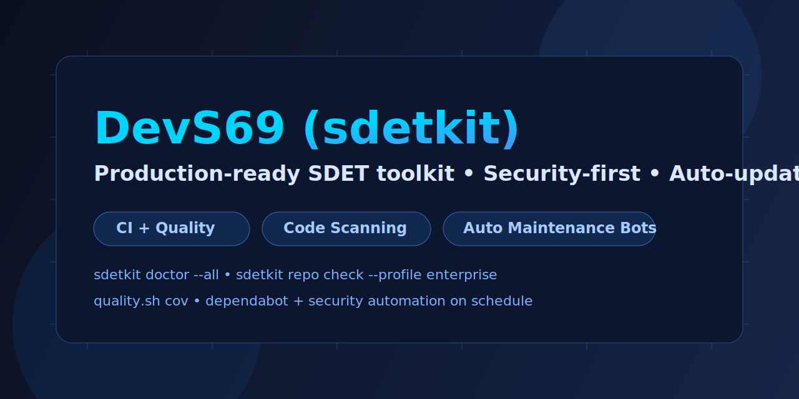
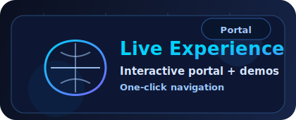
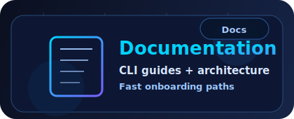
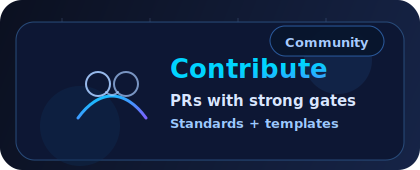
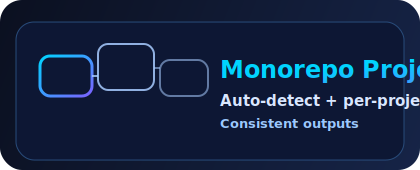
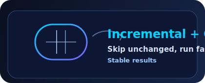

<div align="center">
  <a href="https://sherif69-sa.github.io/DevS69-sdetkit/">
    
  </a>

  <p>
    <a href="https://sherif69-sa.github.io/DevS69-sdetkit/"></a>
    <a href="docs/index.md"></a>
    <a href="docs/repo-audit.md"></a>
    <a href="docs/security.md"></a>
  </p>

  <h1 style="margin: 14px 0 6px; text-align: center;">DevS69 (sdetkit)</h1>

  <p style="max-width: 920px; margin: 0 auto 8px; font-size: 17px; line-height: 1.5;">
    <strong>One-line value proposition:</strong> DevS69 turns SDET quality, API reliability, and repository governance into one repeatable CLI workflow your team can run locally or in CI.
  </p>

  <p style="max-width: 920px; margin: 0 auto 10px; font-size: 16px; line-height: 1.55;">
    <strong>Production-ready SDET toolkit</strong> for API reliability, repository quality,
    and enterprise-grade engineering workflows — tightly aligned with the live portal experience.
  </p>

  <p style="margin: 6px 0 8px;"><strong>Built for:</strong> SDETs · QA Leads · Platform Engineers · Security Champions · Engineering Managers</p>

  <p style="margin: 10px 0 16px;">
    <a href="#quick-start"><strong>⚡ Start in 60 seconds</strong></a>
    ·
    <a href="#day-1-ultra-upgrade-pack"><strong>🧭 Day 1 onboarding</strong></a>
    ·
    <a href="https://sherif69-sa.github.io/DevS69-sdetkit/"><strong>🌐 Live Experience Portal</strong></a>
    ·
    <a href="docs/index.md"><strong>📚 Documentation</strong></a>
    ·
    <a href="CONTRIBUTING.md"><strong>🤝 Contribute</strong></a>
    ·
    <a href="docs/repo-tour.md"><strong>🧭 Repo Tour</strong></a>
  </p>

  <p>
    <a href="https://sherif69-sa.github.io/DevS69-sdetkit/"><strong>Open Portal Now →</strong></a>
  </p>

  <table>
    <tr>
      <td align="center">
        <a href="https://sherif69-sa.github.io/DevS69-sdetkit/">
          
        </a>
        <br />
        <a href="https://sherif69-sa.github.io/DevS69-sdetkit/"><strong>Open Live Experience Portal →</strong></a>
      </td>
      <td align="center">
        <a href="docs/index.md">
          
        </a>
        <br />
        <a href="docs/index.md"><strong>Browse Documentation Hub →</strong></a>
      </td>
      <td align="center">
        <a href="CONTRIBUTING.md">
          
        </a>
        <br />
        <a href="CONTRIBUTING.md"><strong>Start Contributing Guide →</strong></a>
      </td>
    </tr>
  </table>

  <table>
    <tr>
      <td align="center">
        <a href="docs/repo-tour.md">
          
        </a>
        <br />
        <a href="docs/repo-tour.md"><strong>Explore Repo Tour →</strong></a>
      </td>
      <td align="center">
        <a href="docs/repo-audit.md">
          
        </a>
        <br />
        <a href="docs/repo-audit.md"><strong>Review Cache + Audit Strategy →</strong></a>
      </td>
      <td align="center">
        <a href="docs/repo-audit.md">
          
        </a>
        <br />
        <a href="docs/repo-audit.md"><strong>See Exporters + Reports →</strong></a>
      </td>
    </tr>
  </table>

  <p style="margin: 14px 0 8px;">
    <a href="https://github.com/sherif69-sa/DevS69-sdetkit/actions/workflows/ci.yml"></a>
    <a href="https://github.com/sherif69-sa/DevS69-sdetkit/actions/workflows/quality.yml"></a>
    <a href="https://github.com/sherif69-sa/DevS69-sdetkit/actions/workflows/mutation-tests.yml"></a>
    <a href="https://github.com/sherif69-sa/DevS69-sdetkit/actions/workflows/security.yml"></a>
    <a href="https://github.com/sherif69-sa/DevS69-sdetkit/actions/workflows/pages.yml"></a>
  </p>

  <p style="margin: 0 0 10px;">
    <a href="https://github.com/sherif69-sa/DevS69-sdetkit/releases"></a>
    <a href="LICENSE"></a>
    
    <a href="https://github.com/sherif69-sa/DevS69-sdetkit/security/code-scanning"></a>
    <a href="https://github.com/sherif69-sa/DevS69-sdetkit/security/dependabot"></a>
  </p>
</div>

---

## 👥 Who this toolkit is for

| Role | Typical pain | What DevS69 helps you do |
|---|---|---|
| **SDET / QA Engineer** | Flaky checks and fragmented scripts | Run deterministic health, API, and policy checks from one CLI. |
| **Platform / DevOps Engineer** | Inconsistent repo standards across teams | Apply repeatable quality and security guardrails in CI/CD. |
| **Security / Compliance lead** | Weak evidence trail for controls and policy checks | Produce auditable reports and enforce baseline rules. |
| **Engineering Manager / Tech Lead** | Slow onboarding and unclear operational standards | Give teams a documented, role-based workflow with fast adoption paths. |

## 🟢 Top call to action

**Start with the fastest path:** follow the [Quick start](#quick-start) and run your first `doctor` + `repo audit` flow today.


## 🔥 Day 1 ultra upgrade pack

### Start by role (copy/paste entry points)

| I am a... | First command | Next action |
|---|---|---|
| **SDET / QA engineer** | `sdetkit doctor --format markdown` | Run [`repo audit`](docs/repo-audit.md) to convert warnings into fixable tasks. |
| **Platform / DevOps engineer** | `sdetkit repo audit --format markdown` | Wire checks into CI with the [GitHub Action guide](docs/github-action.md). |
| **Security / compliance lead** | `sdetkit security --format markdown` | Enforce policies from [security docs](docs/security.md) and [policy baselines](docs/policy-and-baselines.md). |
| **Engineering manager / tech lead** | `sdetkit doctor --format markdown` | Use [Automation OS docs](docs/automation-os.md) to standardize team-wide operating flow. |

### Day 1 success criteria

- ✅ Clear value proposition in the hero section.
- ✅ Explicit audience segmentation by engineering role.
- ✅ Top-of-page CTA that routes users to first successful command run.
- ✅ Role-specific entry table with immediate command-level next steps.

See the full implementation and validation report in [`docs/day-1-ultra-upgrade-report.md`](docs/day-1-ultra-upgrade-report.md).

Sample runnable artifact: [`docs/artifacts/day1-onboarding-sample.md`](docs/artifacts/day1-onboarding-sample.md) (generated by `python -m sdetkit onboarding --format markdown --output docs/artifacts/day1-onboarding-sample.md`).

## ✨ Platform spotlight

> **Big visual boost + aligned UX:** every major surface (hero, cards, quick links, launch map) now points clearly to the same experience center — **[sherif69-sa.github.io/DevS69-sdetkit](https://sherif69-sa.github.io/DevS69-sdetkit/)**.

## 🧠 Premium Engine Control Center (new)

<div align="center">
  <a href="https://sherif69-sa.github.io/DevS69-sdetkit/">
    <p><strong>Unified visual control center now aligned with the live site</strong></p>
  </a>

  <table>
    <tr>
      <td align="center"><strong>Data source</strong></td>
      <td align="center"><strong>Engine action</strong></td>
      <td align="center"><strong>Artifact / visualization</strong></td>
    </tr>
    <tr>
      <td>doctor.json / maintenance.json / security-check.json</td>
      <td>Normalize + score + rank warnings/recommendations</td>
      <td><code>.sdetkit/out/premium-summary.json</code></td>
    </tr>
    <tr>
      <td>premium-insights.db (guidelines + commit learning)</td>
      <td>Apply learned guidance to active warnings</td>
      <td>Runtime recommendation + manual fix plan</td>
    </tr>
    <tr>
      <td>Local API (<code>/guidelines</code>, <code>/analyze</code>, <code>/learn-commit</code>)</td>
      <td>Editable knowledge base + continuous learning loop</td>
      <td><a href="https://sherif69-sa.github.io/DevS69-sdetkit/">Live docs & visual portal</a></td>
    </tr>
  </table>
</div>

## 🧭 Fast entry paths

| What you need | Start here | Outcome |
|---|---|---|
| Get up and running quickly | [Quick start](#quick-start) | Ready-to-run local environment + first quality pass |
| Get role-based first steps instantly | `sdetkit onboarding --format markdown` | Copy/paste role paths for SDET, Platform, Security, and Engineering leads |
| Bootstrap Linux/macOS/Windows quickly | `sdetkit onboarding --platform all --format text` | One command prints platform-specific setup commands for mixed teams |
| Understand repository layout | [Repo tour](docs/repo-tour.md) | Role-based orientation and architecture map |
| Use CLI commands effectively | [CLI guide](docs/cli.md) | Practical usage patterns and examples |
| Diagnose repository health | [Doctor docs](docs/doctor.md) | Health checks and recommendations |
| Run safe checks and targeted fixes | [Repo audit](docs/repo-audit.md) | Enterprise-focused guardrails |
| Run deterministic automation workflows | [Automation OS](docs/automation-os.md) | Manager/worker workflows, replay, diff, artifacts |
| Contribute with confidence | [Contributing guide](CONTRIBUTING.md) | Quality gates + PR expectations |
| Grow adoption and reach | [Top-10 GitHub strategy](docs/top-10-github-strategy.md) | 90-day execution plan + measurable KPIs |
| Start immediately (Phase 1 days 1–30) | [Phase-1 daily execution plan](docs/top-10-github-strategy.md#phase-1-days-1-30-positioning-conversion-daily-execution) | High-impact actions for same-day momentum |

## 🎨 Visual + clickable experience map

<p align="center">
  <a href="#quick-start">⚡ Quick Start</a> ·
  <a href="#core-cli-commands">🛠️ Core CLI</a> ·
  <a href="#maintenance-and-diagnostics">🧪 Maintenance</a> ·
  <a href="#documentation-index">📘 Docs Index</a> ·
  <a href="#automation-highlights">🤖 Automation</a> ·
  <a href="https://sherif69-sa.github.io/DevS69-sdetkit/">🌐 Live Portal</a>
</p>

| Experience area | What you get | Direct links |
|---|---|---|
| **Onboarding flow** | Quick setup and immediate value | [Quick start](#quick-start), [60-second orientation](#60-second-orientation) |
| **Daily operations** | Stable commands for health, audits, and API checks | [Core CLI commands](#core-cli-commands), [Developer workflow](#developer-workflow) |
| **Quality + security** | Gate-driven reliability and hardening posture | [Repo audit](docs/repo-audit.md), [Security docs](docs/security.md) |
| **Contrib + governance** | Standards and expectations for collaboration | [Contributing](CONTRIBUTING.md), [Code of Conduct](CODE_OF_CONDUCT.md) |
| **Portal-aligned discovery** | Polished visual documentation experience | [Live portal](https://sherif69-sa.github.io/DevS69-sdetkit/), [Docs home](docs/index.md) |

## 🚀 Portal-aligned launch deck

| Area | Highlight | Open |
|---|---|---|
| **Experience center** | The primary visual destination for onboarding and project discovery. | [Open portal](https://sherif69-sa.github.io/DevS69-sdetkit/) |
| **Engineering docs** | Command docs, architecture references, and operational playbooks. | [Open docs](docs/index.md) |
| **Repository quality** | Audits, policy checks, and enterprise readiness workflows. | [Open repo audit](docs/repo-audit.md) |
| **Security posture** | Security policy, reporting, and hardening guidance. | [Open security docs](docs/security.md) |

## 🎯 What makes DevS69 stand out

| Pillar | Description |
|---|---|
| **Quality by default** | Linting, formatting, tests, mutation checks, and CI guardrails are designed into daily workflows. |
| **Security-first operations** | Security policy, code scanning, dependency hygiene, and hardening checks are built into automation. |
| **Operator-friendly CLI** | Commands are predictable, scriptable, and compatible with both local workflows and CI pipelines. |
| **Docs as a product surface** | Practical docs + live portal provide fast path onboarding for new contributors and maintainers. |

## 🗂️ Experience navigation (one-click)

### Governance & trust
- [Code of Conduct](CODE_OF_CONDUCT.md)
- [Contributing](CONTRIBUTING.md)
- [Security Policy](SECURITY.md)
- [Support](SUPPORT.md)
- [License](LICENSE)
- [Commercial Licensing](COMMERCIAL_LICENSE.md)

### Engineering standards
- [Quality Playbook](QUALITY_PLAYBOOK.md)
- [Release Guide](RELEASE.md)
- [Roadmap](ROADMAP.md)
- [Top-10 GitHub Strategy](docs/top-10-github-strategy.md)
- [Changelog](CHANGELOG.md)

### Documentation hub
- [Docs Home](docs/index.md)
- [Repo Tour](docs/repo-tour.md)
- [Project Structure](docs/project-structure.md)
- [Security Docs](docs/security.md)
- [Release Process](docs/releasing.md)

## 🚀 60-second orientation

1. Read this [README](README.md) for the quickest project overview.
2. Open [the live portal](https://sherif69-sa.github.io/DevS69-sdetkit/) for a polished visual entry point.
3. Use [docs/cli.md](docs/cli.md) + [docs/doctor.md](docs/doctor.md) for daily operations.
4. Follow [CONTRIBUTING.md](CONTRIBUTING.md) before opening a PR.


## AgentOS overview

AgentOS is the deterministic orchestration layer behind `sdetkit agent`.

```text
User/CI
  |
  v
sdetkit agent CLI
  |
  +--> Manager (plan)
  +--> Workers (actions: repo/report/fs/shell)
  +--> Reviewer (accept/reject)
  |
  +--> Safety gates (approval, allowlists, restricted shell)
  +--> Stable artifacts (history, conversations, dashboards, exports)
```

Core docs: [AgentOS foundation](docs/agentos-foundation.md), [Omnichannel + MCP bridge](docs/omnichannel-mcp-bridge.md), [Automation templates engine](docs/automation-templates-engine.md).

## Quickstart (clean checkout, provider=none)

```bash
python3 -m venv .venv
./.venv/bin/python -m pip install -r requirements-test.txt -r requirements-docs.txt -e .
./.venv/bin/sdetkit agent init
./.venv/bin/sdetkit agent run 'action repo.audit {"profile":"default"}' --approve
./.venv/bin/sdetkit agent dashboard build --format html
./.venv/bin/sdetkit report build --history-dir .sdetkit/audit-history --output report.html
```

This path is offline-friendly and deterministic when `provider.type=none` and inputs are unchanged.

## Production and enterprise notes

- Safety gates are explicit: dangerous writes/shell actions require approval and allowlists.
- Run records provide durable evidence for what executed and why.
- Exports are deterministic by default (sorted keys/lists + canonical JSON).
- Data ownership remains local to your repository workspace unless you explicitly route data elsewhere.
- MCP/tool bridge is disabled by default and must be explicitly allowlisted.

Additional references: [AgentOS cookbook](docs/agentos-cookbook.md), [Determinism contract](docs/determinism-contract.md), [Security model](docs/security-model.md).


## 🔐 Security Gate

Run the top-level security gate locally and in CI:

```bash
python -m sdetkit security scan --fail-on medium --format text
python -m sdetkit security report --format sarif --output build/security.sarif
python -m sdetkit security fix --dry-run
python -m sdetkit security fix --apply
python -m sdetkit notify --list
bash premium-gate.sh
```

More details:

- [Security gate guide](docs/security-gate.md)
- [Security model](docs/security-model.md)


## 🏢 Company adoption quickstart

```bash
python3 -m sdetkit ops init
python3 -m sdetkit policy snapshot --output .sdetkit/policies/baseline.json
python3 -m sdetkit policy check --baseline .sdetkit/policies/baseline.json
bash premium-gate.sh
```

Outputs are written under `.sdetkit/out/` by default (including `security.sarif` and `evidence.zip`).

## 🧩 Why this repository exists

This project is designed for fast onboarding and high-confidence delivery:

- **Clear entry points** in [`src/sdetkit`](src/sdetkit)
- **Strong quality gates** across lint, format, type checks, tests, coverage, and docs
- **Modular internals** that are easy to import, test, and extend
- **Docs-first architecture** for fast navigation and contributor productivity

## 🚀 Day 2 ultra: 60-second demo path

Use this copy-paste demo flow to show value in under a minute.

```bash
python -m sdetkit demo --execute --format text
```

Expected snippets you should see:

- `doctor score:` and `recommendations:`
- `Repo audit:` and `Result:`
- `security scan:` and `top findings:`

Need a shareable artifact?

```bash
python -m sdetkit demo --execute --format markdown --output docs/artifacts/day2-demo-sample.md
```

See implementation details: [Day 2 ultra upgrade report](docs/day-2-ultra-upgrade-report.md).

Day 2 closeout hints:

- Use `--fail-fast` during live demos to stop on first blocker.
- Use `--timeout-seconds 30` on slower CI machines.
- Use `--target-seconds 60` to enforce a strict Day 2 demo SLA.

## 📸 Day 3 ultra: proof pack

Day 3 focuses on evidence you can share in PRs, release notes, and stakeholder updates.

```bash
python -m sdetkit proof --execute --strict --format text
```

Generate a markdown artifact for handoffs:

```bash
python -m sdetkit proof --execute --strict --format markdown --output docs/artifacts/day3-proof-sample.md
```

See implementation details: [Day 3 ultra upgrade report](docs/day-3-ultra-upgrade-report.md).

Day 3 closeout gate:

```bash
python scripts/check_day3_proof_contract.py
```

- Keep generated markdown artifacts under `docs/artifacts/` for traceability.

## 🧠 Day 4 ultra: skills expansion

Day 4 focuses on automation skill coverage: discover every built-in AgentOS template (skill), run all skills in one command, and keep deterministic artifacts per skill.

```bash
python -m sdetkit agent templates list
python -m sdetkit agent templates run-all --output-dir .sdetkit/agent/template-runs
```

Inspect a specific skill/template contract:

```bash
python -m sdetkit agent templates show repo-health-audit
```

See implementation details: [Day 4 ultra upgrade report](docs/day-4-ultra-upgrade-report.md).

Review sample artifact: [Day 4 skills sample](docs/artifacts/day4-skills-sample.md).

Day 4 closeout checks:

```bash
python -m pytest -q tests/test_agent_templates_cli.py
python scripts/check_day4_skills_contract.py
```

- Keep generated markdown artifacts under `docs/artifacts/` for traceability.

## 🖥️ Day 5 ultra: platform onboarding boost

Day 5 removed setup friction for mixed-OS teams with platform-specific onboarding steps.

```bash
python -m sdetkit onboarding --format text --platform all
```

Generate a shareable onboarding artifact:

```bash
python -m sdetkit onboarding --format markdown --platform all --output docs/artifacts/day5-platform-onboarding-sample.md
```

See implementation details: [Day 5 ultra upgrade report](docs/day-5-ultra-upgrade-report.md).

Review sample artifact: [Day 5 platform onboarding sample](docs/artifacts/day5-platform-onboarding-sample.md).

## 🔗 Day 6 ultra: conversion QA hardening

Day 6 adds a runnable docs conversion QA gate that validates README/docs links and anchors so first-time users do not hit dead paths.

```bash
python -m sdetkit docs-qa --format text
```

Export a Day 6 QA artifact for reviews and handoffs:

```bash
python -m sdetkit docs-qa --format markdown --output docs/artifacts/day6-conversion-qa-sample.md
```

See implementation details: [Day 6 ultra upgrade report](docs/day-6-ultra-upgrade-report.md).

Day 6 closeout checks:

```bash
python -m pytest -q tests/test_docs_qa.py tests/test_cli_help_lists_subcommands.py
python scripts/check_day6_conversion_contract.py
```


## 📊 Day 7 ultra: weekly review #1

Day 7 closes week one with an objective review of what shipped, KPI movement, and next-week priorities.

```bash
python -m sdetkit weekly-review --format text
```

Export a markdown artifact for stakeholder handoff:

```bash
python -m sdetkit weekly-review --format markdown --output docs/artifacts/day7-weekly-review-sample.md
```

See implementation details: [Day 7 ultra upgrade report](docs/day-7-ultra-upgrade-report.md).

Day 7 closeout checks:

```bash
python -m pytest -q tests/test_weekly_review.py tests/test_cli_help_lists_subcommands.py
python scripts/check_day7_weekly_review_contract.py
```


## 🧲 Day 8 ultra: contributor funnel backlog

Day 8 starts week two with a curated `good first issue` backlog so new contributors can pick scoped tasks with clear acceptance criteria.

```bash
python -m sdetkit contributor-funnel --format text --strict
```

Export a markdown artifact for triage and community channels:

```bash
python -m sdetkit contributor-funnel --format markdown --output docs/artifacts/day8-good-first-issues-sample.md
python -m sdetkit contributor-funnel --area docs --issue-pack-dir docs/artifacts/day8-issue-pack
```

See implementation details: [Day 8 ultra upgrade report](docs/day-8-ultra-upgrade-report.md).

Day 8 closeout checks:

```bash
python -m pytest -q tests/test_contributor_funnel.py tests/test_cli_help_lists_subcommands.py
python scripts/check_day8_contributor_funnel_contract.py
python -m sdetkit contributor-funnel --format json --strict
```

## 🧩 Day 9 ultra: contribution templates

Day 9 upgrades issue + PR templates and issue-template config for faster triage with explicit severity, acceptance criteria, risk, rollback, and recovery automation.

```bash
python -m sdetkit triage-templates --format text --strict
python -m sdetkit triage-templates --write-defaults --format json --strict
```

Export a markdown artifact for maintainer handoff:

```bash
python -m sdetkit triage-templates --format markdown --output docs/artifacts/day9-triage-templates-sample.md
```

See implementation details: [Day 9 ultra upgrade report](docs/day-9-ultra-upgrade-report.md).

Day 9 closeout checks:

```bash
python -m pytest -q tests/test_triage_templates.py tests/test_cli_help_lists_subcommands.py
python scripts/check_day9_contribution_templates_contract.py
python -m sdetkit triage-templates --format json --strict
```

## ✅ Day 10 ultra: first-contribution checklist

Day 10 adds a guided first-contribution checklist so new contributors can move from fork/clone to PR with deterministic quality gates.

```bash
python -m sdetkit first-contribution --format text --strict
python -m sdetkit first-contribution --write-defaults --format json --strict
```

Export a markdown artifact for mentor/reviewer handoff:

```bash
python -m sdetkit first-contribution --format markdown --output docs/artifacts/day10-first-contribution-checklist-sample.md
```

See implementation details: [Day 10 ultra upgrade report](docs/day-10-ultra-upgrade-report.md).

Day 10 closeout checks:

```bash
python -m pytest -q tests/test_first_contribution.py tests/test_cli_help_lists_subcommands.py
python scripts/check_day10_first_contribution_contract.py
python -m sdetkit first-contribution --format json --strict
```


## 🧭 Day 11 ultra: docs navigation tune-up

Day 11 makes top user journeys one-click from docs home so users can jump straight to fast start, core CLI guidance, and contribution paths.

```bash
python -m sdetkit docs-nav --format text --strict
python -m sdetkit docs-nav --write-defaults --format json --strict
```

Export a markdown artifact for docs handoff:

```bash
python -m sdetkit docs-nav --format markdown --output docs/artifacts/day11-docs-navigation-sample.md
```

See implementation details: [Day 11 ultra upgrade report](docs/day-11-ultra-upgrade-report.md).

Day 11 closeout checks:

```bash
python -m pytest -q tests/test_docs_navigation.py tests/test_cli_help_lists_subcommands.py
python scripts/check_day11_docs_navigation_contract.py
python -m sdetkit docs-nav --format json --strict
```

## 🚀 Day 12 ultra: startup/small-team use-case page

Day 12 ships a dedicated startup/small-team workflow landing page with a runnable 10-minute path, weekly operating rhythm, and quality guardrails.

```bash
python -m sdetkit startup-use-case --format text --strict
python -m sdetkit startup-use-case --write-defaults --format json --strict
python -m sdetkit startup-use-case --emit-pack-dir docs/artifacts/day12-startup-pack --format json --strict
```

Export a markdown artifact for adoption handoff:

```bash
python -m sdetkit startup-use-case --format markdown --output docs/artifacts/day12-startup-use-case-sample.md
```

See implementation details: [Day 12 ultra upgrade report](docs/day-12-ultra-upgrade-report.md).

Day 12 closeout checks:

```bash
python -m pytest -q tests/test_startup_use_case.py tests/test_cli_help_lists_subcommands.py
python scripts/check_day12_startup_use_case_contract.py
python -m sdetkit startup-use-case --format json --strict
```

## 🏢 Day 13 ultra: enterprise/regulated use-case page

Day 13 ships a dedicated enterprise/regulated workflow landing page with governance cadence, compliance evidence controls, and rollout guidance for multi-repo organizations.

```bash
python -m sdetkit enterprise-use-case --format text --strict
python -m sdetkit enterprise-use-case --write-defaults --format json --strict
python -m sdetkit enterprise-use-case --emit-pack-dir docs/artifacts/day13-enterprise-pack --format json --strict
python -m sdetkit enterprise-use-case --execute --evidence-dir docs/artifacts/day13-enterprise-pack/evidence --format json --strict
```

Export a markdown artifact for compliance handoff:

```bash
python -m sdetkit enterprise-use-case --format markdown --output docs/artifacts/day13-enterprise-use-case-sample.md
```

See implementation details: [Day 13 ultra upgrade report](docs/day-13-ultra-upgrade-report.md).

Day 13 closeout checks:

```bash
python -m pytest -q tests/test_enterprise_use_case.py tests/test_cli_help_lists_subcommands.py
python scripts/check_day13_enterprise_use_case_contract.py
python -m sdetkit enterprise-use-case --format json --strict
python -m sdetkit enterprise-use-case --execute --evidence-dir docs/artifacts/day13-enterprise-pack/evidence --format json --strict
```

## 📈 Day 14 ultra: weekly review #2

Day 14 closes week two with deterministic reporting for Day 8-13 shipment status, KPI movement, growth signals (traffic/stars/discussions), and blocker-fix closeout tracking.

```bash
python -m sdetkit weekly-review --week 2 --format text --signals-file docs/artifacts/day14-growth-signals.json --previous-signals-file docs/artifacts/day7-growth-signals.json
```

Export a markdown artifact for stakeholder handoff:

```bash
python -m sdetkit weekly-review --week 2 --format markdown --signals-file docs/artifacts/day14-growth-signals.json --previous-signals-file docs/artifacts/day7-growth-signals.json --output docs/artifacts/day14-weekly-review-sample.md
```

Emit a Day 14 closeout pack (checklist, KPI scorecard, blocker action plan):

```bash
python -m sdetkit weekly-review --week 2 --emit-pack-dir docs/artifacts/day14-weekly-pack --signals-file docs/artifacts/day14-growth-signals.json --previous-signals-file docs/artifacts/day7-growth-signals.json --format json --strict
```

See implementation details: [Day 14 ultra upgrade report](docs/day-14-ultra-upgrade-report.md).

Day 14 closeout checks:

```bash
python -m pytest -q tests/test_weekly_review.py tests/test_cli_help_lists_subcommands.py
python scripts/check_day14_weekly_review_contract.py
python -m sdetkit weekly-review --week 2 --format json --signals-file docs/artifacts/day14-growth-signals.json --previous-signals-file docs/artifacts/day7-growth-signals.json --strict
```

## 🔁 Day 15 ultra: GitHub Actions quickstart

Day 15 closes with a **production-ready integration recipe**: minimal + strict + nightly GitHub Actions workflows, execution evidence capture, and distribution-loop guidance.

```bash
python -m sdetkit github-actions-quickstart --format text --strict
python -m sdetkit github-actions-quickstart --format json --variant strict --strict
python -m sdetkit github-actions-quickstart --write-defaults --format json --strict
python -m sdetkit github-actions-quickstart --emit-pack-dir docs/artifacts/day15-github-pack --format json --strict
python -m sdetkit github-actions-quickstart --execute --evidence-dir docs/artifacts/day15-github-pack/evidence --format json --strict
```

Export a markdown artifact for handoff:

```bash
python -m sdetkit github-actions-quickstart --format markdown --variant strict --output docs/artifacts/day15-github-actions-quickstart-sample.md
```

See implementation details: [Day 15 ultra upgrade report](docs/day-15-ultra-upgrade-report.md).

Day 15 closeout checks:

```bash
python -m pytest -q tests/test_github_actions_quickstart.py tests/test_cli_help_lists_subcommands.py
python scripts/check_day15_github_actions_quickstart_contract.py
python -m sdetkit github-actions-quickstart --format json --strict
python -m sdetkit github-actions-quickstart --execute --evidence-dir docs/artifacts/day15-github-pack/evidence --format json --strict
```

## 🦊 Day 16 ultra: GitLab CI quickstart

Day 16 ships a **production-ready GitLab CI integration recipe** with minimal + strict + nightly pipelines, evidence capture, and distribution-loop guidance.

```bash
python -m sdetkit gitlab-ci-quickstart --format text --strict
python -m sdetkit gitlab-ci-quickstart --format json --variant strict --strict
python -m sdetkit gitlab-ci-quickstart --write-defaults --format json --strict
python -m sdetkit gitlab-ci-quickstart --emit-pack-dir docs/artifacts/day16-gitlab-pack --format json --strict
python -m sdetkit gitlab-ci-quickstart --variant strict --bootstrap-pipeline --pipeline-path .gitlab-ci.yml --format json --strict
python -m sdetkit gitlab-ci-quickstart --execute --evidence-dir docs/artifacts/day16-gitlab-pack/evidence --format json --strict
```

Export a markdown artifact for handoff:

```bash
python -m sdetkit gitlab-ci-quickstart --format markdown --variant strict --output docs/artifacts/day16-gitlab-ci-quickstart-sample.md
```

See implementation details: [Day 16 ultra upgrade report](docs/day-16-ultra-upgrade-report.md).

Day 16 closeout checks:

```bash
python -m pytest -q tests/test_gitlab_ci_quickstart.py tests/test_cli_help_lists_subcommands.py
python scripts/check_day16_gitlab_ci_quickstart_contract.py
python -m sdetkit gitlab-ci-quickstart --format json --strict
python -m sdetkit gitlab-ci-quickstart --variant strict --bootstrap-pipeline --pipeline-path .gitlab-ci.yml --format json --strict
python -m sdetkit gitlab-ci-quickstart --execute --evidence-dir docs/artifacts/day16-gitlab-pack/evidence --format json --strict
```

## 🧮 Day 17 ultra: quality + contribution deltas

Day 17 captures one **week-over-week evidence pack** that combines quality KPIs and contribution signals into a single closeout view.

```bash
python -m sdetkit quality-contribution-delta --current-signals-file docs/artifacts/day17-growth-signals.json --previous-signals-file docs/artifacts/day14-growth-signals.json --format text
python -m sdetkit quality-contribution-delta --current-signals-file docs/artifacts/day17-growth-signals.json --previous-signals-file docs/artifacts/day14-growth-signals.json --format json --strict
python -m sdetkit quality-contribution-delta --current-signals-file docs/artifacts/day17-growth-signals.json --previous-signals-file docs/artifacts/day14-growth-signals.json --min-traffic-delta 100 --min-stars-delta 5 --min-discussions-delta 2 --min-blocker-fixes-delta 1 --format json --strict
python -m sdetkit quality-contribution-delta --current-signals-file docs/artifacts/day17-growth-signals.json --previous-signals-file docs/artifacts/day14-growth-signals.json --emit-pack-dir docs/artifacts/day17-delta-pack --format json --strict
```

Export a markdown artifact for handoff:

```bash
python -m sdetkit quality-contribution-delta --current-signals-file docs/artifacts/day17-growth-signals.json --previous-signals-file docs/artifacts/day14-growth-signals.json --format markdown --output docs/artifacts/day17-quality-contribution-delta-sample.md
```

See implementation details: [Day 17 ultra upgrade report](docs/day-17-ultra-upgrade-report.md).

Day 17 closeout checks:

```bash
python -m pytest -q tests/test_quality_contribution_delta.py tests/test_cli_help_lists_subcommands.py
python scripts/check_day17_quality_contribution_delta_contract.py
python -m sdetkit quality-contribution-delta --current-signals-file docs/artifacts/day17-growth-signals.json --previous-signals-file docs/artifacts/day14-growth-signals.json --format json --strict
```

## 🧱 Day 18 ultra: reliability evidence pack

Day 18 now ships a production-grade **reliability operating pack** that consolidates Day 15/16 execution evidence and Day 17 quality+contribution deltas into one deterministic closeout lane.

```bash
python -m sdetkit reliability-evidence-pack --format text
python -m sdetkit reliability-evidence-pack --format json --strict
python -m sdetkit reliability-evidence-pack --write-defaults --format json --strict
python -m sdetkit reliability-evidence-pack --emit-pack-dir docs/artifacts/day18-reliability-pack --format json --strict
python -m sdetkit reliability-evidence-pack --execute --evidence-dir docs/artifacts/day18-reliability-pack/evidence --format json --strict
```

Export a markdown artifact for handoff:

```bash
python -m sdetkit reliability-evidence-pack --format markdown --output docs/artifacts/day18-reliability-evidence-pack-sample.md
```

See implementation details: [Day 18 ultra upgrade report](docs/day-18-ultra-upgrade-report.md).

Day 18 closeout checks:

```bash
python -m pytest -q tests/test_reliability_evidence_pack.py tests/test_cli_help_lists_subcommands.py
python scripts/check_day18_reliability_evidence_pack_contract.py
python -m sdetkit reliability-evidence-pack --format json --strict
python -m sdetkit reliability-evidence-pack --execute --evidence-dir docs/artifacts/day18-reliability-pack/evidence --format json --strict
```


## 🧭 Day 19 ultra: release readiness board

Day 19 ships a deterministic **release readiness board** that combines Day 18 reliability posture with Day 14 KPI trend health into one go/no-go score.

```bash
python -m sdetkit release-readiness-board --format text
python -m sdetkit release-readiness-board --format json --strict
python -m sdetkit release-readiness-board --write-defaults --format json --strict
python -m sdetkit release-readiness-board --emit-pack-dir docs/artifacts/day19-release-readiness-pack --format json --strict
python -m sdetkit release-readiness-board --execute --evidence-dir docs/artifacts/day19-release-readiness-pack/evidence --format json --strict
```

Export a markdown artifact for handoff:

```bash
python -m sdetkit release-readiness-board --format markdown --output docs/artifacts/day19-release-readiness-board-sample.md
```

See implementation details: [Day 19 ultra upgrade report](docs/day-19-ultra-upgrade-report.md).

Day 19 closeout checks:

```bash
python -m pytest -q tests/test_release_readiness_board.py tests/test_cli_help_lists_subcommands.py
python scripts/check_day19_release_readiness_board_contract.py
python -m sdetkit release-readiness-board --format json --strict
python -m sdetkit release-readiness-board --execute --evidence-dir docs/artifacts/day19-release-readiness-pack/evidence --format json --strict
```

## ✍️ Day 20 ultra: release narrative

Day 20 now ships a deterministic **release narrative operating lane** that converts Day 19 readiness posture and changelog highlights into multi-channel, non-maintainer storytelling.

```bash
python -m sdetkit release-narrative --format text
python -m sdetkit release-narrative --format json --strict
python -m sdetkit release-narrative --write-defaults --format json --strict
python -m sdetkit release-narrative --emit-pack-dir docs/artifacts/day20-release-narrative-pack --format json --strict
python -m sdetkit release-narrative --execute --evidence-dir docs/artifacts/day20-release-narrative-pack/evidence --format json --strict
```

Export a markdown artifact for handoff:

```bash
python -m sdetkit release-narrative --format markdown --output docs/artifacts/day20-release-narrative-sample.md
```

See implementation details: [Day 20 ultra upgrade report](docs/day-20-ultra-upgrade-report.md).

Day 20 closeout checks:

```bash
python -m pytest -q tests/test_release_narrative.py tests/test_cli_help_lists_subcommands.py
python scripts/check_day20_release_narrative_contract.py
python -m sdetkit release-narrative --format json --strict
python -m sdetkit release-narrative --execute --evidence-dir docs/artifacts/day20-release-narrative-pack/evidence --format json --strict
```

## 📊 Day 21 ultra: weekly review #3

Day 21 ships a deterministic **weekly review #3 closeout lane** that tracks conversion and contributor-response movement across Days 15-20 in one scorecard.

```bash
python -m sdetkit weekly-review --week 3 --format text --signals-file docs/artifacts/day21-growth-signals.json --previous-signals-file docs/artifacts/day14-growth-signals.json
python -m sdetkit weekly-review --week 3 --format json --signals-file docs/artifacts/day21-growth-signals.json --previous-signals-file docs/artifacts/day14-growth-signals.json --strict
python -m sdetkit weekly-review --week 3 --emit-pack-dir docs/artifacts/day21-weekly-pack --signals-file docs/artifacts/day21-growth-signals.json --previous-signals-file docs/artifacts/day14-growth-signals.json --format json --strict
```

Export a markdown artifact for handoff:

```bash
python -m sdetkit weekly-review --week 3 --format markdown --signals-file docs/artifacts/day21-growth-signals.json --previous-signals-file docs/artifacts/day14-growth-signals.json --output docs/artifacts/day21-weekly-review-sample.md
```

See implementation details: [Day 21 ultra upgrade report](docs/day-21-ultra-upgrade-report.md).

Day 21 closeout checks:

```bash
python -m pytest -q tests/test_weekly_review.py tests/test_cli_help_lists_subcommands.py
python scripts/check_day21_weekly_review_contract.py
python -m sdetkit weekly-review --week 3 --format json --signals-file docs/artifacts/day21-growth-signals.json --previous-signals-file docs/artifacts/day14-growth-signals.json --strict
python -m sdetkit weekly-review --week 3 --emit-pack-dir docs/artifacts/day21-weekly-pack --signals-file docs/artifacts/day21-growth-signals.json --previous-signals-file docs/artifacts/day14-growth-signals.json --format json --strict
```

## 🔐 Day 22 ultra: trust signal upgrade

Day 22 ships a deterministic **trust signal upgrade lane** that verifies reliability badges, policy discoverability links, and core trust workflows before broad promotion.

```bash
python -m sdetkit trust-signal-upgrade --format text
python -m sdetkit trust-signal-upgrade --format json --strict
python -m sdetkit trust-signal-upgrade --docs-index docs/index.md --min-trust-score 95 --format json --strict
python -m sdetkit trust-signal-upgrade --write-defaults --format json --strict
python -m sdetkit trust-signal-upgrade --emit-pack-dir docs/artifacts/day22-trust-pack --format json --strict
python -m sdetkit trust-signal-upgrade --execute --evidence-dir docs/artifacts/day22-trust-pack/evidence --format json --strict
```

Export a markdown artifact for handoff:

```bash
python -m sdetkit trust-signal-upgrade --format markdown --output docs/artifacts/day22-trust-signal-upgrade-sample.md
```

See implementation details: [Day 22 ultra upgrade report](docs/day-22-ultra-upgrade-report.md).

Day 22 closeout checks:

```bash
python -m pytest -q tests/test_trust_signal_upgrade.py tests/test_cli_help_lists_subcommands.py
python scripts/check_day22_trust_signal_upgrade_contract.py
python -m sdetkit trust-signal-upgrade --format json --strict
python -m sdetkit trust-signal-upgrade --execute --evidence-dir docs/artifacts/day22-trust-pack/evidence --format json --strict
```


## ❓ Day 23 ultra: FAQ and objections

Day 23 ships a deterministic **FAQ and objection closeout lane** so adoption blockers become validated, operational answers instead of ad-hoc replies.

```bash
python -m sdetkit faq-objections --format text
python -m sdetkit faq-objections --format json --strict
python -m sdetkit faq-objections --docs-page docs/integrations-faq-objections.md --min-faq-score 90 --format json --strict
python -m sdetkit faq-objections --write-defaults --format json --strict
python -m sdetkit faq-objections --emit-pack-dir docs/artifacts/day23-faq-pack --format json --strict
python -m sdetkit faq-objections --execute --evidence-dir docs/artifacts/day23-faq-pack/evidence --format json --strict
```

Export a markdown artifact for handoff:

```bash
python -m sdetkit faq-objections --format markdown --output docs/artifacts/day23-faq-objections-sample.md
```

See implementation details: [Day 23 ultra upgrade report](docs/day-23-ultra-upgrade-report.md).

## ⏱️ Day 24 ultra: onboarding time-to-first-success

- Run `python -m sdetkit onboarding-time-upgrade --format json --strict` to validate Day 24 closeout readiness.
- Emit shareable onboarding pack: `python -m sdetkit onboarding-time-upgrade --emit-pack-dir docs/artifacts/day24-onboarding-pack --format json --strict`.
- Execute and collect deterministic logs: `python -m sdetkit onboarding-time-upgrade --execute --evidence-dir docs/artifacts/day24-onboarding-pack/evidence --format json --strict`.
- Review Day 24 integration guide: [Onboarding time upgrade](docs/integrations-onboarding-time-upgrade.md).

See implementation details: [Day 24 ultra upgrade report](docs/day-24-ultra-upgrade-report.md).

## 🗳️ Day 25 ultra: community activation

- Run `python -m sdetkit community-activation --format json --strict` to validate Day 25 roadmap-voting readiness.
- Emit shareable community pack: `python -m sdetkit community-activation --emit-pack-dir docs/artifacts/day25-community-pack --format json --strict`.
- Execute and collect deterministic logs: `python -m sdetkit community-activation --execute --evidence-dir docs/artifacts/day25-community-pack/evidence --format json --strict`.
- Review Day 25 integration guide: [Community activation](docs/integrations-community-activation.md).

See implementation details: [Day 25 ultra upgrade report](docs/day-25-ultra-upgrade-report.md).

## 📣 Day 26 ultra: external contribution push

- Run `python -m sdetkit external-contribution-push --format json --strict` to validate Day 26 starter-task spotlight readiness.
- Emit shareable external contribution pack: `python -m sdetkit external-contribution-push --emit-pack-dir docs/artifacts/day26-external-contribution-pack --format json --strict`.
- Execute and collect deterministic logs: `python -m sdetkit external-contribution-push --execute --evidence-dir docs/artifacts/day26-external-contribution-pack/evidence --format json --strict`.
- Review Day 26 integration guide: [External contribution push](docs/integrations-external-contribution-push.md).

See implementation details: [Day 26 ultra upgrade report](docs/day-26-ultra-upgrade-report.md).

## 📊 Day 27 ultra: KPI audit closeout

- Run `python -m sdetkit kpi-audit --format json --strict` to validate Day 27 KPI baseline-vs-current readiness.
- Emit shareable KPI pack: `python -m sdetkit kpi-audit --emit-pack-dir docs/artifacts/day27-kpi-pack --format json --strict`.
- Execute and collect deterministic logs: `python -m sdetkit kpi-audit --execute --evidence-dir docs/artifacts/day27-kpi-pack/evidence --format json --strict`.
- Review Day 27 integration guide: [KPI audit](docs/integrations-kpi-audit.md).

See implementation details: [Day 27 ultra upgrade report](docs/day-27-ultra-upgrade-report.md).


## 🧾 Day 28 ultra: weekly review #4 closeout

- Run `python -m sdetkit day28-weekly-review --format json --strict` to validate Day 28 wins/misses/corrective-actions readiness.
- Emit shareable weekly pack: `python -m sdetkit day28-weekly-review --emit-pack-dir docs/artifacts/day28-weekly-pack --format json --strict`.
- Execute and collect deterministic logs: `python -m sdetkit day28-weekly-review --execute --evidence-dir docs/artifacts/day28-weekly-pack/evidence --format json --strict`.
- Review Day 28 integration guide: [Weekly review #4](docs/integrations-day28-weekly-review.md).

See implementation details: [Day 28 ultra upgrade report](docs/day-28-ultra-upgrade-report.md).


## 🧱 Day 29 ultra: Phase-1 hardening closeout

- Run `python -m sdetkit day29-phase1-hardening --format json --strict` to validate Day 29 entry-page hardening readiness.
- Emit shareable hardening pack: `python -m sdetkit day29-phase1-hardening --emit-pack-dir docs/artifacts/day29-hardening-pack --format json --strict`.
- Execute and collect deterministic logs: `python -m sdetkit day29-phase1-hardening --execute --evidence-dir docs/artifacts/day29-hardening-pack/evidence --format json --strict`.
- Review Day 29 integration guide: [Phase-1 hardening](docs/integrations-day29-phase1-hardening.md).

See implementation details: [Day 29 ultra upgrade report](docs/day-29-ultra-upgrade-report.md).


## 🏁 Day 30 ultra: Phase-1 wrap + Phase-2 handoff

- Run `python -m sdetkit day30-phase1-wrap --format json --strict` to validate Day 30 closeout and handoff readiness.
- Emit shareable wrap pack: `python -m sdetkit day30-phase1-wrap --emit-pack-dir docs/artifacts/day30-wrap-pack --format json --strict`.
- Execute and collect deterministic logs: `python -m sdetkit day30-phase1-wrap --execute --evidence-dir docs/artifacts/day30-wrap-pack/evidence --format json --strict`.
- Review Day 30 integration guide: [Phase-1 wrap + handoff](docs/integrations-day30-phase1-wrap.md).

See implementation details: [Day 30 ultra upgrade report](docs/day-30-ultra-upgrade-report.md).

Day 30 closeout checks:

```bash
python -m pytest -q tests/test_day30_phase1_wrap.py tests/test_cli_help_lists_subcommands.py
python scripts/check_day30_phase1_wrap_contract.py
python -m sdetkit day30-phase1-wrap --format json --strict
python -m sdetkit day30-phase1-wrap --execute --evidence-dir docs/artifacts/day30-wrap-pack/evidence --format json --strict
```


## 🚀 Day 31 ultra: Phase-2 kickoff baseline

- Run `python -m sdetkit day31-phase2-kickoff --format json --strict` to validate Day 31 baseline + weekly-target readiness.
- Emit shareable kickoff pack: `python -m sdetkit day31-phase2-kickoff --emit-pack-dir docs/artifacts/day31-phase2-pack --format json --strict`.
- Execute and collect deterministic logs: `python -m sdetkit day31-phase2-kickoff --execute --evidence-dir docs/artifacts/day31-phase2-pack/evidence --format json --strict`.
- Review Day 31 integration guide: [Phase-2 kickoff baseline](docs/integrations-day31-phase2-kickoff.md).

See implementation details: [Day 31 ultra upgrade report](docs/day-31-ultra-upgrade-report.md).

Day 31 kickoff checks:

```bash
python -m pytest -q tests/test_day31_phase2_kickoff.py tests/test_cli_help_lists_subcommands.py
python scripts/check_day31_phase2_kickoff_contract.py
python -m sdetkit day31-phase2-kickoff --emit-pack-dir docs/artifacts/day31-phase2-pack --format json --strict
python -m sdetkit day31-phase2-kickoff --execute --evidence-dir docs/artifacts/day31-phase2-pack/evidence --format json --strict
python -m sdetkit day31-phase2-kickoff --format json --strict
```

Day 31 upgraded pack artifacts include:

- `day31-phase2-kickoff-summary.json`
- `day31-phase2-kickoff-summary.md`
- `day31-baseline-snapshot.json`
- `day31-delivery-board.md`
- `day31-validation-commands.md`


## 🧭 Day 32 ultra: Release cadence setup

- Run `python -m sdetkit day32-release-cadence --format json --strict` to validate Day 32 release-cadence and changelog-quality readiness.
- Emit shareable cadence pack: `python -m sdetkit day32-release-cadence --emit-pack-dir docs/artifacts/day32-release-cadence-pack --format json --strict`.
- Execute and collect deterministic logs: `python -m sdetkit day32-release-cadence --execute --evidence-dir docs/artifacts/day32-release-cadence-pack/evidence --format json --strict`.
- Review Day 32 integration guide: [Release cadence setup](docs/integrations-day32-release-cadence.md).

See implementation details: [Day 32 ultra upgrade report](docs/day-32-ultra-upgrade-report.md).

Day 32 cadence checks:

```bash
python -m pytest -q tests/test_day32_release_cadence.py tests/test_cli_help_lists_subcommands.py
python scripts/check_day32_release_cadence_contract.py
python -m sdetkit day32-release-cadence --emit-pack-dir docs/artifacts/day32-release-cadence-pack --format json --strict
python -m sdetkit day32-release-cadence --execute --evidence-dir docs/artifacts/day32-release-cadence-pack/evidence --format json --strict
python -m sdetkit day32-release-cadence --format json --strict
```

Day 32 upgraded pack artifacts include:

- `day32-release-cadence-summary.json`
- `day32-release-cadence-summary.md`
- `day32-cadence-calendar.json`
- `day32-changelog-template.md`
- `day32-delivery-board.md`
- `day32-validation-commands.md`


## 🎬 Day 33 ultra: Demo asset #1 production

- Run `python -m sdetkit day33-demo-asset --format json --strict` to validate Day 33 demo-production readiness.
- Emit shareable demo pack: `python -m sdetkit day33-demo-asset --emit-pack-dir docs/artifacts/day33-demo-asset-pack --format json --strict`.
- Execute and collect deterministic logs: `python -m sdetkit day33-demo-asset --execute --evidence-dir docs/artifacts/day33-demo-asset-pack/evidence --format json --strict`.
- Review Day 33 integration guide: [Demo asset #1 production](docs/integrations-day33-demo-asset.md).

See implementation details: [Day 33 ultra upgrade report](docs/day-33-ultra-upgrade-report.md).

Day 33 demo checks:

```bash
python -m pytest -q tests/test_day33_demo_asset.py tests/test_cli_help_lists_subcommands.py
python scripts/check_day33_demo_asset_contract.py
python -m sdetkit day33-demo-asset --emit-pack-dir docs/artifacts/day33-demo-asset-pack --format json --strict
python -m sdetkit day33-demo-asset --execute --evidence-dir docs/artifacts/day33-demo-asset-pack/evidence --format json --strict
python -m sdetkit day33-demo-asset --format json --strict
```

Day 33 upgraded pack artifacts include:

- `day33-demo-asset-summary.json`
- `day33-demo-asset-summary.md`
- `day33-demo-asset-plan.json`
- `day33-demo-script.md`
- `day33-delivery-board.md`
- `day33-validation-commands.md`


## 🎬 Day 34 ultra: Demo asset #2 production (`repo audit`)

- Run `python -m sdetkit day34-demo-asset2 --format json --strict` to validate Day 34 repo-audit demo-production readiness.
- Emit shareable demo pack: `python -m sdetkit day34-demo-asset2 --emit-pack-dir docs/artifacts/day34-demo-asset2-pack --format json --strict`.
- Execute and collect deterministic logs: `python -m sdetkit day34-demo-asset2 --execute --evidence-dir docs/artifacts/day34-demo-asset2-pack/evidence --format json --strict`.
- Review Day 34 integration guide: [Demo asset #2 production](docs/integrations-day34-demo-asset2.md).

See implementation details: [Day 34 ultra upgrade report](docs/day-34-ultra-upgrade-report.md).

Day 34 demo checks:

```bash
python -m pytest -q tests/test_day34_demo_asset2.py tests/test_cli_help_lists_subcommands.py
python scripts/check_day34_demo_asset2_contract.py
python -m sdetkit day34-demo-asset2 --emit-pack-dir docs/artifacts/day34-demo-asset2-pack --format json --strict
python -m sdetkit day34-demo-asset2 --execute --evidence-dir docs/artifacts/day34-demo-asset2-pack/evidence --format json --strict
python -m sdetkit day34-demo-asset2 --format json --strict
```

Day 34 upgraded pack artifacts include:

- `day34-demo-asset2-summary.json`
- `day34-demo-asset2-summary.md`
- `day34-demo-asset2-plan.json`
- `day34-demo-script.md`
- `day34-delivery-board.md`
- `day34-validation-commands.md`


## 📈 Day 35 big upgrade: KPI instrumentation closeout

- Run `python -m sdetkit day35-kpi-instrumentation --format json --strict` to validate Day 35 KPI instrumentation readiness.
- Emit shareable KPI pack: `python -m sdetkit day35-kpi-instrumentation --emit-pack-dir docs/artifacts/day35-kpi-instrumentation-pack --format json --strict`.
- Execute and collect deterministic logs: `python -m sdetkit day35-kpi-instrumentation --execute --evidence-dir docs/artifacts/day35-kpi-instrumentation-pack/evidence --format json --strict`.
- Review Day 35 integration guide: [KPI instrumentation closeout](docs/integrations-day35-kpi-instrumentation.md).

See implementation details: [Day 35 big upgrade report](docs/day-35-big-upgrade-report.md).

Day 35 demo checks:

```bash
python -m pytest -q tests/test_day35_kpi_instrumentation.py tests/test_cli_help_lists_subcommands.py
python scripts/check_day35_kpi_instrumentation_contract.py
python -m sdetkit day35-kpi-instrumentation --emit-pack-dir docs/artifacts/day35-kpi-instrumentation-pack --format json --strict
python -m sdetkit day35-kpi-instrumentation --execute --evidence-dir docs/artifacts/day35-kpi-instrumentation-pack/evidence --format json --strict
python -m sdetkit day35-kpi-instrumentation --format json --strict
```

Day 35 upgraded pack artifacts include:

- `day35-kpi-instrumentation-summary.json`
- `day35-kpi-instrumentation-summary.md`
- `day35-kpi-dictionary.csv`
- `day35-alert-policy.md`
- `day35-delivery-board.md`
- `day35-validation-commands.md`


## 🚀 Day 36 big upgrade: Community distribution closeout

- Run `python -m sdetkit day36-distribution-closeout --format json --strict` to validate Day 36 distribution readiness.
- Emit shareable distribution pack: `python -m sdetkit day36-distribution-closeout --emit-pack-dir docs/artifacts/day36-distribution-closeout-pack --format json --strict`.
- Execute and collect deterministic logs: `python -m sdetkit day36-distribution-closeout --execute --evidence-dir docs/artifacts/day36-distribution-closeout-pack/evidence --format json --strict`.
- Review Day 36 integration guide: [Community distribution closeout](docs/integrations-day36-distribution-closeout.md).

See implementation details: [Day 36 big upgrade report](docs/day-36-big-upgrade-report.md).

Day 36 demo checks:

```bash
python -m pytest -q tests/test_day36_distribution_closeout.py tests/test_cli_help_lists_subcommands.py
python scripts/check_day36_distribution_closeout_contract.py
python -m sdetkit day36-distribution-closeout --emit-pack-dir docs/artifacts/day36-distribution-closeout-pack --format json --strict
python -m sdetkit day36-distribution-closeout --execute --evidence-dir docs/artifacts/day36-distribution-closeout-pack/evidence --format json --strict
python -m sdetkit day36-distribution-closeout --format json --strict
```

Day 36 upgraded pack artifacts include:

- `day36-distribution-closeout-summary.json`
- `day36-distribution-closeout-summary.md`
- `day36-distribution-message-kit.md`
- `day36-launch-plan.csv`
- `day36-experiment-backlog.md`
- `day36-delivery-board.md`
- `day36-validation-commands.md`


## 🧪 Day 37 big upgrade: Experiment lane activation

- Run `python -m sdetkit day37-experiment-lane --format json --strict` to validate Day 37 experiment readiness.
- Emit shareable experiment pack: `python -m sdetkit day37-experiment-lane --emit-pack-dir docs/artifacts/day37-experiment-lane-pack --format json --strict`.
- Execute and collect deterministic logs: `python -m sdetkit day37-experiment-lane --execute --evidence-dir docs/artifacts/day37-experiment-lane-pack/evidence --format json --strict`.
- Review Day 37 integration guide: [Experiment lane activation](docs/integrations-day37-experiment-lane.md).

See implementation details: [Day 37 big upgrade report](docs/day-37-big-upgrade-report.md).

Day 37 demo checks:

```bash
python -m pytest -q tests/test_day37_experiment_lane.py tests/test_cli_help_lists_subcommands.py
python scripts/check_day37_experiment_lane_contract.py
python -m sdetkit day37-experiment-lane --emit-pack-dir docs/artifacts/day37-experiment-lane-pack --format json --strict
python -m sdetkit day37-experiment-lane --execute --evidence-dir docs/artifacts/day37-experiment-lane-pack/evidence --format json --strict
python -m sdetkit day37-experiment-lane --format json --strict
```

Day 37 upgraded pack artifacts include:

- `day37-experiment-lane-summary.json`
- `day37-experiment-lane-summary.md`
- `day37-experiment-matrix.csv`
- `day37-hypothesis-brief.md`
- `day37-experiment-scorecard.json`
- `day37-decision-log.md`
- `day37-delivery-board.md`
- `day37-validation-commands.md`


## 📣 Day 38 big upgrade: Distribution batch #1

- Run `python -m sdetkit day38-distribution-batch --format json --strict` to validate Day 38 distribution batch readiness.
- Emit shareable distribution batch pack: `python -m sdetkit day38-distribution-batch --emit-pack-dir docs/artifacts/day38-distribution-batch-pack --format json --strict`.
- Execute and collect deterministic logs: `python -m sdetkit day38-distribution-batch --execute --evidence-dir docs/artifacts/day38-distribution-batch-pack/evidence --format json --strict`.
- Review Day 38 integration guide: [Distribution batch #1](docs/integrations-day38-distribution-batch.md).

See implementation details: [Day 38 big upgrade report](docs/day-38-big-upgrade-report.md).

Day 38 demo checks:

```bash
python -m pytest -q tests/test_day38_distribution_batch.py tests/test_cli_help_lists_subcommands.py
python scripts/check_day38_distribution_batch_contract.py
python -m sdetkit day38-distribution-batch --emit-pack-dir docs/artifacts/day38-distribution-batch-pack --format json --strict
python -m sdetkit day38-distribution-batch --execute --evidence-dir docs/artifacts/day38-distribution-batch-pack/evidence --format json --strict
python -m sdetkit day38-distribution-batch --format json --strict
```

Day 38 upgraded pack artifacts include:

- `day38-distribution-batch-summary.json`
- `day38-distribution-batch-summary.md`
- `day38-channel-plan.csv`
- `day38-post-copy.md`
- `day38-kpi-scorecard.json`
- `day38-execution-log.md`
- `day38-delivery-board.md`
- `day38-validation-commands.md`


## ⚡ Quick start

```bash
python3 -m venv .venv
./.venv/bin/python -m pip install -r requirements-test.txt -r requirements-docs.txt -e .
bash quality.sh cov
```

## 🧱 Repository map

```text
src/sdetkit/              # package source: CLI + library modules
tests/                    # unit tests, behavior tests, mutation-test killers
docs/                     # mkdocs pages for usage, design, and process
scripts/                  # local helper scripts (check, env, bootstrap)
tools/                    # extra developer tooling + patch harness wrapper
```

## 🛠️ Core CLI commands

```bash
./.venv/bin/sdetkit --help
./.venv/bin/sdetkit doctor --all
./.venv/bin/sdetkit apiget https://example.com/api --expect dict
./.venv/bin/sdetkit repo audit --format text
./.venv/bin/sdetkit repo check . --profile enterprise --format json
./.venv/bin/python tools/patch_harness.py spec.json --check
```

## 🧪 Maintenance and diagnostics

```bash
python -m sdetkit.maintenance --mode quick --format json
python -m sdetkit maintenance --mode full --fix --format md --out artifacts/maintenance.md
bash scripts/maintenance_ci.sh full true artifacts/maintenance
```

The maintenance engine emits a stable, versioned report schema (`ok`, `score`, `checks`, `recommendations`, `meta`) in JSON and Markdown formats so local runs and CI artifacts match.

## 🔁 Developer workflow

```bash
# full quality gates
bash scripts/check.sh all

# alternative quality runner with coverage target
bash quality.sh cov

# convenience shell with .venv/bin on PATH
bash scripts/shell.sh
```

## 📘 Documentation index

- [docs/index.md](docs/index.md) — docs homepage
- [docs/repo-tour.md](docs/repo-tour.md) — visual orientation + role-based quick links
- [docs/project-structure.md](docs/project-structure.md) — architecture + file/folder map
- [docs/cli.md](docs/cli.md) — CLI command guide
- [docs/doctor.md](docs/doctor.md) — repository health diagnostics
- [docs/repo-audit.md](docs/repo-audit.md) — repo audit and repository hardening
- [docs/patch-harness.md](docs/patch-harness.md) — spec-driven patch harness usage
- [docs/security.md](docs/security.md) — security policies and notes
- [docs/releasing.md](docs/releasing.md) — release process

## 🤖 Automation highlights

- Docs deployment: [.github/workflows/pages.yml](.github/workflows/pages.yml)
- Release workflow: [.github/workflows/release.yml](.github/workflows/release.yml)
- Version consistency guard: [.github/workflows/versioning.yml](.github/workflows/versioning.yml)
- PR quality feedback: [.github/workflows/pr-quality-comment.yml](.github/workflows/pr-quality-comment.yml)
- Security automation: CodeQL + scheduled secret scanning workflow (see [docs/security.md](docs/security.md))
- Weekly maintenance automation: [.github/workflows/weekly-maintenance.yml](.github/workflows/weekly-maintenance.yml)
- On-demand maintenance workflow: [.github/workflows/maintenance-on-demand.yml](.github/workflows/maintenance-on-demand.yml)
- Shared CI maintenance runner: [scripts/maintenance_ci.sh](scripts/maintenance_ci.sh)
- Dependency automation: Dependabot daily updates + safe auto-merge workflow for low-risk updates

## 🤝 Contributing and support

- [Contributing Guide](CONTRIBUTING.md)
- [Code of Conduct](CODE_OF_CONDUCT.md)
- [Security Policy](SECURITY.md)
- [Support](SUPPORT.md)

## 📄 License

Free for personal/educational noncommercial use. Commercial use requires a paid license (see [COMMERCIAL_LICENSE.md](COMMERCIAL_LICENSE.md)).


## 📣 Day 39 big upgrade: Playbook post #1

- Run `python -m sdetkit day39-playbook-post --format json --strict` to validate Day 39 playbook publication readiness.
- Emit shareable Day 39 playbook pack: `python -m sdetkit day39-playbook-post --emit-pack-dir docs/artifacts/day39-playbook-post-pack --format json --strict`.
- Execute and collect deterministic logs: `python -m sdetkit day39-playbook-post --execute --evidence-dir docs/artifacts/day39-playbook-post-pack/evidence --format json --strict`.
- Review Day 39 integration guide: [Playbook post #1](docs/integrations-day39-playbook-post.md).

See implementation details: [Day 39 big upgrade report](docs/day-39-big-upgrade-report.md).

Day 39 demo checks:

```bash
python -m pytest -q tests/test_day39_playbook_post.py tests/test_cli_help_lists_subcommands.py
python scripts/check_day39_playbook_post_contract.py
python -m sdetkit day39-playbook-post --emit-pack-dir docs/artifacts/day39-playbook-post-pack --format json --strict
python -m sdetkit day39-playbook-post --execute --evidence-dir docs/artifacts/day39-playbook-post-pack/evidence --format json --strict
python -m sdetkit day39-playbook-post --format json --strict
```

Day 39 upgraded pack artifacts include:

- `day39-playbook-post-summary.json`
- `day39-playbook-post-summary.md`
- `day39-playbook-draft.md`
- `day39-rollout-plan.csv`
- `day39-kpi-scorecard.json`
- `day39-execution-log.md`
- `day39-delivery-board.md`
- `day39-validation-commands.md`

## 🚀 Day 40 big upgrade: Scale lane #1

- Run `python -m sdetkit day40-scale-lane --format json --strict` to validate Day 40 scale lane readiness.
- Emit shareable Day 40 scale pack: `python -m sdetkit day40-scale-lane --emit-pack-dir docs/artifacts/day40-scale-lane-pack --format json --strict`.
- Execute and collect deterministic logs: `python -m sdetkit day40-scale-lane --execute --evidence-dir docs/artifacts/day40-scale-lane-pack/evidence --format json --strict`.
- Review Day 40 integration guide: [Scale lane #1](docs/integrations-day40-scale-lane.md).

See implementation details: [Day 40 big upgrade report](docs/day-40-big-upgrade-report.md).

Day 40 demo checks:

```bash
python -m pytest -q tests/test_day40_scale_lane.py tests/test_cli_help_lists_subcommands.py
python scripts/check_day40_scale_lane_contract.py
python -m sdetkit day40-scale-lane --emit-pack-dir docs/artifacts/day40-scale-lane-pack --format json --strict
python -m sdetkit day40-scale-lane --execute --evidence-dir docs/artifacts/day40-scale-lane-pack/evidence --format json --strict
python -m sdetkit day40-scale-lane --format json --strict
```

Day 40 upgraded pack artifacts include:

- `day40-scale-lane-summary.json`
- `day40-scale-lane-summary.md`
- `day40-scale-plan.md`
- `day40-channel-matrix.csv`
- `day40-scale-kpi-scorecard.json`
- `day40-execution-log.md`
- `day40-delivery-board.md`
- `day40-validation-commands.md`


## ⚡ Day 41 big upgrade: Expansion automation lane

- Run `python -m sdetkit day41-expansion-automation --format json --strict` to validate Day 41 expansion readiness.
- Emit shareable Day 41 expansion pack: `python -m sdetkit day41-expansion-automation --emit-pack-dir docs/artifacts/day41-expansion-automation-pack --format json --strict`.
- Execute and collect deterministic logs: `python -m sdetkit day41-expansion-automation --execute --evidence-dir docs/artifacts/day41-expansion-automation-pack/evidence --format json --strict`.
- Review Day 41 integration guide: [Expansion automation lane](docs/integrations-day41-expansion-automation.md).

See implementation details: [Day 41 big upgrade report](docs/day-41-big-upgrade-report.md).

Day 41 demo checks:

```bash
python -m pytest -q tests/test_day41_expansion_automation.py tests/test_cli_help_lists_subcommands.py
python scripts/check_day41_expansion_automation_contract.py
python -m sdetkit day41-expansion-automation --emit-pack-dir docs/artifacts/day41-expansion-automation-pack --format json --strict
python -m sdetkit day41-expansion-automation --execute --evidence-dir docs/artifacts/day41-expansion-automation-pack/evidence --format json --strict
python -m sdetkit day41-expansion-automation --format json --strict
```

Day 41 upgraded pack artifacts include:

- `day41-expansion-automation-summary.json`
- `day41-expansion-automation-summary.md`
- `day41-expansion-plan.md`
- `day41-automation-matrix.csv`
- `day41-expansion-kpi-scorecard.json`
- `day41-execution-log.md`
- `day41-delivery-board.md`
- `day41-validation-commands.md`


## ⚡ Day 42 big upgrade: Optimization closeout lane

- Run `python -m sdetkit day42-optimization-closeout --format json --strict` to validate Day 42 optimization readiness.
- Emit shareable Day 42 optimization pack: `python -m sdetkit day42-optimization-closeout --emit-pack-dir docs/artifacts/day42-optimization-closeout-pack --format json --strict`.
- Execute and collect deterministic logs: `python -m sdetkit day42-optimization-closeout --execute --evidence-dir docs/artifacts/day42-optimization-closeout-pack/evidence --format json --strict`.
- Review Day 42 integration guide: [Optimization closeout lane](docs/integrations-day42-optimization-closeout.md).

See implementation details: [Day 42 big upgrade report](docs/day-42-big-upgrade-report.md).

Day 42 demo checks:

```bash
python -m pytest -q tests/test_day42_optimization_closeout.py tests/test_cli_help_lists_subcommands.py
python scripts/check_day42_optimization_closeout_contract.py
python -m sdetkit day42-optimization-closeout --emit-pack-dir docs/artifacts/day42-optimization-closeout-pack --format json --strict
python -m sdetkit day42-optimization-closeout --execute --evidence-dir docs/artifacts/day42-optimization-closeout-pack/evidence --format json --strict
python -m sdetkit day42-optimization-closeout --format json --strict
```

Day 42 upgraded pack artifacts include:

- `day42-optimization-closeout-summary.json`
- `day42-optimization-closeout-summary.md`
- `day42-optimization-plan.md`
- `day42-remediation-matrix.csv`
- `day42-optimization-kpi-scorecard.json`
- `day42-execution-log.md`
- `day42-delivery-board.md`
- `day42-validation-commands.md`

### Day 43 — Acceleration closeout lane

- Run `python -m sdetkit day43-acceleration-closeout --format json --strict` to validate Day 43 acceleration readiness.
- Emit shareable Day 43 acceleration pack: `python -m sdetkit day43-acceleration-closeout --emit-pack-dir docs/artifacts/day43-acceleration-closeout-pack --format json --strict`.
- Execute and collect deterministic logs: `python -m sdetkit day43-acceleration-closeout --execute --evidence-dir docs/artifacts/day43-acceleration-closeout-pack/evidence --format json --strict`.
- Review Day 43 integration guide: [Acceleration closeout lane](docs/integrations-day43-acceleration-closeout.md).

See implementation details: [Day 43 big upgrade report](docs/day-43-big-upgrade-report.md).

### Day 44 — Scale closeout lane

- Run `python -m sdetkit day44-scale-closeout --format json --strict` to validate Day 44 scale readiness.
- Emit shareable Day 44 scale pack: `python -m sdetkit day44-scale-closeout --emit-pack-dir docs/artifacts/day44-scale-closeout-pack --format json --strict`.
- Execute and collect deterministic logs: `python -m sdetkit day44-scale-closeout --execute --evidence-dir docs/artifacts/day44-scale-closeout-pack/evidence --format json --strict`.
- Review Day 44 integration guide: [Scale closeout lane](docs/integrations-day44-scale-closeout.md).

See implementation details: [Day 44 big upgrade report](docs/day-44-big-upgrade-report.md).

### Day 45 — Expansion closeout lane

- Run `python -m sdetkit day45-expansion-closeout --format json --strict` to validate Day 45 expansion readiness.
- Emit shareable Day 45 expansion pack: `python -m sdetkit day45-expansion-closeout --emit-pack-dir docs/artifacts/day45-expansion-closeout-pack --format json --strict`.
- Execute and collect deterministic logs: `python -m sdetkit day45-expansion-closeout --execute --evidence-dir docs/artifacts/day45-expansion-closeout-pack/evidence --format json --strict`.
- Review Day 45 integration guide: [Expansion closeout lane](docs/integrations-day45-expansion-closeout.md).

See implementation details: [Day 45 big upgrade report](docs/day-45-big-upgrade-report.md).

### Day 46 — Optimization closeout lane

- Run `python -m sdetkit day46-optimization-closeout --format json --strict` to validate Day 46 optimization readiness.
- Emit shareable Day 46 optimization pack: `python -m sdetkit day46-optimization-closeout --emit-pack-dir docs/artifacts/day46-optimization-closeout-pack --format json --strict`.
- Execute and collect deterministic logs: `python -m sdetkit day46-optimization-closeout --execute --evidence-dir docs/artifacts/day46-optimization-closeout-pack/evidence --format json --strict`.
- Review Day 46 integration guide: [Optimization closeout lane](docs/integrations-day46-optimization-closeout.md).

See implementation details: [Day 46 big upgrade report](docs/day-46-big-upgrade-report.md).

### Day 47 — Reliability closeout lane

- Run `python -m sdetkit day47-reliability-closeout --format json --strict` to validate Day 47 reliability readiness.
- Emit shareable Day 47 reliability pack: `python -m sdetkit day47-reliability-closeout --emit-pack-dir docs/artifacts/day47-reliability-closeout-pack --format json --strict`.
- Execute and collect deterministic logs: `python -m sdetkit day47-reliability-closeout --execute --evidence-dir docs/artifacts/day47-reliability-closeout-pack/evidence --format json --strict`.
- Review Day 47 integration guide: [Reliability closeout lane](docs/integrations-day47-reliability-closeout.md).

See implementation details: [Day 47 big upgrade report](docs/day-47-big-upgrade-report.md).

