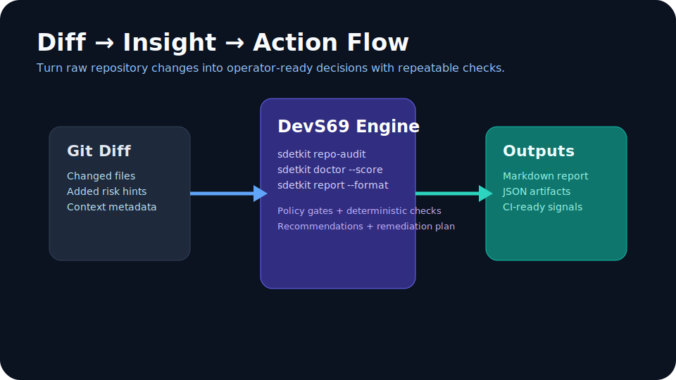

# 🔄 DevS69 Diff-to-Decision — Live Detail View

This page is the dedicated **full Diff-to-Decision view**.

{ target=_blank }

## Decision flow (full detail)

| Stage | Command | Artifact |
|---|---|---|
| Validate | `python -m pytest -q` | Test pass/fail signal |
| Audit | `python -m sdetkit repo audit --format markdown` | Quality findings |
| Secure | `python -m sdetkit security report --format sarif --output build/security.sarif` | SARIF output |
| Publish evidence | `python -m sdetkit proof --execute --strict --format markdown --output docs/artifacts/day3-proof-sample.md` | Shareable proof pack |
| Decide | `python -m sdetkit release-narrative --format markdown --output docs/artifacts/day20-release-narrative-sample.md` | Release decision narrative |

## Live + auto-updated signals

- 
- 
- 
- 

## Related links

- [Open docs portal home](https://sherif69-sa.github.io/DevS69-sdetkit/)
- [Open HUD showcase index](hud-showcase.md)
