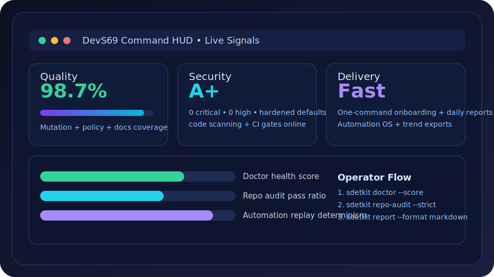

# DevS69 Visual HUD Showcase

Large, clickable visual cards with quick usage hints.

> Portal redirect: https://sherif69-sa.github.io/DevS69-sdetkit/

## Command HUD

**Quick hint:** Start with `python -m sdetkit doctor --format markdown` to get your baseline health score and next actions.

[Open full Command HUD view](command-hud-live.md)

## Repo Map

**Quick hint:** Use this visual to understand where source, tests, docs, templates, and tooling are located.

[Open full Repo Map view](repo-map-live.md)

## Diff-to-Decision

**Quick hint:** Follow the sequence: tests → repo audit → security → proof pack → release narrative.

[Open full Diff-to-Decision view](diff-flow-live.md)
