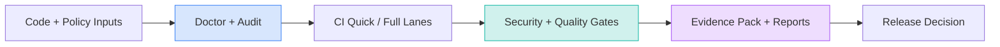

<div class="hero-panel" markdown>

<div class="hero-badges" markdown>

<span class="pill">Deterministic by design</span>
<span class="pill">CI-ready workflows</span>
<span class="pill">Audit-friendly evidence</span>

</div>

# DevS69 SDETKit

Build, validate, and release software with confidence using a polished SDET + DevOps toolkit that keeps quality, security, and traceability aligned from local runs to production pipelines.

<div class="hero-actions" markdown>

[Get started](#fast-start){ .md-button .md-button--primary }
[Open command reference](cli.md){ .md-button }
[See release evidence](evidence.md){ .md-button }

</div>

<div class="hero-stats" markdown>

- **Single toolkit** for quality + security + release readiness
- **Deterministic output** with CI-safe exit codes and repeatability
- **Actionable docs** for SDETs, DevOps, and engineering leads

</div>

</div>


<div class="quick-jump" markdown>

[⚡ Fast start](#fast-start) · [📦 Day 90 report](day-90-big-upgrade-report.md) · [🔒 Day 90 lane](integrations-day90-phase3-wrap-publication-closeout.md) · [📦 Day 91 report](day-91-big-upgrade-report.md) · [🔁 Day 91 lane](integrations-day91-continuous-upgrade-closeout.md) · [📦 Day 92 report](day-92-big-upgrade-report.md) · [🔁 Day 92 lane](integrations-day92-continuous-upgrade-cycle2-closeout.md) · [📦 Day 93 report](day-93-big-upgrade-report.md) · [🔁 Day 93 lane](integrations-day93-continuous-upgrade-cycle3-closeout.md) · [🚀 Phase-1 daily plan](top-10-github-strategy.md#phase-1-days-1-30-positioning-conversion-daily-execution) · [✅ Day 10 ultra report](day-10-ultra-upgrade-report.md) · [🧭 Day 11 ultra report](day-11-ultra-upgrade-report.md) · [🧭 Repo tour](repo-tour.md) · [📈 Top-10 strategy](top-10-github-strategy.md) · [🤖 AgentOS](agentos-foundation.md) · [🍳 Cookbook](agentos-cookbook.md) · [🛠 CLI commands](cli.md) · [🩺 Doctor checks](doctor.md) · [🤝 Contribute](contributing.md)

</div>

## Day 11 ultra upgrades (docs navigation tune-up)

### Day 11 top journeys

- Run first command in under 60 seconds
- Validate docs links and anchors before publishing
- Ship a first contribution with deterministic quality gates

## Platform architecture at a glance



## Why teams choose SDETKit

<div class="grid cards feature-grid" markdown>

- [**Repository diagnostics**](doctor.md)
  Continuously detect hygiene, policy, and reliability gaps with clear remediation guidance.

- [**Deterministic API validation**](api.md)
  Run and replay checks with cassettes for reproducible, low-flake test behavior.

- [**Policy + security enforcement**](security-gate.md)
  Enforce release budgets and quality constraints before they turn into production risk.

- [**Release evidence packs**](evidence.md)
  Produce machine-readable artifacts for audits, governance reviews, and handoffs.

- [**Patch-safe workflows**](patch-harness.md)
  Apply controlled updates with validations that reduce merge and rollback risk.

- [**Production readiness controls**](production-readiness.md)
  Standardize CI lanes, quality gates, and release decisions with confidence.

</div>

## Delivery flow (arranged by outcome)

<div class="process-grid" markdown>

<div class="process-step" markdown>

### 1) Diagnose
Run repository health checks and baseline policy posture.

`python -m sdetkit doctor --help`

</div>

<div class="process-step" markdown>

### 2) Validate
Execute deterministic test and API verification workflows.

`bash ci.sh quick --skip-docs`

</div>

<div class="process-step" markdown>

### 3) Enforce
Apply quality and security budgets as go/no-go release controls.

`python -m sdetkit security enforce --help`

</div>

<div class="process-step" markdown>

### 4) Evidence
Generate artifacts to support traceable release approvals.

`python -m sdetkit evidence --help`

</div>

</div>

## Fast start

=== "Local setup"

    ```bash
    python3 -m venv .venv
    ./.venv/bin/python -m pip install -r requirements-test.txt -r requirements-docs.txt -e .
    bash ci.sh quick --skip-docs
    ```

=== "CI-style path"

    ```bash
    bash ci.sh quick
    bash quality.sh cov
    python -m sdetkit security enforce --format json --max-error 0 --max-warn 0 --max-info 0
    ```

!!! tip "10-minute onboarding path"
    Follow this sequence for the fastest adoption: **CLI help** → **Doctor** → **Gate fast** → **Evidence export**.

## Role-based jump points

<div class="grid cards" markdown>

- **SDET / QA engineers**
  Start with [CLI](cli.md), [Doctor](doctor.md), and [API](api.md).

- **Platform / DevOps teams**
  Start with [Production readiness](production-readiness.md), [Security gate](security-gate.md), and [Patch harness](patch-harness.md).

- **Tech leads / maintainers**
  Start with [Repo tour](repo-tour.md), [Project structure](project-structure.md), and [Design](design.md).

</div>

## Readiness scorecard

| Area | Outcome target | Primary command |
| --- | --- | --- |
| Quality | CI-equivalent checks are green and reproducible | `bash ci.sh quick --skip-docs` |
| Coverage | Coverage gate meets release threshold | `bash quality.sh cov` |
| Security | Policy budgets are enforced with zero drift | `python -m sdetkit security enforce --format json --max-error 0 --max-warn 0 --max-info 0` |
| Evidence | Artifacts are generated and stored for review | `python -m sdetkit evidence --help` |

## Continue exploring

- [Repo tour](repo-tour.md)
- [Contributing](contributing.md)
- [Security policy](security.md)
- [Releasing](releasing.md)
