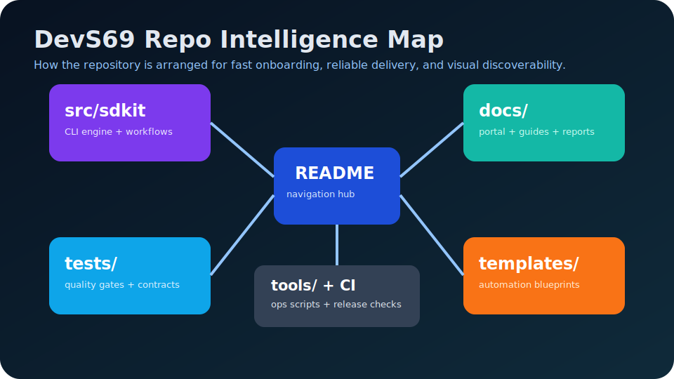

# 🗺️ DevS69 Repo Map — Live Detail View

This page is the dedicated **full Repo Map view**.

{ target=_blank }

## Repository zones (full detail)

| Zone | Purpose | Primary path |
|---|---|---|
| Source | CLI and orchestration implementation | [`src/sdetkit`](https://github.com/sherif69-sa/DevS69-sdetkit/tree/main/src/sdetkit) |
| Tests | Deterministic checks/contracts | [`tests`](https://github.com/sherif69-sa/DevS69-sdetkit/tree/main/tests) |
| Docs | Guides, references, runbooks | [`docs`](https://github.com/sherif69-sa/DevS69-sdetkit/tree/main/docs) |
| Templates | Reusable automation templates | [`templates`](https://github.com/sherif69-sa/DevS69-sdetkit/tree/main/templates) |
| Tools | Utility scripts and governance helpers | [`tools`](https://github.com/sherif69-sa/DevS69-sdetkit/tree/main/tools) |

## Live + auto-updated signals

- 
- 
- 
- 

## Related links

- [Open docs portal home](https://sherif69-sa.github.io/DevS69-sdetkit/)
- [Open HUD showcase index](hud-showcase.md)
